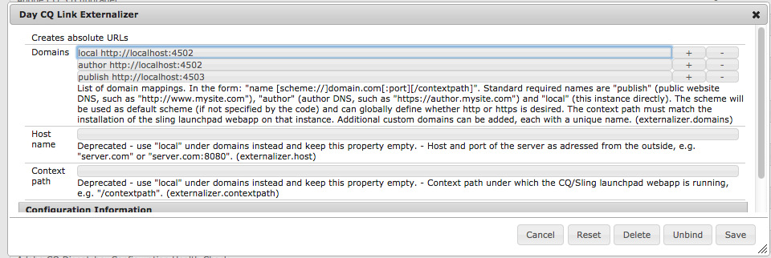

# Externalizing URLs{#externalizing-urls}

In AEM, the **Externalizer** is an OSGI service that allows you to programmatically transform a resource path (e.g. `/path/to/my/page`) into an external and absolute URL (for example, `https://www.mycompany.com/path/to/my/page`) by prefixing the path with a pre-configured DNS.

Because an instance can not know its externally visible URL if it is running behind a web layer, and because sometimes a link has to be created outside of the request scope, this service provides a central place to configure those external URLs and build them.

This page explains how to configure the **Externalizer** service and how to use it. For more details, please refer to the [Javadocs](https://helpx.adobe.com/experience-manager/6-4/sites/developing/using/reference-materials/javadoc/com/day/cq/commons/Externalizer.html).

## Configuring the Externalizer service {#configuring-the-externalizer-service}

The **Externalizer** service allows you to centrally define multiple domains that can be used to programmatically prefix resource paths. Each domain is identified by a unique name that is used to programmatically reference the domain.

To define a domain mapping for the **Externalizer** service:

1. Navigate to the configuration manager via **Tools**, then **Web Console**, or enter `https://<host>:<port>/system/console/configMgr.`
1. Click **Day CQ Link Externalizer** to open the configuration dialog box.

   >[!NOTE]
   >
   >The direct link to the configuration is `https://<host>:<port>/system/console/configMgr/com.day.cq.commons.impl.ExternalizerImpl`

   

1. Define a domain mapping: a mapping consists of a unique name that can be used in the code to reference the domain, a space and the domain: 

   `<unique-name> [scheme://]server[:port][/contextpath]`, where:

    * **scheme** is usually http or https, but can also be ftp etc.; use https to enforce https links if desired; it will be used if the client code does not override the scheme when asking for externalization of a URL. 
    * **server** is the host name (can be a domain name or ip address).
    * **port** (optional) is the port number. 
    * **contextpath** (optional) is only set if AEM is installed as a webapp under a different context path.

   For example: `production https://my.production.instance` 

   The following mapping names are predefined and must always be set as AEM relies on them:

    * **local** - the local instance
    * **author** - the authoring system DNS 
    * **publish** - the public facing website DNS

   >[!NOTE]
   >
   >A custom configuration allows you to add a new category, such as "production," "staging," or even external non-AEM systems such as "my-internal-webservice" and is useful to avoid hardcoding such URLs across different places in a project's codebase.

1. Click **Save** to save your changes.

>[!NOTE]
>
>Adobe recommends that you [add the configuration to the repository](/help/sites-deploying/configuring-osgi.md#adding-a-new-configuration-to-the-repository).

## Using the Externalizer service {#using-the-externalizer-service}

This section shows a few examples of how the **Externalizer** service can be used.

**To get the Externalizer service in a JSP:**

`Externalizer externalizer = resourceResolver.adaptTo(Externalizer.class);`

**To externalize a path with the 'publish' domain:**

`String myExternalizedUrl = externalizer.publishLink(resolver, "/my/page") + ".html";`

Assuming the domain mapping " `publish https://www.website.com`", myExternalizedUrl ends up with the value " `https://www.website.com/contextpath/my/page.html`".

**To externalize a path with the 'author' domain:**

`String myExternalizedUrl = externalizer.authorLink(resolver, "/my/page") + ".html";`

Assuming the domain mapping " `author https://author.website.com`", myExternalizedUrl ends up with the value " `https://author.website.com/contextpath/my/page.html`".

**To externalize a path with the 'local' domain:**

`String myExternalizedUrl = externalizer.externalLink(resolver, Externalizer.LOCAL, "/my/page") + ".html";`

Assuming the domain mapping " `local https://publish-3.internal`", myExternalizedUrl ends up with the value " `https://publish-3.internal/contextpath/my/page.html`".

You can find more examples in the [Javadocs](https://helpx.adobe.com/experience-manager/6-4/sites/developing/using/reference-materials/javadoc/com/day/cq/commons/Externalizer.html).
