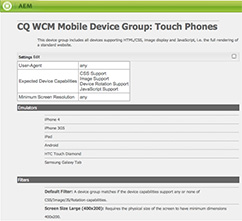

# Creating Device Group Filters{#creating-device-group-filters}

{{ue-over-mobile}}

Create a device group filter to define a set of device capability requirements. Create as many filters as you require to target the needed groups of device capabilities.

Design your filters so that you can use combinations of them to define the groups of capabilities. Typically, there is overlap of the capabilities of different device groups. Therefore, you might use some filters with multiple device group definitions.

After you create a filter, you can use it in the [group configuration.](/help/sites-developing/mobile.md#creating-a-device-group)

## The Filter Java&trade; Class {#the-filter-java-class}

A device group filter is an OSGi component that implements the [com.day.cq.wcm.mobile.api.device.DeviceGroupFilter](https://developer.adobe.com/experience-manager/reference-materials/6-5/javadoc/index.html?com/day/cq/wcm/mobile/api/device/DeviceGroupFilter.html) interface. When deployed, the implementation class provides a filter service that is available to device group configurations.

The solution described in this article uses the Apache Felix Maven SCR Plugin to facilitate the development of the component and service. Therefore, the example Java&trade; class uses the `@Component`and `@Service` annotations. The class has the following structure:

```java
package com.adobe.example.myapp;

import java.util.Map;

import com.day.cq.wcm.mobile.api.device.DeviceGroup;
import com.day.cq.wcm.mobile.api.device.DeviceGroupFilter;

import org.apache.felix.scr.annotations.Component;
import org.apache.felix.scr.annotations.Service;

@Component(metatype = false)
@Service
public class myDeviceGroupFilter implements DeviceGroupFilter {

       public String getDescription() {
  return null;
 }

 public String getTitle() {
  return null;
 }

 public boolean matches(DeviceGroup arg0, String arg1, Map arg2) {
  return false;
 }

}
```

Provide code for the following methods:

* `getDescription`: Returns the filter description. The description appears in the Device Group configuration dialog.
* `getTitle`: Returns the name of the filter. The name appears when selecting filters for the device group.
* `matches`: Determines whether the device has the required capabilities.

### Providing the Filter Name and Description {#providing-the-filter-name-and-description}

The `getTitle` and `getDescription` methods return the filter name and description, respectively. The following code illustrates the simplest implementation:

```java
public String getDescription() {
    return "An example device group filter";
}

public String getTitle() {
 return "myFilter";
}
```

Hard-coding the name and description text is sufficient for uni-lingual authoring environments. Consider externalizing the strings for multi-lingual use, or for enabling the changing of strings without recompiling the source code.

### Evaluating Against Filter Criteria {#evaluating-against-filter-criteria}

The `matches` function returns `true` if the device capabilities satisfy all the filter criteria. Evaluate the information provided in method arguments to determine if the device belongs to the group. The following values are provided as arguments:

* A DeviceGroup object
* The name of the user agent
* A Map object that contains the device capabilities. The Map keys are the WURFL&trade; capability names and the values are the corresponding values from the WURFL&trade; database.

The [com.day.cq.wcm.mobile.api.devicespecs.DeviceSpecsConstants](https://developer.adobe.com/experience-manager/reference-materials/6-5/javadoc/index.html?com/day/cq/wcm/mobile/api/device/DeviceGroupFilter.html) interface contains a subset of the WURFL&trade; capability names in static fields. Use these field constants as keys when retrieving values from the Map of device capabilities.

For example, the following code example determines whether the device supports CSS:

```xml
boolean cssSupport = true;
cssSupport = NumberUtils.toInt(capabilities.get(DeviceSpecsConstants.DSPEC_XHTML_SUPPORT_LEVEL)) > 1;
```

The `org.apache.commons.lang.math` package provides the `NumberUtils` class.

>[!NOTE]
>
>Ensure the WURFL&trade; database that is deployed to AEM includes the capabilities that you use as filter criteria. (See [Device Detection](/help/sites-developing/mobile.md#server-side-device-detection).)

### Example Filter For Screen Size {#example-filter-for-screen-size}

The example DeviceGroupFilter implementation that follows determines whether the physical size of the device meets minimum requirements. This filter is meant to add granularity to the touch device group. The size of buttons in the application UI should be the same regardless of physical screen size. The size of other items, such as text, can vary. The filter enables the dynamic selection of a particular CSS that controls the size of the UI elements.

This filter applies size criteria to the `physical_screen_height` and `physical_screen_width` WURFL&trade; property names.

```java
package com.adobe.example.myapp;

import java.util.Map;

import com.day.cq.wcm.mobile.api.device.DeviceGroup;
import com.day.cq.wcm.mobile.api.device.DeviceGroupFilter;

import org.apache.commons.lang.math.NumberUtils;
import org.apache.felix.scr.annotations.Component;
import org.apache.felix.scr.annotations.Service;

@Component(metatype = false)
@Service
@SuppressWarnings("unused")
public class ScreenSizeLarge implements DeviceGroupFilter {
    private int len=400;
    private int wid=200;
    public String getDescription() {

        return "Requires the physical size of the screen to have minimum dimensions " + len + "x" + wid+".";
    }

    public String getTitle() {
        return "Screen Size Large ("+len + "x" + wid+")";
    }

    public boolean matches(DeviceGroup deviceGroup, String userAgent,
            Map<String, String> deviceCapabilities) {

        boolean longEnough=true;
        boolean wideEnough=false;
        int dimension1=NumberUtils.toInt(deviceCapabilities.get("physical_screen_height"));
        int dimension2=NumberUtils.toInt(deviceCapabilities.get("physical_screen_width"));
        if(dimension1>dimension2){
            longEnough=dimension1>=len;
            wideEnough=dimension2>=wid;
        }else{
            longEnough=dimension2>=len;
            wideEnough=dimension1>=wid;
        }

        return longEnough && wideEnough;
    }
}
```

The String value that the getTitle method returns appears in the drop-down list of the device group properties.


The String values that the getTitle and getDescription methods return are included at the bottom of the device group summary page.



### The Maven POM File {#the-maven-pom-file}

The following POM code is useful if you use Maven to build your applications. The POM references several required plugins and dependencies.

**Plugins:**

* Apache Maven Compiler Plugin: Compiles Java&trade; classes from source code.
* Apache Felix Maven Bundle Plugin: Creates the bundle and the manifest
* Apache Felix Maven SCR Plugin: Creates the component descriptor file and configures the service-component manifest header.

**Dependencies:**

* `cq-wcm-mobile-api-5.5.2.jar`: Provides the DeviceGroup and DeviceGroupFilter interfaces.

* `org.apache.felix.scr.annotations.jar`: Provides the Component and Service annotations.

The DeviceGroup and DeviceGroupFilter interfaces are included in the Day Communique 5 WCM Mobile API bundle. The Felix annotations are included in the Apache Felix Declarative Services bundle. You can obtain this JAR file from the public Adobe repository.

At the time of authoring, 5.5.2 is the version of the WCM Mobile API bundle that is in the latest release of AEM. Use Adobe Web Console ([https://localhost:4502/system/console/bundles](https://localhost:4502/system/console/bundles)) to ensure this is the bundle version that is deployed in your environment.

**POM:** (Your POM uses a different groupId and version.)

```xml
<project xmlns="https://maven.apache.org/POM/4.0.0"
        xmlns:xsi="https://www.w3.org/2001/XMLSchema-instance"
        xsi:schemaLocation="https://maven.apache.org/POM/4.0.0 https://maven.apache.org/xsd/maven-4.0.0.xsd">
      <modelVersion>4.0.0</modelVersion>
      <groupId>com.adobe.example.myapp</groupId>
      <artifactId>devicefilter</artifactId>
      <version>0.0.1-SNAPSHOT</version>
      <name>my app device filter</name>
      <url>https://dev.day.com/docs/en/cq/current.html</url>
  <packaging>bundle</packaging>
<build>
    <plugins>
        <plugin>
            <groupId>org.apache.maven.plugins</groupId>
            <artifactId>maven-compiler-plugin</artifactId>
            <configuration>
                <source>1.5</source>
                <target>1.5</target>
            </configuration>
        </plugin>
        <plugin>
            <groupId>org.apache.felix</groupId>
            <artifactId>maven-scr-plugin</artifactId>
            <executions>
                  <execution>
                    <id>generate-scr-scrdescriptor</id>
                    <goals>
                          <goal>scr</goal>
                    </goals>
                  </execution>
            </executions>
          </plugin>
        <plugin>
            <groupId>org.apache.felix</groupId>
            <artifactId>maven-bundle-plugin</artifactId>
            <version>1.4.3</version>
            <extensions>true</extensions>
            <configuration>
                <instructions>
                    <Export-Package>com.adobe.example.myapp.*;version=${project.version}</Export-Package>
                </instructions>
            </configuration>
        </plugin>
    </plugins>
</build>
<dependencies>
     <dependency>
         <groupId>com.day.cq.wcm</groupId>
         <artifactId>cq-wcm-mobile-api</artifactId>
         <version>5.5.2</version>
         <scope>provided</scope>
     </dependency>
     <dependency>
        <groupId>org.apache.felix</groupId>
        <artifactId>org.apache.felix.scr.annotations</artifactId>
        <version>1.6.0</version>
        <scope>compile</scope>
    </dependency>
</dependencies>
</project>
```

Add the profile that the [Obtaining the Content Package Maven Plugin](/help/sites-developing/vlt-mavenplugin.md) section provides to your maven settings file to use the public Adobe repository.
