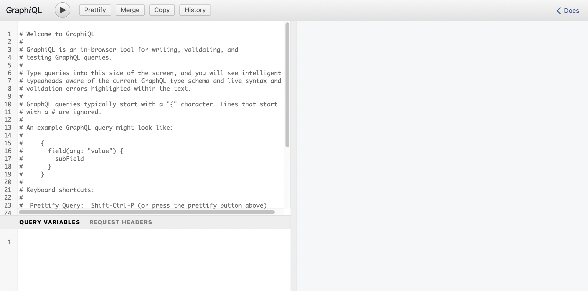
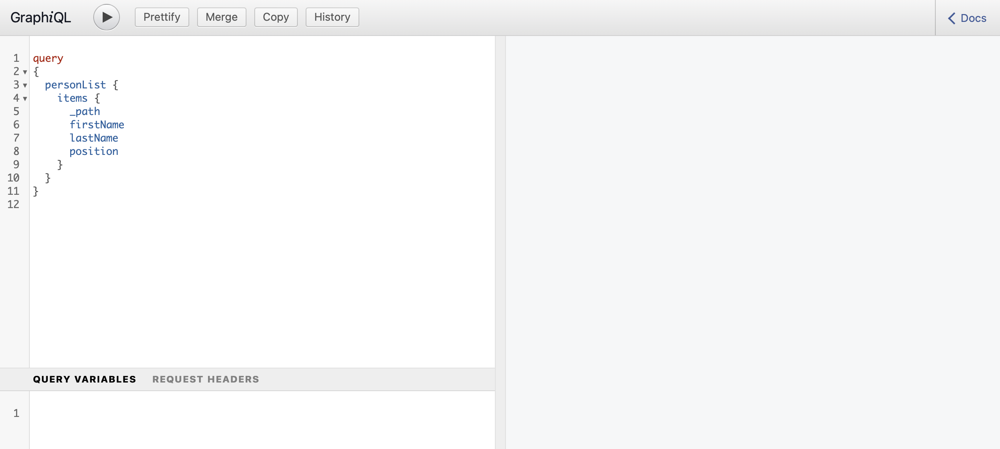
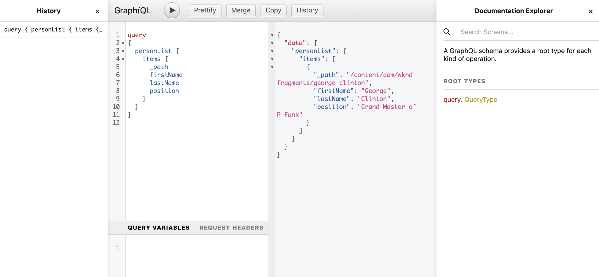

# Accessing and Delivering Content Fragments Headless Quick Start Guide {#accessing-delivering-content-fragments}

Learn how to use AEM's Assets REST API to manage Content Fragments and the GraphQL API for headless delivery of Content Fragment content.

## What are GraphQL and Assets REST APIs? {#what-are-the-apis}

[Now that you have created some content fragments,](create-content-fragment.md) you can use AEM's APIs to deliver them headlessly.

* [The GraphQL API](/help/assets/content-fragments/graphql-api-content-fragments.md) allows you to create requests to access and deliver Content Fragments.
* [The Assets REST API](/help/assets/content-fragments/assets-api-content-fragments.md) allows you to create and modify Content Fragments (and other assets).

The remainder of this guide will focus on GraphQL access and Content Fragment delivery.

## How to Deliver a Content Fragment Using GraphQL {#how-to-deliver-a-content-fragment}

Information architects will need to design queries for their channel endpoints in order to deliver content. These queries will generally only need to be considered once per endpoint per model. For the purposes of this getting started guide we will only need to create one.

<!-- Not in the UI yet - will need updating when it is -->
<!--
1. Log into AEM as a Cloud Service and from the main menu select **Tools -&gt; Assets -&gt; GraphQL** 
   * Alternatively open the page directly at `https://<host>:<port>/content/graphiql.html`.
-->

1. Log into AEM as a Cloud Service and access the GraphiQL interface:
   * For example: `https://<host>:<port>/content/graphiql.html`.

1. The GraphiQL is an in-browser query editor for GraphQL. You can use it to build queries to retrieve Content Fragments to deliver them headlesly as JSON.
   * The left panel allows you to build your query.
   * The right panel displays the results.
   * The query editor features code completion and hotkeys to easily execute the query.
   

1. Assuming that the model we created was called `person` with fields `firstName`, `lastName`, and `position`, we can build a simple query to retrieve the content of our Content Fragment.

   ```text
   query 
   {
     personList {
       items {
         _path
         firstName
         lastName
         position
       }
     }
   }
   ```

1. Enter the query into the left panel.
   

1. Click the **Execute Query** button or use the `Ctrl-Enter` hotkey and the results are displayed as JSON in the right panel.
   

1. Click the **Docs** link at the top-right of the page to show in-context documentation to help you build your queries which adapts to your own models.
   

GraphQL enables structured queries that can target not only specific data sets or individual data objects, but also can deliver specific elements of the objects, nested results, offers support for query variables, and much more.

GraphQL can avoid iterative API requests as well as over-delivery, and instead allows for bulk delivery of exactly what is needed for rendering as a response to a single API query. The resulting JSON can be used to deliver data to other sites or apps.

## Next Steps {#next-steps}

That's it! You now have a basic understanding of headless content management in AEM. Of course there are many more resources where you can dive deeper for a comprehensive understanding of the features available.

* **Configuration Browser** - For details about the AEM Configuration Browser
* **[Content Fragments](/help/assets/content-fragments/content-fragments.md)** - For details about creating and managing Content Fragments
* **[Content Fragments Support in AEM Assets HTTP API](/help/assets/content-fragments/assets-api-content-fragments.md)** - For details on accessing AEM content directly over the HTTP API, via CRUD operations (Create, Read, Update, Delete)
* **[GraphQL API](/help/assets/content-fragments/graphql-api-content-fragments.md)** - For details on how to deliver Content Fragments headlessly
