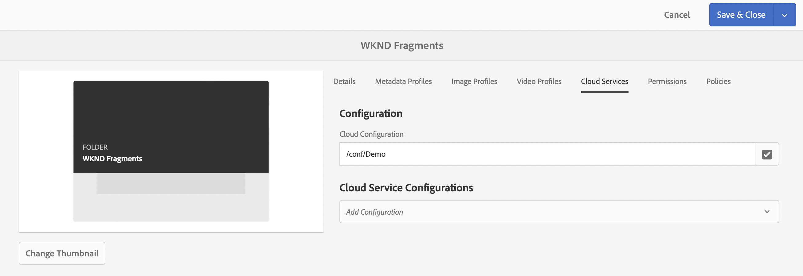
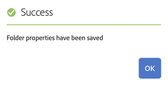

# Creating an Assets Folder Headless Quick Start Guide {#creating-an-assets-folder}

Use AEM Content Fragment Models to define the structure of Content Fragments, the basis of your headless content. Content Fragments are then stored in assets folders.

## What is an Assets Folder? {#what-is-an-assets-folder}

[Now that you have created Content Fragment Models](create-content-model.md) that define the structure that you want for your future Content Fragments, you are probably excited to create some fragments.

However you will first need to create an assets folder where you will store them.

Assets folders are used to [organize traditional content assets](/help/assets/manage-assets.md) like images and video as well as Content Fragments.

## How to Create an Assets Folder {#how-to-create-an-assets-folder}

An administrator would only need to create folders occasionally to organize content as it is created. For the purposes of this getting started guide, we only need to create one folder.

1. Log into AEM and from the main menu select **Navigation -&gt; Assets -&gt; Files**.
1. Tap or click **Create -&gt; Folder**.
1. Provide a **Title** and a **Name** for your folder.
   * The **Title** should be descriptive.
   * The **Name** will become the node name in the repository.
      * It will be automatically generated based on the title and adjusted according to [AEM naming conventions.](/help/sites-developing/naming-conventions.md)
      * It can be adjusted if necessary.

   
1. Select the folder you just created and then select **Properties** from the toolbar (or use the `p` [keyboard shortcut.](/help/sites-authoring/keyboard-shortcuts.md))
1. In the **Properties** window, select the **Cloud Services** tab.
1. For the **Cloud Configuration** Select the [configuration you created previously.](create-configuration.md)
   
1. Tap or click **Save &amp; Close**.
1. Tap or click **OK** in the confirmation window.

   

You can create additional subfolders within the folder you just created. The subfolders will inherit the **Cloud Configuration** of the parent folder. This can be overridden however if you wish to use models from another configuration.

If you are using a localized site structure, you can [create a language root](/help/assets/multilingual-assets.md) below your new folder.

## Next Steps {#next-steps}

Now that you have created a folder for your Content Fragments, you can move on to the fourth part of the getting started guide and [create content fragments.](create-content-fragment.md)

>[!TIP]
>
>For complete details about managing Content Fragments, see the [Content Fragments documentation](/help/assets/content-fragments/content-fragments.md)
