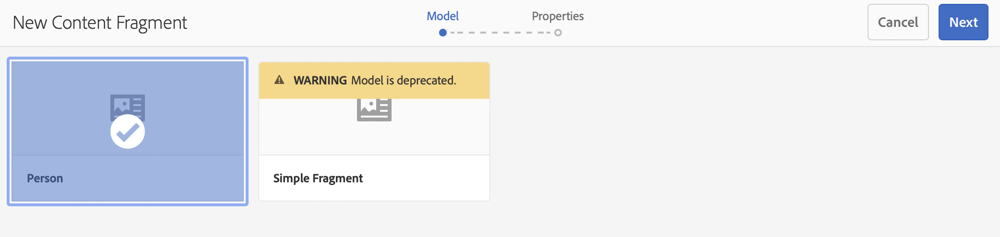

# Creating Content Fragments Headless Quick Start Guide {#creating-content-fragments}

Learn how to use AEM's Content Fragments to design, create, curate, and use page-independent content for headless delivery.

## What are Content Fragments? {#what-are-content-fragments}

[Now that you have created an assets folder](create-assets-folder.md) where you can store your Content Fragments, you can now create the fragments!

Content Fragments allow you to design, create, curate, and publish page-independent content. They allow you to prepare content ready for use in multiple locations and over multiple channels.

Content fragments contain structured content and can be delivered in JSON format.

## How to Create a Content Fragment {#how-to-create-a-content-fragment}

Content authors will create any number of Content Fragments to represent the content that they create. This will be their main task in AEM. For the purposes of this getting started guide, we will only need to create one.

1. Log into AEM and from the main menu select **Navigation -&gt; Assets**.
1. Navigate to the [folder you created previously.](create-assets-folder.md)
1. Tap or click **Create -&gt; Content Fragment**.
1. The creation of a Content Fragment is presented as a wizard in two steps. First select which model you wish to use to create your content fragment and tap or click **Next**.
   * The models available depend on the [**Cloud Configuration** you defined for the assets folder](create-assets-folder.md) in which you are creating the Content Fragment.
   * If you receive the message `We could not find any models`, check the configuration of your assets folder.

   
1. Provide a **Title**, **Description**, and **Tags** as necessary and tap or click **Create**.

   
1. Tap or click **Open** in the confirmation window.

   
1. Provide the details of the Content Fragment in the Content Fragment Editor.

   
1. Tap or click **Save** or  **Save & close**.

Content Fragments can reference other Content Fragments, allowing for a nested content structure if necessary.

Content Fragments can also reference other assets in AEM. [These assets need to be stored in AEM](/help/assets/manage-assets.md) before creating a referencing Content Fragment.

## Next Steps {#next-steps}

Now that you have created a Content Fragment, you can move on to the final part of the getting started guide and [create API requests to access and deliver content fragments.](create-api-request.md)

>[!TIP]
>
>For complete details about managing Content Fragments, see the [Content Fragments documentation](/help/assets/content-fragments/content-fragments.md)
