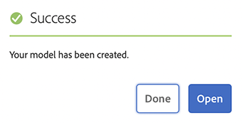

# Creating Content Fragment Models Headless Quick Start Guide {#creating-content-fragment-models}

Define the structure of the content you will create and serve using AEM's headless capabilities by using Content Fragment Models.

## What are Content Fragment Models? {#what-are-content-fragment-models}

[Now that you have created a configuration,](create-configuration.md) you can use it to create Content Fragment Models.

Content Fragment Models define the structure of the data and content that you will create and manage in AEM. They serve as a kind of scaffolding for your content. When choosing to create content, your authors will select from the Content Fragment Models you define, which guides them in creating content.

## How to Create a Content Fragment Model {#how-to-create-a-content-fragment-model}

An information architect would perform these tasks only sporadically as new models are required. For the purposes of this getting started guide, we only need to create one model.

1. Log into AEM and from the main menu select **Tools -&gt; Assets -&gt; Content Fragment Models**.
1. Tap or click on the folder that was made by creating your configuration.

   
1. Tap or click **Create**.
1. Provide a **Model Title**, **Tags** and **Description**. You can also select/deselect **Enable model** to control whether the model is immediately enabled upon creation.

   
1. In the confirmation window, tap or click **Open** to configure your model.

   
1. Using the **Content Fragment Model Editor**, build your Content Fragment Model by dragging and dropping fields from the **Data Types** column.

   

1. Once you place a field, you must configure its properties. The editor will automatically switch to the **Properties** tab for the added field where you can provide the mandatory fields.

   
1. When you are finished building your model, tap or click **Save**. 

1. The mode of the newly-created model depends on whether you selected **Enable Model** when creating the model:
   * selected - the new model will already be **Enabled**
   * not selected - the new model will be created in **Draft** mode

1. If not already enabled, the model must be **Enabled** in order to use it. 
   1. Select the model you just created and then tap or click **Enable**.

      
   1. Confirm enabling the model by tapping or clicking **Enable** in the confirmation dialog.

      
1. The model is now enabled and ready to use.

   

The **Content Fragment Model Editor** supports many different data type such as simple text fields, asset references, references to other models, and JSON data.

You can create multiple models. Models can reference other content fragments. Use [configurations](create-configuration.md) to organize your models.

## Next Steps {#next-steps}

Now that you have defined the structures of your Content Fragments by creating models, you can move on to the third part of the getting started guide and [create folders where you will store the fragments themselves.](create-assets-folder.md)

>[!TIP]
>
>For complete details about Content Fragment Models, see the [Content Fragment Models documentation](/help/assets/content-fragments/content-fragments-models.md)
