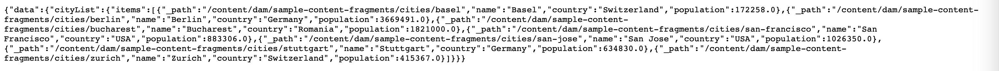
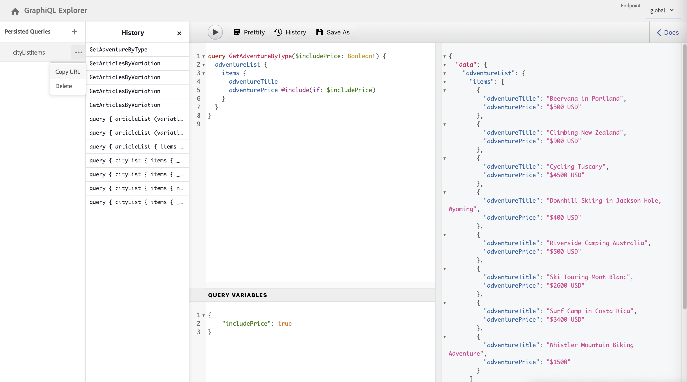

# Using the GraphiQL IDE {#graphiql-ide}

An implementation of the standard [GraphiQL](https://graphql.org/learn/serving-over-http/#graphiql) IDE is available for use with the GraphQL API of Adobe Experience Manager (AEM). 

>[!NOTE]
>
>GraphiQL is included in all environments of AEM (but will only be accessible/visible when you configure your endpoints).
>
>In previous releases, a package was needed to install the GraphiQL IDE. If you have this installed, it can now be removed.

>[!NOTE]
>You must have [configured your endpoints](/help/sites-developing/headless/graphql-api/graphql-endpoint.md) in the [configuration browser](/help/assets/content-fragments/content-fragments-configuration-browser.md) before using the GraphiQL IDE.

The **GraphiQL** tool allows you to test and debug your GraphQL queries by enabling you to:

* select the **Endpoint** appropriate to the Sites configuration that you want to use for your queries
* directly input new queries 
* create, and access, **[Persisted Queries](/help/sites-developing/headless/graphql-api/persisted-queries.md)**
* run your queries to immediately see the the results
* manage **Query Variables** 
* save, and manage **Persisted Queries**
* publish, or unpublish, **Persisted Queries** (for example, to/from `dev-publish`)
* see the **History** of your previous queries
* use the **Documentation Explorer** to access the documentation; helping you to learn and understand what methods are available.

You can access the query editor from either: 

* **Tools** -> **General** -> **GraphQL Query Editor**
* directly; for example, `http://localhost:4502/aem/graphiql.html`

You can use GraphiQL on your system so that queries can be requested by your client application using GET requests, and for publishing queries. For production usage, you can then [move your queries to your production environment](/help/sites-developing/headless/graphql-api/persisted-queries.md#transfer-persisted-query-production). Initially to production author for validating newly authored content with the queries, and finally production publish for live consumption.

## Selecting your endpoint {#selecting-endpoint}

As a first step you need to select the **[Endpoint](/help/sites-developing/headless/graphql-api/graphql-endpoint.md)** that you want to use for the queries. The endpoint is appropriate to the Sites configuration that you want to use for your queries.

This is available from the drop-down list at the top-right.

## Creating, and persisting, a new query {#creating-new-query}

You can enter your new query in the editor - which is in the middle-left panel, directly under the GraphiQL logo.

>[!NOTE]
>
>If you have a persisted query already selected, and showing in the editor panel, then select `+` (next to **Persisted Queries**) to empty the editor ready for your new query.

Just start typing, the editor also:

* uses mouse-over to show you additional information about elements
* provides features such as syntax-highlighting, auto-complete, auto-suggest

>[!NOTE]
>
>GraphQL queries typically start with a `{` character. 
>
>Lines that start with a `#` are ignored.

Use **Save As** to persist your new query.

## Updating your persisted query {#updating-persisted-query}

Select the query you want to update from the list in the **[Persisted Queries](/help/sites-developing/headless/graphql-api/persisted-queries.md)** panel (far left).

The query will be shown in the editor panel. Make any changes you need, then use **Save** to commit your updates to the persisted query.

## Running queries {#running-queries}

You can run a new query immediately, or you can load and run a persisted query. To load a persisted query, select it from the list - the query will be shown in the editor panel.

In either case, the query showing in the editor panel is the query that will be executed when you either:

* click/tap on the **Execute Query** icon
* use the keyboard combination `Control-Enter`

## Query variables {#query-variables}

<!-- more details needed here? -->

The GraphiQL IDE also allows you to manage your [Query Variables](/help/sites-developing/headless/graphql-api/graphql-api-content-fragments.md#graphql-variables).

For example:

<!--
## Managing cache for your persisted queries {#managing-cache}

[Persisted queries](/help/headless/graphql-api/persisted-queries.md) are recommended as they can be cached at the dispatcher and CDN layers, ultimately improving the performance of the requesting client application. By default AEM will invalidate the Content Delivery Network (CDN) cache based on a default Time To Live (TTL).

>[!NOTE]
>
>Custom rewrite rules on the Dispatcher might override defaults from AEM publish. 
>
>In the case that you are sending TTL-based cache-control headers from the dispatcher, based on a location match pattern, then, if necessary, you might want to exclude `/graphql/execute.json/*` from the matches.

Using GraphQL you can configure the HTTP Cache Headers  to control these parameters for your individual persisted query.

1. The **Headers** option is accessible via the three vertical dots to the right of the persisted query name (far left panel):

   

1. Selecting this will open the **Cache Configuration** dialog:

   

1. Select the appropriate parameter, then adjust the value as required:

   * **cache-control** - **max-age**
     Caches can store this content for specified number of seconds. Typically this is the browser TTL (Time To Live).
   * **surrogate-control** - **s-maxage**
     Same as max-age but applies specifically to proxy caches.
   * **surrogate-control** - **stale-while-revalidate**
     Caches may continue to serve a cached response after it becomes stale, for up to the specified number of seconds.
   * **surrogate-control** - **stale-if-error**
     Caches may continue to serve a cached response in case of or origin error, for up to the specified number of seconds.

1. Select **Save** to persist the changes.
-->

## Publishing persisted queries {#publishing-persisted-queries}

Once you have selected your [persisted query](/help/sites-developing/headless/graphql-api/persisted-queries.md) from the list (left panel) you can use the **Publish** and **Unpublish** actions. This will activate them to your publish environment (for example, `dev-publish`) for easy access by your applications when testing.

>[!NOTE]
>
>The definition of the persisted query's cache `Time To Live` {"cache-control":"parameter":value} has a default value of 2 hours (7200 seconds).

## Copy URL to directly access the query {#copy-url}

The **Copy URL** option allows you to simulate a query, by copying the URL used to directly access the persisted query and see the results. This can then be used for testing; for example, by accessing in a browser:

<!--
  >[!NOTE]
  >
  >The URL will need [encoding before using programmatically](/help/headless/graphql-api/persisted-queries.md#encoding-query-url).
  >
  >The target environment might need adjusting, depending on your requirements.
-->

For example:

`http://localhost:4502/graphql/execute.json/global/article-list-01`

By using this URL in a browser, you can confirm the results:

The **Copy URL** option is accessible via the three vertical dots to the right of the persisted query name (far left panel):

## Deleting persisted queries {#deleting-persisted-queries}

The **Delete** option is also accessible via the three vertical dots to the right of the persisted query name (far left panel).

<!-- what happens if you try to delete something that is still published? -->

## Installing your Persisted Query on Production {#installing-persisted-query-production}

After developing and testing your persisted query with GraphiQL, the final goal is to [transfer it to your production environment](/help/sites-developing/headless/graphql-api/persisted-queries.md#transfer-persisted-query-production) for use by your applications.

## Keyboard shortcuts {#keyboard-shortcuts}

There are a selection of keyboard shortcuts that provide direct access to action icons in the IDE:

* Prettify Query:  `Shift-Control-P` 
* Merge Query:  `Shift-Control-M` 
* Execute Query:  `Control-Enter` 
* Auto Complete:  `Control-Space` 

>[!NOTE]
>
>On some keyboards the `Control` key is labelled as `Ctrl`.
