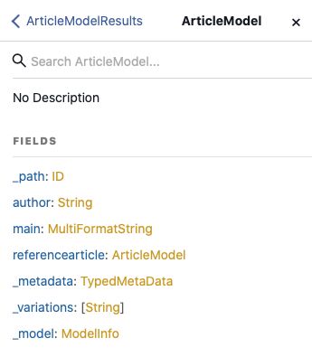
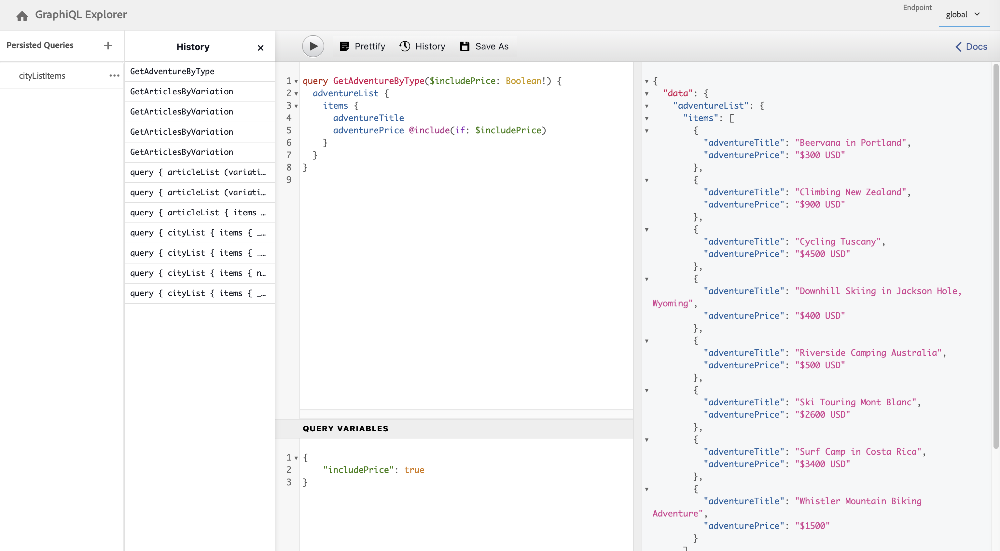

# AEM GraphQL API for use with Content Fragments {#graphql-api-for-use-with-content-fragments}

Learn how to use Content Fragments in Adobe Experience Manager (AEM) with the AEM GraphQL API for headless content delivery.

AEM GraphQL API used with Content Fragments is heavily based on the standard, open-source GraphQL API.

Using the GraphQL API in AEM enables the efficient delivery of Content Fragments to JavaScript clients in headless CMS implementations:

* Avoiding iterative API requests as with REST,
* Ensuring that delivery is limited to the specific requirements,
* Allowing for bulk delivery of exactly what is needed for rendering as the response to a single API query.

>[!NOTE]
>
>GraphQL is used in two (separate) scenarios in Adobe Experience Manager (AEM):
>
>* [AEM Commerce consumes data from a Commerce platform via GraphQL](/help/commerce/cif/integrating/magento.md).
>* AEM Content Fragments work together with the AEM GraphQL API (a customized implementation, based on standard GraphQL), to deliver structured content for use in your applications.

## Prerequisites {#prerequisites}

Customers using GraphQL should install the AEM Content Fragment with GraphQL Index Package 1.0.5. See the [Release Notes](/help/release-notes/release-notes.md#install-aem-graphql-index-add-on-package) for further details.

## The GraphQL API {#graphql-api}

GraphQL is:

* "*...a query language for APIs and a runtime for fulfilling those queries with your existing data. GraphQL provides a complete and understandable description of the data in your API. It gives clients the power to ask for exactly what they need and nothing more, makes it easier to evolve APIs over time, and enables powerful developer tools.*". 

  See [GraphQL.org](https://graphql.org)

* "*...an open spec for a flexible API layer. Put GraphQL over your existing backends so you can build products faster than ever before....*". 

  See [Explore GraphQL](https://graphql.com/). 

* *"...a data query language and specification developed internally by Facebook in 2012 before being publicly open-sourced in 2015. It provides an alternative to REST-based architectures with the purpose of increasing developer productivity and minimizing amounts of data transferred. GraphQL is used in production by hundreds of organizations of all sizes..."* 
  
  See [GraphQL Foundation](https://graphql.org/foundation).

<!--
"*Explore GraphQL is maintained by the Apollo team. Our goal is to give developers and technical leaders around the world all of the tools they need to understand and adopt GraphQL.*". 
-->

For further information about the GraphQL API, see the following sections (among many other resources):

* At [graphql.org](https://graphql.org):

  * [Introduction to GraphQL](https://graphql.org/learn)

  * [The GraphQL Specification](https://spec.graphql.org/)

* At [graphql.com](https://graphql.com):

  * [Tutorials](https://graphql.com/tutorials/)


The GraphQL for AEM implementation is based on the standard GraphQL Java&trade; Library. See:

* [graphQL.org - Java](https://graphql.org/code/#java)

* [GraphQL Java&trade; at GitHub](https://github.com/graphql-java)

### GraphQL Terminology {#graphql-terminology}

GraphQL uses the following:

* **[Queries](https://graphql.org/learn/queries/)**
  
* **[Schemas and Types](https://graphql.org/learn/schema/)**:

  * Schemas are generated by AEM based on the Content Fragment Models.
  * Using your schemas, GraphQL presents the types and operations allowed for the GraphQL for AEM implementation.
  
* **[Fields](https://graphql.org/learn/queries/#fields)**

* **[GraphQL Endpoint](/help/sites-developing/headless/graphql-api/graphql-endpoint.md#graphql-aem-endpoint)**
  * The path in AEM that responds to GraphQL queries, and provides access to the GraphQL schemas. 

  * See [Enabling your GraphQL Endpoint](/help/sites-developing/headless/graphql-api/graphql-endpoint.md#enabling-graphql-endpoint) for further details.

See the [(GraphQL.org) Introduction to GraphQL](https://graphql.org/learn/) for comprehensive details, including the [Best Practices](https://graphql.org/learn/best-practices/).

### GraphQL Query Types {#graphql-query-types}

With GraphQL you can perform queries to return either:

* A **single entry**
  
* A **[list of entries](https://graphql.org/learn/schema/#lists-and-non-null)**

AEM provides capabilities to convert queries (both types) to [Persisted Queries](/help/sites-developing/headless/graphql-api/persisted-queries.md) that are cached by Dispatcher and the CDN.

### GraphQL Query Best Practices (Dispatcher and CDN) {#graphql-query-best-practices}

The [Persisted Queries](/help/sites-developing/headless/graphql-api/persisted-queries.md) are the recommended method to be used on publish instances as:

* they are cached
* they are managed centrally by AEM 

<!-- is this fully accurate? -->
>[!NOTE]
>
>Usually there is no dispatcher/CDN on author, so there is no performance gain in using persisted queries there; apart from testing them.

GraphQL queries using POST requests are not recommended as they are not cached, so on a default instance the Dispatcher is configured to block such queries.

While GraphQL also supports GET requests, these requests can hit limits (for example the length of the URL) that can be avoided using Persisted Queries.

>[!NOTE]
>
>The ability to perform direct queries may be deprecated at some point in the future.

## GraphiQL Interface {#graphiql-interface}

An implementation of the standard [GraphiQL](https://graphql.org/learn/serving-over-http/#graphiql) interface is available for use with AEM GraphQL. 

>[!NOTE]
>
>GraphiQL is included in all environments of AEM (but is only accessible/visible when you configure your endpoints).
>
>In previous releases, you needed a package to install the GraphiQL IDE. If you have this package installed, it can now be removed.

This interface lets you directly input, and test, queries.

For example: 

* `http://localhost:4502/content/graphiql.html`

It provides features such as syntax-highlighting, auto-complete, auto-suggest, together with a history and online documentation:


>[!NOTE]
>
>See [Using the GraphiQL IDE](/help/sites-developing/headless/graphql-api/graphiql-ide.md).

## Use Cases for Author and Publish Environments {#use-cases-author-publish-environments}

The use cases can depend on the type of AEM environment:

* Publish environment; used to: 
  * Query data for JS application (standard use-case)

* Author environment; used to: 
  * Query data for "content management purposes":
    * GraphQL in AEM is a read-only API.
    * The REST API can be used for CR(u)D operations.

## Permissions {#permission}

The permissions are required for accessing Assets.

GraphQL queries are run with the permission of the AEM user of the underlying request. If the user does not have read access to some fragments (stored as Assets), they do not become part of the result set. 

Also, the user must have access to a GraphQL endpoint to be able to run GraphQL queries. 

## Schema Generation {#schema-generation}

GraphQL is a typed API, which means that data must be clearly structured and organized by type.

The GraphQL specification provides a series of guidelines on how to create a robust API for interrogating data on a certain instance. To complete these guidelines, a client must fetch the [Schema](#schema-generation), which contains all the types necessary for a query. 

For Content Fragments, the GraphQL schemas (structure and types) are based on **Enabled** [Content Fragment Models](/help/assets/content-fragments/content-fragments-models.md) and their data types.

>[!CAUTION]
>
>All the GraphQL schemas (derived from Content Fragment Models that have been **Enabled**) are readable through the GraphQL endpoint.
>
>This ability means that you must ensure that no sensitive data is available, as it could be leaked this way. For example, it includes information that could be present as field names in the model definition.

For example, if a user created a Content Fragment Model called `Article`, then AEM generates a GraphQL type `ArticleModel`. The fields within this type correspond to the fields and data types defined in the model. In addition, it creates some entrypoints for the queries that operate on this type, such as `articleByPath` or `articleList`.

1. A Content Fragment Model:

   

1. The corresponding GraphQL schema (output from GraphiQL automatic documentation):
   

   This image shows that the generated type `ArticleModel` contains several [fields](#fields). 
   
   * Three of them have been controlled by the user: `author`, `main`, and `referencearticle`.

   * The other fields were added automatically by AEM, and represent helpful methods to provide information about a certain Content Fragment. In this example, (the [helper fields](#helper-fields)) `_path`, `_metadata`, `_variations`.

1. After a user creates a Content Fragment based on the Article model, it can then be interrogated through GraphQL. For examples, see the [Sample Queries](/help/sites-developing/headless/graphql-api/content-fragments-graphql-samples.md#graphql-sample-queries) (based on a [sample Content Fragment structure for use with GraphQL](/help/sites-developing/headless/graphql-api/content-fragments-graphql-samples.md#content-fragment-structure-graphql)).

In GraphQL for AEM, the schema is flexible. This flexibility means that it is auto-generated each time a Content Fragment Model is created, updated, or deleted. The data schema caches are also refreshed when you update a Content Fragment Model.

The Sites GraphQL service listens (in the background) for any modifications made to a Content Fragment Model. When updates are detected, only that part of the schema is regenerated. This optimization saves time and provides stability.

So for example, if you:

1. Install a package containing `Content-Fragment-Model-1` and `Content-Fragment-Model-2`:
 
   1. GraphQL types for `Model-1` and `Model-2` are generated.

1. Then modify `Content-Fragment-Model-2`:

   1. Only the `Model-2` GraphQL type gets updated.

   1. Whereas `Model-1` remains the same. 

>[!NOTE]
>
>This detail is important to note just in case you want to do bulk updates on Content Fragment Models through the REST api, or otherwise.

The schema is served through the same endpoint as the GraphQL queries, with the client handling the fact that the schema is called with the extension `GQLschema`. For example, performing a simple `GET` request on `/content/cq:graphql/global/endpoint.GQLschema` results in the output of the schema with the Content-type: `text/x-graphql-schema;charset=iso-8859-1`.

### Schema Generation - Unpublished Models {#schema-generation-unpublished-models}

When Content Fragments are nested it can happen that a parent Content Fragment Model is published, but a referenced model is not.

>[!NOTE]
>
>The AEM user interface prevents this happening, but if publishing is made programmatically, or with content packages, it can occur.

When such happens, AEM generates an *incomplete* Schema for the parent Content Fragment Model. It means that the Fragment Reference, which depends on the unpublished model, is removed from the schema.

## Fields {#fields}

Within the schema, there are individual fields, of two basic categories:

* Fields that you generate.

  A selection of [Data Types](#data-types) are used to create fields based on how you configure your Content Fragment Model. The field names are taken from the **Property Name** field of the **Data Type**.
  
  * There is also the **Render As** setting to consider, as users can configure certain data types. For example, a single-line text field can be configured to contain multiple single-line texts by choosing `multifield` from the dropdown.

* GraphQL for AEM also generates several [helper fields](#helper-fields).

  These fields are used to identify a Content Fragment, or to get more information about a content fragment.

### Data Types {#data-types}

GraphQL for AEM supports a list of types. All the supported Content Fragment Model Data Types and the corresponding GraphQL types are represented:

| Content Fragment Model - Data Type | GraphQL Type | Description |
|--- |--- |--- |
| Single-line Text | `String`, `[String]` | Used for simple strings such as author names and location names. |
| Multiline Text | `String` | Used for outputting text such as the body of an article |
| Number | `Float`, `[Float]` | Used to display floating point number and regular numbers |
| Boolean | `Boolean` | Used to display checkboxes → simple true/false statements |
| Date And Time | `Calendar` | Used to display date and time in an ISO 8086 format. Depending on the type selected, there are three flavors available for use in AEM GraphQL: `onlyDate`, `onlyTime`, `dateTime` |
| Enumeration | `String` | Used to display an option from a list of options defined at model creation |
| Tags | `[String]` | Used to display a list of Strings representing Tags used in AEM |
| Content Reference | `String` | Used to display the path towards another asset in AEM |
| Fragment Reference | *A model type* <br><br>Single field: `Model` - Model type, referenced directly <br><br>Multifield, with one referenced type: `[Model]` - Array of type `Model`, referenced directly from array <br><br>Multifield, with multiple referenced types: `[AllFragmentModels]` - Array of all model types, referenced from array with union type | Used to reference one, or more, Content Fragments of certain Model Types, defined when the model was created |

{style="table-layout:auto"}

### Helper Fields {#helper-fields}

In addition to the data types for user-generated fields, GraphQL for AEM also generates several *helper* fields to help identify a Content Fragment, or to provide additional information about a Content Fragment.

These [helper fields](#helper-fields) are marked with a preceding `_` to distinguish between what has been defined by the user and what has been auto-generated.

#### Path {#path}

The path field is used as an identifier in AEM GraphQL. It represents the path of the Content Fragment asset inside the AEM repository. This path is chosen as the identifier of a content fragment, because it:

* is unique within AEM,
* can be easily fetched.

The following code displays the paths of all Content Fragments that were created based on the Content Fragment Model `Person`.

```graphql
{
  personList {
    items {
      _path
    }
  }
}
```

To retrieve a single Content Fragment of a specific type, you must also determine its path first. For example:

```graphql
{
  authorByPath(_path: "/content/dam/path/to/fragment/john-doe") {
    item {
      _path
      firstName
      name
    }
  }
}
```

See [Sample Query - A Single Specific City Fragment](/help/sites-developing/headless/graphql-api/content-fragments-graphql-samples.md#sample-single-specific-city-fragment).

#### Metadata {#metadata}

Through GraphQL, AEM also exposes the metadata of a Content Fragment. Metadata is the information that describes a content fragment, such as the following:

* the title of a content fragment
* the thumbnail path
* the description of a Content Fragment
* and the date it was created, among others.

Because Metadata is generated through the Schema Editor and as such does not have a specific structure, the `TypedMetaData` GraphQL type was implemented to expose the metadata of a Content Fragment. The `TypedMetaData` exposes the information grouped by the following scalar types:

| Field |
|--- |
|`stringMetadata:[StringMetadata]!`|
|`stringArrayMetadata:[StringArrayMetadata]!`|
|`intMetadata:[IntMetadata]!`|
|`intArrayMetadata:[IntArrayMetadata]!`|
|`floatMetadata:[FloatMetadata]!`|
|`floatArrayMetadata:[FloatArrayMetadata]!`|
|`booleanMetadata:[BooleanMetadata]!`|
|`booleanArrayMetadata:[booleanArrayMetadata]!` |
|`calendarMetadata:[CalendarMetadata]!`|
|`calendarArrayMetadata:[CalendarArrayMetadata]!`|

Each scalar type represents either a single name-value pair or an array of name-value pairs, where the value of that pair is of the type it was grouped in. 

For example, if you want to retrieve the title of a Content Fragment, this property is a String property, so you would query for all the String Metadata:

To query for metadata:

```graphql
{
  personByPath(_path: "/content/dam/path/to/fragment/john-doe") {
    item {
      _path
      _metadata {
        stringMetadata {
          name
          value
        }
      }
    }
  }
}
```

You can view all the metadata GraphQL types if you view the Generated GraphQL schema. All model types have the same `TypedMetaData`. 

>[!NOTE]
>
>**Difference between normal and array metadata**
>Keep in mind that `StringMetadata` and `StringArrayMetadata` both refer to what is stored in the repository, not how you retrieve them. 
>
>For example, by calling the `stringMetadata` field, you receive an array of all the metadata stored in the repository as a `String`. And if you call `stringArrayMetadata`, you receive an array of all the metadata stored in the repository as `String[]`.

See [Sample Query for Metadata - List the Metadata for Awards titled GB](/help/sites-developing/headless/graphql-api/content-fragments-graphql-samples.md#sample-metadata-awards-gb).

#### Variations {#variations}

The `_variations` field has been implemented to simplify querying the variations that a Content Fragment has. For example:

```graphql
{
  personByPath(_path: "/content/dam/path/to/fragment/john-doe") {
    item {
      _variations
    }
  }
}
```

>[!NOTE]
>
>The `_variations` field does not contain a `master` variation, as technically the original data (referenced as *Master* in the UI) is not considered an explicit variation.

See [Sample Query - All Cities with a Named Variation](/help/sites-developing/headless/graphql-api/content-fragments-graphql-samples.md#sample-cities-named-variation).

>[!NOTE]
>
>If the given variation does not exist for a Content Fragment, then the original data (also known as the master variation) is returned as a (fallback) default.

<!--
## Security Considerations {#security-considerations}
-->

## GraphQL Variables {#graphql-variables}

GraphQL permits variables to be placed in the query. For more information, see [GraphQL documentation for Variables](https://graphql.org/learn/queries/#variables).

For example, to get all Content Fragments of type `Article` that have a specific variation, you can specify the variable `variation` in GraphiQL.


```graphql
### query
query GetArticlesByVariation($variation: String!) {
    articleList(variation: $variation) {
        items {
            _path
            author
            _variations
        }
    }
}
 
### in query variables
{
    "variation": "uk"
}
```

## GraphQL Directives {#graphql-directives}

In GraphQL, there is a possibility to change the query based on variables, called GraphQL Directives.

For example there you can include the `adventurePrice` field in a query for all the `AdventureModels`, based on a variable `includePrice`.



```graphql
### query
query GetAdventureByType($includePrice: Boolean!) {
  adventureList {
    items {
      adventureTitle
      adventurePrice @include(if: $includePrice)
    }
  }
}
 
### in query variables
{
    "includePrice": true
}
```

## Filtering {#filtering}

You can also use filtering in your GraphQL queries to return specific data.

Filtering uses a syntax based on logical operators and expressions. 

The most atomic part is a single expression that can be applied to the content of a certain field. It compares the content of the field with a given constant value.

For example, the following expression would compare the content of the field with the value `some text`, and succeed if the content equals the value. Otherwise, the expression fails.:

```graphql
{
  value: "some text"
  _op: EQUALS
}
```

The following operators can be used to compare fields to a certain value:

| Operator | Types | The expression succeeds if ... |
|--- |--- |--- |
| `EQUALS` | `String`, `ID`, `Boolean` | ... the value is the same as the content of the field |
| `EQUALS_NOT` | `String`, `ID` | ... the value is *not* the same as the content of the field |
| `CONTAINS` | `String` | ... the content of the field contains the value (`{ value: "mas", _op: CONTAINS }` matches `Christmas`, `Xmas`, `master`, ...) |
| `CONTAINS_NOT` | `String` | ... the content of the field does *not* contain the value |
| `STARTS_WITH` | `ID` | ... the ID starts with a certain value (`{ value: "/content/dam/", _op: STARTS_WITH` matches `/content/dam/path/to/fragment`, but not `/namespace/content/dam/something` |
| `EQUAL` | `Int`, `Float` | ... the value is the same as the content of the field |
| `UNEQUAL` | `Int`, `Float` | ... the value is *not* the same as the content of the field |
| `GREATER` | `Int`, `Float` | ... the content of the field is greater than the value |
| `GREATER_EQUAL` | `Int`, `Float` | ... the content of the field is greater than or equal to the value |
| `LOWER` | `Int`, `Float` | ... the content of the field is lower than the value |
| `LOWER_EQUAL` | `Int`, `Float` | ... the content of the field is lower than or equal to the value |
| `AT` | `Calendar`, `Date`, `Time` | ... the content of the field is the same as the value (including timezone setting) |
| `NOT_AT` | `Calendar`, `Date`, `Time` | ... the content of the field is *not* the same as the value |
| `BEFORE` | `Calendar`, `Date`, `Time` | ... the point in time denoted by the value is before the point in time denoted by the content of the field |
| `AT_OR_BEFORE` | `Calendar`, `Date`, `Time` | ... the point in time denoted by the value is before or at the same point in time denoted by the content of the field |
| `AFTER` | `Calendar`, `Date`, `Time` | ... the point in time denoted by the value is after the point in time denoted by the content of the field |
| `AT_OR_AFTER` | `Calendar`, `Date`, `Time` | ... the point in time denoted by the value is after or at the same point in time denoted by the content of the field |

Some types also let you specify additional options that modify how an expression is evaluated:

| Option | Types | Description |
|--- |--- |--- |
| `_ignoreCase` | `String` | Ignores the case of a string, for example, a value of `time` matches `TIME`, `time`, `tImE`, ... |
| `_sensitiveness` | `Float` | Allows a certain margin for `float` values to be considered the same (to work around technical limitations due to the internal representation of `float` values; should be avoided, as this option might have a negative impact on performance |

Expressions can be combined to a set with the help of a logical operator (`_logOp`):

* `OR` - the set of expressions succeed if at least one expression succeeds
* `AND` - the set of expressions succeed if all expressions succeed (default)

Each field can be filtered by its own set of expressions. The expression sets of all fields mentioned in the filter argument are eventually combined by its own logical operator.

A filter definition (passed as the `filter` argument to a query) contains:

* A subdefinition for each field (the field can be accessed through its name, for example, there's a `lastName` field in the filter for the `lastName` field in the Data (field) Type)
* Each subdefinition contains the `_expressions` array, providing the expression set, and the `_logOp` field that defines the logical operator the expressions should be combined with
* Each expression is defined by the value (`value` field) and the operator (`_operator` field) the content of a field should be compared to

You can omit `_logOp` if you want to combine items with `AND` and `_operator` if you want to check for equality, because these values are defaults.

The following example demonstrates a full query that filters all persons that have a `lastName` of `Provo` or containing `sjö`, independent of the case:

```graphql
{
  authorList(filter: {
    lastname: {
      _logOp: OR
      _expressions: [
        {
          value: "sjö",
          _operator: CONTAINS,
          _ignoreCase: true
        },
        {
          value: "Provo"
        }
      ]
    }
  }) {
    items {
      lastName
      firstName
    }
  }
}
```

While you can also filter on nested fields, it is not recommended, as it might lead to performance issues.

For further examples, see:

* details of the [GraphQL for AEM extensions](#graphql-extensions)

* [Sample Queries using this Sample Content and Structure](/help/sites-developing/headless/graphql-api/content-fragments-graphql-samples.md#graphql-sample-queries-sample-content-fragment-structure)

  * And the [Sample Content and Structure](/help/sites-developing/headless/graphql-api/content-fragments-graphql-samples.md#content-fragment-structure-graphql) prepared for use in sample queries

* [Sample Queries based on the WKND Project](/help/sites-developing/headless/graphql-api/content-fragments-graphql-samples.md#sample-queries-using-wknd-project)

## Sorting {#sorting}

>[!NOTE]
>
>For best performance, consider [Updating your Content Fragments for Paging and Sorting in GraphQL Filtering](/help/sites-developing/headless/graphql-api/graphql-optimized-filtering-content-update.md).

This feature allows you to sort the query results according to a specified field.

The sorting criteria:

* is a comma-separated list of values representing the field path
  * the first field in the list defines the primary sort order
    * the second field is used if two values of the primary sort criterion are equal
    * the third field is used if the first two criteria are equal, and so on.
  * dotted notation, i.e field1.subfield.subfield and so on...
* with an optional order direction
  * ASC (ascending) or DESC (descending); as default ASC is applied
  * the direction can be specified per field; this ability means that you can sort one field in ascending order, another one in descending order (name, firstName DESC)

For example:

```graphql
query {
  authorList(sort: "lastName, firstName") {
    items {
      firstName
      lastName
    }
  }
}
```

And also:

```graphql
{
  authorList(sort: "lastName DESC, firstName DESC") {
    items {
        lastName
        firstName
    }
  }
}
```

You can also sort on a field within a nested fragment, using the format of `nestedFragmentname.fieldname`.

>[!NOTE]
>
>This format might have a negative impact on performance.

For example:

```graphql
query {
  articleList(sort: "authorFragment.lastName")  {
    items {
      title
      authorFragment {
        firstName
        lastName
        birthDay
      }
      slug
    }
  }
}
```

## Paging {#paging}

>[!NOTE]
>
>For best performance, consider [Updating your Content Fragments for Paging and Sorting in GraphQL Filtering](/help/sites-developing/headless/graphql-api/graphql-optimized-filtering-content-update.md).

This feature allows you to perform paging on query types that returns a list. Two methods are provided:

* `offset` and `limit` in a `List` query
* `first` and `after` in a `Paginated` query

### List query - offset and limit {#list-offset-limit}

In a `...List`query you can use `offset` and `limit` to return a specific subset of results:

* `offset`: Specifies the first data set to return
* `limit`: Specifies the maximum number of data sets to be returned

For example, to output the page of results containing up to five articles, starting from the fifth article from the *complete* results list:

```graphql
query {
   articleList(offset: 5, limit: 5) {
    items {
      authorFragment {
        lastName
        firstName
      }
    }
  }
}
```

<!-- When available link to BP and replace "JCR query level" with a more neutral term. -->

<!-- When available link to BP and replace "JCR query result set" with a more neutral term. -->

>[!NOTE]
>
>* Paging requires a stable sort order to work correctly across multiple queries requesting different pages of the same result set. By default it uses the repository path of each item of the result set to make sure that the order is always the same. If a different sort order is used, and if that sorting cannot be done at JCR query level, then there is a negative performance impact. The reason is because the entire result set must be loaded into memory before the pages are determined.
>
>* The higher the offset, the more time it takes to skip the items from the complete JCR query result set. An alternative solution for large result sets is to use the Paginated query with `first` and `after` method.

### Paginated query - first and after {#paginated-first-after}

The `...Paginated` query type reuses most of the `...List` query type features (filtering, sorting), but instead of using `offset`/`limit` arguments, it uses the `first`/`after` arguments as defined by [the GraphQL Cursor Connections Specification](https://relay.dev/graphql/connections.htm). You can find a less formal introduction in the [GraphQL introduction](https://graphql.org/learn/pagination/#pagination-and-edges).

* `first`: The `n` first items to return. 
  The default is `50`. 
  The maximum is `100`.
* `after`: The cursor that determines the beginning of the requested page. The item represented by the cursor is not included in the result set. The cursor of an item is determined by the `cursor` field of the `edges` structure.

For example, output the page of results containing up to five adventures, starting from the given cursor item in the *complete* results list:

```graphql
query {
    adventurePaginated(first: 5, after: "ODg1MmMyMmEtZTAzMy00MTNjLThiMzMtZGQyMzY5ZTNjN2M1") {
        edges {
          cursor
          node {
            title
          }
        }
        pageInfo {
          endCursor
          hasNextPage
        }
    }
}
```

<!-- When available link to BP -->
<!-- Due to internal technical constraints, performance will degrade if sorting and filtering is applied on nested fields. Therefore it is recommended to use filter/sort fields stored at root level. For more information, see the [Best Practices document](link). -->

>[!NOTE]
>
>* By default, paging uses the UUID of the repository node representing the fragment for ordering to ensure that the order of results is always the same. When `sort` is used, the UUID is implicitly used to ensure a unique sort; even for two items with identical sort keys.
>
>* Due to internal technical constraints, performance degrades if sorting and filtering is applied on nested fields. Therefore, use filter/sort fields stored at root level. This technique is also the recommended way if you want to query large paginated result sets.

## GraphQL for AEM - Summary of Extensions {#graphql-extensions}

The basic operation of queries with GraphQL for AEM adhere to the standard GraphQL specification. For GraphQL queries with AEM, there are a few extensions:

* If you require a single result:
  * use the model name; for example, city

* If you expect a list of results:
  * add `List` to the model name; for example,  `cityList`
  * See [Sample Query - All Information about All Cities](/help/sites-developing/headless/graphql-api/content-fragments-graphql-samples.md#sample-all-information-all-cities)
  
  You can then:
  
  * [Sort the results](#sorting)

    * `ASC` : ascending
    * `DESC` : descending

  * Return a page of results using either:

    * [A List query with offset and limit](/help/sites-developing/headless/graphql-api/content-fragments-graphql-samples.md#list-offset-limit)
    * [A Paginated query with first and after](/help/sites-developing/headless/graphql-api/content-fragments-graphql-samples.md#paginated-first-after)
  * See [Sample Query - All Information about All Cities](/help/sites-developing/headless/graphql-api/content-fragments-graphql-samples.md#sample-all-information-all-cities)

* The filter `includeVariations` is included in the `List` query type. To retrieve Content Fragment Variations in the query results, the `includeVariations` filter must be set to `true`.

  >[!CAUTION]
  >The filter `includeVariations` cannot be used together with the system-generated field `_variation`.

* If you want to use a logical OR:
  * use ` _logOp: OR`
  * See [Sample Query - All Persons that have a name of "Jobs" or "Smith"](/help/sites-developing/headless/graphql-api/content-fragments-graphql-samples.md#sample-all-persons-jobs-smith)

* Logical AND also exists, but is (often) implicit

* You can query on field names that correspond to the fields within the Content Fragment Model
  * See [Sample Query - Full Details of a Company's CEO and Employees](/help/sites-developing/headless/graphql-api/content-fragments-graphql-samples.md#sample-full-details-company-ceos-employees)

* In addition to the fields from your model, there are some system-generated fields (preceded by underscore):

  * For content:

    * `_locale` : to reveal the language; based on Language Manager
      * See [Sample Query for multiple Content Fragments of a given locale](/help/sites-developing/headless/graphql-api/content-fragments-graphql-samples.md#sample-wknd-multiple-fragments-given-locale)

    * `_metadata` : to reveal metadata for your fragment
      * See [Sample Query for Metadata - List the Metadata for Awards titled GB](/help/sites-developing/headless/graphql-api/content-fragments-graphql-samples.md#sample-metadata-awards-gb)

    * `_model` : allow querying for a Content Fragment Model (path and title)
      * See [Sample Query for a Content Fragment Model from a Model](/help/sites-developing/headless/graphql-api/content-fragments-graphql-samples.md#sample-wknd-content-fragment-model-from-model)
  
    * `_path` : the path to your Content Fragment within the repository
      * See [Sample Query - A Single Specific City Fragment](/help/sites-developing/headless/graphql-api/content-fragments-graphql-samples.md#sample-single-specific-city-fragment)

    * `_reference` : to reveal references; including inline references in the Rich Text Editor
      * See [Sample Query for multiple Content Fragments with Prefetched References](/help/sites-developing/headless/graphql-api/content-fragments-graphql-samples.md#sample-wknd-multiple-fragments-prefetched-references)

    * `_variation` : to reveal specific Variations within your Content Fragment

      >[!NOTE]
      >
      >If the given variation does not exist for a Content Fragment, then the master variation is returned as a (fallback) default.

      >[!CAUTION]
      >The system-generated field `_variation` cannot be used together with the filter `includeVariations`.

      * See [Sample Query - All Cities with a Named Variation](/help/sites-developing/headless/graphql-api/content-fragments-graphql-samples.md#sample-cities-named-variation)

    * `_tags` : to reveal the IDs of Content Fragments or Variations that contain tags; this list is an array of `cq:tags` identifiers. 

      * See [Sample Query - Names of All Cities Tagged as City Breaks](/help/sites-developing/headless/graphql-api/content-fragments-graphql-samples.md#sample-names-all-cities-tagged-city-breaks)
      * See [Sample Query for Content Fragment Variations of a given Model that have a specific tag attached](/help/sites-developing/headless/graphql-api/content-fragments-graphql-samples.md#sample-wknd-fragment-variations-given-model-specific-tag)
  
      >[!NOTE]
      >
      >Tags can also be queried by listing the Metadata of a Content Fragment.

  * And operations:
  
    * `_operator` : apply specific operators; `EQUALS`, `EQUALS_NOT`, `GREATER_EQUAL`, `LOWER`, `CONTAINS`, `STARTS_WITH` 
      * See [Sample Query - All Persons that do not have a name of "Jobs"](/help/sites-developing/headless/graphql-api/content-fragments-graphql-samples.md#sample-all-persons-not-jobs)
      * See [Sample Query - All Adventures where the `_path` starts with a specific prefix](/help/sites-developing/headless/graphql-api/content-fragments-graphql-samples.md#sample-wknd-all-adventures-cycling-path-filter)
  
    * `_apply` : to apply specific conditions; for example,  `AT_LEAST_ONCE`
      * See [Sample Query - Filter on an array with an item that must occur at least once](/help/sites-developing/headless/graphql-api/content-fragments-graphql-samples.md#sample-array-item-occur-at-least-once)

    * `_ignoreCase` : to ignore the case when querying
      * See [Sample Query - All cities with SAN in the name, irrespective of case](/help/sites-developing/headless/graphql-api/content-fragments-graphql-samples.md#sample-all-cities-san-ignore-case)

* GraphQL union types are supported:

  * use `... on` 
    * See [Sample Query for a Content Fragment of a specific Model with a Content Reference](/help/sites-developing/headless/graphql-api/content-fragments-graphql-samples.md#sample-wknd-fragment-specific-model-content-reference)

* Fallback when querying nested fragments:

  * If the requested variation does not exist in a nested fragment, then the **Master** variation is returned.

### CORS Filter {#cors-filter}

>[!NOTE]
>
>For a detailed overview of the CORS resource sharing policy in AEM, see [Understand Cross-Origin Resource Sharing (CORS)](https://experienceleague.adobe.com/docs/experience-manager-learn/foundation/security/understand-cross-origin-resource-sharing.html#understand-cross-origin-resource-sharing-(cors)).

To access the GraphQL endpoint, configure a CORS policy in the customer Git repository. This configuration is done by adding an appropriate OSGi CORS configuration file for one or more desired endpoints. 

This configuration must specify a trusted website origin `alloworigin` or `alloworiginregexp` for which access must be granted.

For example, to grant access to the GraphQL endpoint and persisted queries endpoint for `https://my.domain` you can use:

```xml
{
  "supportscredentials":true,
  "supportedmethods":[
    "GET",
    "HEAD",
    "POST"
  ],
  "exposedheaders":[
    ""
  ],
  "alloworigin":[
    "https://my.domain"
  ],
  "maxage:Integer":1800,
  "alloworiginregexp":[
    ""
  ],
  "supportedheaders":[
    "Origin",
    "Accept",
    "X-Requested-With",
    "Content-Type",
    "Access-Control-Request-Method",
    "Access-Control-Request-Headers"
  ],
  "allowedpaths":[
    "/content/_cq_graphql/global/endpoint.json",
    "/graphql/execute.json/.*"
  ]
}
```

If you have configured a vanity path for the endpoint, you can also use it in `allowedpaths`.

### Referrer Filter {#referrer-filter}

In addition to CORS configuration, a Referrer filter must be configured to allow access from third-party hosts.

This filter is done by adding an appropriate OSGi Referrer Filter configuration file that:

* specifies a trusted website host name; either `allow.hosts` or `allow.hosts.regexp`,
* grants access for this host name.

For example, to grant access for requests with the Referrer `my.domain` you can:

```xml
{
    "allow.empty":false,
    "allow.hosts":[
      "my.domain"
    ],
    "allow.hosts.regexp":[
      ""
    ],
    "filter.methods":[
      "POST",
      "PUT",
      "DELETE",
      "COPY",
      "MOVE"
    ],
    "exclude.agents.regexp":[
      ""
    ]
}
```

>[!CAUTION]
>
>It remains the customer's responsibility to:
>
>* only grant access to trusted domains 
>* make sure that no sensitive information is exposed 
>* not use a wildcard [*] syntax; this functionality disables authenticated access to the GraphQL endpoint and also expose it to the entire world.

>[!CAUTION]
>
>All the GraphQL [schemas](#schema-generation) (derived from Content Fragment Models that have been **Enabled**) are readable through the GraphQL endpoint.
>
>This functionality means that you must ensure that no sensitive data is available, as it could be leaked this way. For example, it includes information that could be present as field names in the model definition.

## Authentication {#authentication}

See [Authentication for Remote AEM GraphQL Queries on Content Fragments](/help/sites-developing/headless/graphql-api/graphql-authentication-content-fragments.md).

## FAQs {#faqs}

Questions that have arisen:

1. **Q**: "*How is the GraphQL API for AEM different from Query Builder API?*"

   * **A**: 
     "*The AEM GraphQL API offers total control on the JSON output, and is an industry standard for querying content. 
     In the future, AEM is planning to invest in the AEM GraphQL API.*"

## Tutorial - Getting Started with AEM Headless and GraphQL {#tutorial}

Looking for a hands-on tutorial? Check out [Getting Started with AEM Headless and GraphQL](https://experienceleague.adobe.com/docs/experience-manager-learn/getting-started-with-aem-headless/graphql/overview.html) end-to-end tutorial illustrating how to build-out and expose content using AEM's GraphQL APIs and consumed by an external app, in a headless CMS scenario.
