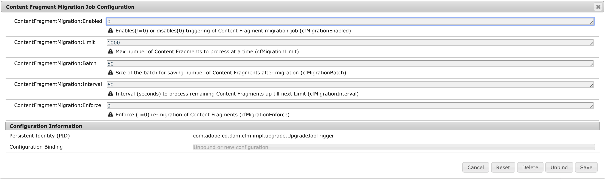

# Updating your Content Fragments for optimized GraphQL Filtering {#updating-content-fragments-for-optimized-graphql-filtering}

To optimize the performance of your GraphQL filters, run a procedure to update your Content Fragments.

>[!NOTE]
>
>After updating your Content Fragments, you can follow the recommendations for [Optimizing GraphQL Queries](/help/sites-developing/headless/graphql-api/graphql-optimization.md).

## Prerequisites {#prerequisites}

Ensure that you have a minimum of the 6.5.17.0 release  of AEM.

## Updating your Content Fragments {#updating-content-fragments}

To run the procedure, use the following steps:

1. [Configure the OSGi settings](/help/sites-deploying/configuring-osgi.md) for the **Content Fragment Migration Job Configuration**:

   

1. In the dialog, set these two parameters as follows:

   * **ContentFragmentMigration:Enabled** : `1`
   * **ContentFragmentMigration:Enforce** : `1`

1. **Save** the specifications - the update procedure starts.

1. Wait until the procedure is completed. The procedure is complete when the property `cfGlobalVersion` appears on `/content/dam` and is set to `1`.

1. Return to the OSGi configuration to deactivate the procedure.

   In the dialog for the **Content Fragment Migration Job Configuration** set these two parameters as follows:

   * **ContentFragmentMigration:Enabled** : `0`
   * **ContentFragmentMigration:Enforce** : `0`

## Limitations {#limitations}

Be aware of the following limitations:

* Optimization of the performance of GraphQL filters will only be possible after a complete update of all your Content Fragments (indicated by the presence of the `cfGlobalVersion` property for the JCR node `/content/dam`)

* If Content Fragments are imported from a content package (using `crx/de`) after the update procedure is run, then those Content Fragments will not be considered in the GraphQL query results, until the update procedure is executed again.
