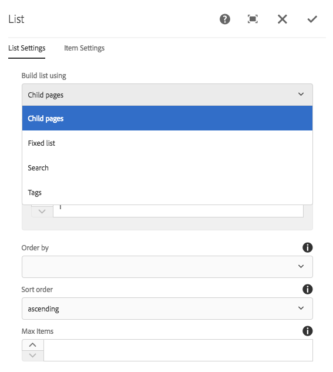
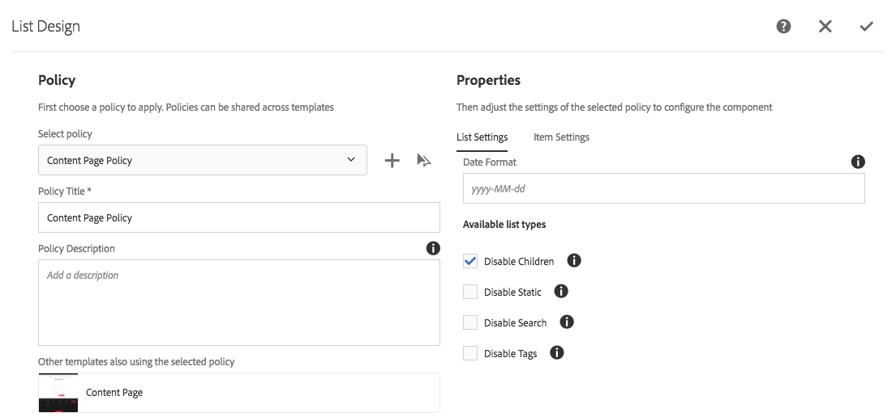
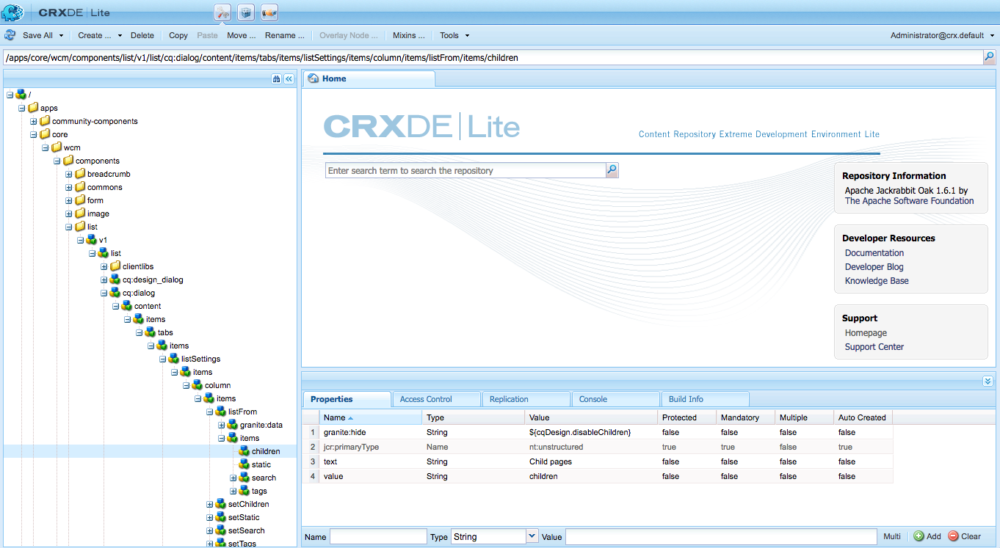

# Using Hide Conditions {#using-hide-conditions}

Hide conditions can be used to determine if a component resource is rendered or not. An example of this would be when a template author configures the Core Component [list component](https://experienceleague.adobe.com/docs/experience-manager-core-components/using/wcm-components/list.html) in the [template editor](/help/sites-authoring/templates.md) and decides to disable the options to build the list based on child pages. Disabling this option in the design dialog box sets a property so that when the list component is rendered, the hide condition is evaluated and the option to show child pages is not displayed.

## Overview {#overview}

Dialog boxes can become complex with numerous options for the user, who may only use a fraction of the options that are at their disposal. This can lead to overwhelming user interface experiences for users.

By using hide conditions, admins, developers, and super users have a way to hide resources based on a set of rules. This feature allows them to decide what resources should be displayed when an author edits content.

>[!NOTE]
>
>Hiding a resource based on an expression does not replace ACL permissions. Content remains editable but is not displayed.

## Implementation and Usage Details {#implementation-and-usage-details}

`com.adobe.granite.ui.components.FilteringResourceWrapper` is responsible filtering the resources based on the existence and value of the `granite:hide` property, located on the field to be filtered. The implementation of `/libs/cq/gui/components/authoring/dialog/dialog.jsp` includes an instance of `FilteringResourceWrapper.`

The implementation makes use of the Granite [ELResolver API](https://developer.adobe.com/experience-manager/reference-materials/6-5/granite-ui/api/jcr_root/libs/granite/ui/docs/server/el.html) and adds a `cqDesign` custom variable via the ExpressionCustomizer.

Here are a few examples of hide conditions on a design node located either under `etc/design` or as a Content Policy.

```
${cqDesign.myProperty}
${!cqDesign.myProperty}
${cqDesign.myProperty == 'someText'}
${cqDesign.myProperty != 'someText'}
${cqDesign.myProperty == true}
${cqDesign.myProperty == true}
${cqDesign.property1 == 'someText' && cqDesign.property2 || cqDesign.property3 != 1 || header.myHeader}
```

When defining your hide expression, keep in mind the following:

* To be valid, the scope in which property is found should be expressed (for example, `cqDesign.myProperty`).
* Values are read only.
* Functions (if necessary) should be limited to a given set provided by the service.

## Example {#example}

Examples of hide conditions can be found throughout AEM and the [core components](https://experienceleague.adobe.com/docs/experience-manager-core-components/using/introduction.html) in particular. For example, consider the [list core component](https://experienceleague.adobe.com/docs/experience-manager-core-components/using/wcm-components/list.html).

[Using the template editor](/help/sites-authoring/templates.md), the template author can define in the design dialog which options of the list component that are available to the page author. Such options as whether to allow the list to be a static list, a list of child pages, a list of tagged pages, and so on, can be enabled or disabled.

If a template author chooses to disable the child pages option, a design property is set and a hide condition is evaluated against it, which causes the option to not render for the page author.

1. By default, the page author can use the list core component to build a list using child pages by choosing the option **Child pages**.

   

1. In the design dialog of the list core component, the template author can choose the option **Disable Children** to prevent the option to generate a list based on child pages from being shown to the page author.

   

1. A policy node is created under `/conf/we-retail/settings/wcm/policies/weretail/components/content/list` with a property `disableChildren` set to `true`.
1. The hide condition is defined as the value of a `granite:hide` property on the dialog property node `/conf/we-retail/settings/wcm/policies/weretail/components/content/list`

   

1. The value of `disableChildren` is pulled from the design configuration and the expression `${cqDesign.disableChildren}` evaluates to `false`, meaning the option will not be rendered as part of the component.

   You can view the hide expression as the value of the `granite:hide` property [in GitHub](https://github.com/adobe/aem-core-wcm-components/blob/main/content/src/content/jcr_root/apps/core/wcm/components/list/v1/list/_cq_dialog/.content.xml#L40).

1. The option **Child pages** is no longer rendered for the page author when using the list component.

   
