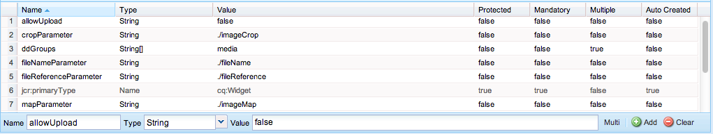
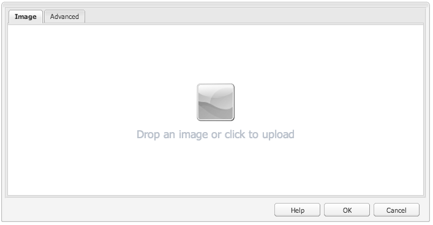
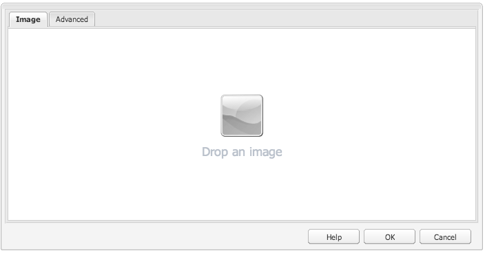
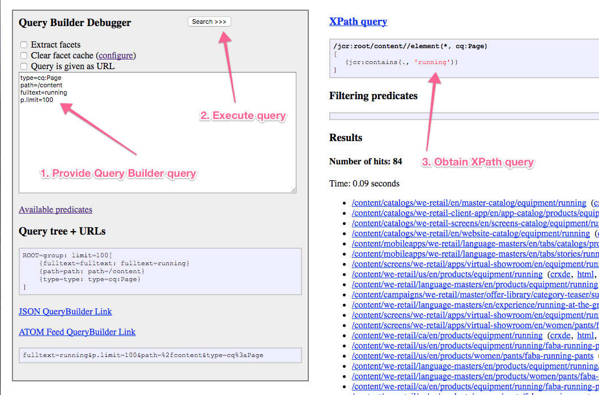
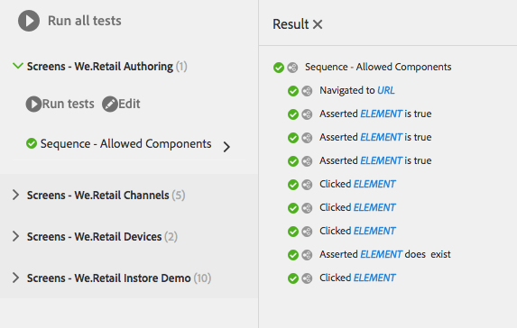
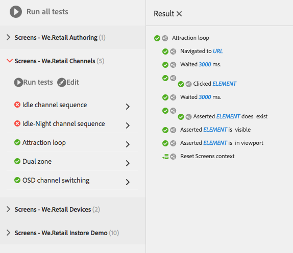

# Testing Your UI{#testing-your-ui}

>[!NOTE]
>
>From AEM 6.5 onwards, the hobbes.js UI testing framework is deprecated. Adobe does not plan to make further enhancements to it and recommends customers to use Selenium automation.
>
>See [Deprecated and Removed Features](/help/release-notes/deprecated-removed-features.md).

AEM provides a framework for automating tests for your AEM UI. Using the framework, you write and run UI tests directly in a web browser. The framework provides a JavaScript API for creating tests.

The AEM test framework uses Hobbes.js, a testing library written in JavaScript. The Hobbes.js framework was developed for testing AEM as part of the development process. The framework is now available for public use for testing your AEM applications.

>[!NOTE]
>
>Refer to the Hobbes.js [documentation](https://developer.adobe.com/experience-manager/reference-materials/6-5/test-api/index.html) for full details of the API.

## Structure of Tests {#structure-of-tests}

When using automated tests within AEM, the following terms are important to understand:

| Action |An **Action** is a specific activity on a web page such as clicking a link or a button. |
|---|---|
| Test Case |A **Test Case** is a specific situation that can be made up of one or more **Actions**. |
| Test Suite |A **Test Suite** is a group of related **Test Cases** that together test a specific use case. |

## Executing Tests {#executing-tests}

### Viewing Test Suites {#viewing-test-suites}

Open the Testing Console to see the registered Test Suites. The Tests panel contains a list of test suites and their test cases.

Navigate to the Tools console via **Global Navigation -&gt; Tools &gt; Operations -&gt; Testing**.



When opening the console, the Test Suites are listed to the left along with an option to run all of them sequentially. The space to the right shown with a checkered background is a placeholder for showing page content as the tests run.



### Running a Single Test Suite {#running-a-single-test-suite}

Tests Suites can be run individually. When you run a Test Suite, the page changes as the Test Cases and their Actions are executed and the results appear after completion of the test. Icons indicate the results.

A checkmark icon indicates a passed test:


An "X" icon indicates a failed test:


To run a Test Suite:

1. In the Tests panel, click or tap the name of the Test Case that you want to run to expand the details of the Actions.

   

1. Click **Run test**.

   

1. The placeholder is replaced with page content as the test executes.

   

1. Review the results of the Test Case by tapping or clicking the description to open the **Result** panel. Tapping or clicking the name of your Test Case in the **Result** panel shows all details.

   

### Running Multiple Tests {#running-multiple-tests}

Test Suites execute sequentially in the order that they appear in the console. You can drill down into a test to see the detailed results.


1. On the Tests panel, tap or click either the **Run all tests** button or the **Run tests** button below the title of the Test Suite that you want to run.

   

1. To view the results of each Test Case, click the title of the Test Case. Clicking the name of your test in the **Result** panel shows all details.

   

## Creating and Using a Simple Test Suite {#creating-and-using-a-simple-test-suite}

The following procedure steps you through the creation and execution of a Test Suite using [We.Retail content](/help/sites-developing/we-retail.md), but you can easily modify the test to use a different web page.

For full details about creating your own Test Suites, see the [Hobbes.js API documentation](https://developer.adobe.com/experience-manager/reference-materials/6-5/test-api/index.html).

1. Open CRXDE Lite. ([https://localhost:4502/crx/de](https://localhost:4502/crx/de))
1. Right-click the `/etc/clientlibs` folder and click **Create > Create Folder**. Type `myTests` for the name and click **OK**.
1. Right-click the `/etc/clientlibs/myTests` folder and click **Create &gt; Create Node**. Use the following property values and then click **OK**:

    * Name: `myFirstTest`
    * Type: `cq:ClientLibraryFolder`

1. Add the following properties to the myFirstTest node:

   | Name |Type |Value |
   |---|---|---|
   | `categories` |String[] | `granite.testing.hobbes.tests` |
   | `dependencies` |String[] | `granite.testing.hobbes.testrunner` |

   >[!NOTE]
   >
   >**AEM Forms only**
   >
   >
   >To test adaptive forms, add the following values to the categories and dependencies. For example:
   >
   >
   >**categories**: `granite.testing.hobbes.tests, granite.testing.hobbes.af.commons`
   >
   >
   >**dependencies**: `granite.testing.hobbes.testrunner, granite.testing.hobbes.af`

1. Click **Save All**.
1. Right-click the `myFirstTest` node and click **Create > Create File**. Name the file `js.txt` and click **OK**.
1. In the `js.txt` file, enter the following text:

   ```
   #base=.
   myTestSuite.js
   ```

1. Click **Save All** and then close the `js.txt` file.
1. Right-click the `myFirstTest` node and click **Create > Create File**. Name the file `myTestSuite.js` and click **OK**.
1. Copy the following code to the `myTestSuite.js` file then save the file:

   ```
   new hobs.TestSuite("Experience Content Test Suite", {path:"/etc/clientlibs/myTests/myFirstTest/myTestSuite.js"})
      .addTestCase(new hobs.TestCase("Navigate to Experience Content")
         .navigateTo("/content/we-retail/us/en/experience/arctic-surfing-in-lofoten.html")
      )
      .addTestCase(new hobs.TestCase("Hover Over Topnav")
         .mouseover("li.visible-xs")
      )
      .addTestCase(new hobs.TestCase("Click Topnav Link")
         .click("li.active a")
   );
   ```

1. Navigate to the **Testing** console to try your test suite.
