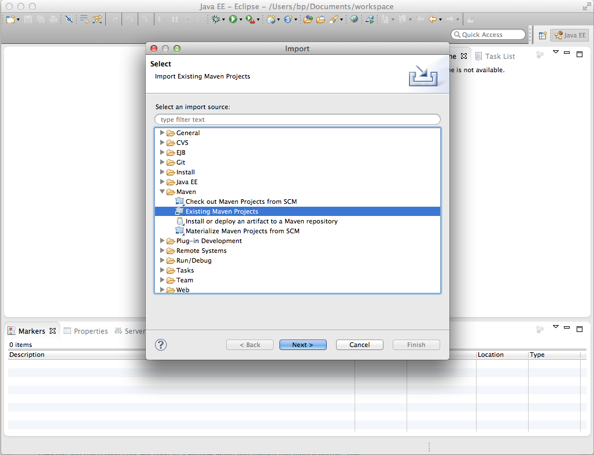
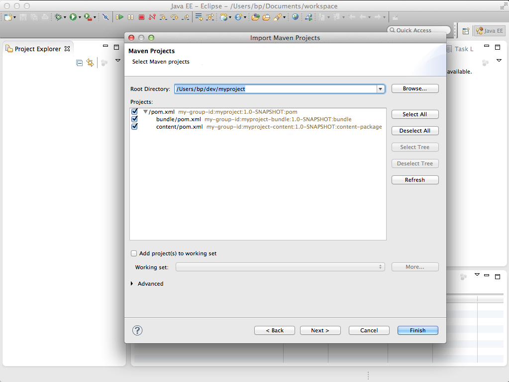

# How to Develop AEM Projects Using Eclipse{#how-to-develop-aem-projects-using-eclipse}

This guide describes how to use Eclipse for developing AEM based projects.

>[!NOTE]
>
>Adobe now provides the [AEM Development Tools for Eclipse](/help/sites-developing/aem-eclipse.md) which helps you to develop AEM solutions with Eclipse.

## Overview {#overview}

To get started with AEM development on Eclipse, the following steps are required.

Each of them is expained in more detail in the remainder of this How-To.

* Install Eclipse 4.3 (Kepler)
* Set up your AEM project based on Maven
* Prepare JSP support for Eclipse in the Maven POM
* Import the Maven Project into Eclipse

>[!NOTE]
>
>This guide is based on Eclipse 4.3 (Kepler) and AEM 5.6.1.

## Install Eclipse {#install-eclipse}

Download the "Eclipse IDE for Java EE Developers" from the [Eclipse Downloads page](https://www.eclipse.org/downloads/).

Install Eclipse following the [Installation Instructions](https://wiki.eclipse.org/Eclipse/Installation).

## Set up your AEM project based on Maven {#set-up-your-aem-project-based-on-maven}

Next, set up your project using Maven as described in [How-To Build AEM Projects using Apache Maven](/help/sites-developing/ht-projects-maven.md).

## Prepare JSP Support for Eclipse {#prepare-jsp-support-for-eclipse}

Eclipse can also provide support in working with JSP, for example,

* auto-completion of tag libraries
* Eclipse-awareness of objects defined by &lt;cq:defineObjects /&gt; and &lt;sling:defineObjects /&gt;

For that to work:

1. Follow the instructions on [How-To Work with JSPs](/help/sites-developing/ht-projects-maven.md#how-to-work-with-jsps) in [How-To Build AEM Projects using Apache Maven](/help/sites-developing/ht-projects-maven.md).
1. Add the following to the &lt;build /&gt; section in your content module's POM.

   Eclipse's Maven support plugin, m2e, does not provide support for the maven-jspc-plugin, and this configuration tells m2e to ignore the plugin and the related task of cleaning up the temporary compilation results.

   This is not a problem: as noted in [How-To Work with JSPs](/help/sites-developing/ht-projects-maven.md#how-to-work-with-jsps), the maven-jspc-plugin in this setup is only used to validate that JSPs compile as part of the build process. Eclipse already reports any problems in JSPs and does not rely on this Maven plugin to be able to do so.

   **myproject/content/pom.xml**

   ```xml
   <build>
     <!-- ... -->
     <pluginManagement>
       <plugins>
         <!--This plugin's configuration is used to store Eclipse m2e settings only. It has no influence on the Maven build itself.-->
         <plugin>
           <groupId>org.eclipse.m2e</groupId>
           <artifactId>lifecycle-mapping</artifactId>
           <version>1.0.0</version>
           <configuration>
             <lifecycleMappingMetadata>
               <pluginExecutions>
                 <pluginExecution>
                   <pluginExecutionFilter>
                     <groupId>org.apache.sling</groupId>
                     <artifactId>maven-jspc-plugin</artifactId>
                     <versionRange>[2.0.6,)</versionRange>
                     <goals>
                       <goal>jspc</goal>
                     </goals>
                   </pluginExecutionFilter>
                   <action>
                     <ignore/>
                   </action>
                 </pluginExecution>
                 <pluginExecution>
                   <pluginExecutionFilter>
                     <groupId>org.apache.maven.plugins</groupId>
                     <artifactId>maven-clean-plugin</artifactId>
                     <versionRange>[2.4.1,)</versionRange>
                     <goals>
                       <goal>clean</goal>
                     </goals>
                   </pluginExecutionFilter>
                   <action>
                     <ignore/>
                   </action>
                 </pluginExecution>
               </pluginExecutions>
             </lifecycleMappingMetadata>
           </configuration>
         </plugin>
       </plugins>
     </pluginManagement>
   </build>
   ```

### Import the Maven Project into Eclipse {#import-the-maven-project-into-eclipse}

1. In Eclipse, choose File &gt; Import...
1. In the Import Dialog, choose Maven &gt; Existing Maven Projects, then click "Next".

   

1. Enter the path to your project's top-level folder, then click "Select All" and "Finish".

   

1. You are now all set for using Eclipse to develop your AEM project, including JSP autocompletion.

   

   >[!NOTE]
   >
   >If you include `/libs/foundation/global.jsp` or other JSPs in `/libs`, you must copy that to your project so Eclipse can resolve the inclusion. At the same time, you need to make sure that it is not bundled into your content package by Maven. How to achieve this is described in [How to Build AEM Projects using Apache Maven](/help/sites-developing/ht-projects-maven.md).
