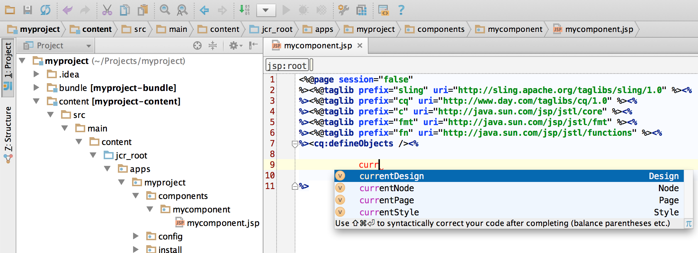
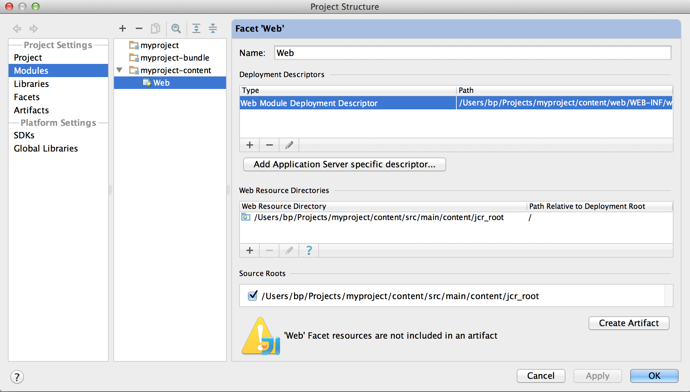
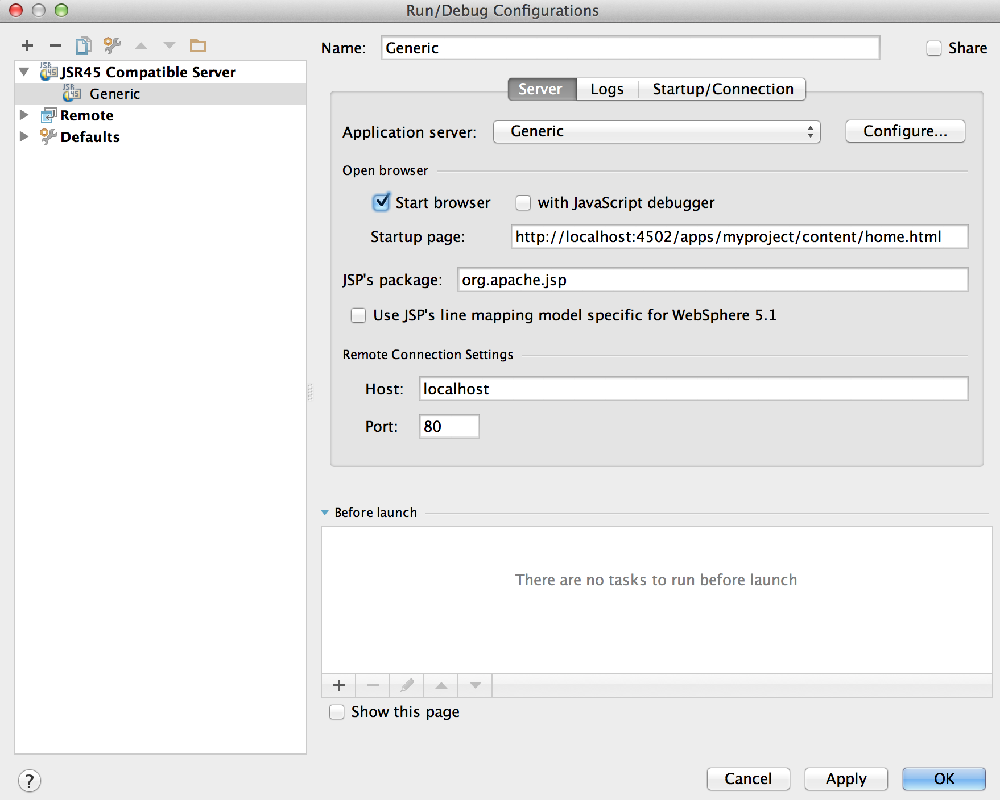

# How to Develop AEM Projects using IntelliJ IDEA{#how-to-develop-aem-projects-using-intellij-idea}

## Overview {#overview}

To get started with AEM development on IntelliJ, the following steps are required.

Each step is explained in more detail in the remainder of this topic.

* Install IntelliJ
* Set up your AEM project based on Maven
* Prepare JSP support for IntelliJ in the Maven POM
* Import the Maven Project into IntelliJ

>[!NOTE]
>
>This guide is based on IntelliJ IDEA Ultimate Edition 12.1.4 and AEM 5.6.1.

### Install IntelliJ IDEA {#install-intellij-idea}

Download IntelliJ IDEA from [the Downloads page at JetBrains](https://www.jetbrains.com/idea/download/).

Then, follow the installation instructions on that page.

### Set up your AEM project based on Maven {#set-up-your-aem-project-based-on-maven}

Next, set up your project using Maven as described in [How-To Build AEM Projects using Apache Maven](/help/sites-developing/ht-projects-maven.md).

To start working with AEM Projects in IntelliJ IDEA, the basic setup in [Getting Started in 5 Minutes](https://maven.apache.org/guides/getting-started/maven-in-five-minutes.html) is sufficient.

### Prepare JSP Support for IntelliJ IDEA {#prepare-jsp-support-for-intellij-idea}

IntelliJ IDEA can also provide support in working with JSP, for example:

* auto-completion of tag libraries
* awareness of objects defined by `<cq:defineObjects />` and `<sling:defineObjects />`

For that to work, follow the instructions on [How-To Work with JSPs](/help/sites-developing/ht-projects-maven.md#how-to-work-with-jsps) in [How-To Build AEM Projects using Apache Maven](/help/sites-developing/ht-projects-maven.md).

### Import the Maven Project {#import-the-maven-project}

1. Open the **Import** dialog in IntelliJ IDEA by

    * selecting **Import Project** on the welcome screen if you have no project open yet
    * selecting **File -&gt; Import Project** from the main menu

1. In the Import dialog, select the POM file of your project.

   

1. Continue with the default settings as shown in the dialog below.

   

1. Continue through the following dialogs by clicking **Next** and **Finish**.
1. You are now set up for AEM Development using IntelliJ IDEA

   

### Debugging JSPs with IntelliJ IDEA {#debugging-jsps-with-intellij-idea}

The following steps are necessary for debugging JSPs with IntelliJ IDEA

* Set up a Web Facet in the Project
* Install the JSR45 support plugin
* Configure a Debug Profile
* Configure AEM for Debug Mode

#### Set up a Web Facet in the Project {#set-up-a-web-facet-in-the-project}

IntelliJ IDEA must understand where to find the JSPs for debugging. Because IDEA cannot interpret the `content-package-maven-plugin` settings, it must be configured manually.

1. Go to **File -&gt; Project Structure**
1. Select the **Content** module
1. Click **+** above the list of modules and select **Web**
1. As the Web Resource Directory, select the `content/src/main/content/jcr_root subdirectory` of your project as shown in the screenshot below.



#### Install the JSR45 support plugin {#install-the-jsr-support-plugin}

1. Go to the **Plugins** pane in the IntelliJ IDEA settings
1. Navigate to the **JSR45 Integration** Plugin and select the check box next to it
1. Click **Apply**
1. Restart IntelliJ IDEA when requested to


#### Configure a Debug Profile {#configure-a-debug-profile}

1. Go to **Run -&gt; Edit Configurations**
1. Hit the **+** and select **JSR45 Remote**
1. In the configuration dialog, select **Configure** next to **Application Server** and configure a Generic server
1. Set the start page to an appropriate URL if you want to open a browser when you start debugging
1. Remove all **Before launch** tasks if you use vlt autosync, or configure appropriate Maven tasks if you don't
1. On the **Startup/Connection** pane, adjust the port, if necessary
1. Copy the command-line arguments that IntelliJ IDEA proposes

 

#### Configure AEM for Debug Mode {#configure-aem-for-debug-mode}

The last step required is to start AEM with the JVM options proposed by IntelliJ IDEA.

Start the AEM jar file directly and adding these options, for example with the following command line:

`java -Xdebug -Xrunjdwp:transport=dt_socket,address=58242,suspend=n,server=y -Xmx1024m -jar cq-quickstart-6.5.0.jar`

You can also add these options to your start script in `crx-quickstart/bin/start` as shown below.

```shell
# ...

# default JVM options
if [ -z "$CQ_JVM_OPTS" ]; then
 CQ_JVM_OPTS='-server -Xmx1024m -Djava.awt.headless=true'
fi

CQ_JVM_OPTS="$CQ_JVM_OPTS -Xdebug -Xrunjdwp:transport=dt_socket,address=58242,suspend=n,server=y"

# ...
```

#### Start Debugging {#start-debugging}

You are now all set up for debugging your JSPs in AEM.

1. Select **Run -&gt; Debug -&gt; Your Debug Profile**
1. Set breakpoints in your component code
1. Access a page in your browser


### Debugging Bundles with IntelliJ IDEA {#debugging-bundles-with-intellij-idea}

Code in bundles can be debugged using a standard generic remote debug connection. You can follow the [Jetbrain documentation on remote debugging](https://www.jetbrains.com/help/idea/remote-debugging-with-product.html#remote-interpreter).
