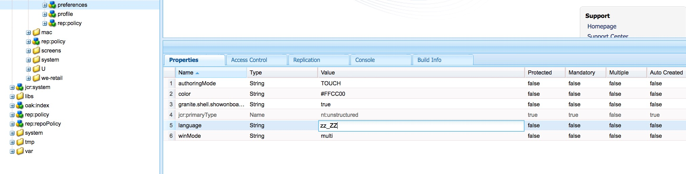

# Internationalizing UI Strings {#internationalizing-ui-strings}

Java&trade; and JavaScript APIs enable you to internationalize strings in the following types of resources:

* Java&trade; source files.
* JSP scripts.
* JavaScript in client-side libraries or in page source.
* JCR node property values used in dialogs and component configuration properties.

For an overview of the internationalization and localization process, see [Internationalizing Components](/help/sites-developing/i18n.md).

## Internationalizing Strings in Java&trade; and JSP Code {#internationalizing-strings-in-java-and-jsp-code}

The `com.day.cq.i18n` Java&trade; package enables you to display localized strings in your UI. The `I18n` class provides the `get` method that retrieves localized strings from the Adobe Experience Manager (AEM) dictionary. The only required parameter of the `get` method is the string literal in the English language. English is the default language for the UI. The following example localizes the word `Search`:

`i18n.get("Search");`

Identifying the string in the English language differs from typical internationalization frameworks where an ID identifies a string and is used to reference the string at runtime. Using the English string literal provides the following benefits:

* Code is easy to understand.
* The string in the default language is always available.

### Determining the User's Language {#determining-the-user-s-language}

There are two ways to determine the language that the user prefers:

* For authenticated users, determine the language from the preferences in the user account.
* The locale of the requested page.

The language property of the user account is the preferred method because it is more reliable. However, the user must be logged in to use this method.

#### Creating the I18n Java&trade; object {#creating-the-i-n-java-object}

The I18n class provides two constructors. How you determine the user's preferred language determines the constructor to use.

To present the string in the language that is specified in the user account, use the following constructor (after importing `com.day.cq.i18n.I18n)`:

```java
I18n i18n = new I18n(slingRequest);
```

The constructor uses the `SlingHTTPRequest` to retrieve the user's language setting.

To use the page locale to determine the language, first obtain the ResourceBundle for the language of the requested page:

```java
Locale pageLang = currentPage.getLanguage(false);
ResourceBundle resourceBundle = slingRequest.getResourceBundle(pageLang);
I18n i18n = new I18n(resourceBundle);
```

#### Internationalizing a String {#internationalizing-a-string}

Use the `get` method of the `I18n` object to internationalize a string. The only required parameter of the `get` method is the string to internationalize. The string corresponds with a string in a Translator dictionary. The get method looks up the string in the dictionary and returns the translation for the current language.

The first argument of the `get` method must comply with the following rules:

* The value must be a string literal. A variable of type `String` is not acceptable.
* The string literal must be expressed on a single line.
* The string is case-sensitive.

```xml
i18n.get("Enter a search keyword");
```

#### Using Translation Hints {#using-translation-hints}

Specify the [translation hint](/help/sites-developing/i18n-translator.md#adding-changing-and-removing-strings) of the internationalized string to distinguish between duplicate strings in the dictionary. Use the second, optional parameter of the `get` method to provide the translation hint. The translation hint must exactly match the Comment property of the item in the dictionary.

For example, the dictionary contains the string `Request` twice: once as a verb and once as a noun. The following code includes the translation hint as an argument in the `get` method:

```java
i18n.get("Request","A noun, as in a request for a web page");
```

#### Including Variables in Localized Sentences {#including-variables-in-localized-sentences}

Include variables in the localized string to build contextual meaning into a sentence. For example, after logging into a web application, the home page displays the message "Welcome back Administrator. You have two messages in your inbox." The page context determines the user name and the number of messages.

[In the dictionary](/help/sites-developing/i18n-translator.md#adding-changing-and-removing-strings), the variables are represented in strings as bracketed indexes. Specify the values of the variables as arguments of the `get` method. The arguments are placed following the translation hint, and the indexes correspond with the order of the arguments:

```xml
i18n.get("Welcome back {0}. You have {1} messages.", "user name, number of messages", user.getDisplayName(), numItems);
```

The internationalized string and the translation hint must exactly match the string and comment in the dictionary. You can omit the localization hint by providing a `null` value as the second argument.

#### Using the Static Get Method {#using-the-static-get-method}

The `I18N` class defines a static `get` method that is useful when you must localize a few strings. In addition to the parameters of an object's `get` method, the static method requires the `SlingHttpRequest` object or the `ResourceBundle` that you are using, according to how you are determining the user's preferred language:

* Use the user's language preference: Provide the SlingHttpRequest as the first parameter.

  `I18n.get(slingHttpRequest, "Welcome back {}. You have {} messages.", "user name, number of messages", user.getDisplayName(), numItems);`
* Use the page language: Provide the ResourceBundle as the first parameter.

  `I18n.get(resourceBundle,"Welcome back {}. You have {} messages.", "user name, number of messages", user.getDisplayName(), numItems);`

### Internationalizing Strings in JavaScript Code {#internationalizing-strings-in-javascript-code}

The JavaScript API enables you to localize strings on the client. As with [Java&trade; and JSP](#internationalizing-strings-in-java-and-jsp-code) code, the JavaScript API enables you to identify strings to localize, provide localization hints, and include variables in the localized strings.

The `granite.utils` [client library folder](/help/sites-developing/clientlibs.md) provides the JavaScript API. To use the API, include this client library folder on your page. Localization functions use the `Granite.I18n` namespace.

Before you present localized strings, set the locale using the `Granite.I18n.setLocale` function. The function requires the language code of the locale as an argument:

```
Granite.I18n.setLocale("fr");
```

To present a localized string, use the `Granite.I18n.get` function:

```
Granite.I18n.get("string to localize");
```

The following example internationalizes the string "Welcome back":

```
Granite.I18n.setLocale("fr");
Granite.I18n.get("string to localize", [variables], "localization hint");
```

The function parameters are different from the Java&trade; I18n.get method:

* The first parameter is the string literal to localize.
* The second parameter is an array of values to inject into the string literal.
* The third parameter is the localization hint.

The following example uses JavaScript to localize the "Welcome back Administrator. You have two messages in your inbox." sentence:

```
Granite.I18n.setLocale("fr");
Granite.I18n.get("Welcome back {0}. You have {1} new messages in your inbox.", [username, numMsg], "user name, number of messages");
```

### Internationalizing Strings from JCR Nodes {#internationalizing-strings-from-jcr-nodes}

UI strings are often based on JCR node properties. For example, the `jcr:title` property of a page is typically used as the content of the `h1` element in the page code. The `I18n` class provides the `getVar` method for localizing these strings.

The following example JSP script retrieves the `jcr:title` property from the repository and displays the localized string on the page:

```java
<% title = properties.get("jcr:title", String.class);%>
<h1><%=i18n.getVar(title) %></h1>
```

#### Specifying Translation Hints for JCR Nodes {#specifying-translation-hints-for-jcr-nodes}

Similar to [translation hints in the Java&trade; API](#using-translation-hints), you can provide translation hints to distinguish duplicate strings in the dictionary. Provide the translation hint as a property of the node that contains the internationalized property. The name of the hint property is composed of the name of the internationalized property name with the `_commentI18n` suffix:

`${prop}_commentI18n`

For example, a `cq:page` node includes the jcr:title property which is being localized. The hint is provided as the value of the property named jcr:title_commentI18n.

### Testing Internationalization Coverage {#testing-internationalization-coverage}

Test whether you have internationalized all the strings in your UI. To see which strings are covered, set the user language to zz_ZZ and open the UI in the web browser. The internationalized strings appear with a stub translation in the following format:

`USR_*Default-String*_尠`

The following image shows the stub translation for the AEM home page:


To set the language for the user, configure the language property of the preferences node for the user account.

The preferences node of a user has a path like this:

`/home/users/<letter>/<hash>/preferences`


