# Using Translator to Manage Dictionaries{#using-translator-to-manage-dictionaries}

AEM provides a console for managing the various translations of texts used in component UI. This console is available at

`https://<hostname>:<port-number>/libs/cq/i18n/translator.html`

Use the translator tool to manage English strings and their translations. The dictionaries are created in the repository, for example, /apps/myproject/i18n.

The Translator tool and the dictionaries that you manage are for presenting component UI in different languages. If you want to translate page or user generated content, see [Translating Content for Multilingual Sites](/help/sites-administering/translation.md) and [Translation of User Generated Content](/help/communities/translate-ugc.md).

>[!CAUTION]
>
>Only edit dictionaries that are created for your project and reside under `/apps`.
>
>AEM system dictionaries are also available in this tool. Do not change the AEM system dictionaries as this can cause problems with the AEM UI. Also, changes can be lost upon upgrade. AEM system dictionaries are located under `/libs`.

>[!NOTE]
>
>Although the Translator tool has a classic UI interface, it is used for translation of phrases regardless of the interface where those phrases are found.

The translator lists the texts used in AEM with the various language translations alongside each other:

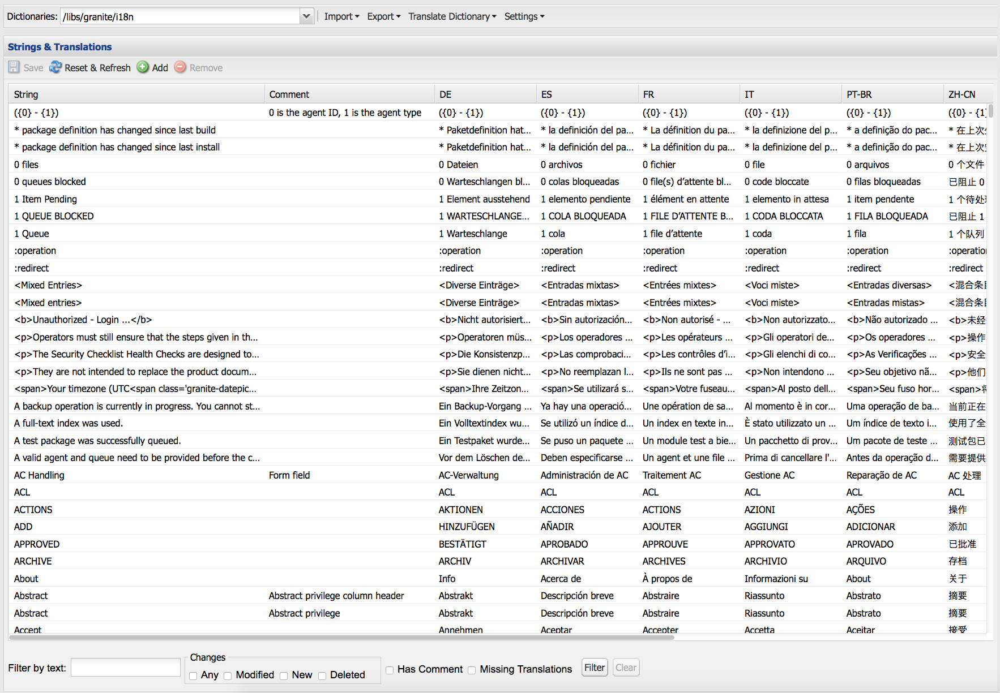

You can search, filter and edit the English and translated texts. You can also export dictionaries to XLIFF format for translating, then import the translations back into the dictionaries.

It is also possible to add the i18n dictonaries to a translation project from this console. You can either create one or add to an existing project.

1. Click **Translate Dictionary**.

   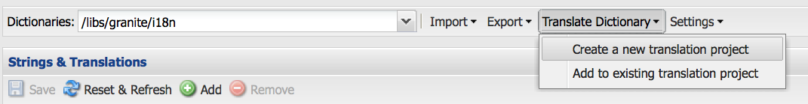

1. Select Create or Add option depending on your need. A dialog opens.

   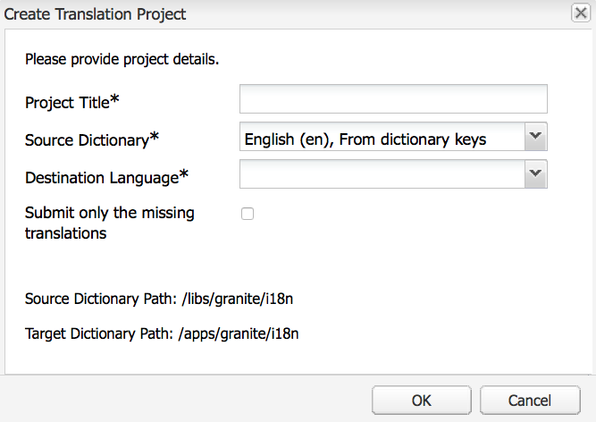

1. Fill the fields as required and click OK. 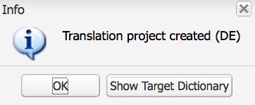

1. You can now click **OK** or see the Target Dictionary.

   >[!NOTE]
   >
   >For more information about translation projects, read [Managing Translation Projects](/help/sites-administering/tc-manage.md).

## Creating a Dictionary {#creating-a-dictionary}

Create a dictionary for managing your localized UI strings. After you create a dictionary you can use the Translation tool to manage it.

1. Using CRXDE Lite, add the root node ( `sling:Folder`) for your new dictionary as the structure to hold the language definitions:

   ` /apps/<projectName>/i18n`

   For example, `/apps/myProject/i18n`

1. Add the required language structure under this root. For example:

   ```shell
   /apps/myProject/i18n [sling:Folder]
       - de.json [nt:file] [mix:language]
           + jcr:language = de
       - fr.json [nt:file] [mix:language]
           + jcr:language = fr
   ```

   >[!NOTE]
   >
   >This is the structure from the [Sling i18n module](https://sling.apache.org/site/internationalization-support.html).

1. Reload the translator and the dictionary path (for example, `/apps/myProject/i18n`) will be available in the drop-down selector in the toolbar. Select this to start adding strings and their translations.

   >[!NOTE]
   >
   >The translator will only save translations for languages that are actually present underneath the path (for example, `/apps/myProject/i18n`).
   >
   >Make sure that these correspond to the languages shown in the grid.

## Managing Dictionary Strings {#managing-dictionary-strings}

Use the Translation tool to manage the strings in your dictionaries. You can add, modify, and remove English strings, and also provide translated strings.

>[!CAUTION]
>
>Only edit dictionaries that are created for your project and reside under `/apps`.
>
>Do not change the AEM system dictionaries as this can cause problems with the AEM UI. Also, changes can be lost upon upgrade. AEM system dictionaries are located under `/libs`.

### Adding, Changing, and Removing Strings {#adding-changing-and-removing-strings}

Add English strings to a dictionary that your component has internationalized. Only add strings that are internationalized so that you do not waste resources by translating strings that are not used.

The strings that you add to a dictionary must exactly match the string that is specified in code. If the default English string that is used in the code does not match the English string in a dictionary, the translated string does not appear in the UI when needed. Strings are case-sensitive.

**Providing Translation Hints**

Use the Commenet poperty of the dictionary string to provide information to the translator to clarify the meaning of the string. Typically, the UI assists users to determine the meaning of ambiguous words. However, the translator does not see the string within the context of the UI. The translation hint removes the ambiguity. For example, a comment helps the translator to understand that the English word Request is used as a noun rather than a verb.

Translation hints also distinguish strings that are identical and have different meanings. For example, the word Search can be a noun or a verb, requiring two "Search" entries in the dictionary with two different translation hints. The code that requests the string also includes the translation hint so that the correct string is used in the UI.

**Including Indexed Variables**

Include variables in the localized string to build contextual meaning into a sentence. For example, after logging into a web application, the home page displays the message "Welcome back Administrator. You have 2 messages in your inbox." The page context determines the user name and the number of messages.

To include variables in the localized string, place bracketed indexes at the location of the variables in the first argument of the get method. Use the localization hint to describe the values. The translator must understand the meaning of the variables because different languages use different sentence structures.

Note that [the code that requests the translated string](/help/sites-developing/i18n-dev.md#including-variables-in-localized-sentences) provides values for the indexed variables according to the context.

For example, the following string appears when a user logs into a web site, and is included in the dictionary:

`Welcome back {0}. You have {1} messages.`

The following Comment describes the variables:

`{0} = the user name, {1} = the number of items in the user's inbox`

**Modifying Strings**

Change or remove English strings as they are changed or removed in the code. When you change a string, the original string is persisted and a new string is made that reflects the change. Before you remove a string, make sure that no code uses it.

Use the following procedure to add a string.

1. In the Dictionaries drop-down menu, select the dictionary to which you are adding a string. In the drop-down menu, Dictionaries are represented by their path in the respository.
1. Above the Strings and Translations table, click Add.

   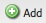

1. In the String box of the Add String dialog box, type the English string. In the Comment box, type a translation hint for the translator if necessary.
1. Click OK.
1. Click Save.

   

Use the following procedure to change a string in a dictionary.

1. In the Dictionaries drop-down menu, select the dictionary that contains the string to change.
1. Double-click the string to change.
1. In the Edit String dialog box, select Modify String or Comment (Creates a Copy).

   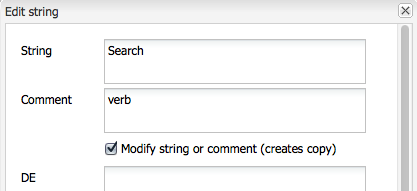

1. Modify the string or the comment and click OK.
1. Click Save.

   

Use the following procedure to remove a string from a dictionary.

1. In the Dictionaries drop-down menu, select the dictionary from which you are removing a string.
1. Click Remove.

   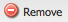

1. Click Save.

   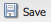

### Searching for Strings {#searching-for-strings}

The search bar at the bottom of the Translator tool provides string selection options:

* **Filter by text:** A pattern to match with the English string, comment, or translations. Only items that match all or part of the pattern appear in the table.
* **Changes: Any, Modified, New, Deleted:** Show items that have been changed and not saved.

    * Any: Show items that have been modified, added, or removed.
    * Modified: Show items that are changed.
    * New: Show items that are added.
    * Deleted: Show items that are to be removed.
    * Multiple Selections: Show items that have all the selected properties.

* **Has Comment**: Show items that have comments for translators.
* **Missing Translations:** Show items where at least one language does not have a translation.

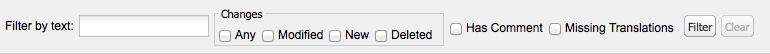

1. On the search bar, select the filtering options.
1. To filter using the options click Filter.
1. To remove the filters and see all items in the dictionary, click Clear.

### Editing Translated Strings {#editing-translated-strings}

After you add the English string to a dictionary, you can add translations of the string. You can also [export the dictionary](/help/sites-developing/i18n-translator.md#exporting-a-dictionary) to have it translated by a third-party.

1. Select [your project specific dictionary](#creating-a-dictionary) as it specifies the path in the repository holding the translations. For example, select **Dictionaries** as:

   `/apps/myProject/i18n`

   >[!CAUTION]
   >
   >Only edit dictionaries that are created for your project and reside under `/apps`.
   >
   >AEM system dictionaries are also available in this tool. Do not change the AEM system dictionaries as this can cause problems with the AEM UI. Also, changes can be lost upon upgrade. AEM system dictionaries are located under `/libs`.

1. To edit the translated texts for one of the strings you can either:

    * Double-click the appropriate language for the required string to edit that single text:

   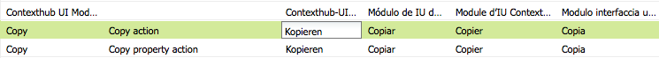

    * Double-click the **String** or **Comment** fields for the required string to open the **Edit string** dialog, edit the translation(s) as required, then click **OK** to close the dialog:

   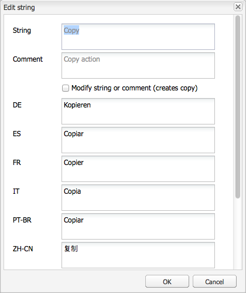

1. Click **Save** in the toolbar to commit your changes.

   >[!NOTE]
   >
   >Clicking on **Reset & Refresh** (instead of **Save**) reverts any changes to the prior texts.

## Using Third-Party Translators {#using-third-party-translators}

To support the use of third-party translation services, the Translation tool enables you to export and import dictionaries.

### Exporting a Dictionary {#exporting-a-dictionary}

Export a dictionary to an XLIFF file so that a third-party service can translate the dictionary strings.

* Export a dictionary and include the English and the translated terms for a language.
* Export some or all of only the English strings.

When you export an XLIFF file and include a language, the node structure of the dictionary in the repository must include that language. If the language is not included, errors occur. For example, to export the French XLIFF file, the dictionary folder must include the `mix:language` child node named `fr`. (See [Creating a Dictionary](/help/sites-developing/i18n-translator.md#creating-a-dictionary).)

Use the following procedure to export an XLIFF file for a specific language.

1. Open the Translation tool `http://<host>:<port>/libs/cq/i18n/translator.html`
1. Use the Dictionaries drop-down menu to select the dictionary to export.
1. Click Export &gt; Export Full *XX* Xliff Options, where *XX* is the two-letter language code such as DE or FR.

   The XLIFF file opens in a new tab or window.

1. Use the web browser commands to save the page as a file on your file system, such as File &gt; Save Page As.

Use the following procedure to export all or some of only the English strings.

1. Open the Translation tool. `http://<host>:<port>/libs/cq/i18n/translator.html`
1. Use the Dictionaries drop-down menu to select the dictionary to export.
1. If you are exporting a subset of the strings, select the items in the dictionary to export. Selecting no items exports all the items.
1. Click Export &gt; Export Selection As Xliff (Strings Only).
1. In the dialog box that appears, copy the text and paste it into a text file.

### Importing a Dictionary {#importing-a-dictionary}

Import an XLIFF file into a dictionary to populate the dictionary. When the dictionary includes a translation for an English string and the XLIFF file contains a different translation for the same string, the dictionary translation is replaced.

1. Open the Translation tool `http://<host>:<port>/libs/cq/i18n/translator.html`
1. Click Import &gt; XLIFF Translations.
1. Select the file to import and click OK.

## Managing Supported Lanuages {#managing-supported-lanuages}

Add or remove languages that the Translation tool supports and that are provided to users of your web pages.

### Changing Languages Listed in the Dictionary Table {#changing-languages-listed-in-the-dictionary-table}

The Translator tool includes the following languages in the dictionary table:

* de - German
* fr - French
* it - Italian
* es - Spanish
* ja - Japanese
* pt-br - Brazilian Portuguese
* zh-cn - Simplified Chinese
* zh-tw - Traditional Chinese (limited support)
* ko-kr - Korean

Use the following procedure to add or remove languages.

1. Using CRXDE Lite, create a node:

   `/etc/languages`

1. On this node, create a property:

    * **Name**: `languages`
    * **Type**: `Multi-String`
    * **Value**: the list of languages you want displayed. For example:

        * fr
        * es

   >[!NOTE]
   >
   >The language codes must be lowercase.

1. Click **Save All** in CRXDE Lite and reload the translator. The grid will be updated to show the languages defined.

   >[!NOTE]
   >
   >The translator will only save translations for languages that are actually [present in the dictionary](#creating-a-dictionary) (that is, underneath the dictionary path such as `/apps/myProject/i18n`).
   >
   >Make sure that these correspond to the languages shown in the grid.

### Making Languages Available to Authors {#making-languages-available-to-authors}

After defing a dictionary for a language new to your AEM instance you need to make this available for selection by the authors (for example, for use in **Preferences**):

1. To change the list of available languages available in **Preferences** of the **Security** console:

    1. Create an overlay in your application code for:

       ```
               /libs/cq/security/widgets/source/widgets/security/Preferences.js
        and update as required.
       ```

1. To make the language available in **Preferences** from the **Websites** console you need to make the following changes in your application:

    1. Create an overlay for the structure under:

       `/libs/cq/security/content/tools/userProperties`

    1. Inside the overlay update the language list under:

       `items/common/items /lang/options`

1. Save everything and reload the appropriate console.

### Changing Language Names and Default Countries {#changing-language-names-and-default-countries}

Various countries use the same language, for example, the US, the UK and Australia all use English. This is indicated by a code indicating both language and country such as `en_US`, `en_GB` and `en_AU`.

The default countries are used when displaying flags (for example, in the language copy dialog), they are used to resolve the country for a language code.

>[!NOTE]
>
>For localizations as managed by the translator above, only the exact language works. If the language preference drop-down uses `en_uk`, there must be a `en_uk` dictionary in the repository.

To change the default definitions:

1. A language list is stored under:

   `/libs/wcm/core/resources/languages`

   Overlay this by copying it to:

   `/apps/wcm/core/resources/languages`

   Then changing or extending the list there. The property `defaultCountry` on a language node (for example, `ja`) must contain the full code, such as `ja_jp`, which would define `jp` as the default country for the language `ja`.

1. Update the **CQ WCM Language Manager**.

    * **Language list**:

      The path to the language list in the repository. Set this to the location used to overlay:

      ```
             /apps/wcm/core/resources/languages
      ```

   You can do this using the OSGi Web Console:

   ```shell
   https://<hostname>:<port-number>/system/console/configMgr/com.day.cq.wcm.core.impl.LanguageManagerImpl
   ```

## Publishing Dictionaries {#publishing-dictionaries}

Incorporate your dictionaries into the release management process of your AEM applications. For example, include the dictionary in the content package of your application for deployment to the publish instance. This strategy provides the following benefits:

* Dictionaries are available for components in their publish environment.
* Changes to component UI strings are deployed along with the updated translations.

Similarly, testing of dictionary strings should be performed as part of your normal software development lifecycle.

>[!NOTE]
>
>Do not use regular publish functionality, or replication, for dictionaries. Instead dictionaires should be treated the same way as code and configuration. This includes using source control to track changes, and using content packages to apply changes to author and publish.

>[!NOTE]
>
>When using Dispatcher, you need to [invalidate cached pages](https://helpx.adobe.com/experience-manager/dispatcher/using/page-invalidate.html) to include new dicationary strings in rendered component strings.
