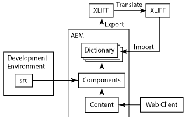
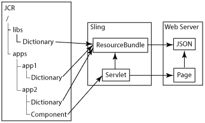

# Internationalizing Components{#internationalizing-components}

Internationalize your components and dialogs so that their UI strings can be presented in different languages. Components that are designed for internationalization enable UI strings to be externalized, translated, then imported to the repository. At runtime, the user's language preferences or the page locale determines which language is displayed in the UI.

Use the following process to internationalize your components and provide the UI in different languages:

1. [Implement your components using code that internationalizes strings.](/help/sites-developing/i18n-dev.md) Your code identifies the strings to translate, and selects the language to present at runtime.
1. [Create dictionaries](/help/sites-developing/i18n-translator.md#creating-a-dictionary) and [add](/help/sites-developing/i18n-translator.md#adding-changing-and-removing-strings) the English strings to translate.

1. [Export](/help/sites-developing/i18n-translator.md#exporting-a-dictionary) the dictionary to XLIFF format, translate the strings, then [import](/help/sites-developing/i18n-translator.md#importing-a-dictionary) the XLIFF files back into AEM. Alternatively, you can [manally add translations](/help/sites-developing/i18n-translator.md#editing-translated-strings) to the dictionary.

1. [Incorporate the dictionary into the release management process of your application](/help/sites-developing/i18n-translator.md#publishing-dictionaries).

>[!NOTE]
>
>The methods described here for internationalizing components is meant for translating static strings. When component strings are expected to change you should use conventional translation workflows. For example, when authors can edit a UI string using properties in the Edit dialog of a component, you should not use a language dictionary to internationalize the string.

## Language Dictionaries {#language-dictionaries}

The AEM internationalization framework uses dictionaries in the repository to store English strings and their translations in other languages. The framework uses English as the default language. Strings are identified using their English version. Typically, internationalization frameworks use alphanumeric IDs for UI strings. Using the English version of the string as the ID has several advantages:

* Code is easy to read.
* The default language is always available.

Localized strings can be stored in several dictionaries in the repository. AEM system dictionaries are located below the `/libs` node. You can create dictionaries for your components below the `/apps` node. The AEM internationalization framework combines the dictionaries and makes them available in Sling as a single `ResourceBundle` object. When components are rendered, they retrieve translated strings from the resource bundle. The combined dictionaries are also deployed on the web server in JSON format to provide translated strings to JavaScript code in web pages.

Also, the [Translation tool](/help/sites-developing/i18n-translator.md) enables you to manage all dictionaries from one central location.

>[!NOTE]
>
>Do not modify the AEM system dictionaries that are located below the `/libs` node.

### Overlaying Strings in System Dictionaries {#overlaying-strings-in-system-dictionaries}

Strings in dictionaries below the `/apps` node override duplicate strings in dictionaries that are below the `/libs` node. If your components use strings that are included in the AEM system dictionaries, duplicate the string in your own dictionary. All components will use the strings from your dictionary.

Note that you cannot predict which translation is used when strings are duplicated in dictionaries that are all located below the `/apps` node.
