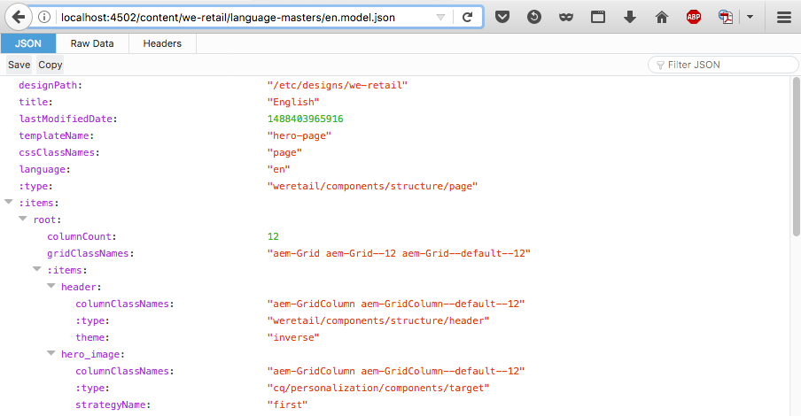
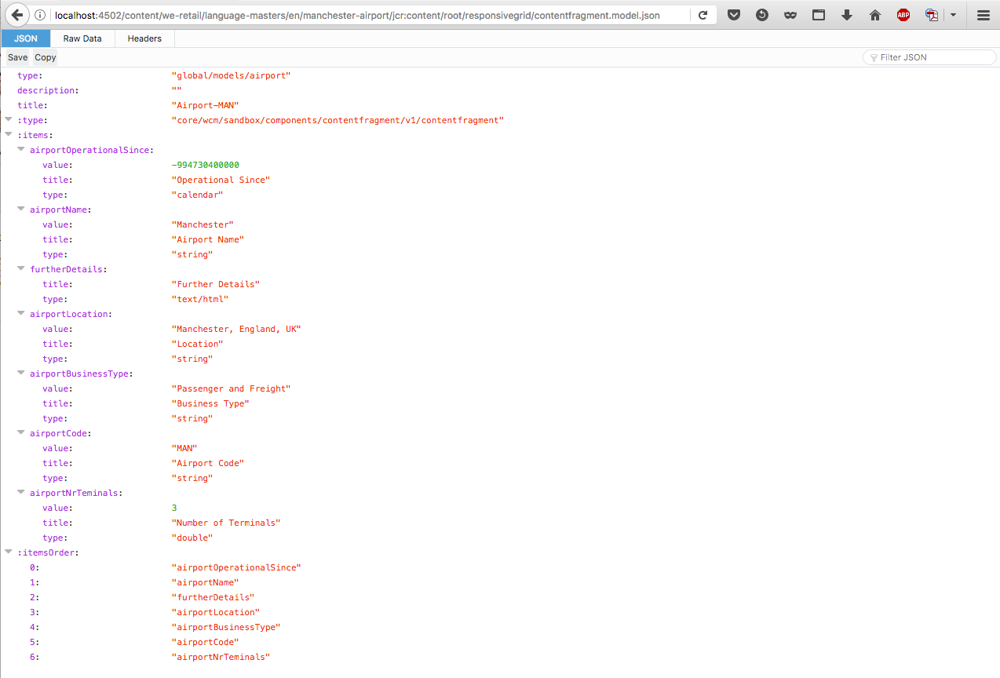

# JSON Exporter for Content Services{#json-exporter-for-content-services}

AEM Content Services are designed to generalize the description and delivery of content in/from AEM beyond a focus on web pages.

They provide the delivery of content to channels that are not traditional AEM web pages, using standardized methods that can be consumed by any client. These channels can include:

* [Single Page Applications](spa-walkthrough.md)
* Native Mobile Applications
* other channels and touch-points external to AEM

With content fragments that use structured content, you can provide content services by using the JSON exporter to deliver the contents of any AEM page in JSON data model format. This method can then be consumed by your own applications.

>[!NOTE]
>
>The functionality described here is available for all Core Components since [release 1.1.0 of the Core Components](https://experienceleague.adobe.com/docs/experience-manager-core-components/using/introduction.html?lang=en).

## JSON Exporter with Content Fragment Core Components {#json-exporter-with-content-fragment-core-components}

Using the AEM JSON exporter, you can deliver the contents of any AEM page in JSON data model format. This method can then be consumed by your own applications.

Within AEM, the delivery is achieved using the selector `model` and `.json` extension.

`.model.json`

1. For example, a URL such as:

   ```shell
   http://localhost:4502/content/we-retail/language-masters/en.model.json
   ```

1. Delivers content such as:

   

You can alternatively deliver the contents of a structured content fragment by targeting it specifically.

Use the entire path to the fragment (by way of the `jcr:content`); for example, with a suffix such as.

`.../jcr:content/root/responsivegrid/contentfragment.model.json`

Your page can contain either a single content fragment or multiple components of various types. You can also use mechanisms such as list components to automatically search for relevant content.

* For example, a URL such as:

  ```shell
  http://localhost:4502/content/we-retail/language-masters/en/manchester-airport/jcr:content/root/responsivegrid/contentfragment.model.json
  ```

* Delivers content such as:

  

  >[!NOTE]
  >
  >You can [adapt your own components](/help/sites-developing/json-exporter-components.md) to access and use this data.

  >[!NOTE]
  >
  >Although not a standard implementation, [multiple selectors are supported,](json-exporter-components.md#multiple-selectors) but `model` must be the first.

### Further Information {#further-information}

See also:

* Assets HTTP API

    * [Assets HTTP API](/help/assets/mac-api-assets.md)

* Sling Models:

    * [Sling Models - Associating a model class with a resource type since 130](https://sling.apache.org/documentation/bundles/models.html#associating-a-model-class-with-a-resource-type-since-130)

* AEM with JSON:

    * [Obtaining Page Information in JSON Format](/help/sites-developing/pageinfo.md)

## Related Documentation {#related-documentation}

For further details, see:

* The [Content Fragments topic in the Assets user guide](/help/assets/content-fragments/content-fragments.md)

* [Content Fragment Models](/help/assets/content-fragments/content-fragments-models.md)
* [Authoring with Content Fragments](/help/sites-authoring/content-fragments.md)
* [Enabling JSON Export for a Component](/help/sites-developing/json-exporter-components.md)

* [Core Components](https://experienceleague.adobe.com/docs/experience-manager-core-components/using/introduction.html) and the [Content Fragment component](https://experienceleague.adobe.com/docs/experience-manager-core-components/using/wcm-components/content-fragment-component.html?lang=en)
