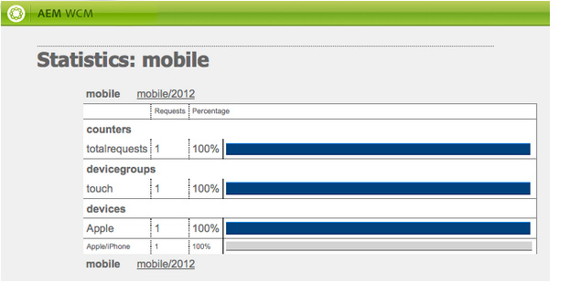

# Creating Sites for Mobile Devices{#creating-sites-for-mobile-devices}

{{ue-over-mobile}}

Creating a mobile site is similar to creating a standard site as it also involves creating templates and components. For more details on creating templates and components, see the following pages: [Templates](/help/sites-developing/templates.md), [Components](/help/sites-developing/components.md), and [Getting Started Developing AEM Sites](/help/sites-developing/getting-started.md). The main difference consists in enabling the Adobe Experience Manager (AEM) built-in mobile functionalities within the site. It is achieved by creating a template that relies on the mobile page component.

Consider using [responsive design](/help/sites-developing/responsive.md), creating a single site that accommodates multiple screen sizes.

To get started, you can have a look at the **We.Retail Mobile Demo Site** that is available in AEM.

To create a mobile site, proceed as follows:

1. Create the page component:

    * Set the `sling:resourceSuperType` property to `wcm/mobile/components/page`
      This way the component relies on the mobile page component.

    * Create the `body.jsp` with the project-specific logic.

1. Create the page template:

    * Set the `sling:resourceType` property to the newly created page component.
    * Set the `allowedPaths` property.

1. Create the design page for the site.
1. Create the site root page below the `/content` node:

    * Set the `cq:allowedTemplates` property.
    * Set the `cq:designPath` property.

1. In the page properties of the site root page, set the device groups in the **Mobile** tab.
1. Create the site pages by using the new template.

The mobile page component ( `/libs/wcm/mobile/components/page`):

* Adds the **Mobile** tab to the page properties dialog.
* Through its `head.jsp`, it retrieves the current mobile device group from the request and if a device group is found, uses the group's `drawHead()` method to include the device group's associated emulator init component (only in author mode) and the device group's rendering CSS.

>[!NOTE]
>
>The root page of the mobile site needs to be at the level 1 of the node hierarchy, and is recommended to be below the /content node.

## Creating a Mobile Site with the Multi Site Manager {#creating-a-mobile-site-with-the-multi-site-manager}

Use Multi Site Manager (MSM) to create a mobile live copy from a standard site. The standard site is automatically transformed into a mobile site: the mobile site has all the features of the mobile sites (for example, edition within an emulator) and can be managed in sync with the standard site. Refer to the section [Creating a Live Copy for different Channels](/help/sites-administering/msm.md) in the Multi Site Manager page.

## Server-Side Mobile API {#server-side-mobile-api}

The Java&trade; packages containing the mobile classes are:

* [com.day.cq.wcm.mobile.api](https://developer.adobe.com/experience-manager/reference-materials/6-5/javadoc/com/day/cq/wcm/mobile/api/device/capability/package-summary.html) - defines MobileConstants.
* [com.day.cq.wcm.mobile.api.device](https://developer.adobe.com/experience-manager/reference-materials/6-5/javadoc/com/day/cq/wcm/mobile/api/device/package-summary.html) - defines Device, DeviceGroup, and DeviceGroupList.
* [com.day.cq.wcm.mobile.api.device.capability](https://developer.adobe.com/experience-manager/reference-materials/6-5/javadoc/com/day/cq/wcm/mobile/api/device/capability/package-summary.html) - defines DeviceCapability.
* [com.day.cq.wcm.mobile.api.wurfl](https://developer.adobe.com/experience-manager/reference-materials/6-5/javadoc/com/day/cq/wcm/workflow/api/package-summary.html) - defines WurflQueryEngine.
* [com.day.cq.wcm.mobile.core](https://developer.adobe.com/experience-manager/reference-materials/6-5/javadoc/com/day/cq/wcm/mobile/core/package-summary.html) - defines MobileUtil, which provides various utility methods revolving around WCM Mobile.

### Mobile Components {#mobile-components}

The **We.Retail Mobile Demo Site** uses the following mobile components which are located below `/libs/foundation/components`:

<table>
 <tbody>
  <tr>
   <td>Name</td>
   <td>Group</td>
   <td>Characteristics</td>
  </tr>
  <tr>
   <td>mobilefooter</td>
   <td>hidden</td>
   <td>- footer</td>
  </tr>
  <tr>
   <td>mobileimage</td>
   <td>Mobile</td>
   <td>- based on the image foundation component<br /> - renders an image if the device is capable<br /> </td>
  </tr>
  <tr>
   <td>mobilelist</td>
   <td>Mobile</td>
   <td>- based on the list foundation component<br /> - listitem_teaser.jsp renders an image if the device is capable<br /> </td>
  </tr>
  <tr>
   <td>mobilelogo</td>
   <td>hidden</td>
   <td>- based on the logo foundation component<br /> - renders an image if the device is capable<br /> </td>
  </tr>
  <tr>
   <td>mobilereference</td>
   <td>Mobile</td>
   <td><p>- similar to the reference foundation component</p> <p>- maps a textimage component to a mobiletextimage one and an image component to a mobileimage one</p> </td>
  </tr>
  <tr>
   <td>mobiletextimage</td>
   <td>Mobile</td>
   <td>- based on the textimage foundation component<br /> - renders an image if the device is capable</td>
  </tr>
  <tr>
   <td>mobiletopnav</td>
   <td>hidden</td>
   <td><p>- based on the topnav foundation component</p> <p>- only renders text</p> </td>
  </tr>
 </tbody>
</table>

#### Creating a Mobile Component {#creating-a-mobile-component}

The AEM mobile framework lets you develop components that are sensitive to the device issuing the request. The following code samples show how to use the AEM mobile API in a component jsp and particularly how to:

* Get the device from the request:
  `Device device = slingRequest.adaptTo(Device.class);`

* Get the device group:
  `DeviceGroup deviceGroup = device.getDeviceGroup();`

* Get the device group capabilities:
  `Collection<DeviceCapability> capabilities = deviceGroup.getCapabilities();`

* Get the device attributes (raw capability key/values from the WURFL database):
  `Map<String,String> deviceAttributes = device.getAttributes();`

* Get the device user-agent:
  `String userAgent = device.getUserAgent();`

* Get the device group list (device groups assigned to the site by the author) from the current page:
  `DeviceGroupList deviceGroupList = currentPage.adaptTo(DeviceGroupList.class);`

* Check if the device group supports images
  `if (deviceGroup.hasCapability(DeviceCapability.CAPABILITY_IMAGES)) {`
  ...
  OR
  `if MobileUtil.hasCapability(request, DeviceCapability.CAPABILITY_IMAGES) {`
  ...

>[!NOTE]
>
>In a jsp, `slingRequest` is available through the `<sling:defineObjects>` tag and `currentPage` through the `<cq:defineObjects>` tag.

### Emulators {#emulators}

Emulator-based authoring provides authors the means to create content pages intended for mobile clients. Mobile content authoring follows the same principle of in-place WYSIWYG editing. In order for authors to perceive the page appearance on a mobile device, a mobile content page is edited by using a device emulator.

Mobile devices emulators are based on the generic emulator framework. For more details, see [Emulators](/help/sites-developing/emulators.md).

The device emulator displays the mobile device on the page whereas the usual editing (parsys, components) occurs within the device's screen. The device emulator depends on the device groups that are configured for the site. Several emulators can be assigned to a device group. All the emulators are then available on the content page. By default the first emulator assigned to the first device group assigned to the site, is displayed. Emulators can be switched either via the emulator carousel at the top of the page or via the Sidekick's edit button.

**Creating an emulator**

To create an emulator, see [Creating a Custom Mobile Emulator](/help/sites-developing/emulators.md) in the generic Emulators page.

**Main characteristics of mobile emulators**

* A device group is composed of one of more emulators: the device group configuration page, for example, /etc/mobile/groups/touch, contains the `emulators` property below the `jcr:content` node.
  Note: although it is possible that the same emulator belongs to several device groups, it does not make much sense.

* Via the device group's configuration dialog, the `emulators` property is set with the path of the desired emulators. For example: `/libs/wcm/mobile/components/emulators/iPhone4`.

* The emulator components (for example, `/libs/wcm/mobile/components/emulators/iPhone4`) extend the base mobile emulator component ( `/libs/wcm/mobile/components/emulators/base`).

* Every component extending the base mobile emulator is available for selection when configuring a device group. Custom emulators can thus be easily created or extended.
* At request time in edit mode, the emulator implementation is used to render the page.
* When the template of the page relies on the mobile page component, the emulator functionalities are automatically integrated in the page (through the `head.jsp` of the mobile page component).

### Device Groups {#device-groups}

Mobile device groups provide segmentation of mobile devices based on the device capabilities. A device group provides the information required for emulator-based authoring on the author instance and for correct content rendering on the publish instance: once authors have added content to the mobile page and have published it, the page can be requested on the publish instance. There, instead of the emulator editing view, the content page is rendered using one of the configured device groups. The selection of the device group occurs based on [mobile device detection](#devicedetection). The matching device group then provides the necessary styling information.

Device groups are defined as content pages below `/etc/mobile/devices` and use the **Mobile Device Group** template. The device group template serves as a configuration template for device group definitions in the form of content pages. Its main characteristics are:

* Location: `/libs/wcm/mobile/templates/devicegroup`
* Allowed Path: `/etc/mobile/groups/*`
* Page Component: `wcm/mobile/components/devicegroup`

#### Assigning Device Groups to your Site {#assigning-device-groups-to-your-site}

When you create a mobile site, you need to assign device groups to your site. AEM provides three device groups depending on the device's HTML and JavaScript rendering abilities:

* **Feature** phones, for feature devices like the Sony Ericsson W800 with support for basic HTML but no support for images and JavaScript.
* **Smart** phones, for devices like the BlackBerry&reg; with support for basic HTML and images, but no support for JavaScript.

* **Touch** phones, for devices like the iPad with full support for HTML, images, JavaScript, and device rotation.

As emulators can be associated with a device group (see the section [Creating a Device Group](#creating-a-device-group)), assigning a device group to a site enables authors to select between the emulators that are associated with the device group to edit the page.

To assign a device group to your site:

1. In your browser, go to the **Siteadmin** console.
1. Open the root page of your mobile site below **Websites**.
1. Open the page properties.
1. Select the **Mobile** tab:

    * Define the device groups.
    * Click **OK**.

>[!NOTE]
>
>When the device groups have been defined for a site, they are inherited by all the pages of the site.

#### Device Group Filters {#device-group-filters}

Device group filters define capability-based criteria for determining whether a device belongs in the group. When you create a device group, you can select the filters to use for evaluating devices.

At run time when AEM receives an HTTP request from a device, each filter that is associated with a group compares the device capabilities with specific criteria. The device is considered to belong to the group when it has all the capabilities that the filters require. Capabilities are retrieved from the WURFL&trade; database.

Device groups can use zero or more filters for capability detection. Also, a filter can be used with multiple device groups. AEM provides a default filter that determines whether the device has the capabilities that are selected for a group:

* CSS
* JPG and PNG images
* JavaScript
* Device rotation

If the device group does not use a filter, the selected capabilities that are configured for the group are the only capabilities that a device requires.

For more information, see [Creating Device Group Filters](/help/sites-developing/groupfilters.md).

#### Creating a Device Group {#creating-a-device-group}

Create a device group when the groups that AEM installs do not meet your requirements.

1. In your browser, go to the **Tools** console.
1. Create a page below **Tools** > **Mobile** > **Device Groups**. In the **Create Page** dialog:

    * As **Title**, enter `Special Phones`.

    * As **Name**, enter `special`.

    * Select the **Mobile Device Group Template**.
    * Click **Create**.

1. In CRXDE, add a **static.css** file containing the styles for the device group below the `/etc/mobile/groups/special` node.

1. Open the **Special Phones** page.
1. To configure the device group, click the **Edit** button beside **Settings**.
   On the **General** tab:

    * **Title**: the name of the mobile device group.
    * **Description**: description of the group.
    * **User-Agent**: user-agent string which the devices are matched against. It is optional and can be a regex. Example: `BlackBerryZ10`
    * **Capabilities**: defines if the group can handle images, CSS, JavaScript, or device rotation.
    * **Minimum Screen Width **and** Height**
    * **Disable Emulator**: to able/disable the emulator during content editing.

   On the **Emulators** tab:

    * **Emulators**: select the emulators assigned to this device group.

   On the **Filters** tab:

    * To add a filter, click Add Item and select a filter from the drop-down list.
    * Filters are evaluated in the order that they appear. When a device does not meet a filter's criteria, subsequent filters on the list are not evaluated.

1. Click OK.

The mobile device group configuration dialog looks as follows:


#### Custom CSS per Device Group {#custom-css-per-device-group}

As described before, it is possible to associate a custom CSS with a device group page, much like the CSS of a design page. This CSS is used to influence the device group-specific rendering of the page content on author and on publish. This CSS is then automatically included:

* In the page on the author instance, for every emulator used by this device group.
* In the page on the publish instance, if the request's user agent matches a mobile device in this particular device group.

## Server-Side Device Detection {#server-side-device-detection}

Use filters and a library of device specifications to determine the capabilities of the device that performs the HTTP request.

### Develop Device Group Filters {#develop-device-group-filters}

Create a device group filter to define a set of device capability requirements. Create as many filters as you require to target the needed groups of device capabilities.

Design your filters so that you can use combinations of them to define the groups of capabilities. Typically, there is overlap of the capabilities of different device groups. Therefore, you might use some filters with multiple device group definitions.

After you create a filter, you can use it in the group configuration.

For information, go to [Creating Device Group Filters](/help/sites-developing/groupfilters.md).

### Using the WURFL&trade; Database {#using-the-wurfl-database}

AEM uses a truncated version of the [WURFL](https://wurfl.sourceforge.net/)&trade; database to query device capabilities, such as screen resolution or JavaScript support, based on the device's User-Agent.

The XML code of the WURFL&trade; database is represented as nodes below `/var/mobile/devicespecs` by parsing the `wurfl.xml`file at `/libs/wcm/mobile/devicespecs/wurfl.xml.` The expansion to nodes occurs the first time that the `cq-mobile-core` bundle is started.

Device capabilities are stored as node properties, and nodes represent device models. You can use queries to retrieve the capabilities of a device or user agent.

As the WURFL&trade; database is evolving, you may need to customize or replace it. To update the mobile devices database, you have the following options:

* Replace the file with the latest version, if you have a license that allows this usage. See Installing a Different WURFL Database.
* Use the version that is available in AEM and configure a regexp that matches your User-Agent strings and points to an existing WURFL&trade; device. See [Adding a regexp-based User-Agent Matching](#adding-a-regexp-based-user-agent-matching).

#### Testing the Mapping of a User-Agent to WURFL&trade; Capabilities {#testing-the-mapping-of-a-user-agent-to-wurfl-capabilities}

When a device accesses your mobile site, AEM detects the device, maps it to a device group according to its capabilities and sends a view of the page that corresponds to the device group. The matching device group provides the necessary styling information. The mappings can be tested on the Mobile User-Agent Test Page:

`https://localhost:4502/etc/mobile/useragent-test.html`

#### Installing a Different WURFL&trade; Database {#installing-a-different-wurfl-database}

The truncated WURFL&trade; database that is installed with AEM is a release that pre-dates
August 30, 2011. If your version of the WURFL was released after August 30, 2011, make sure that your usage complies with your license.

To install a WURFL&trade; database:

1. In CRXDE Lite, create the following folder: `/apps/wcm/mobile/devicespecs`
1. Copy the WURFL&trade; file to the folder.
1. Rename the file as `wurfl.xml`.

AEM automatically parses the `wurfl.xml` file and updates the nodes below `/var/mobile/devicespecs`.

>[!NOTE]
>
>When the full WURFL&trade; database is enabled, parsing and activation might take a few minutes. You can watch the logs for progress information.

#### Adding a regexp-based User-Agent Matching {#adding-a-regexp-based-user-agent-matching}

Add a user-agent as a regular expression below /apps/wcm/mobile/devicespecs/wurfl/regexp to point to an existing WURFL&trade; device type.

1. In **CRXDE Lite**, create a node below /apps/wcm/mobile/devicespecs/regexp, for example, `apple_ipad_ver1`.
1. Add the following properties to the node:

    * **regexp**: regular expression defining user-agents, for example, .&#42;Mozilla.&#42;iPad.&#42;AppleWebKit.&#42;Safari.&#42;
    * **deviceId**: the device ID as defined in the wurfl.xml, for example, `apple_ipad_ver1`

The above configuration causes devices for which the User-Agent matches the supplied regular expression to be mapped to the apple_ipad_ver1 WURFL&trade; device ID, if it exists.

## Client-Side Device Detection {#client-side-device-detection}

This section describes how to use the device client-side detection of AEM to optimize page rendering or to provide the client with alternate website versions.

AEM supports device client-side detection based on `BrowserMap`. `BrowserMap` is shipped in AEM as a client library under `/etc/clientlibs/browsermap`.

`BrowserMap` provides you with three strategies you can use to provide an alternate website to a client, which is employed in the following order:

1. [Alternate links](#providing-alternate-links)
1. [Device Group Specific URL](#definingdevicegroupspecificurl)
1. [Selector-based URL](#defining-selector-based-urls)

>[!NOTE]
>
>For more information about Client Library integration, see [Using Client-Side HTML Libraries](/help/sites-developing/clientlibs.md).

### Providing Alternate Links {#providing-alternate-links}

The `PageVariantsProvider` OSGi service is capable of generating alternate links for sites belonging to the same family. To configure sites to be considered by the service, a `cq:siteVariant` node has to be added to the `jcr:content` node from the root of the site.

The `cq:siteVariant` node must have the following properties:

* `cq:childNodesMapTo` - determines to which attribute of the link element that the child nodes will be mapped; it is recommended to organize the content of your website in such a way so that the children of the root node represent the root for a language variant of your global website (for example, `/content/mysite/en`, `/content/mysite/de`), in which case the value of the `cq:childNodesMapTo` should be `hreflang`;
* `cq:variantDomain` - indicates what `Externalizer` domain is used to generate the page variants absolute URLs; if this value is not set then the page variants will be generated using relative links;
* `cq:variantFamily` - indicates to which family of websites this site belongs; multiple device-specific representations of the same website should belong to the same family;
* `media` - stores the values of the media attribute of the link element; it is recommended to use the name of the `BrowserMap` registered `DeviceGroups`, so that the `BrowserMap` library can automatically forward the clients to the correct variant of the website.

#### PageVariantsProvider and Externalizer {#pagevariantsprovider-and-externalizer}

When the value of the `cq:variantDomain` property of a `cq:siteVariant` node is not empty, the `PageVariantsProvider` service generates absolute links using this value as a configured domain for the `Externalizer` service. Make sure to configure the `Externalizer` service to reflect your setup.

>[!NOTE]
>
>When working with AEM, there are several methods of managing the configuration settings for such services; see [Configuring OSGi](/help/sites-deploying/configuring-osgi.md) for more details and the recommended practices.

### Defining a Device Group Specific URL {#defining-a-device-group-specific-url}

If you do not want to use alternate links, you can configure a global URL for each `DeviceGroup`. Adobe recommends creating your own client library that embeds the `browsermap.standard` client library but redefines the device groups.

BrowserMap is designed in such a way that Device Groups definitions can be overridden by creating and adding a Device Group with the same name to the `BrowserMap` object from your customized client library.

>[!NOTE]
>
>For more details, see [Customized BrowserMap](#creatingacustomisedbrowsermap).

### Defining Selector-based URLs {#defining-selector-based-urls}

If none of the previous mechanisms have been employed to indicate an alternate site for `BrowserMap`, then selectors that will use the names of the `DeviceGroups` will be added to the `URL`s, in which case you should provide your own servlets that will handle the requests.

For example, a device browsing `www.example.com/index.html` identified as `smartphone` by BrowserMap is forwarded to `www.example.com/index.smartphone.html.`

### Using BrowserMap On Your Pages {#using-browsermap-on-your-pages}

To use the standard BrowserMap client library in a page, you have to include the `/libs/wcm/core/browsermap/browsermap.jsp` file using a `cq:include`tag in your page's `head` section.

```xml
<cq:include script="/libs/wcm/core/browsermap/browsermap.jsp" />
```

Besides adding the `BrowserMap` client library in your `JSP` files, you also have to add a `cq:deviceIdentificationMode` String property set to `client-side` to the `jcr:content` node below the root of your web site.

### Overriding BrowserMap's default behavior {#overriding-browsermap-s-default-behaviour}

If you would like to customize `BrowserMap` - by overriding the `DeviceGroups` or adding more probes - then you should create your own client-side library in which you embed the `browsermap.standard`client-side library.

Furthermore, you have to manually call the `BrowserMap.forwardRequest()` method in your `JavaScript` code.

>[!NOTE]
>
>For more information about Client Library integration, see [Using Client-Side HTML Libraries](/help/sites-developing/clientlibs.md).

Once you've created your customized `BrowserMap` client library, Adobe suggests the following approach:

1. Create a `browsermap.jsp` file in your application

   ```xml
   <%@include file="/libs/foundation/global.jsp" %>
   <%@ taglib prefix="c" uri="https://java.sun.com/jsp/jstl/core" %>
   <%@ page import="
       com.day.cq.wcm.api.variants.PageVariant,
       com.day.cq.wcm.api.variants.PageVariantsProvider,
       com.day.cq.wcm.api.devicedetection.DeviceIdentificationMode,
       com.day.cq.wcm.api.WCMMode"
   %>
   <%
       final PageVariantsProvider p = sling.getService(PageVariantsProvider.class);
       if(p == null) {
           throw new IllegalStateException("Missing PageVariantsProvider service");
       }
       for(PageVariant v : p.getVariants(currentPage, slingRequest)) {
           final String curVar = v.getAttributes().get("data-current-variant");
           String media = v.getAttributes().get("media");
           if (media != null) {
               media = media.replaceAll(" ", "");
           }
   %>
       <link
           rel="alternate"
           data-cq-role="site.variant"
           title="<%= xssAPI.encodeForHTMLAttr(v.getTitle()) %>"
           hreflang="<%= xssAPI.encodeForHTMLAttr(v.getAttributes().get("hreflang")) %>"
           media="<%= xssAPI.encodeForHTMLAttr(media) %>"
           href="<%= xssAPI.getValidHref(v.getURL()) %>"
           <% if(curVar != null) { %> data-current-variant="<%= curVar %>"<% } %>
       />
   <%
       }
       Boolean browserMapEnabled = true;
       final DeviceIdentificationMode dim = sling.getService(DeviceIdentificationMode.class);
       String[] selectors  = slingRequest.getRequestPathInfo().getSelectors();
       boolean isPortletRequest = false;
       for (int i = 0; i < selectors.length; i++) {
           if ("portlet".equals(selectors[i])) {
               isPortletRequest = true;
               break;
           }
       }
       if (isPortletRequest) {
           log.debug("Request was made by a portlet container - BrowserMap will not be embedded");
       } else {
           final WCMMode wcmMode = WCMMode.fromRequest(slingRequest);
           boolean shouldIncludeClientLib = false;
           if (WCMMode.EDIT != wcmMode && WCMMode.PREVIEW != wcmMode && WCMMode.DESIGN != wcmMode) {
               if (dim != null) {
                   final String mode = dim.getDeviceIdentificationModeForPage(currentPage);
                   shouldIncludeClientLib = DeviceIdentificationMode.CLIENT_SIDE.equals(mode);
                   if (shouldIncludeClientLib) {
                       browserMapEnabled = (Boolean) request.getAttribute("browsermap.enabled");
                       if (browserMapEnabled == null) {
                           browserMapEnabled = true;
                       }
                   }
               }
           }
   %>
           <c:if test="<%= !browserMapEnabled %>">
               <meta name="browsermap.enabled" content="false">
           </c:if>
           <c:if test="<%= shouldIncludeClientLib %>">
               <meta name="viewport" content="width=device-width, initial-scale=1.0">
               <cq:includeClientLib categories="browsermap.custom"/>
           </c:if>
   <%
       }
   %>

   ```

1. Include the `broswermap.jsp` file in your head section.

   ```xml
   <cq:include script="browsermap.jsp" />
   ```

### Excluding BrowserMap From Certain Pages {#excluding-browsermap-from-certain-pages}

If you would like to exclude the BrowserMap library from some of your pages where you do not need client-detection you can add a request attribute:

```xml
<%
request.setAttribute("browsermap.enabled", false);
%>
```

This will make the `/libs/wcm/core/browsermap/browsermap.jsp` script to add a meta tag to the page that will make `BrowserMap` to not perform any detection:

```xml
<meta name="browsermap.enabled" content="false">
```

### Testing a Specific Version of a Web Site {#testing-a-specific-version-of-a-web-site}

Normally, the BrowserMap script always redirects visitors to the best suited version of the web site, typically redirecting visitors to the desktop or to the mobile site when needed.

You can force the device of any request to test a specific version of a web site by adding the `device` parameter to your URL. The following URL renders the mobile version of the Geometrixx Outdoors web site.

`https://localhost:4502/content/geometrixx-outdoors/en.html?wcmmode=disabled&device=smartphone`

>[!NOTE]
>
>The `wcmmode` parameter is set to `disabled` to simulate the behavior of a publish instance.

The overriding device value is stored in a cookie so you can browse your web site without adding the `device` parameter to each `URL`.

As a consequence, you need to call the same `URL` with the `device` set to `browser` to get back to the desktop version of the web site.

>[!NOTE]
>
>BrowserMap stores the overriding device value in a cookie called `BMAP_device`. Deleting this cookie ensures that CQ will serve the appropriate version of the web site according to your current device (for example, desktop or mobile).

## Mobile Request Processing {#mobile-request-processing}

AEM processes a request issued by a mobile device that belongs to the touch device group as follows:

1. An iPad sends a request to the AEM publish instance, for example, `https://localhost:4503/content/geometrixx_mobile/en/products.html`
1. AEM determines whether the site of the requested page is a mobile site (by checking whether the first-level page `/content/geometrixx_mobile` extends the mobile page component). If yes:
1. AEM looks up the device capabilities based on the User-Agent in the request header.
1. AEM maps the device capabilities to the device group and sets `touch` as the device group selector.
1. AEM redirects the request to `https://localhost:4503/content/geometrixx_mobile/en/products.touch.html.`
1. AEM sends the response to the iPad:

    * `products.touch.html` is rendered in the usual way and is cachable.
    * The rendering components use selectors to adapt the presentation.
    * AEM automatically adds the mobile selector to all the internal links in the page.

### Statistics {#statistics}

You can get some statistics about the number of requests that were made to the AEM server by mobile devices. The number of requests can be broken down:

* per device group and device
* per year, month and day

To view the statistics:

1. Go to the **Tools** console.
1. Open the **Device Statistics** page below **Tools** &gt; **Mobile**.
1. Click the link to view the statistics for a specific year, month, or day.

The **Statistics** page looks as follows:



>[!NOTE]
>
>The **Statistics** page is created the first time a mobile device accesses AEM and is detected. Before that, it is not available.

If you need to generate an entry in the statistics, you can proceed as follows:

1. Use a mobile device or an emulator (as for example, https://chrispederick.com/work/user-agent-switcher/ on Firefox).
1. Request a mobile page on the author instance by disabling the authoring mode, for example:
   `https://localhost:4502/content/geometrixx_mobile/en/products.html?wcmmode=disabled`

The **Statistics** page is now available.

### Supporting Page Caching for "send link to a friend" Links {#supporting-page-caching-for-send-link-to-a-friend-links}

Mobile pages are cachable on Dispatcher, because pages that are rendered for a device group are distinguished in the page URL by the device group selector, for example, `/content/mobilepage.touch.html`. A request to a mobile page without a selector is never cached, as in this case, the device detection operates and finally redirects to the matching device group (or "nomatch" for that matter). A mobile page rendered with a device group selector is processed by the link rewriter, which rewrites all links within the page to also contain the device group selector, preventing from reperforming device detection for every click of an already qualified page.

Therefore you might encounter the following scenario:

User Alice gets redirected to `coolpage.feature.html`, and sends that URL to a friend Bob who accesses it with a different client which falls in the `touch` device group.

If `coolpage.feature.html` is served from a front-end cache, AEM does not get a chance to analyze the request to find out that the mobile selector does not match the new User-Agent, and Bob gets the wrong representation.

To solve it, you can include a simple selection UI on the pages, where end users can override the device group that was selected by AEM. In the above example, a link (or an icon) on the page allows the end user to switch to `coolpage.touch.html` if they think that their device is good enough for that.
