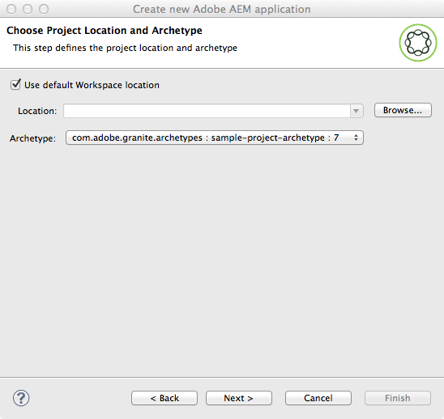

# Page Templates - Editable {#page-templates-editable}

Editable templates have been introduced to:

* Allow specialized authors to [create and edit templates](/help/sites-authoring/templates.md).

    * Such specialized authors are called **template authors**
    * Template authors must be members of the `template-authors` group.

* Provide templates that retain a dynamic connection to any pages created from them. Doing so ensures that any changes to the template are reflected in the pages themselves.
* Make the page component more generic so the core page component can be used without customization.

With editable templates, the pieces that make a page are isolated within components. You can configure the necessary combinations of components in a UI so that you eliminate the need for a new page component to be developed for each page variation.

>[!NOTE]
>
>[Static templates](/help/sites-developing/page-templates-static.md) are also available.

This document:

* Gives an overview of creating editable templates

    * For details see [Creating Page Templates](/help/sites-authoring/templates.md)

* Describes the admin/developer tasks required to create editable templates
* Describes the technical underpinnings of editable templates

This document assumes that you are already familiar with creating and editing templates. See the authoring document [Creating Page Templates](/help/sites-authoring/templates.md), which details the capabilities of editable templates as exposed to the template author.

>[!NOTE]
>
>Following tutorial might also be of interest for setting up an editable page template in a new project:
>[Getting Started with AEM Sites Part 2 - Creating a Base Page and Template](https://experienceleague.adobe.com/docs/experience-manager-learn/getting-started-wknd-tutorial-develop/project-archetype/pages-templates.html?lang=en)

## Creating a New Template {#creating-a-new-template}

Creating editable templates is primarily done with the [template console and template editor](/help/sites-authoring/templates.md) by a template author. This section gives an overview of this process and follows with a description of what occurs at a technical level.

For information on how to use editable templates in an AEM project see [Creating an AEM project using Lazybones](https://experienceleaguecommunities.adobe.com/t5/adobe-experience-manager/create-aem-project-structure-using-lazybones/m-p/186478).

When creating a new editable template you:

1. Create a [folder for the templates](#template-folders). This folder is not mandatory, but is recommended best practice.
1. Select a [template type](#template-type). This type is copied to create the [template definition](#template-definitions).

   >[!NOTE]
   >
   >A selection of template types are provided out-of-the-box. You can also [create your own site-specific template types](/help/sites-developing/page-templates-editable.md#creating-template-types), if necessary.

1. Configure the structure, content policies, initial content, and layout of the new template.

   **Structure**

    * The structure lets you define components and content for your template.
    * Components defined in the template structure cannot be moved on a resulting page nor deleted from any resulting pages.

        * If you are creating a template in a custom folder outside of the `We.Retail` sample content, you can choose Foundation Components or use [Core Components](https://experienceleague.adobe.com/docs/experience-manager-core-components/using/developing/overview.html?lang=en).

    * If you want page authors to be able to add and remove components, add a paragraph system to the template.
    * Components can be unlocked and locked again to allow you to define initial content.

   For details on how a template author defines the structure, see [Creating Page Templates](/help/sites-authoring/templates.md#editing-a-template-structure-template-author).

   For technical details of the structure, see [Structure](/help/sites-developing/page-templates-editable.md#structure) in this document.

   **Policies**

    * The content policies define the design properties of a component.

        * For example, the components available or minimum/maximum dimensions.

    * These policies are applicable to the template (and pages created with the template).

   For details on how a template author defines policies, see [Creating Page Templates](/help/sites-authoring/templates.md#editing-a-template-structure-template-author).

   For technical detail of policies, see [Content Policies](/help/sites-developing/page-templates-editable.md#content-policies) in this document.

   **Initial Content**

    * Initial Content defines content that appears when a page is first created based on the template.
    * Initial content can then be edited by page authors.

   For details on how a template author defines the structure, see [Creating Page Templates](/help/sites-authoring/templates.md#editing-a-template-initial-content-author).

   For technical details on initial content, see [Initial Content](/help/sites-developing/page-templates-editable.md#initial-content) in this document.

   **Layout**

    * You can define the template layout for a range of devices.
    * Responsive layout for templates operates as it does for page authoring.

   For details on how a template author defines the template layout, see [Creating Page Templates](/help/sites-authoring/templates.md#editing-a-template-layout-template-author).

   For technical details on template layout, see [Layout](/help/sites-developing/page-templates-editable.md#layout) in this document.

1. Enable the template, then allow it for specific content trees.

    * A template can be enabled or disabled to make it available or unavailable to page authors.
    * A template can be made available or unavailable for certain page branches.

   For details on how a template author enables a template, see [Creating Page Templates](/help/sites-authoring/templates.md#enabling-and-allowing-a-template-template-author).

   For technical details on enabling a template, see [Enabling and Allowing a Template for Us](/help/sites-developing/page-templates-editable.md#enabling-and-allowing-a-template-for-use)e in this document

1. Use it to create content pages.

    * When using a template to create a page, there is no visible difference and no indication between static and editable templates.
    * For the page author, the process is transparent.

   For details on how a page author uses templates to create a page, see [Creating and Organizing Pages](/help/sites-authoring/managing-pages.md#templates).

   For technical details on creating pages with editable templates, see [Resultant Content Pages](/help/sites-developing/page-templates-editable.md#resultant-content-pages) in this document.

>[!TIP]
>
>Never enter any information that must be internationalized into a template. For internalization purposes, the [localization feature of the Core Components](https://experienceleague.adobe.com/docs/experience-manager-core-components/using/get-started/localization.html) is recommended.

>[!NOTE]
>
>Templates are powerful tools to streamline your page creation workflow. However too many templates can overwhelm the authors and make page creation confusing. A good rule of thumb is to keep the number of templates under 100.
>
>Adobe does not recommend having more than 1000 templates due to potential performance impacts.

>[!NOTE]
>
>The editor client library assumes the presence of the `cq.shared` namespace in content pages. If it is absent, it results in the JavaScript error `Uncaught TypeError: Cannot read property 'shared' of undefined`.
>
>All sample content pages contain `cq.shared`, so any content based on them automatically includes `cq.shared`. However, if you decide to create your own content pages from scratch without basing them on sample content, you must make sure to include the `cq.shared` namespace.
>
>See [Using Client-Side Libraries](/help/sites-developing/clientlibs.md) for further information.

## Template Folders {#template-folders}

For organizing your templates, you can use the following folders:

* **global**
* Site-specific
  The site-specific folders that you create to organize your templates are created with an account holding admin privileges.

>[!NOTE]
>
>Even though you can nest your folders, when the user views them in the **Templates** console they are presented as a flat structure.

In a standard AEM instance, the **global** folder exists in the template console. This folder holds default templates and acts as a fallback if no policies and/or template-types are found in the current folder. You can add your default templates to this folder or create a folder (recommended).

>[!NOTE]
>
>It is best practice to create a folder to hold your customized templates and not to use the global folder.

>[!CAUTION]
>
>Folders must be created by a user with `admin` rights.

Template types and policies are inherited across all folders according to the following order of precedence:

1. The current folder.
1. Parent or parents of the current folder.
1. `/conf/global`
1. `/apps`
1. `/libs`

A list of all allowed entries is created. If any configurations overlap ( `path`/ `label`), only the instance closest to the current folder is presented to the user.

To create a folder, do the following:

* Programmatically or with CRXDE Lite
* Using the Configuration Browser

## Using CRXDE Lite {#using-crxde-lite}

1. A new folder (under /conf) can be created for your instance either programmatically or with CRXDE Lite.

   The following structure must be used:

   ```xml
   /conf
       <your-folder-name> [sling:Folder]
           settings [sling:Folder]
               wcm [cq:Page]
                   templates [cq:Page]
                   policies [cq:Page]
   ```

1. You can then define the following properties on the folder root node:

   `<your-folder-name> [sling:Folder]`

   Name: `jcr:title`

    * Type: `String`

    * Value: The title (for the folder) you want to appear in the **Templates** console.

1. In *addition* to the standard authoring permissions and privileges (for example, `content-authors`), assign groups and define the required access rights (ACLs) for your authors to be able to create templates in the new folder.

   The `template-authors` group is the default group that must be assigned. See the following section [ACLs and Groups](/help/sites-developing/page-templates-editable.md#acls-and-groups) for details.

   See [Access Right Management](/help/sites-administering/user-group-ac-admin.md#access-right-management) for full details on managing and assigning access rights.

### Using the Configuration Browser {#using-the-configuration-browser}

1. Go to **Global Navigation** -&gt; **Tools** &gt; **Configuration Browser**.

   The existing folders are listed to the left including the **global** folder.

1. Click **Create**.
1. In the **Create Configuration** dialog, the following fields must be configured:

    * **Title**: Provide a title for the configuration folder
    * **Editable Templates**: Select to allow for editable templates within this folder

1. Click **Create**

>[!NOTE]
>
>In the Configuration Browser, you can edit the global folder and activate the **Editable Templates** option if you want to create templates within this folder. However, this practice is not a recommended best practice.
>
>See the [Configuration Browser](/help/sites-administering/configurations.md) documentation for more information.

### ACLs and Groups {#acls-and-groups}

After your template folders are created (either by way of CRXDE or with the Configuration Browser), ACLs must be defined for the appropriate groups for the template folders to ensure proper security.

The template folders for the [`We.Retail` reference implementation](/help/sites-developing/we-retail.md) can be used as an example.

#### The template-authors Group {#the-template-authors-group}

The `template-authors` group is the group used to manage access to templates and comes standard with AEM, but is empty. Users must be added to the group for the project/site.

>[!CAUTION]
>
>The `template-authors` group is *only* for users that must be able to create templates.
>
>Editing templates is powerful and if not done properly, existing templates can break. Therefore, this role should be focused and only include qualified users.

The following table details the necessary permissions for template editing.

<table>
 <tbody>
  <tr>
   <th>Path</th>
   <th>Role / Group</th>
   <th>Permissions<br /> </th>
   <th>Description</th>
  </tr>
  <tr>
   <td rowspan="3"><code>/conf/&lt;<i>your-folder</i>&gt;/settings/wcm/templates</code></td>
   <td>Template Authors<br /> </td>
   <td>read, write, replicate</td>
   <td>Template authors that create, read, update, delete, and replicate templates in site-specific <code>/conf</code> space</td>
  </tr>
  <tr>
   <td>Anonymous Web User</td>
   <td>read</td>
   <td>Anonymous Web User must read templates while rendering a page</td>
  </tr>
  <tr>
   <td>Content Authors</td>
   <td>replicate</td>
   <td>replicateContent authors must activate the templates of a page when activating a page</td>
  </tr>
  <tr>
   <td rowspan="3"><code>/conf/&lt;<i>your-folder</i>&gt;/settings/wcm/policies</code></td>
   <td><code>Template Author</code></td>
   <td>read, write, replicate</td>
   <td>Template authors that create, read, update, delete, and replicate templates in site-specific <code>/conf</code> space</td>
  </tr>
  <tr>
   <td>Anonymous Web User</td>
   <td>read</td>
   <td>Anonymous Web User must read policies while rendering a page</td>
  </tr>
  <tr>
   <td>Content Authors</td>
   <td>replicate</td>
   <td>Content authors must activate the policies of a template of a page when activating a page</td>
  </tr>
  <tr>
   <td rowspan="2"><code>/conf/&lt;site&gt;/settings/template-types</code></td>
   <td>Template Author</td>
   <td>read</td>
   <td>Template author creates a template based on one of the predefined template types.</td>
  </tr>
  <tr>
   <td>Anonymous Web User</td>
   <td>none</td>
   <td>Anonymous Web User must not access the template types</td>
  </tr>
 </tbody>
</table>

This default `template-authors` group only covers the project setups, where all `template-authors` members are allowed to access and author all templates. For more complex setups, where there is a need for multiple template authors groups to separate access to templates, more custom template authors groups must be created. However, the permissions for the template authors groups would still be the same.

#### Legacy Templates under /conf/global {#legacy-templates-under-conf-global}

Do not store templates in `/conf/global`. However, for some legacy installations, there may still be templates in this location. *Only* in such legacy situations should the following `/conf/global` paths be explicitly configured.

<table>
 <tbody>
  <tr>
   <th>Path</th>
   <th>Role / Group</th>
   <th>Permissions<br /> </th>
   <th>Description</th>
  </tr>
  <tr>
   <td rowspan="3"><code>/conf/global/settings/wcm/templates</code></td>
   <td>Template Authors</td>
   <td>read, write, replicate</td>
   <td>Template authors that create, read, update, delete, and replicate templates in <code>/conf/global</code></td>
  </tr>
  <tr>
   <td>Anonymous Web User</td>
   <td>read</td>
   <td>Anonymous Web User must read templates while rendering a page</td>
  </tr>
  <tr>
   <td>Content Authors</td>
   <td>replicate</td>
   <td>Content authors must activate the templates of a page when activating a page</td>
  </tr>
  <tr>
   <td rowspan="3"><code>/conf/global/settings/wcm/policies</code></td>
   <td><code>Template Author</code></td>
   <td>read, write, replicate</td>
   <td>Template authors that create, read, update, delete, and replicate templates in <code>/conf/global</code></td>
  </tr>
  <tr>
   <td>Anonymous Web User</td>
   <td>read</td>
   <td>Anonymous Web User must read policies while rendering a page</td>
  </tr>
  <tr>
   <td>Content Authors</td>
   <td>replicate</td>
   <td>Content authors must activate the policies of a template of a page when activating a page</td>
  </tr>
  <tr>
   <td rowspan="2"><code>/conf/global/settings/wcm/template-types</code></td>
   <td>Template Author</td>
   <td>read</td>
   <td>Template author creates a template based on one of the predefined template types</td>
  </tr>
  <tr>
   <td>Anonymous Web User</td>
   <td>none</td>
   <td>Anonymous Web User must not access the template types</td>
  </tr>
 </tbody>
</table>

## Template Type {#template-type}

When creating a template, specify a template type:

* Template types effectively provide templates for a template. When creating a template, the structure and initial content of the selected template type is used to create the template.

    * The template type is copied to create the template.
    * Once the copy has occurred, the only connection between the template and the template type is a static reference for information purposes.

* Template types allow you to define:

    * The resource type of the page component.
    * The policy of the root node, which defines the components allowed in the template editor.
    * Adobe recommends that you define the breakpoints for the responsive grid and setup of the mobile emulator at on the template type. This step is optional, because the configuration could also be defined on the individual template (see [Template Type and Mobile Device Groups](/help/sites-developing/page-templates-editable.md#p-template-type-and-mobile-device-groups-br-p)).

* AEM provides a small selection of out-of-the-box template types such as HTML5 Page and Adaptive Form Page.

    * Additional examples are provided as a part of the [`We.Retail`](/help/sites-developing/we-retail.md) sample content.

* Template types are typically defined by developers.

The out-of-the box template types are stored under:

* `/libs/settings/wcm/template-types`

>[!CAUTION]
>
>Do not change anything in the `/libs` path. The reason is because the content of `/libs` is overwritten the next time you upgrade your instance (and may be overwritten when you apply either a hotfix or feature pack).

Your site-specific template types should be stored in the comparable location of:

* `/apps/settings/wcm/template-types`

Definitions for your customized templates types should be stored in user-defined folders (recommended) or alternatively in `global`. For example:

* `/conf/<my-folder-01>/<my-folder-02>/settings/wcm/template-types`
* `/conf/<my-folder>/settings/wcm/template-types`
* `/conf/global/settings/wcm/template-types`

>[!CAUTION]
>
>The template types have to respect the correct folder structure (that is, `/settings/wcm/...`), otherwise the template types are not found.

### Template Type and Mobile Device Groups {#template-type-and-mobile-device-groups-br}

The [device groups](/help/sites-developing/mobile.md#device-groups) used for an editable template (set as relative path of the property `cq:deviceGroups`) define which mobile devices are available as emulators in the [layout mode](/help/sites-authoring/responsive-layout.md) of page authoring. This value can be set in two places:

* On the editable template type
* On the editable template

When creating a new editable template, the value is copied from the template type to the individual template. If the value is not set on the type, it can be set on the template. Once a template is created, there is no inheritance from the type to the template.

>[!CAUTION]
>
>The value of `cq:deviceGroups` must be set as a relative path such as `mobile/groups/responsive` and not as an absolute path such as `/etc/mobile/groups/responsive`.

>[!NOTE]
>
>With [static templates](/help/sites-developing/page-templates-static.md), the value of `cq:deviceGroups` could be set at the root of the site.
>
>With editable templates, this value is now stored at the template level and is not supported at the page root level.

### Creating Template Types {#creating-template-types}

If you have created a template that can serve as the basis of other templates, you can copy this template as a template type.

1. Create a template as you would any editable template [as documented here](/help/sites-authoring/templates.md#creating-a-new-template-template-author), which can serve as the basis of your template type.
1. Using CRXDE Lite, copy the newly created template from the `templates` node to the `template-types` node under the [template folder](/help/sites-developing/page-templates-editable.md#template-folders).
1. Delete the template from the `templates` node under the [template folder](/help/sites-developing/page-templates-editable.md#template-folders).
1. In the copy of the template that is under the `template-types` node, delete all `cq:template` and `cq:templateType` properties from all `jcr:content` nodes.

You can also develop your own template type using an example editable template as a basis, available on GitHub.

CODE ON GITHUB

You can find the code of this page on GitHub

* [Open aem-sites-example-custom-template-type project on GitHub](https://github.com/Adobe-Marketing-Cloud/aem-sites-example-custom-template-type)
* Download the project as [a ZIP file](https://codeload.github.com/Adobe-Marketing-Cloud/aem-sites-example-custom-template-type/zip/refs/heads/master)

## Template Definitions {#template-definitions}

Definitions for editable templates are stored [user-defined folders](/help/sites-developing/page-templates-editable.md#template-folders) (recommended) or alternatively in `global`. For example:

* `/conf/<my-folder>/settings/wcm/templates`
* `/conf/<my-folder-01>/<my-folder-02>/settings/wcm/templates`
* `/conf/global/settings/wcm/templates`

The root node of the template is of type `cq:Template` with a skeleton structure of:

```xml
<template-name>
  initial
    jcr:content
      root
        <component>
        ...
        <component>
  jcr:content
    @property status
  policies
    jcr:content
      root
        @property cq:policy
        <component>
          @property cq:policy
        ...
        <component>
          @property cq:policy
  structure
    jcr:content
      root
        <component>
        ...
        <component>
      cq:responsive
        breakpoints
  thumbnail.png
```

The main elements are:

* `<template-name>`

    * ` [initial](#initial-content)`
    * `jcr:content`
    * ` [structure](#structure)`
    * ` [policies](#policies)`
    * `thumbnail.png`

### jcr:content {#jcr-content}

This node holds properties for the template:

* **Name**: `jcr:title`

* **Name**: `status`

    * **Type**: `String`

    * **Value**: `draft`, `enabled`, or `disabled`

### Structure {#structure}

Defines the structure of the resultant page:

* Is merged with the initial content ( `/initial`) when creating a page.
* Changes made to the structure are reflected in any pages created with the template.
* The `root` ( `structure/jcr:content/root`) node defines the list of components that are available in the resulting page.

    * Components defined in the template structure cannot be moved on or deleted from any resultant pages.
    * After a component is unlocked, the `editable` property is set to `true`.

    * After a component that already contains content is unlocked, this content is moved to the `initial` branch.

* The `cq:responsive` node holds definitions for the responsive layout.

### Initial Content {#initial-content}

Defines the initial content that a new page has on creation:

* Contains a `jcr:content` node that is copied to any new pages.
* Is merged with the structure ( `/structure`) when creating a page.
* Any existing pages are updated if the initial content is changed after creation.
* The `root` node holds a list of components to define what are available in the resulting page.
* If content is added to a component in structure mode and that component is later unlocked (or conversely), then this content is used as initial content.

### Layout {#layout}

When [editing a template, you can define the layout](/help/sites-authoring/templates.md), this practice uses [standard responsive layout](/help/sites-authoring/responsive-layout.md) that can also be [configured](/help/sites-administering/configuring-responsive-layout.md).

### Content Policies {#content-policies}

The content (or design) policies define the design properties of a component, such as the component's availability or minimum/maximum dimensions. These policies are applicable to the template (and pages created with the template). Content policies can be created and selected in the template editor.

* The property `cq:policy`, on the `root` node
  `/conf/<your-folder>/settings/wcm/templates/<your-template>/policies/jcr:content/root`
  Provides a relative reference to the content policy for the page's paragraph system.

* The property `cq:policy`, on the component-explicit nodes under `root`, provide links to the policies for the individual components.

* The actual policy definitions are stored under:
  `/conf/<your-folder>/settings/wcm/policies/wcm/foundation/components`

>[!NOTE]
>
>The paths of policy definitions depend on the path of the component. The `cq:policy` holds a relative reference to the configuration itself.

>[!NOTE]
>
>Pages created from editable templates do not offer a Design mode in the page editor.
>
>The `policies` tree of an editable template has the same hierarchy as the design mode configuration of a static template under:
>
>`/etc/designs/<my-site>/jcr:content/<component-name>`
>
>The design mode configuration of a static template was defined per page component.

### Page Policies {#page-policies}

Page policies allow you to define the [content policy](#content-policies) for the page (main parsys), in either the template or resultant pages.

### Enabling and Allowing a Template for Use {#enabling-and-allowing-a-template-for-use}

1. **Enable the Template**

   Before a template can be used, it must be enabled by either:

    * [Enabling the template](/help/sites-authoring/templates.md#enablingatemplateauthor) from the **Templates** console.

    * Setting the status property on the `jcr:content` node.

        * For example, on:
          `/conf/<your-folder>/settings/wcm/templates/<your-template>/jcr:content`

        * Define the property:

            * Name: status
            * Type: String
            * Value: `enabled`

1. **Allowed Templates**

    * [Define the Allowed Template paths on the **Page Properties**](/help/sites-authoring/templates.md#allowing-a-template-author) of the appropriate page or root page of a subbranch.
    * Set the property:
      `cq:allowedTemplates`
      On the `jcr:content` node of the required branch.

   For example, with a value of:

   `/conf/<your-folder>/settings/wcm/templates/.*`

## Resultant Content Pages {#resultant-content-pages}

Pages created from editable templates:

* Are created with a subtree that is merged from `structure` and `initial` in the template

* Have references to information held in the template and template type. You can achieve this functionality with a `jcr:content` node with the properties:

    * `cq:template`
      Provides the dynamic reference to the actual template; enables changes to the template to be reflected on the actual pages.

    * `cq:templateType`
      Provides a reference to the template type.



The above diagram shows how templates, content, and components interrelate:

* Controller - `/content/<my-site>/<my-page>`
  The resultant page that references the template. The content controls the entire process. According to the definitions, it accesses the appropriate template and components.

* Configuration - `/conf/<my-folder>/settings/wcm/templates/<my-template>`
  The [template and related content policies](#template-definitions) define the page configuration.

* Model - OSGi bundles
  The [OSGI bundles](/help/sites-deploying/osgi-configuration-settings.md) implement the functionality.

* View - `/apps/<my-site>/components`
  On both the author and publish environments, the content is rendered by [components](/help/sites-developing/components.md).

When rendering a page:

* **Templates**:

    * The `cq:template` property of its `jcr:content` node is referenced to access the template that corresponds to that page.

* **Components**:

    * The page component merges the `structure/jcr:content` tree of the template with the `jcr:content` tree of the page.

    * The page component only allows the author to edit the nodes of the template structure that have been flagged as editable (and any children).
    * When rendering a component on a page, the relative path of that component is taken from the `jcr:content` node; the same path under the `policies/jcr:content` node of the template is then searched.

        * The `cq:policy` property of this node points to the actual content policy (that is, it holds the design configuration for that component).

        * This functionality lets you have multiple templates that reuse the same content policy configurations.
