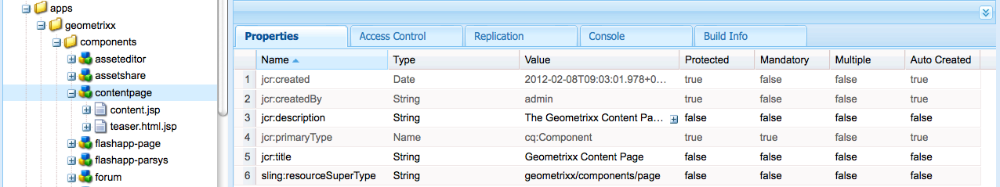
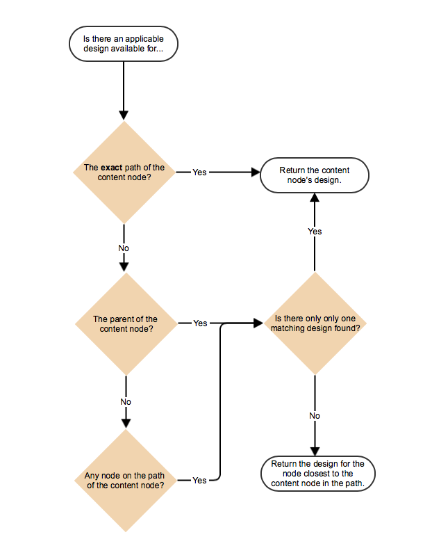
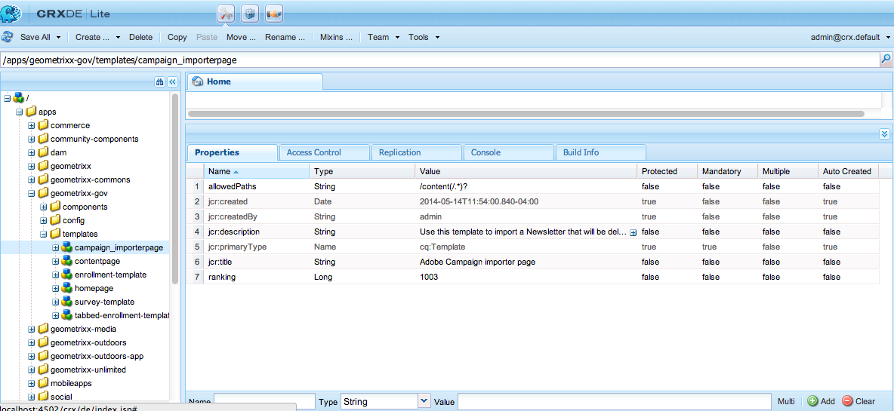
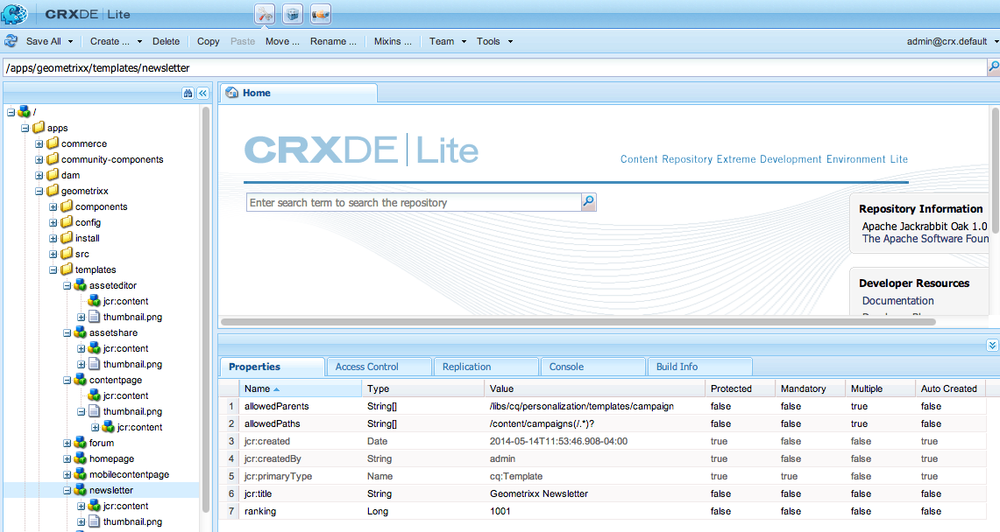

# Page Templates - Static{#page-templates-static}

A Template is used to create a Page and defines which components can be used within the selected scope. A template is a hierarchy of nodes that has the same structure as the page to be created, but without any actual content.

Each Template presents you with a selection of components available for use.

* Templates are built up of [Components](/help/sites-developing/components.md);
* Components use, and allow access to, Widgets and these are used to render the Content.

>[!NOTE]
>
>[Editable templates](/help/sites-developing/page-templates-editable.md) are also available and are the recommended type of templates for most flexibility and the newest features.

## Properties and Child Nodes of a Template {#properties-and-child-nodes-of-a-template}

A template is a node of type cq:Template and has the following properties and child nodes:

<table>
 <tbody>
  <tr>
   <td><strong>Name   </strong></td>
   <td><strong>Type   </strong></td>
   <td><strong>Description   </strong></td>
  </tr>
  <tr>
   <td>.   </td>
   <td> cq:Template</td>
   <td>Current template. A template is of node type cq:Template.  </td>
  </tr>
  <tr>
   <td> allowedChildren </td>
   <td> String[]</td>
   <td>Path of a template that is allowed to be a child of this template.  </td>
  </tr>
  <tr>
   <td> allowedParents</td>
   <td> String[]</td>
   <td>Path of a template that is allowed to be a parent of this template.  </td>
  </tr>
  <tr>
   <td> allowedPaths</td>
   <td> String[]</td>
   <td>Path of a page that is allowed to be based on this template.  </td>
  </tr>
  <tr>
   <td> jcr:created</td>
   <td> Date</td>
   <td>Date of creation of the template.  </td>
  </tr>
  <tr>
   <td> jcr:description</td>
   <td> String</td>
   <td>Description of the template.  </td>
  </tr>
  <tr>
   <td> jcr:title</td>
   <td> String</td>
   <td>Title of the template.  </td>
  </tr>
  <tr>
   <td> ranking</td>
   <td> Long</td>
   <td>Rank of the template. Used to display the template in the User Interface.  </td>
  </tr>
  <tr>
   <td> jcr:content</td>
   <td> cq:PageContent</td>
   <td>Node containing the content of the template.  </td>
  </tr>
  <tr>
   <td> thumbnail.png</td>
   <td> nt:file</td>
   <td>Thumbnail of the template.  </td>
  </tr>
  <tr>
   <td> icon.png</td>
   <td> nt:file</td>
   <td>Icon of the template.  </td>
  </tr>
 </tbody>
</table>

A template is the basis of a page.

To create a page, the template must be copied (node-tree `/apps/<myapp>/template/<mytemplate>`) to the corresponding position in the site-tree: this is what happens if a page is created using the **Websites** tab.

This copy action also gives the page its initial content (usually Top-Level Content only) and the property sling:resourceType, the path to the page component that is used to render the page (everything in the child node jcr:content).

## How Templates are structured {#how-templates-are-structured}

There are two aspects to be considered:

* the structure of the template itself
* the structure of the content produced when a template is used

### The structure of a Template {#the-structure-of-a-template}

A Template is created under a node of type **cq:Template**.

Various properties can be set, in particular:

* **jcr:title** - title for the template; appears in the dialog when creating a page.
* **jcr:description** - description for the template; appears in the dialog when creating a page.

This node contains a jcr:content (cq:PageContent) node which is used as the basis for the content node of resulting pages; this references, using sling:resourceType, the component to be used for rendering the actual content of a new page.

This component is used to define the structure and design of the content when a new page is created.

### The content produced by a Template {#the-content-produced-by-a-template}

Templates are used to create pages of type `cq:Page` (as mentioned earlier, a page is a special type of component). Each AEM Page has a structured node `jcr:content`. This:

* is of type cq:PageContent
* is a structured node-type holding a defined content-definition
* has a property `sling:resourceType` to reference the component holding the sling scripts used for rendering the content

### Default Templates {#default-templates}

AEM comes with various default templates available out of the box. Sometimes, you may want to use the templates as is. In that case, you must ensure that the template is available for your web site.

For example, AEM comes with several templates including a contentpage and home page.

| **Title** |**Component** |**Location** |**Purpose** |
|---|---|---|---|
| Home Page |homepage |geometrixx |The Geometrixx home page template. |
| Content Page |contentpage |geometrixx |The Geometrixx content page template. |

#### Displaying Default Templates {#displaying-default-templates}

To see a list of all templates in the repository, proceed as follows:

1. In CRXDE Lite, open the **Tools** menu and click **Query**.

1. In the Query tab
1. As **Type**, select **XPath**.

1. In the **Query** input field, enter following string:
   //element(&#42;, cq:Template)

1. Click **Execute**. The list is displayed in the result box.

Usually, you take an existing template and develop a new one for your own use. See [Developing Page Templates](#developing-page-templates) for more information.

To enable an existing template for your website and you want it to be displayed in the **Create Page** dialog when creating a page right under **Websites** from the **Websites** console, set the allowedPaths property of the template node to: **/content(/.&#42;)?**

## How Template Designs are Applied {#how-template-designs-are-applied}

When styles are defined in the UI using [Design Mode](/help/sites-authoring/default-components-designmode.md), the design is persisted at the exact path of the content node for which the style is being defined.

>[!CAUTION]
>
>Adobe recommends only applying designs through [Design Mode](/help/sites-authoring/default-components-designmode.md).
>
>Modifying designs in CRXDE Lite, for example, is not best practice and the application of such designs can vary from expected behavior.

If designs are only applied using Design Mode, then the following sections, [Design Path Resolution](/help/sites-developing/page-templates-static.md#design-path-resolution), [Decision Tree](/help/sites-developing/page-templates-static.md#decision-tree), and the [Example](/help/sites-developing/page-templates-static.md#example) are not applicable.

### Design Path Resolution {#design-path-resolution}

When rendering content based on a static template, AEM attempts to apply the most relevant design and styles to the content based on a traversal of the content hierarchy.

AEM determines the most relevant style for a content node in the following order:

* If there is a design for the full and exact path of the content node (as when the design is defined in Design Mode), then use that design.
* If there is a design for the content node of the parent, then use that design.
* If there is a design for any node on the path of the content node, then use that design.

In the last two cases, if there is more than one applicable design, use the one closest to the content node.

### Decision Tree {#decision-tree}

This is a graphical representation of the [Design Path Resolution](/help/sites-developing/page-templates-static.md#design-path-resolution) logic.

### Example {#example}

Consider a simple content structure as follows, where a design could apply to any of the nodes:

`/root/branch/leaf`

The following table describes how AEM chooses a design.

<table>
 <tbody>
  <tr>
   <td><strong>Finding Design For  </strong></td>
   <td><strong>Designs Exist For  </strong></td>
   <td><strong>Design Chosen  </strong></td>
   <td><strong>Comment</strong></td>
  </tr>
  <tr>
   <td><code class="code">leaf
      </code></td>
   <td>
<code>root</code>
 
<code>branch</code>
 
<code>leaf</code>
 </td>
   <td><code>leaf</code></td>
   <td>The most exact match is always taken.  </td>
  </tr>
  <tr>
   <td><code>leaf</code></td>
   <td>
<code>root</code>
 
<code>branch</code>
 </td>
   <td><code>branch</code></td>
   <td>Fall back to the closest match lower in the tree.</td>
  </tr>
  <tr>
   <td><code>leaf</code></td>
   <td><code>root</code></td>
   <td><code>root</code></td>
   <td>If all else fails, take what's remaining.  </td>
  </tr>
  <tr>
   <td><code>branch</code></td>
   <td><code>branch</code></td>
   <td><code>branch</code></td>
   <td> </td>
  </tr>
  <tr>
   <td><code>branch</code></td>
   <td>
<code>branch</code>
 
<code class="code">leaf
       </code>
 </td>
   <td><code>branch</code></td>
   <td> </td>
  </tr>
  <tr>
   <td><code>branch</code></td>
   <td>
<code>root</code>
 
<code class="code">branch
       </code>
 </td>
   <td><code>branch</code></td>
   <td> </td>
  </tr>
  <tr>
   <td><code>branch</code></td>
   <td>
<code>root</code>
 
<code class="code">leaf
       </code>
 </td>
   <td><code>root</code></td>
   <td>
If there is not an exact match, take the one lower in the tree.
 
The assumption is that this will always be applicable, but further up the tree can be too specific.  
 </td>
  </tr>
 </tbody>
</table>

## Developing Page Templates {#developing-page-templates}

AEM page templates are simply models used to create pages. They can contain as little, or as much, initial content as needed, their role being to create the correct initial node structures, with the required properties (primarily sling:resourceType) set to allow editing and rendering.

### Creating a Template (based on an existing template) {#creating-a-new-template-based-on-an-existing-template}

A new template can be created completely from scratch, but often an existing template is copied instead, and updated to save you time and effort. For example, the templates within Geometrixx can be used to get you started.

To create a template based on an existing template:

1. Copy an existing template (preferably with a definition as close as possible to what you want to achieve) to a new node.

   Templates are stored in **/apps/&lt;website-name&gt;/templates/&lt;template-name&gt;**.

   >[!NOTE]
   >
   >The list of available templates depends on the location of the new page and the restrictions on placement specified in each template. See [Template Availability](#templateavailibility).

1. Change the **jcr:title** of the new template node to reflect its new role. You can also update the **jcr:description** if appropriate. Be sure to change the template availability of the page as appropriate.

   >[!NOTE]
   >
   >If you want your template to be displayed in the **Create Page** dialog when creating a page right under **Websites** from the **Websites** console, set the `allowedPaths` property of the template node to: `/content(/.*)?`

   

1. Copy the component on which the template is based (this is indicated by the **sling:resourceType** property of the **jcr:content** node within the template) to create an instance.

   Components are stored in **/apps/&lt;website-name&gt;/components/&lt;component-name&gt;**.

1. Update the **jcr:title** and **jcr:description** of the new component.
1. Replace the thumbnail.png if you want a new thumbnail picture to be shown in the template selection list (size 128 x 98 px).
1. Update the **sling:resourceType** of the template's **jcr:content** node to reference the new component.
1. Make additional changes to the functionality or design of the template, or its underlying component, or both.

   >[!NOTE]
   >
   >Changes made to the **/apps/&lt;website&gt;/templates/&lt;template-name&gt;** node affect the template instance (as in the selection list).
   >
   >
   >Changes made to the **/apps/&lt;website&gt;/components/&lt;component-name&gt;** node affect the content page created when the template is used.

   You can now create a page within your website using the new template.

>[!NOTE]
>
>The editor client library assumes the presence of the `cq.shared` namespace in content pages, and if it is absent, the JavaScript error `Uncaught TypeError: Cannot read property 'shared' of undefined` results.
>
>All sample content pages contain `cq.shared`, so any content based on them automatically includes `cq.shared`. However, if you decide to create your own content pages from scratch without basing them on sample content, you must make sure to include the `cq.shared` namespace.
>
>See [Using Client-Side Libraries](/help/sites-developing/clientlibs.md) for further information.

## Making an Existing Template Available {#making-an-existing-template-available}

This example illustrates how to allow a template to be used for certain content paths. The templates that are available to the page author when creating pages are determined by the logic defined in [Template Availability](/help/sites-developing/templates.md#template-availability).

1. In CRXDE Lite, navigate to the template you want to use for your page, for example, the Newsletter template.
1. Change the `allowedPaths` property and other properties used for [template availability](/help/sites-developing/templates.md#template-availability). For example, `allowedPaths`: `/content/geometrixx-outdoors/[^/]+(/.*)?` means that this template is allowed in any path under `/content/geometrixx-outdoors`.

   
