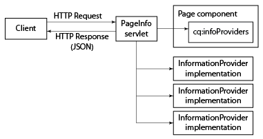

# Obtaining Page Information in JSON Format{#obtaining-page-information-in-json-format}

To obtain the page information, send a request to the PageInfo servlet to obtain the page metadata in JSON format.

The PageInfo servlet returns information about resources in the repository. The servlet is bound to the URL `https://<server>:<port>/libs/wcm/core/content/pageinfo.json` and uses the `path` parameter to identify the resource. The following example URL returns information about the `/content/we-retail/us/en` node:

```shell
http://localhost:4502/libs/wcm/core/content/pageinfo.json?path=/content/we-retail/us/en
```

>[!NOTE]
>
>If you need page information in JSON format to provide the delivery of content to channels that are not traditional AEM web pages such as:
>
>* Single Page Applications
>* Native Mobile Applications
>* Other channels and touch-points external to AEM
>
>See the document [JSON Exporter for Content Services](/help/sites-developing/json-exporter.md).

## Page Information Providers {#page-information-providers}

Page components can be associated with one or more `com.day.cq.wcm.api.PageInfoProvider` services that generate page metadata. The PageInfo servlet calls each PageInfoProvider service and aggregates the metadata:

1. The HTTP client sends a request to the PageInfo servlet, which includes the URL of the page.
1. The PageInfo servlet discovers which component renders the page.
1. The PageInfo servlet calls each PageInfoProvider that is associated with the component.
1. The servlet aggregates the metadata that each PageInfoProvider returns and adds the metadata to the HTTP response in a JSON object.



>[!NOTE]
>
>Similar to PageInfoProviders, use ListInfoProviders to update lists of information in JSON format. (See [Customizing the Websites Administration Console](/help/sites-developing/customizing-siteadmin.md).)

## Default Page Information Providers {#default-page-information-providers}

The `/libs/foundation/components/page` component is associated with the following PageInfoProvider services:

* **Default Page Status Provider:** Information about the page status, such as whether it is locked, whether the page is the payload of an active workflow, and which workflows are available for the page.
* **Live Relationship Info Provider:** Information regarding Multi Site Management (MSM), such as whether the page is part of a Blue Print, and whether it is a Live Copy.
* **Content Language Servlet:** The language of the current page, and information about each language in which the page is available.
* **Workflow Status Provider:** Status information about the running workflow that has the page as a payload.
* **Workflow Package Info Provider:** Information about each workflow package that is stored in the repository, and whether each package contains the current resource.
* **Emulator Info Provider:** Information about the mobile device emulators that are available for this resource. If the page component does not render mobile pages, no emulators are available.
* **Annotations Info Provider:** Information about annotations that are on the page.

For example, the PageInfo servlet returns the following JSON response for the `/content/we-retail/us/en` node:

```
{
   "status":{
      "path":"/content/we-retail/us/en",
      "isLocked":false,
      "lockOwner":"",
      "canUnlock":false,
      "lastModified":1467202845038,
      "lastModifiedBy":"admin",
      "timeUntilValid":0,
      "onTime":0,
      "offTime":0,
      "replication":{
         "numQueued":0
      },
      "isDesignable":true,
      "isDeveloper":true
   },
   "isPage":true,
   "pageResourceType":"weretail/components/structure/page",
   "enableFragmentIdentifier":false,
   "workflow":{
      "isRunning":false
   },
   "workflows":{
      "wcm":{
         "models":[
            {
               "wid":"/etc/workflow/models/dam/adddamsize/jcr:content/model",
               "label":"Add Asset Size",
               "label_xss":"Add Asset Size"
            },
            {
               "wid":"/etc/workflow/models/ac-newsletter-workflow-simple/jcr:content/model",
               "label":"Approve for Adobe Campaign",
               "label_xss":"Approve for Adobe Campaign"
            },
            {
               "wid":"/etc/workflow/models/dam/dam-autotag-assets/jcr:content/model",
               "label":"DAM Smart Tag Assets",
               "label_xss":"DAM Smart Tag Assets"
            },
            {
               "wid":"/etc/workflow/models/dam/update_asset/jcr:content/model",
               "label":"DAM Update Asset",
               "label_xss":"DAM Update Asset"
            },
            {
               "wid":"/etc/workflow/models/cloudservices/DTM_bundle_download/jcr:content/model",
               "label":"Default DTM Bundle Download",
               "label_xss":"Default DTM Bundle Download"
            },
            {
               "wid":"/etc/workflow/models/dam/dam_download_asset/jcr:content/model",
               "label":"Download Asset",
               "label_xss":"Download Asset"
            },
            {
               "wid":"/etc/workflow/models/dam/dynamic-media-video-thumbnail-replacement/jcr:content/model",
               "label":"Dynamic Media Video Thumbnail Replacement",
               "label_xss":"Dynamic Media Video Thumbnail Replacement"
            },
            {
               "wid":"/etc/workflow/models/dam/dynamic-media-video-user-uploaded-thumbnail/jcr:content/model",
               "label":"Dynamic Media Video User Uploaded Thumbnail Process",
               "label_xss":"Dynamic Media Video User Uploaded Thumbnail Process"
            },
            {
               "wid":"/etc/workflow/models/projects/approval_workflow/jcr:content/model",
               "label":"Project Approval Workflow",
               "label_xss":"Project Approval Workflow"
            },
            {
               "wid":"/etc/workflow/models/publish_example/jcr:content/model",
               "label":"Publish Example",
               "label_xss":"Publish Example"
            },
            {
               "wid":"/etc/workflow/models/publish_to_campaign/jcr:content/model",
               "label":"Publish to Adobe Campaign",
               "label_xss":"Publish to Adobe Campaign"
            },
            {
               "wid":"/etc/workflow/models/s7dam/request_to_publish_to_youtube/jcr:content/model",
               "label":"Publish to YouTube",
               "label_xss":"Publish to YouTube"
            },
            {
               "wid":"/etc/workflow/models/projects/request_copy/jcr:content/model",
               "label":"Request Copy",
               "label_xss":"Request Copy"
            },
            {
               "wid":"/etc/workflow/models/request_for_activation/jcr:content/model",
               "label":"Request for Activation",
               "label_xss":"Request for Activation"
            },
            {
               "wid":"/etc/workflow/models/request_for_deactivation/jcr:content/model",
               "label":"Request for Deactivation",
               "label_xss":"Request for Deactivation"
            },
            {
               "wid":"/etc/workflow/models/request_for_deletion/jcr:content/model",
               "label":"Request for Deletion",
               "label_xss":"Request for Deletion"
            },
            {
               "wid":"/etc/workflow/models/request_to_complete_move_operation/jcr:content/model",
               "label":"Request to complete Move operation",
               "label_xss":"Request to complete Move operation"
            },
            {
               "wid":"/etc/workflow/models/screens-update-asset/jcr:content/model",
               "label":"Screens Update Asset",
               "label_xss":"Screens Update Asset"
            },
            {
               "wid":"/etc/workflow/models/s7dam/request_to_remove_from_youtube/jcr:content/model",
               "label":"Unpublish from YouTube",
               "label_xss":"Unpublish from YouTube"
            },
            {
               "wid":"/etc/workflow/models/wcm-translation/create_language_copy/jcr:content/model",
               "label":"WCM: Create Language Copy",
               "label_xss":"WCM: Create Language Copy"
            },
            {
               "wid":"/etc/workflow/models/wcm-translation/prepare_translation_project/jcr:content/model",
               "label":"WCM: Prepare Translation Project",
               "label_xss":"WCM: Prepare Translation Project"
            },
            {
               "wid":"/etc/workflow/models/wcm-translation/translate-i18n-dictionary/jcr:content/model",
               "label":"WCM: Prepare and Translate I18n-Dictionary",
               "label_xss":"WCM: Prepare and Translate I18n-Dictionary"
            },
            {
               "wid":"/etc/workflow/models/wcm-translation/sync_translation_job/jcr:content/model",
               "label":"WCM: Sync Translation Job",
               "label_xss":"WCM: Sync Translation Job"
            },
            {
               "wid":"/etc/workflow/models/wcm-translation/update_language_copy/jcr:content/model",
               "label":"WCM: Update Language Copy",
               "label_xss":"WCM: Update Language Copy"
            }
         ]
      },
      "translation":{
         "models":[
            {
               "wid":"/etc/workflow/models/dam/adddamsize/jcr:content/model",
               "label":"Add Asset Size",
               "label_xss":"Add Asset Size"
            },
            {
               "wid":"/etc/workflow/models/ac-newsletter-workflow-simple/jcr:content/model",
               "label":"Approve for Adobe Campaign",
               "label_xss":"Approve for Adobe Campaign"
            },
            {
               "wid":"/etc/workflow/models/dam/dam-autotag-assets/jcr:content/model",
               "label":"DAM Smart Tag Assets",
               "label_xss":"DAM Smart Tag Assets"
            },
            {
               "wid":"/etc/workflow/models/cloudservices/DTM_bundle_download/jcr:content/model",
               "label":"Default DTM Bundle Download",
               "label_xss":"Default DTM Bundle Download"
            },
            {
               "wid":"/etc/workflow/models/dam/dam_download_asset/jcr:content/model",
               "label":"Download Asset",
               "label_xss":"Download Asset"
            },
            {
               "wid":"/etc/workflow/models/dam/dynamic-media-video-thumbnail-replacement/jcr:content/model",
               "label":"Dynamic Media Video Thumbnail Replacement",
               "label_xss":"Dynamic Media Video Thumbnail Replacement"
            },
            {
               "wid":"/etc/workflow/models/dam/dynamic-media-video-user-uploaded-thumbnail/jcr:content/model",
               "label":"Dynamic Media Video User Uploaded Thumbnail Process",
               "label_xss":"Dynamic Media Video User Uploaded Thumbnail Process"
            },
            {
               "wid":"/etc/workflow/models/projects/approval_workflow/jcr:content/model",
               "label":"Project Approval Workflow",
               "label_xss":"Project Approval Workflow"
            },
            {
               "wid":"/etc/workflow/models/publish_to_campaign/jcr:content/model",
               "label":"Publish to Adobe Campaign",
               "label_xss":"Publish to Adobe Campaign"
            },
            {
               "wid":"/etc/workflow/models/s7dam/request_to_publish_to_youtube/jcr:content/model",
               "label":"Publish to YouTube",
               "label_xss":"Publish to YouTube"
            },
            {
               "wid":"/etc/workflow/models/projects/request_copy/jcr:content/model",
               "label":"Request Copy",
               "label_xss":"Request Copy"
            },
            {
               "wid":"/etc/workflow/models/request_for_deletion/jcr:content/model",
               "label":"Request for Deletion",
               "label_xss":"Request for Deletion"
            },
            {
               "wid":"/etc/workflow/models/request_to_complete_move_operation/jcr:content/model",
               "label":"Request to complete Move operation",
               "label_xss":"Request to complete Move operation"
            },
            {
               "wid":"/etc/workflow/models/screens-update-asset/jcr:content/model",
               "label":"Screens Update Asset",
               "label_xss":"Screens Update Asset"
            },
            {
               "wid":"/etc/workflow/models/translation/jcr:content/model",
               "label":"Translation Prepare",
               "label_xss":"Translation Prepare"
            },
            {
               "wid":"/etc/workflow/models/s7dam/request_to_remove_from_youtube/jcr:content/model",
               "label":"Unpublish from YouTube",
               "label_xss":"Unpublish from YouTube"
            }
         ]
      }
   },
   "translation":{

   },
   "design":{
      "path":"/conf/we-retail/settings/wcm/templates/hero-page/policies",
      "lastModified":0
   },
   "componentsRef":"/libs/wcm/core/content/components.1497341312569.json",
   "editableTemplate":"/conf/we-retail/settings/wcm/templates/hero-page",
   "msm":{
      "msm:isLiveCopy":true,
      "msm:isInBlueprint":false,
      "msm:isSource":false
   },
   "launches":{
      "isLaunch":false,
      "isInLaunch":false
   },
   "language":"en",
   "languages":{
      "rows":[
         {
            "path":"/content/we-retail/us/en",
            "exists":true,
            "hasContent":true,
            "lastModified":0,
            "iso":"en",
            "country":"gb",
            "language":"English"
         },
         {
            "path":"/content/we-retail/us/es",
            "exists":true,
            "hasContent":true,
            "lastModified":0,
            "iso":"es",
            "country":"es",
            "language":"Spanish"
         }
      ]
   },
   "workflowInfo":{
      "isRunning":false
   },
   "workflowPackageInfo":{
      "workflowPackages":[

      ],
      "selectedWorkflowPackages":[

      ],
      "runningSelectedWorkflowPackages":[

      ]
   },
   "emulators":{
      "groups":{
         "responsive":{
            "title":"Responsive Devices",
            "description":"The devices in this group are able to display a website built using responsive design patterns.",
            "path":"/etc/mobile/groups/responsive",
            "galaxy5":{
               "text":"Galaxy S5",
               "action":"start",
               "path":"/libs/wcm/mobile/components/emulators/galaxy5",
               "canRotate":true,
               "hasTouchScrolling":true,
               "contentCssPath":"/etc/mobile/groups/responsive/static.css",
               "width":1080,
               "height":1920,
               "device-pixel-ratio":3
            },
            "ipad":{
               "text":"iPad",
               "action":"start",
               "path":"/libs/wcm/mobile/components/emulators/ios/ipad",
               "canRotate":true,
               "hasTouchScrolling":true,
               "contentCssPath":"/etc/mobile/groups/responsive/static.css",
               "width":768,
               "height":1024,
               "device-pixel-ratio":1
            },
            "iphone5":{
               "text":"iPhone 5",
               "action":"start",
               "path":"/libs/wcm/mobile/components/emulators/ios/iphone5",
               "canRotate":true,
               "hasTouchScrolling":true,
               "contentCssPath":"/etc/mobile/groups/responsive/static.css",
               "width":640,
               "height":1136,
               "device-pixel-ratio":2
            },
            "iphone6":{
               "text":"iPhone 6",
               "action":"start",
               "path":"/libs/wcm/mobile/components/emulators/ios/iphone6",
               "canRotate":true,
               "hasTouchScrolling":true,
               "contentCssPath":"/etc/mobile/groups/responsive/static.css",
               "width":750,
               "height":1334,
               "device-pixel-ratio":2
            },
            "iphone4":{
               "text":"iPhone 4",
               "action":"start",
               "path":"/libs/wcm/mobile/components/emulators/ios/iphone4",
               "canRotate":true,
               "hasTouchScrolling":true,
               "contentCssPath":"/etc/mobile/groups/responsive/static.css",
               "width":640,
               "height":960,
               "device-pixel-ratio":2
            },
            "iphone6plus":{
               "text":"iPhone 6 Plus",
               "action":"start",
               "path":"/libs/wcm/mobile/components/emulators/ios/iphone6plus",
               "canRotate":true,
               "hasTouchScrolling":true,
               "contentCssPath":"/etc/mobile/groups/responsive/static.css",
               "width":1080,
               "height":1920,
               "device-pixel-ratio":2.6
            },
            "nexuss":{
               "text":"Nexus S",
               "action":"start",
               "path":"/libs/wcm/mobile/components/emulators/nexuss",
               "canRotate":true,
               "hasTouchScrolling":true,
               "contentCssPath":"/etc/mobile/groups/responsive/static.css",
               "width":320,
               "height":533,
               "device-pixel-ratio":1
            }
         }
      }
   },
   "annotations":[

   ],
   "permissions":{
      "modify":true,
      "replicate":true,
      "read":true,
      "create":true,
      "delete":true,
      "acl_read":true,
      "acl_edit":true
   },
   "isTargetable":"true",
   "responsive":{
      "breakpoints":{
         "phone":{
            "width":650,
            "title":"Smaller Screen"
         },
         "tablet":{
            "width":1200,
            "title":"Tablet"
         }
      }
   }
}
```

## Filtering Workflow Package Information {#filtering-workflow-package-information}

Configure the Day CQ WCM Workflow Package Info Provider service so that it returns information about only the workflow packages in which you are interested. By default, the Workflow Package Info Provider service returns information about every workflow package in the repository. Iterating over a subset of workflow packages uses less server resources.

>[!NOTE]
>
>The Workflow tab of Sidekick uses the PageInfo servlet to obtain a list of workflow packages. From the list, you can select the package to which to add the current page. The filters that you create affect this list.
>

The ID of the service is `com.day.cq.wcm.workflow.impl.WorkflowPackageInfoProvider`. To create a filter, specify a value for a `workflowpackageinfoprovider.filter` property.

Property values are prefixed with a + or - character followed by the package path:

* The path is the path of the root node of the workflow package. The path uses the FileVault syntax.
* To include a package, use the + prefix.
* To exclude a package, use the - prefix.

The service applies the cumulative result of all filters. For example, the following filter values exclude all workflow packages except for those in the Editions folder:

```
-/etc/workflow/packages(/.*)?
+/etc/workflow/packages/Editions(/.&ast;)?
```

>[!NOTE]
>
>When working with AEM, there are several methods of managing the configuration settings for such services. See [Configuring OSGi](/help/sites-deploying/configuring-osgi.md) for full details.

For example, to configure the service using CRXDE Lite:

1. Open CRXDE Lite ([http://localhost:4502/crx/de](http://localhost:4502/crx/de)).
1. In the config folder of your application, create a node:

    * Name: `com.day.cq.wcm.workflow.impl.WorkflowPackageInfoProvider`
    * Type: `sling:OsgiConfig`

1. Select the node and add a property:

    * Name: `workflowpackageinfoprovider.filter`
    * Type: `String[]`
    * Value: The path to the workflow package using the correct format.

1. Click Save All.

To configure the service in your project source:

1. Locate or create the config folder for your AEM application in your project source.

   For example, if you used the multimodule archetype of the Content Package Maven Plugin to create your project, the folder path is `<projectroot>/content/src/ for example, content/src/main/content/jcr_root/apps/<appname>/config`.
1. In the config folder, create a text file named com.day.cq.wcm.workflow.impl.WorkflowPackageInfoProvider.xml
1. Copy the following text to the file:

   ```
   <?xml version="1.0" encoding="UTF-8"?>
    <jcr:root xmlns:sling="https://sling.apache.org/jcr/sling/1.0"
    xmlns:jcr="https://www.jcp.org/jcr/1.0"
    jcr:primaryType="sling:OsgiConfig"
    workflowpackageinfoprovider.filter="[]"/>
   ```

1. Inside the brackets (`[]`) that surround the `workflowpackageinfoprovider.filter` property, type a comma-separated list of filter values similar to the following example:

   `workflowpackageinfoprovider.filter="[-/etc/workflow/packages(/.*)?,+/etc/workflow/packages/Editions(/.*)?]"/>`

1. Save the file.

## Creating a Page Information Provider {#creating-a-page-information-provider}

Create a custom Page Information Provider service to add page metadata that your application can easily obtain.

1. Implement the `com.day.cq.wcm.api.PageInfoProvider` interface.
1. Bundle and deploy the class as an OSGi service.
1. Create a page component in your application. Use `foundation/components/page` as the value of the `sling:resourceSuperType` property.

1. Add a node below the component node named `cq:infoProviders`.
1. Below the `cq:infoProviders` node, add a node for your PageInfoProvider service. You can specify any name for the node.
1. Add the following property to your PageInfoProvider node:

    * Name: className
    * Type: String
    * Value: The PID of your PageInfoProvider service.

For resources that use your application page component as the `sling:resourceType`, the PageInfo servlet returns the custom PageInfoProvider metadata in addition to the default PageInfoProvider metadata.

### Example PageInfoProvider implementation {#example-pageinfoprovider-implementation}

The following Java class implements [PageInfoProvider](https://helpx.adobe.com/experience-manager/6-5/sites/developing/using/reference-materials/javadoc/index.html) and returns the published URL of the current page resource.

```java
package com.adobe.example;

import org.apache.felix.scr.annotations.Component;
import org.apache.felix.scr.annotations.Properties;
import org.apache.felix.scr.annotations.Property;
import org.apache.felix.scr.annotations.ReferenceCardinality;
import org.apache.felix.scr.annotations.Service;
import org.apache.felix.scr.annotations.Reference;

import org.apache.sling.api.SlingHttpServletRequest;
import org.apache.sling.api.resource.Resource;
import org.apache.sling.api.resource.ResourceResolver;

import org.apache.sling.commons.json.JSONException;
import org.apache.sling.commons.json.JSONObject;

import com.day.cq.wcm.api.Page;
import com.day.cq.wcm.api.PageInfoProvider;

@Component(metatype = false)
@Properties({
 @Property(name="service.description", value="Returns the public URL of a resource.")
})
@Service
public class PageUrlInfoProvider implements PageInfoProvider {

 @Reference(cardinality = ReferenceCardinality.OPTIONAL_UNARY)
 private com.day.cq.commons.Externalizer externalizer;

 private String fetchExternalUrl(ResourceResolver rr, String path) {
  return externalizer.publishLink(rr, path);
 }

 public void updatePageInfo(SlingHttpServletRequest request, JSONObject info, Resource resource)
   throws JSONException {

  Page page = resource.adaptTo(Page.class);
  JSONObject urlinfo = new JSONObject();
  urlinfo.put("publishURL", fetchExternalUrl(null,page.getPath()));
  info.put("URLs",urlinfo);
 }
}
```

The following example, in CRXDE Lite, shows the page component that is configured to use the PageUrlInfoProvider service:


The PageUrlInfoProvider service returns the following data for the `/content/we-retail/us/en` node:

```xml
"URLs": {
    "publishURL": "http://localhost:4503/content/we-retail/us/en"
}
```
