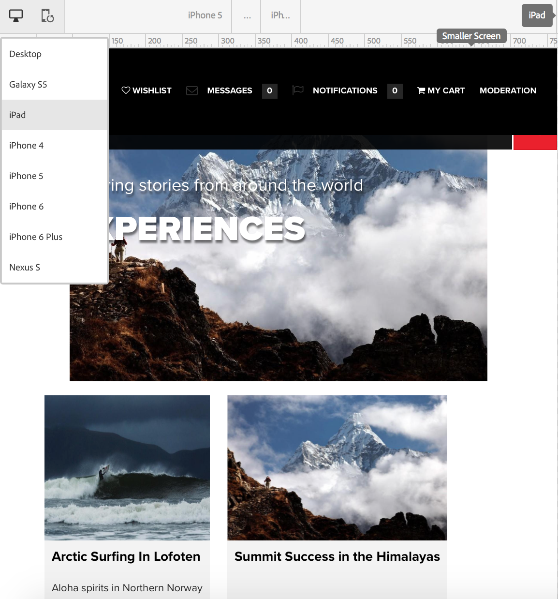
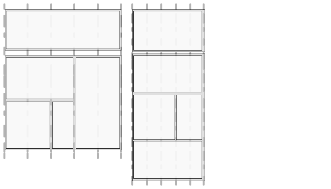
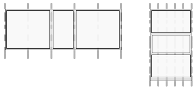

# Responsive Design for Web Pages{#responsive-design-for-web-pages}

>[!NOTE]
>
>Adobe recommends using the SPA Editor for projects that require single page application framework-based client-side rendering (such as _React_). [Learn more](/help/sites-developing/spa-overview.md).
>

>[!NOTE]
>
>Various examples are based on the Geometrixx sample content, which is no longer shipped with AEM (Adobe Experience Manager), having been replaced by We.Retail. See the document [We.Retail Reference Implementation](/help/sites-developing/we-retail.md#we-retail-geometrixx) for how to download and install Geometrixx.

Design your web pages so that they adapt to the client viewport in which they are displayed. With responsive design, the same pages can be effectively displayed on multiple devices in both orientations. The following image demonstrates some ways in which a page can respond to changes in viewport size:

* Layout: Use single-column layouts for smaller viewports, and multiple-column layouts for larger viewports.
* Text size: Use larger text size (when appropriate, such as headings) in larger viewports.
* Content: Include only the most important content when displaying on smaller devices.
* Navigation: Device-specific tools are provided for accessing other pages.
* Images: Serving image renditions that are appropriate for the client viewport. according to the window dimensions.


Develop Adobe Experience Manager (AEM) applications that generate HTML5 pages that adapt to multiple window sizes and orientations. For example, the following ranges of viewport widths correspond with various device types and orientations

* Maximum width of 480 pixels (phone, portrait)
* Maximum width of 767 pixels (phone, landscape)
* Width between 768 pixels and 979 pixels (tablet, portrait)
* Width between 980 pixels and 1199 pixels (tablet, landscape)
* Width of 1200 pixels or greater (desktop)

See the following topics for information about implementing responsive design behavior:

* [Media queries](/help/sites-developing/responsive.md#using-media-queries)
* [Fluid grids](/help/sites-developing/responsive.md#developing-a-fluid-grid)
* [Adaptive images](/help/sites-developing/responsive.md#using-adaptive-images)

As you design, use **[!UICONTROL Sidekick]** to preview your pages for various screen sizes.

## Before you develop {#before-you-develop}

Before you develop the AEM application that supports your web pages, several design decisions should be made. For example, you must have the following information:

* The devices you are targeting.
* The target viewport sizes.
* The page layouts for each of the targeted viewport size.

### Application structure {#application-structure}

The typical AEM application structure supports all responsive design implementations:

* Page components reside below /apps/*application_name*/components
* Templates reside below /apps/*application_name*/templates
* Designs reside below /etc/designs

## Using media queries {#using-media-queries}

Media queries enable the selective use of CSS styles for page rendering. AEM development tools and features enable you to effectively and efficiently implement media queries in your applications.

The W3C group provides the [Media Queries](https://www.w3.org/TR/mediaqueries-3/) recommendation that describes this CSS3 feature and the syntax.

### Creating the CSS file {#creating-the-css-file}

In your CSS file, define media queries based on the properties of the devices that you are targeting. The following implementation strategy is effective for managing styles for each media query:

* Use a ClientLibraryFolder to define the CSS that is assembled when the page is rendered.
* Define each media query and the associated styles in separate CSS files. It is useful to use file names that represent the device features of the media query.
* Define styles that are common to all devices in a separate CSS file.
* In the css.txt file of the ClientLibraryFolder, order the list CSS files as is required in the assembled CSS file.

The `We.Retail` Media sample uses this strategy to define styles in the site design. The CSS file used by `We.Retail` is at `*/apps/weretail/clientlibs/clientlib-site/less/grid.less`.

The following table lists the files in the css child folder.

<table>
 <tbody>
  <tr>
   <th>File name</th>
   <th>Description</th>
   <th>Media Query</th>
  </tr>
  <tr>
   <td>style.css</td>
   <td>Common styles.</td>
   <td>N/A</td>
  </tr>
  <tr>
   <td>bootstrap.css</td>
   <td>Common styles, defined by Twitter Bootstrap.</td>
   <td>N/A</td>
  </tr>
  <tr>
   <td>responsive-1200px.css</td>
   <td>Styles for all media that are 1200 pixels wide or wider.</td>
   <td><p>@media (min-width: 1200 px) {<br /> ...<br /> }</p> </td>
  </tr>
  <tr>
   <td>responsive-980px-1199px.css</td>
   <td>Styles for media that are between 980 pixels and 1199 pixels wide.</td>
   <td><p>@media (min-width: 980 px) and (max-width: 1199 px) {<br /> ...<br /> }</p> </td>
  </tr>
  <tr>
   <td>responsive-768px-979px.css</td>
   <td>Styles for media that are between 768 pixels and 979 pixels wide. </td>
   <td><p>@media (min-width: 768 px) and (max-width: 979 px) {<br /> ...<br /> }</p> </td>
  </tr>
  <tr>
   <td>responsive-767px-max.css</td>
   <td>Styles for all media that are fewer than 768 pixels wide.</td>
   <td><p>@media (max-width: 767 px) {<br /> ...<br /> }</p> </td>
  </tr>
  <tr>
   <td>responsive-480px.css</td>
   <td>Styles for all media that are fewer than 481 pixels wide.</td>
   <td>@media (max-width: 480 px) {<br /> ...<br /> }</td>
  </tr>
 </tbody>
</table>

The css.txt file in the `/etc/designs/weretail/clientlibs` folder lists the CSS files that the client library folder includes. The order of the files implements style precedence. Styles are more specific as the device size decreases.

`#base=css`

```
style.css
 bootstrap.css
```

```
responsive-1200px.css
 responsive-980px-1199px.css
 responsive-768px-979px.css
 responsive-767px-max.css
 responsive-480px.css
```

**Tip**: Descriptive file names let you easily identify the targeted viewport size.

### Using Media Queries with AEM Pages {#using-media-queries-with-aem-pages}

Include the client library folder in the JSP script of your page component. Doing so helps generate the CSS file that includes the media queries, and references the file.

```xml
<ui:includeClientLib categories="apps.weretail.all"/>
```

>[!NOTE]
>
>The `apps.weretail.all` client library folder embeds the clientlibs library.

The JSP script generates the following HTML code that references the style sheets:

```xml
<link rel="stylesheet" href="/etc/designs/weretail/clientlibs-all.css" type="text/css">
<link href="/etc/designs/weretail.css" rel="stylesheet" type="text/css">
```

## Previewing for specific devices {#previewing-for-specific-devices}

See previews of your pages in different viewport sizes so you can test the behavior of your responsive design. In **[!UICONTROL Preview]** mode, **[!UICONTROL Sidekick]** includes a **[!UICONTROL Devices]** drop-down menu that you use to select a device. When you select a device, the page changes to adapt to the viewport size.



To enable the device preview in **[!UICONTROL Sidekick]**, you must configure the page and the **[!UICONTROL MobileEmulatorProvider]** service. Another page configuration controls the list of devices that appears in the **[!UICONTROL Devices]** list.

### Adding the Devices List {#adding-the-devices-list}

The **[!UICONTROL Devices]** list appears in **[!UICONTROL Sidekick]** when your page includes the JSP script that renders the **[!UICONTROL Devices]** list. To add the **[!UICONTROL Devices]** list to **[!UICONTROL Sidekick]**, include the `/libs/wcm/mobile/components/simulator/simulator.jsp` script in the `head` section of your page.

Include the following code in the JSP that defines the `head` section:

`<cq:include script="/libs/wcm/mobile/components/simulator/simulator.jsp"/>`

To see an example, open the `/apps/weretail/components/page/head.jsp` file in CRXDE Lite.

### Registering Page components for simulation {#registering-page-components-for-simulation}

To enable the device simulator to support your pages, register your page components with the MobileEmulatorProvider factory service and define the `mobile.resourceTypes` property.

When working with AEM, there are several methods of managing the configuration settings for such services; see [Configuring OSGi](/help/sites-deploying/configuring-osgi.md) for full details.

For example, to create a ` [sling:OsgiConfig](/help/sites-deploying/configuring-osgi.md#adding-a-new-configuration-to-the-repository)` node in your application:

* Parent folder: `/apps/application_name/config`
* Name: `com.day.cq.wcm.mobile.core.impl.MobileEmulatorProvider-*alias*`

  The - `*alias*` suffix is required because the MobileEmulatorProvider service is a factory service. Use any alias that is unique for this factory.

* jcr:primaryType: `sling:OsgiConfig`

Add the following node property:

* Name: `mobile.resourceTypes`
* Type: `String[]`
* Value: The paths to the page components that render your web pages. For example, the geometrixx-media app uses the following values:

  ```
  geometrixx-media/components/page
   geometrixx-unlimited/components/pages/page
   geometrixx-unlimited/components/pages/coverpage
   geometrixx-unlimited/components/pages/issue
  ```

### Specifying the device groups {#specifying-the-device-groups}

To specify the device groups that appear in the Devices list, add a `cq:deviceGroups` property to the `jcr:content` node of the root page of your site. The value of the property is an array of paths to the device group nodes.

Device group nodes are in the `/etc/mobile/groups` folder.

For example, the root page of the Geometrixx Media site is `/content/geometrixx-media`. The `/content/geometrixx-media/jcr:content` node includes the following property:

* Name: `cq:deviceGroups`
* Type: `String[]`
* Value: `/etc/mobile/groups/responsive`

Use the Tools console to [create and edit device groups](/help/sites-developing/groupfilters.md).

>[!NOTE]
>
>For device groups that you use for responsive design, edit the device group and on the General tab select Disable Emulator. This option prevents the emulator carousel from appearing, which is not relevant to responsive design.
>

## Using adaptive images {#using-adaptive-images}

You can use media queries to select an image resource to display in the page. However, every resource that uses a media query to conditionalize its use is downloaded to the client. The media query merely determines whether the downloaded resource is displayed.

For large resources such as images, downloading all resources is not an efficient use of the client's data pipeline. To selectively download resources, use JavaScript to initiate the resource request after the media queries perform the selection.

The following strategy loads a single resource that is chosen using media queries:

1. Add a DIV element for each version of the resource. Include the URI of the resource as the value of an attribute value. The browser does not interpret the attribute as a resource.
1. Add a media query to each DIV element that is appropriate for the resource.
1. When the document loads or the window is resized, JavaScript code tests the media query of each DIV element.
1. Based on the results of the queries, determine which resource to include.
1. Insert an HTML element in the DOM that references the resource.

### Evaluating media queries using JavaScript {#evaluating-media-queries-using-javascript}

Implementations of the [MediaQueryList interface](https://drafts.csswg.org/cssom-view/#the-mediaquerylist-interface) that the W3C defines enable you to evaluate media queries using JavaScript. You can apply logic to the media query results and execute scripts that are targeted for the current window:

* Browsers that implement the MediaQueryList interface support the `window.matchMedia()` function. This function tests media queries against a given string. The function returns a `MediaQueryList` object that provides access to the query results.

* For browsers that do not implement the interface, you can use a `matchMedia()` poly fill, such as [matchMedia.js](https://github.com/paulirish/matchMedia.js), a freely available JavaScript library.

#### Selecting media-specific resources {#selecting-media-specific-resources}

The W3C [picture element](https://html.spec.whatwg.org/multipage/embedded-content.html#the-picture-element) uses media queries to determine the source to use for image elements. The picture element uses element attributes to associate media queries with image paths.

The freely available [picturefill.js library](https://github.com/scottjehl/picturefill) provides similar functionality as the proposed `picture` element, and uses a similar strategy. The picturefill.js library calls `window.matchMedia` to evaluate the media queries that are defined for a set of `div` elements. Each `div` element also specifies an image source. The source is used when the media query of the `div` element returns `true`.

The `picturefill.js` library requires HTML code that is similar to the following example:

```xml
<div data-picture>
    <div data-src='path to default image'></div>
    <div data-src='path to small image'    data-media="(media query for phone)"></div>
    <div data-src='path to medium image'   data-media="(media query for tablet)"></div>
    <div data-src='path to large image'     data-media="(media query for monitor)"></div>
</div>
```

When the page is rendered, picturefull.js inserts an `img` element as the last child of the `<div data-picture>` element:

```xml
<div data-picture>
    <div data-src='path to default image'></div>
    <div data-src='path to small image'    data-media="(media query for phone)"></div>
    <div data-src='path to medium image'   data-media="(media query for tablet)"></div>
    <div data-src='path to large image'     data-media="(media query for monitor)"></div>
    
</div>
```

In an AEM page, the value of the `data-src` attribute is the path to a resource in the repository.

### Implementing adaptive images in AEM {#implementing-adaptive-images-in-aem}

To implement adaptive images in your AEM application, you must add the required JavaScript libraries, and include the required HTML markup in your pages.

**Libraries**

Obtain the following JavaScript libraries and include them in a client library folder:

* [matchMedia.js](https://github.com/paulirish/matchMedia.js) (for browsers that do not implement the MediaQueryList interface)
* [picturefill.js](https://github.com/scottjehl/picturefill)
* jquery.js (avaliable by way of the `/etc/clientlibs/granite/jquery` client library folder (category = jquery)
* [jquery.debouncedresize.js](https://github.com/louisremi/jquery-smartresize) (a jquery event that occurs once after the window is resized)

**Tip:** You can automatically concatenate multiple client library folders by [embedding](/help/sites-developing/clientlibs.md#embedding-code-from-other-libraries).

**HTML**

Create a component that generates the required div elements that the picturefill.js code expects. In an AEM page, the value of the data-src attribute is the path to a resource in the repository. For example, a page component can hard-code the media queries and the associated paths for image renditions in DAM. Or, create a custom Image component that enables authors to select image renditions or specify runtime rendering options.

The following example HTML selects from two DAM renditions of the same image.

```xml
<div data-picture>
    <div data-src='/content/dam/geometrixx-media/articles/meridien.png'></div>
    <div data-src='/content/dam/geometrixx-media/articles/meridien.png/jcr:content/renditions/cq5dam.thumbnail.319.319.png'    data-media="(min-width: 769px)"></div>
    <div data-src='/content/dam/geometrixx-media/articles/meridien.png/jcr:content/renditions/cq5dam.thumbnail.140.100.png'   data-media="(min-width: 481px)"></div>
</div>
```

>[!NOTE]
>
>The Adaptive Image foundation component implements adaptive images:
>
>* Client library folder: `/libs/foundation/components/adaptiveimage/clientlibs`
>* Script that generates the HTML: `/libs/foundation/components/adaptiveimage/adaptiveimage.jsp`
>
>The subsequent section provides details about this component.
>

### Understanding image rendering in AEM {#understanding-image-rendering-in-aem}

To customize image rendering, you should understand the default AEM static image rendering implementation. AEM provides the Image component and an image-rendering servlet that work together to render images for web page. The following sequences of events occur when the Image component is included inthepage's paragraph system:

1. Authoring: Authors edit the Image component to specify the image file to include in an HTML page. The file path is stored as a property value of the Image component node.
1. Page request: The JSP of the page component generates the HTML code. The JSP of the Image component generates and adds an img element to the page.
1. Image request: The web browser loads the page, and requests the image according to the src attribute of the img element.
1. Image rendering: The image-rendering servlet returns the image to the web browser.


For example, the JSP of the Image component generates the following HTML element:

``

When the browser loads the page, it requests the image using the value of the src attribute as the URL. Sling decomposes the URL:

* Resource: `/content/mywebsite/en/_jcr_content/par/image_0`
* File name extension: `.jpg`
* Selector: `img`
* Suffix: `1358372073597.jpg`

The `image_0` node has a `jcr:resourceType` value of `foundation/components/image`, which has a `sling:resourceSuperType` value of `foundation/components/parbase`. The parbase component includes the img.GET.java script that matches the selector and the file name extension of the request URL. CQ uses this script (servlet) to render the image.

To see the source code of the script, use CRXDE Lite to open the `/libs/foundation/components/parbase/img.GET.java`
file.

## Scaling images for the current viewport size {#scaling-images-for-the-current-viewport-size}

Scale images at runtime according to the characteristics of the client viewport to provide images that conform to the principles of responsive design. Use the same design pattern as static image rendering, using a servlet and an authoring component.

The component must perform the following tasks:

* Store the path and desired dimensions of the image resource as property values.
* Generate `div` elements that contain media selectors and service calls for rendering the image.

>[!NOTE]
>
>The web client uses the matchMedia and Picturefill JavaScript libraries (or similar libraries) to evaluate the media selectors.
>

The servlet that processes the image request must perform the following tasks:

* Retrieve the path and dimensions of the image from the component properties.
* Scale the image according to the properties and return the image.

**Available solutions**

AEM installs the following implementations that you can use or extend.

* The Adaptive Image foundation component that generates media queries, and HTTP requests to the Adaptive Image Component Servlet that scales the images.
* The Geometrixx Commons package installs the Image Reference Modification Servlet sample servlets that alter image resolution.

### Understanding the Adaptive Image component {#understanding-the-adaptive-image-component}

The Adaptive Image component generates calls to the Adaptive Image Component Servlet to render an image that is sized according to the device screen. The component includes the following resources:

* JSP: Adds div elements that associate media queries with calls to Adaptive Image Component Servlet.
* Client libraries: The clientlibs folder is a `cq:ClientLibraryFolder` that assembles the matchMedia polyfill JavaScript library and a modified Picturefill JavaScript library.
* Edit dialog box: The `cq:editConfig` node overrides the CQ foundation image component so that the drop target creates an adaptive-image component rather than a foundation image component.

#### Adding the DIV elements {#adding-the-div-elements}

The adaptive-image.jsp script includes the following code that generates div elements and media queries:

```
<div data-picture data-alt='<%= alt %>'>
    <div data-src='<%= path + ".img.320.low." + extension + suffix %>'       data-media="(min-width: 1px)"></div>                                        <%-- Small mobile --%>
    <div data-src='<%= path + ".img.320.medium." + extension + suffix %>'    data-media="(min-width: 320px)"></div>  <%-- Portrait mobile --%>
    <div data-src='<%= path + ".img.480.medium." + extension + suffix %>'    data-media="(min-width: 321px)"></div>  <%-- Landscape mobile --%>
    <div data-src='<%= path + ".img.476.high." + extension + suffix %>'      data-media="(min-width: 481px)"></div>   <%-- Portrait iPad --%>
    <div data-src='<%= path + ".img.620.high." + extension + suffix %>'      data-media="(min-width: 769px)"></div>  <%-- Landscape iPad --%>
    <div data-src='<%= path + ".img.full.high." + extension + suffix %>'     data-media="(min-width: 1025px)"></div> <%-- Desktop --%>

    <%-- Fallback content for non-JS browsers. Same img src as the initial, unqualified source element. --%>
    <noscript>
        ' alt='<%= alt %>'>
    </noscript>
</div>
```

The `path` variable contains the path of the current resource (the adaptive-image component node). The code generates a series of `div` elements with the following structure:

`<div data-scr = "*path-to-parent-node*.adaptive-image.adapt.*width*.*quality*.jpg" data-media="*media query*"></div>`

The value of the `data-scr` attribute is a URL that Sling resolves to the Adaptive Image Component Servlet that renders the image. The data-media attribute contains the media query that is evaluated against the client properties.

The following HTML code is an example of the `div` elements that the JSP generates:

```xml
<div data-src='/content/geometrixx-media/en/events/the-lineup-you-ve-been-waiting-for/jcr:content/article-content-par/adaptive_image.adapt.320.low.jpg'></div>
    <div data-src='/content/geometrixx-media/en/events/the-lineup-you-ve-been-waiting-for/jcr:content/article-content-par/adaptive_image.adapt.320.medium.jpg'    data-media="(min-width: 320px)"></div>
    <div data-src='/content/geometrixx-media/en/events/the-lineup-you-ve-been-waiting-for/jcr:content/article-content-par/adaptive_image.adapt.480.medium.jpg'    data-media="(min-width: 321px)"></div>
    <div data-src='/content/geometrixx-media/en/events/the-lineup-you-ve-been-waiting-for/jcr:content/article-content-par/adaptive_image.adapt.476.high.jpg'     data-media="(min-width: 481px)"></div>
    <div data-src='/content/geometrixx-media/en/events/the-lineup-you-ve-been-waiting-for/jcr:content/article-content-par/adaptive_image.adapt.620.high.jpg'     data-media="(min-width: 769px)"></div>
    <div data-src='/content/geometrixx-media/en/events/the-lineup-you-ve-been-waiting-for/jcr:content/article-content-par/adaptive_image.adapt.full.high.jpg'     data-media="(min-width: 1025px)"></div>
```

#### Changing the image size selectors {#changing-the-image-size-selectors}

If you customize the Adaptive Image component and change the width selectors, you must also configure the Adaptive Image Component Servlet to support the widths.

### Understanding the Adaptive Image Component Servlet {#understanding-the-adaptive-image-component-servlet}

The Adaptive Image Component Servlet resizes a JPEG image according to a specified width, and sets the JPEG quality.

#### The interface of the Adaptive Image Component Servlet {#the-interface-of-the-adaptive-image-component-servlet}

The Adaptive Image Component Servlet is bound to the default Sling servlet and supports the .jpg, .jpeg, .gif, and .png file extensions. The servlet selector is img.

>[!CAUTION]
>
>Animated .gif files are not supported in AEM for adaptive renditions.

Therefore, Sling resolves HTTP request URLs of the following format to this servlet:

`*path-to-node*.img.*extension*`

For example, Sling forwards HTTP requests with the URL `http://localhost:4502/content/geometrixx/adaptiveImage.img.jpg` to Adaptive Image Component Servlet.

Two additional selectors specify the requested image width and JPEG quality. The following example requests an image of width 480 pixels and medium quality:

`http://localhost:4502/content/geometrixx/adaptiveImage.adapt.480.MEDIUM.jpg`

**Supported image properties**

The servlet accepts a finite number of image widths and qualities. The following widths are supported by default (in pixels):

* full
* 320
* 480
* 476
* 620

The full value indicates no scaling.

The following values for JPEG quality are supported:

* LOW
* MEDIUM
* HIGH

The numeric values are 0.4, 0.82, and 1.0, respectively.

**Changing the default supported widths**

Use the Web Console ([http://localhost:4502/system/console/configMgr](http://localhost:4502/system/console/configMgr)) or a sling:OsgiConfig node to configure the supported widths of the Adobe CQ Adaptive Image Component Servlet.

For information about how to configure AEM services, see [Configuring OSGi](/help/sites-deploying/configuring-osgi.md).

<table>
 <tbody>
  <tr>
   <th> </th>
   <th>Web console</th>
   <th>sling:OsgiConfig</th>
  </tr>
  <tr>
   <th>Service or Node name</th>
   <td>The service name on the Configuration tab is Adobe CQ Adaptive Image Component Servlet</td>
   <td>com.day.cq.wcm.foundation.impl. AdaptiveImageComponentServlet</td>
  </tr>
  <tr>
   <th>Property</th>
   <td><p>Supported widths</p>
    <ul>
     <li>To add a supported width, click a + button and enter a positive integer.</li>
     <li>To remove a supported width, click the associated - button.</li>
     <li>To modify a supported width, edit the field value.</li>
    </ul> </td>
   <td><p>adapt.supported.widths</p>
    <ul>
     <li>The property is a multivalued String value.</li>
    </ul> </td>
  </tr>
 </tbody>
</table>

#### Implementation details {#implementation-details}

The `com.day.cq.wcm.foundation.impl.AdaptiveImageComponentServlet` class extends the [AbstractImageServlet](https://developer.adobe.com/experience-manager/reference-materials/6-5/javadoc/com/day/cq/wcm/commons/AbstractImageServlet.html) class. The AdaptiveImageComponentServlet source code is in the `/libs/foundation/src/impl/src/com/day/cq/wcm/foundation/impl` folder.

The class uses Felix SCR annotations to configure the resource type and file extension that the servlet is associated with, and the name of the first selector.

```java
@Component(metatype = true, label = "Adobe CQ Adaptive Image Component Servlet",
        description = "Render adaptive images in a variety of qualities")
@Service
@Properties(value = {
    @Property(name = "sling.servlet.resourceTypes", value = "foundation/components/adaptiveimage", propertyPrivate = true),
    @Property(name = "sling.servlet.selectors", value = "img", propertyPrivate = true),
    @Property(name = "sling.servlet.extensions", value ={
            "jpg",
            "jpeg",
            "png",
            "gif"
    }, propertyPrivate = true)
})
```

The servlet uses the Property SCR annotation to set the default supported image quality and dimensions.

```java
@Property(value = {
            "320", // iPhone portrait
            "480", // iPhone landscape
            "476", // iPad portrait
            "620" // iPad landscape
    },
            label = "Supported Widths",
            description = "List of widths this component is permitted to generate.")
```

The `AbstractImageServlet` class provides the `doGet` method that processes the HTTP request. This method determines the resource that is associated with the request, retrieves resource properties from the repository, and returns them in an [ImageContext](https://developer.adobe.com/experience-manager/reference-materials/6-5/javadoc/com/day/cq/wcm/commons/AbstractImageServlet.ImageContext.html) object.

>[!NOTE]
>
>The [com.day.cq.commons.DownloadResource](https://developer.adobe.com/experience-manager/reference-materials/6-5/javadoc/com/day/cq/commons/DownloadResource.html) class provides the `getFileReference method`, which retrieves the value of the resource's `fileReference` property.

The `AdaptiveImageComponentServlet` class overrides the `createLayer` method. The method obtains the path of the image resource and the requested image width from the `ImageContext` object. It then calls the methods of the `info.geometrixx.commons.impl.AdaptiveImageHelper` class, which performs the actual image scaling.

The AdaptiveImageComponentServlet class also overrides the writeLayer method. This method applies the JPEG quality to the image.

### Image Reference Modification Servlet (Geometrixx Common) {#image-reference-modification-servlet-geometrixx-common}

The sample Image Reference Modification Servlet generates size attributes for the img element to scale an image on the web page.

#### Calling the servlet {#calling-the-servlet}

The servlet is bound to `cq:page` resources and supports the .jpg file extension. The servlet selector is `image`. Therefore, Sling resolves HTTP request URLs of the following format to this servlet:

`path-to-page-node.image.jpg`

For example, Sling forwards HTTP requests with the URL `http://localhost:4502/content/geometrixx/en.image.jpg` to Image Reference Modification Servlet.

Three additional selectors specify the requested image width, height, and (optionally) quality. The following example requests an image of width 770 pixels, height 360 pixels, and of medium quality.

`http://localhost:4502/content/geometrixx/en.image.770.360.MEDIUM.jpg`

**Supported image properties**

The servlet accepts a finite number of image dimensions and quality values.

The following values are supported by default (widthxheight):

* 256x192
* 370x150
* 480x200
* 127x127
* 770x360
* 620x290
* 480x225
* 320x150
* 375x175
* 303x142
* 1170x400
* 940x340
* 770x300
* 480x190

The following values for image quality are supported:

* low
* medium
* high

When working with AEM, there are several methods of managing the configuration settings for such services; see [Configuring OSGi](/help/sites-deploying/configuring-osgi.md) for full details.

#### Specifying the image resource {#specifying-the-image-resource}

The image path, dimensions, and quality values must be stored as properties of a node in the repository:

* The node name is `image`.
* The parent node is the `jcr:content` node of a `cq:page` resource.

* The image path is stored as the value of a property named `fileReference`.

When authoring a page, use **Sidekick** to specify the image and add the `image` node to the page properties:

1. In **Sidekick**, click the **Page** tab, and then click **Page Properties**.
1. Click the **Image** tab and specify the image.
1. Click **OK**.

#### Implementation details {#implementation-details-1}

The info.geometrixx.commons.impl.servlets.ImageReferenceModificationServlet class extends the [AbstractImageServlet](https://developer.adobe.com/experience-manager/reference-materials/6-5/javadoc/com/day/cq/wcm/commons/AbstractImageServlet.html) class. If you have the cq-geometrixx-commons-pkg package installed, the ImageReferenceModificationServlet source code is in the `/apps/geometrixx-commons/src/core/src/main/java/info/geometrixx/commons/impl/servlets` folder.

The class uses Felix SCR annotations to configure the resource type and file extension that the servlet is associated with, and the name of the first selector.

```java
@Component(metatype = true, label = "Adobe CQ Image Reference Modification Servlet",
        description = "Render the image associated with a page in a variety of dimensions and qualities")
@Service
@Properties(value = {
    @Property(name = "sling.servlet.resourceTypes", value = NameConstants.NT_PAGE, propertyPrivate = true),
    @Property(name = "sling.servlet.selectors", value = "image", propertyPrivate = true),
    @Property(name = "sling.servlet.extensions", value = "jpg", propertyPrivate = true)
})
```

The servlet uses the Property SCR annotation to set the default supported image quality and dimensions.

```java
@Property(label = "Image Quality",
            description = "Quality must be a double between 0.0 and 1.0", value = "0.82")
@Property(value = {
                "256x192", // Category page article list images
                "370x150", // "Most popular" desktop & iPad & carousel min-width: 1px
                "480x200", // "Most popular" phone
                "127x127", // article summary phone square images
                "770x360", // article summary, desktop
                "620x290", // article summary, tablet
                "480x225", // article summary, phone (landscape)
                "320x150", // article summary, phone (portrait) and fallback
                "375x175", // 2-column article summary, desktop
                "303x142", // 2-column article summary, tablet
                "1170x400", // carousel, full
                "940x340",  // carousel min-width: 980px
                "770x300",  // carousel min-width: 768px
                "480x190"   // carousel min-width: 480px
            },
            label = "Supported Resolutions",
            description = "List of resolutions this component is permitted to generate.")
```

The `AbstractImageServlet` class provides the `doGet` method that processes the HTTP request. This method determines the resource that is associated with the call, retrieves resource properties from the repository, and saves them in an [ImageContext](https://developer.adobe.com/experience-manager/reference-materials/6-5/javadoc/com/day/cq/wcm/commons/AbstractImageServlet.ImageContext.html) object.

The `ImageReferenceModificationServlet` class overrides the `createLayer` method and implements the logic that determines the image resource to render. The method retrieves a child node of the page's `jcr:content` node named `image`. An [Image](https://developer.adobe.com/experience-manager/reference-materials/6-5/javadoc/com/day/cq/wcm/foundation/Image.html) object is created from this `image` node, and the `getFileReference` method returns the path to the image file from the `fileReference` property of the image node.

>[!NOTE]
>The [com.day.cq.commons.DownloadResource](https://developer.adobe.com/experience-manager/reference-materials/6-5/javadoc/com/day/cq/commons/DownloadResource.html) class provides the getFileReferencemethod.
>

## Developing a fluid grid {#developing-a-fluid-grid}

AEM enables you to efficiently and effectively implement fluid grids. This page explains how you can integrate your fluid grid or an existing grid implementation (such as [Bootstrap](https://github.com/topics/twitter-bootstrap?l=css)) into your AEM application.

If you are not familiar with fluid grids, see the [Introduction to Fluid Grids](/help/sites-developing/responsive.md#developing-a-fluid-grid) section at the bottom of this page. This introduction provides an overview of fluid grids and guidance for designing them.

### Defining the grid using a Page component {#defining-the-grid-using-a-page-component}

Use page components to generate the HTML elements that define the content blocks of the page. The ClientLibraryFolder that the page references provides the CSS that controls the layout of the content blocks:

* Page component: Adds div elements that represent rows of content blocks. The div elements that represent content blocks include a parsys component where authors add content.
* Client library folder: Provides the CSS file that includes media queries and styles for the div elements.

For example, the sample geometrixx-media application contains the media-home component. This page component inserts two scripts, which generate two `div` elements of class `row-fluid`:

* The first row contains a `div` element of class `span12` (the content spans 12 columns). The `div` element contains the parsys component.

* The second row contains two `div` elements, one of class `span8` and the other of class `span4`. Each `div` element includes the parsys component.

```xml
<div class="page-content">
    <div class="row-fluid">
        <div class="span12">
            <cq:include path="grid-12-par" resourceType="foundation/components/parsys" />
        </div>
    </div>
    <div class="row-fluid">
        <div class="span8">
            <cq:include path="grid-8-par" resourceType="foundation/components/parsys" />
        </div>
        <div class="span4">
            <cq:include path="grid-4-par" resourceType="foundation/components/parsys" />
        </div>
    </div>
</div>
```

>[!NOTE]
>
>When a component includes multiple `cq:include` elements that reference the parsys component, each `path` attribute must have a different value.
>

#### Scaling the Page component grid {#scaling-the-page-component-grid}

The design that is associated with the geometrixx-media page component (`/etc/designs/geometrixx-media`) contains the `clientlibs` ClientLibraryFolder. This ClientLibraryFolder defines CSS styles for `row-fluid` classes, `span*` classes, and `span*` classes that are children of `row-fluid` classes. Media queries enable styles to be redefined for different viewport sizes.

The following example CSS is a subset of those styles. This subset focuses on `span12`, `span8`, and `span4` classes, and media queries for two viewport sizes. Notice the following characteristics of the CSS:

* The `.span` styles define element widths using absolute numbers.
* The `.row-fluid .span*` styles define element widths as percentages of the parent. Percentages are calculated from the absolute widths.
* Media queries for larger viewports assign larger absolute widths.

>[!NOTE]
>
>The Geometrixx Media sample integrates the [Bootstrap](https://getbootstrap.com/2.0.2/) JavaScript framework into its fluid grid implementation. The Bootstrap framework provides the bootstrap.css file.

```xml
/* default styles (no media queries) */
 .span12 { width: 940px }
 .span8 { width: 620px }
 .span4 { width: 300px }
 .row-fluid .span12 { width: 100% }
 .row-fluid .span8 { width: 65.95744680851064% }
 .row-fluid .span4 { width: 31.914893617021278% }

@media (min-width: 768px) and (max-width: 979px) {
 .span12 { width: 724px; }
 .span8 {     width: 476px; }
 .span4 {     width: 228px; }
 .row-fluid .span12 {     width: 100%;}
 .row-fluid .span8 {     width: 65.74585635359117%; }
 .row-fluid .span4 {     width: 31.491712707182323%; }
}

@media (min-width: 1200px) {
 .span12 { width: 1170px }
 .span8 { width: 770px }
 .span4 { width: 370px }
 .row-fluid .span12 { width: 100% }
 .row-fluid .span8 { width: 65.81196581196582% }
 .row-fluid .span4 { width: 31.623931623931625% }
}
```

#### Repositioning content in the Page component grid {#repositioning-content-in-the-page-component-grid}

The pages of the sample Geometrixx Media application distribute rows of content blocks horizontally in wide viewports. In smaller viewports, the same blocks are distributed vertically. The following example CSS shows the styles that implement this behavior for the HTML code that the media-home page component generates:

* The default CSS for the media-welcome page assigns the `float:left` style for `span*` classes that are inside `row-fluid` classes.

* Media queries for smaller viewports assign the `float:none` style for the same classes.

```xml
/* default styles (no media queries) */
    .row-fluid [class*="span"] {
        width: 100%;
        float: left;
}

@media (max-width: 767px) {
    [class*="span"], .row-fluid [class*="span"] {
        float: none;
        width: 100%;
    }
}
```

#### Modularize your Page components {#tip-modularize-your-page-components}

Modularize your components so you can make efficient use of the code. Your site likely uses several different types of pages, such as a welcome page, an article page, or a product page. Each type of page contains different types of content and likely use different layouts. However, when certain elements of each layout are common across multiple pages, you can reuse the code that implements that part of the layout.

**Use page component overlays**

Create a main page component that provides scripts for generating the various parts of a page, such as `head` and `body` sections, and `header`, `content`, and `footer` sections within the body.

Create other page components that use the main page component as the `cq:resourceSuperType`. These components include scripts that override the scripts of the main page as needed.

For example, the goemetrixx-media application includes the page component (the `sling:resourceSuperType` is the foundation page component). Several child components (such as article, category, and media-home) use this page component as the `sling:resourceSuperType`. Each child component includes a content.jsp file that overrides the content.jsp file of the page component.

**Reuse scripts**

Create multiple JSP scripts that generate row and column combinations that are common for multiple page components. For example, the `content.jsp` script of the article and media-home components both reference the `8x4col.jsp` script.

**Organize CSS styles by targeted viewport size**

Include CSS styles and media queries for different viewport sizes in separate files. Use client library folders to concatenate them.

### Inserting components into the page grid {#inserting-components-into-the-page-grid}

When components generate a single block of content, generally the grid that the page component establishes controls the placement of the content.

As an author, the content block can be rendered in various sizes and relative positions. Content text should not use relative directions to refer to other content blocks.

If necessary, the component should provide any CSS or JavaScript libraries that are required for the HTML code that it generates. Use a client library folder inside the component so the CSS and JS files are generated. To expose the files, [create a dependency or embed the library](/help/sites-developing/clientlibs.md#creating-client-library-folders) in another client library folder below the /etc folder.

**Sub-grids**

If the component contains multiple blocks of content, add the content blocks inside a row to establish a sub-grid on the page:

* Use the same class names as the containing page component so you can express div elements as rows and content blocks.
* To override the behavior that the page design's CSS implements, use a second class name for the row div element and provide the associated CSS in a client library folder.

For example, the `/apps/geometrixx-media/components/2-col-article-summary` component generates two columns of content. The HTML that it generates has the following structure:

```xml
<div class="row-fluid mutli-col-article-summary">
    <div class="span6">
        <article>
            <div class="article-summary-image">...</div>
            <div class="social-header">...</div>
            <div class="article-summary-description">...</div>
            <div class="social">...</div>
        </article>
    </div>
</div>
```

The `.row-fluid .span6` selectors of the page's CSS applies to the `div` elements of the same class and structure in this HTML. However, the component also includes the /apps/geometrixx-media/components/2-col-article-summary/clientlibs client library folder:

* The CSS uses the same media queries as the page component to establish changes in layout at the same discrete page widths.
* Selectors use the `multi-col-article-summary` class of the row `div` element to override the behavior of the page's `row-fluid` class.

For example, the following styles are included in the `/apps/geometrixx-media/components/2-col-article-summary/clientlibs/css/responsive-480px.css` file:

```xml
@media (max-width: 480px) {
    .mutli-col-article-summary .article-summary-image {
        float: left;
        width: 127px;
    }
    .mutli-col-article-summary .article-summary-description {
        width: auto;
        margin-left: 127px;
    }
    .mutli-col-article-summary .article-summary-description h4 {
        padding-left: 10px;
    }
    .mutli-col-article-summary .article-summary-text {
        margin-left: 127px;
        min-height: 122px;
        top: 0;
    }
}
```

## Introduction to fluid grids {#introduction-to-fluid-grids}

Fluid grids enable page layouts to adapt to the dimensions of the client viewport. Grids consist of logical columns and rows that position the blocks of content on the page.

* Columns determine the horizontal positions and widths of content blocks.
* Rows determine the relative vertical positions of content blocks.

Using HTML5 technology you can implement the grid and manipulate it to adapt page layouts to different viewport sizes:

* HTML `div` elements contain blocks of content that span some columns.
* One or more of these div elements comprise a row when they share a common parent div element.

### Using discrete widths {#using-discrete-widths}

For each range of viewport widths that you are targeting, use a static page width and content blocks of constant width. When manually resizing a browser window, changes to content size occur at discrete window widths (also known as breakpoints). Therefore, page designs are more closely adhered to, maximizing the user experience.

#### Scaling the grid {#scaling-the-grid}

Use grids to scale content blocks to adapt to different viewport sizes. Content blocks span a specific number of columns. As column widths increase or decrease to fit different viewport sizes, the widths of the content blocks increase or decrease accordingly. Scaling can support both large- and medium-sized viewports that are wide enough to accommodate the side-by-side placement of content blocks.


#### Repositioning content in the grid {#repositioning-content-in-the-grid}

The size of content blocks can be constrained by a minimum width, beyond which scaling is no longer effective. For smaller viewports, the grid can be used to vertically distribute blocks of content rather than horizontally.



### Designing the grid {#designing-the-grid}

Determine the columns and rows that you must position the blocks of content on your pages. Your page layouts determine the number of columns and rows that span your grid.

**Number of columns**

Include enough columns to horizontally position the content blocks in all of your layouts, for all viewport sizes. Use more columns than are currently needed so you can accommodate future page designs.

**Row contents**

Use rows to control the vertical positioning of content blocks. Determine the content blocks that share the same row:

* Content blocks that are located next to each other horizontally in any of the layouts are in the same row.
* Content blocks that are located next to each other horizontally (wider viewports) and vertically (smaller viewports) are in the same row.

### Grid implementations {#grid-implementations}

Create CSS classes and styles so you can control the layout of the content blocks on a page. Page designs are often based on the relative size and position of content blocks within the viewport. The viewport determines the actual size of the content blocks. Your CSS must account for the relative and the absolute sizes. You can implement a fluid grid using three types of CSS classes:

* A class for a `div` element that is a container for all rows. This class sets the absolute width of the grid.
* A class for `div` elements that represent a row. This class controls the horizontal or vertical positioning of the content blocks that it contains.
* Classes for `div` elements that represent blocks of content of different widths. Widths are expressed as a percentage of the parent (the row).

Targeted viewport widths (and their associated media queries) demarcate discrete widths that are used for a page layout.

#### Widths of content blocks {#widths-of-content-blocks}

Generally, the `width` styles of content block classes are based on the following characteristics of your page and grid:

* The absolute page width that you are using for each targeted viewport size. Known values.
* The absolute width of the grid columns for each page width. You determine these values.
* The relative width of each column as a percentage of the total page width. You calculate these values.

The CSS includes a series of media queries that use the following structure:

```xml
@media(query_for_targeted_viewport){

  .class_for_container{ width:absolute_page_width }
  .class_for_row { width:100%}

  /* several selectors for content blocks   */
  .class_for_content_block1 { width:absolute_block_width1 }
  .class_for_content_block2 { width:absolute_block_width2 }
  ...

  /* several selectors for content blocks inside rows */
  .class_for_row .class_for_content_block1 { width:relative_block_width1 }
  .class_for_row .class_for_content_block2 { width:relative_block_width2 }
  ...
}
```

Use the following algorithm as a starting point for developing the element classes and CSS styles for your pages.

1. Define a class name for the div element that contains all rows, for example `content.`
1. Define a CSS class for div elements that represent rows, such as `row-fluid`.
1. Define class names for content block elements. A class is required for all possible widths, in terms of column spans. For example, use the `span3` class for `div` elements that span three columns, use `span4` classes for spans of four columns. Define as many classes as there are columns in your grid.

1. For each viewport size that you are targeting, add the corresponding media query to your CSS file. Add the following items in each media query:

    * A selector for the `content` class, for example `.content{}`.
    * Selectors for each span class, for example `.span3{ }`.
    * A selector for the `row-fluid` class, for example `.row-fluid{ }`
    * Selectors for span classes that are inside row-fluid classes, for example `.row-fluid span3 { }`.

1. Add width styles for each selector:

    1. Set the width of `content` selectors to the absolute size of the page, for example `width:480px`.
    1. Set the width of all row-fluid selectors to 100%.
    1. Set the width of all span selectors to the absolute width of the content block. A trivial grid uses evenly distributed columns of the same width: `(absolute width of page)/(number of columns)`.
    1. Set the width of the `.row-fluid .span` selectors as a percentage of the total width. Calculate this width using the `(absolute span width)/(absolute page width)*100` formula.

#### Positioning Content Blocks in Rows {#positioning-content-blocks-in-rows}

Use the float style of the `.row-fluid` class so you can control whether the content blocks in a row are arranged horizontally or vertically.

* The `float:left` or `float:right` style causes the horizontal distribution of child elements (content blocks).

* The `float:none` style causes vertical distribution of child elements.

Add the style to the `.row-fluid` selector inside each media query. Set the value according to the page layout that you are using for that media query. For example, the following diagram illustrates a row that distributes content horizontally for wide viewports, and vertically for narrow viewports.



The following CSS could implement this behavior:

```xml
@media (min-width: 768px) and (max-width: 979px) {
   .row-fluid {
       width:100%;
       float:left
   }
}

@media (max-width:480px){
    .row-fluid {
       width:100%;
       float:none
   }
}
```

#### Assigning classes to content blocks {#assigning-classes-to-content-blocks}

For the page layout of each viewport size you are targeting, determine the number of columns that each content block spans. Then, determine which class to use for the div elements of those content blocks.

When you have established the div classes, you can implement the grid using your AEM application.
