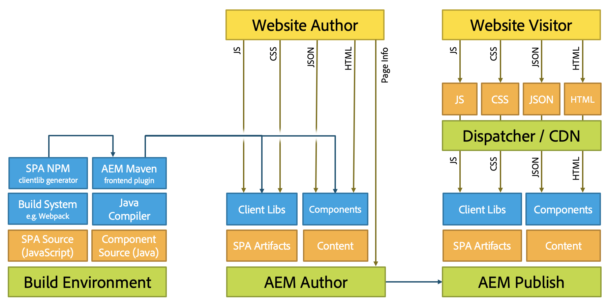

# Developing SPAs for AEM{#developing-spas-for-aem}

Single page applications (SPAs) can offer compelling experiences for website users. Developers want to be able to build sites using SPA frameworks and authors want to seamlessly edit content within Adobe Experience Manager (AEM) for a site built using such frameworks.

This article presents important questions to consider when engaging a front-end developer to develop a SPA for AEM and gives an overview of the architecture of AEM regarding deploying SPAs on AEM.

{{ue-over-spa}}

## SPA Development Principles for AEM {#spa-development-principles-for-aem}

Developing single page applications on AEM assumes that the front-end developer observes standard best practices when creating an SPA. If as a front-end developer you follow these general best practices and a few AEM-specific principles, your SPA will be functional with [AEM and its content-authoring capabilities](/help/sites-developing/spa-walkthrough.md#content-editing-experience-with-spa).

* **[Portability](/help/sites-developing/spa-architecture.md#portability) -** As with any components, the components should be built to be as portable as possible. The SPA should be built with portably and reusable components.
* **[AEM Drives Site Structure](/help/sites-developing/spa-architecture.md#aem-drives-site-structure)** - The front-end developer creates components and owns their internal structure, but relies on AEM to define the content structure of the site.
* **[Dynamic Rendering](/help/sites-developing/spa-architecture.md#dynamic-rendering)** - All rendering should be dynamic.
* **[Dynamic Routing](#dynamic-routing) -** The SPA is responsible for the routing and AEM listens to it and fetches based on it. Any routing should be dynamic as well.

If you keep these principles in mind as you develop your SPA, it will be as flexible and as future proof as possible while enabling all supported AEM authoring functionality.

If you do not need to support AEM authoring features, you may need to consider a different [SPA design model](/help/sites-developing/spa-architecture.md#spa-design-models).

### Portability {#portability}

As when developing any component, your components should be designed in such a way that maximizes their portability. Any patterns that work against the portability or reusability of the components should be avoided to ensure compatibility, flexibility, and maintainability going forward.

The resulting SPA should be built with highly portable and reusable components.

### AEM Drives Site Structure {#aem-drives-site-structure}

The front-end developer must think of themselves as responsible for creating a library of SPA components that are used to build the app. The front-end developer has full control of the internal structure of the components. [However, AEM, at all times, owns the structure of the site.](/help/sites-developing/spa-overview.md)

This means that the front-end developer can add customer content before or after the entry point of the components and can also make third-party calls inside the component. However, the front-end developer is not in full control of how the components nest, for example.

### Dynamic Rendering {#dynamic-rendering}

The SPA should only rely on dynamic rendering of content. This is the default expectation where AEM fetches and renders all children of the content structure.

Any explicit rendering that points to specific content is considered static rendering and though supported will not be compatible with AEM's content authoring features. This also goes against the principle of [portability](/help/sites-developing/spa-architecture.md#portability).

### Dynamic Routing {#dynamic-routing}

As with rendering, all routing should also be dynamic. In AEM, [the SPA should always own the routing](/help/sites-developing/spa-routing.md) and AEM listens to it and fetches content based on it.

Any static routing works against the [principle of portability](/help/sites-developing/spa-architecture.md#portability) and limits the author by not being compatible with content authoring features of AEM. For example, with static routing, if the content author wants to change a route or change a page, the author would have to ask the front-end developer to do it.

## AEM Project Archetype {#aem-project-archetype}

Any AEM project should use the [AEM Project Archetype](https://experienceleague.adobe.com/docs/experience-manager-core-components/using/developing/archetype/overview.html), which supports SPA projects using React or Angular and uses the SPA SDK.

## SPA Design Models {#spa-design-models}

If the [principles of developing SPAs in AEM](/help/sites-developing/spa-architecture.md#spa-development-principles-for-aem) are followed, then your SPA will be functional with all supported AEM content authoring features.

There may be cases however when this is not entirely necessary. The following table gives an overview of the various design models, their advantages, and their disadvantages.

<table>
 <tbody>
  <tr>
   <th><strong>Design Model  </strong></th>
   <th><strong>Advantages</strong></th>
   <th><strong>Disadvantages</strong></th>
  </tr>
  <tr>
   <td>AEM is used as a headless CMS without using the <a href="/help/sites-developing/spa-reference-materials.md">SPA Editor SDK framework.</a></td>
   <td>The front-end developer has full control over the app.</td>
   <td>
Content authors cannot use AEM's content authoring experience.
 
The code is not portable or reusable if it contains static references or routing.
 
Does not allow use of the template editor so the front-end developer must maintain editable templates via the JCR.
 </td>
  </tr>
  <tr>
   <td>The front-end developer uses the SPA Editor SDK framework but only opens some areas to the content author.</td>
   <td>The developer keeps control over the app by only enabling authoring in restricted areas of the app.</td>
   <td>
Content authors are restricted to a limited set of AEM's content authoring experience.
 
The code risks being neither portable nor reusable if it contains static references or routing.
 
Does not allow use of the template editor so the front-end developer must maintain editable templates by way of the JCR.
 </td>
  </tr>
  <tr>
   <td>The project fully uses the SPA Editor SDK and the frontend components are developed as a library and the content structure of the app is delegated to AEM.</td>
   <td>
The app is reusable and portable.
 
The content author can edit the app using AEM's content authoring experience.  
 
The SPA is compatible with the template editor.
 </td>
   <td>
The developer is not in control of the structure of the app and the portion of content delegated to AEM.
 
The developer can still reserve areas of the app for the content that is not meant to be authored using AEM.
 </td>
  </tr>
 </tbody>
</table>

>[!NOTE]
>
>Although all models are supported in AEM, only by implementing the third (and therefore following the recommended [SPA development principles in AEM](/help/sites-developing/spa-architecture.md#spa-development-principles-for-aem)) can content authors interact with and edit the content of the SPA in AEM as they are accustomed.

## Migrating Existing SPAs to AEM {#migrating-existing-spas-to-aem}

Generally if your SPA follows the [SPA Development Principles for AEM](/help/sites-developing/spa-architecture.md#spa-development-principles-for-aem), then your SPA will work in AEM and be editable using the AEM SPA Editor.

Follow these steps to get your existing SPA ready to work with AEM.

1. **Make your JS components modular.**

   Make them capable of being rendered in any order, position, and size.
1. **Use the containers provided by Adobe's SDK to place your components on the screen.**

   AEM provides a page and paragraph system component for you to use.
1. **Create an AEM component for each JS component.**

   The AEM components define the dialog and JSON output.

## Instructions for Front-End Developers {#instructions-for-front-end-developers}

The main task in engaging a front-end developer to create a SPA for AEM is to agree on the components and their JSON models.

The following is an outline of the steps that a front-end developer needs to follow when developing a SPA for AEM.

1. **Agree on components and their JSON model**

   Front-end developers and back-end AEM developers need to agree on which components are necessary and a model so there is a one-on-one match from SPA components to the back-end components.

   AEM components are still necessary mostly to provide edit dialogs and to export the component model.

1. **In React components, access the model via `this.props.cqModel`**

   Once components are agreed and the JSON model is in place, the front-end developer is free to develop the SPA and can simply access the JSON model via `this.props.cqModel`.

1. **Implement component's `render()` method**

   The front-end developer implements the `render()` method as they see fit and can use the fields of the `cqModel` property. This outputs the DOM and the HTML fragments that are inserted into the page. This is the standard way of building an app in React.

1. **Map the component to the AEM resource type via `MapTo()`**

   The mapping stores component classes and is used internally by the provided `Container` component to retrieve and dynamically instantiate components based on the given resource type.

   This serves as the "glue" between front end and back end so editor knows to which components the react components correspond.

   The `Page` and `ResponsiveGrid` are good examples of classes extending the base `Container`.

1. **Define the component's `EditConfig` as parameter to `MapTo()`**

   This parameter is necessary to tell the editor how the component should be named as long at is not yet rendered or has no content to render.

1. **Extend the provided `Container` class for pages and containers**

   Pages and paragraph systems should extend this class so that delegation to inner components works as expected.

1. **Implement a routing solution that using the HTML5 `History` API.**

   When the `ModelRouter` is enabled, calling the `pushState` and `replaceState` functions trigger a request to the `PageModelManager` to fetch a missing fragment of the model.

   The current version of the `ModelRouter` only supports the use of URLs that points to the actual resource path of Sling Model entry points. It does not support the use of vanity URLs or aliases.

   The `ModelRouter` can be disabled or configured to ignore a list of regular expressions.

## AEM-Agnostic {#aem-agnostic}

These code blocks illustrate how your React and Angular components need nothing that is Adobe or AEM specific.

* Everything that is inside the JavaScript component is AEM-agnostic.
* However, what is specific to AEM is that the JS component must be mapped to an AEM component with the MapTo helper.

The `MapTo` helper is the "glue" that allows the back-end and the front-end components to be matched together:

* It tells the JS container (or JS paragraph system) what JS component is responsible for rendering each of the components that are present in the JSON.
* It adds an HTML data attribute to the HTML that the JS component renders, so that the SPA Editor knows what dialog to display to the author when editing the component.

For more information about using `MapTo` and building SPAs for AEM in general, see the Getting Started guide for your chosen framework.

* [Getting Started with SPAs in AEM - React](/help/sites-developing/spa-getting-started-react.md)
* [Getting Started with SPAs in AEM - Angular](/help/sites-developing/spa-getting-started-angular.md)

## AEM Architecture and SPAs {#aem-architecture-and-spas}

The general architecture of AEM including development, authoring, and publishing environments does not change when using SPAs. However it is helpful to understand how SPA development fits into this architecture.

* **Build Environment**

  This is where the source for the SPA application source and component source is checked-out.

    * The NPM clientlib generator creates a client library from the SPA project.
    * That library is taken by Maven and deployed by the Maven Build plugin along with the component to the AEM Author.

* **AEM Author**

  Content is created on the AEM author, including authoring SPAs.

  When a SPA is edited using the SPA Editor on the authoring environment:

    1. The SPA requests the outer HTML.
    1. The CSS is loaded.
    1. The JavaScript of the SPA application is loaded.
    1. When the SPA application is executed, the JSON is requested, allowing the app to build the DOM of the page including the `cq-data` attributes.
    1. This `cq-data` attributes allows the editor to load additional page information so that it knows what edit configurations are available for the components.

* **AEM Publish**

  This is where the authored content and compiled libraries including SPA application artifacts, clientlibs, and components are published for public consumption.

* **Dispatcher / CDN**

  The Dispatcher serves as the caching layer of AEM for visitors to the site.

    * Requests are processed similar to how they are on the AEM Author, however there is no request of the page information because this is only needed by the editor.
    * JavaScript, CSS, JSON, and HTML are cached, optimizing the page for fast delivery.

>[!NOTE]
>
>Inside AEM, there is no need to execute JavaScript build mechanisms or to execute the JavaScript itself. AEM only hosts the compiled artifacts from the SPA application.

## Next Steps {#next-steps}

For an overview of how a simple SPA in AEM is structured and how it works, see the getting started guide for both [React](/help/sites-developing/spa-getting-started-react.md) and [Angular](/help/sites-developing/spa-getting-started-angular.md).

For a step-by-step guide to creating your own SPA, see the [Getting Started with the AEM SPA Editor - WKND Events Tutorial](https://helpx.adobe.com/experience-manager/kt/sites/using/getting-started-spa-wknd-tutorial-develop.html).

For further details about the dynamic model to component mapping and how it works within SPAs in AEM, see the article [Dynamic Model to Component Mapping for SPAs](/help/sites-developing/spa-dynamic-model-to-component-mapping.md).

If you wish to implement SPAs in AEM for a framework other than React or Angular or simply wish to take a deep dive into how the SPA SDK for AEM works, see the [SPA Blueprint](/help/sites-developing/spa-blueprint.md) article.
