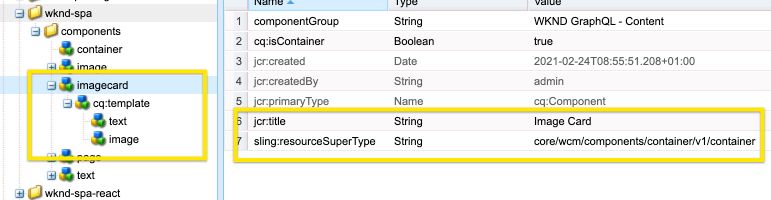
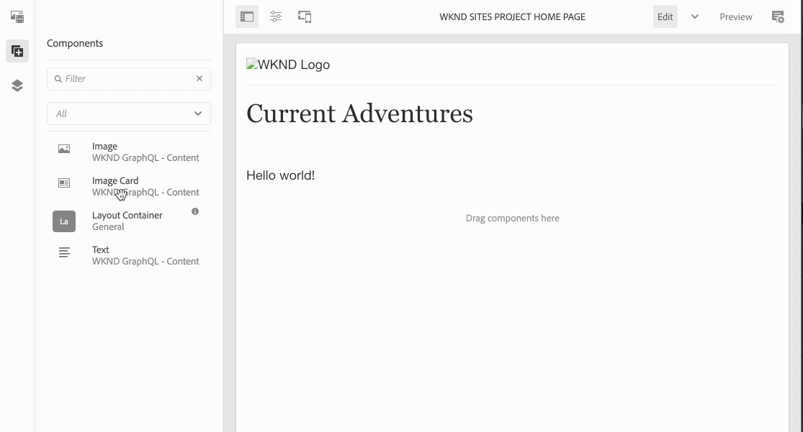
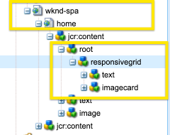

# Composite Components in SPAs {#composite-components-in-spas}

Composite components leverage the modular nature of AEM components by combining multiple base components into a single component. A common composite component use case is the card component, made of a combination of the image and text components.

When composite components are properly implemented within the AEM Single Page Application (SPA) Editor framework, the content authors can drag and drop such components as they would any other component, but still have the ability to individually edit each component making up the composite component.

This article demonstrates how you can add a composite component to your single page application to work seamlessly with the AEM SPA Editor.

## Use Case {#use-case}

This article will use the typical card component as its example use case. Cards are a common UI element for many digital experiences and are typically made up of an image and associated text or caption. An author wants to be able to drag-and-drop the whole card, but be able to individually edit the card's image as well as customize the associated text.

## Prerequisites {#prerequisites}

The following models for supporting the composite component use cases require the following prerequisites.

* Your AEM development instance is running locally on port 4502 with a sample project.
* You have a working external React app [enabled for editing in AEM.](editing-external-spa.md)
* The React app is loaded in the AEM editor [using the RemotePage component.](remote-page.md)

## Adding Composite Components to a SPA {#adding-composite-components}

There are three different models for implementing your composite component depending on your SPA implementation within AEM.

* [The component does not exist in your AEM project.](#component-does-not-exist)
* [The component exists in your AEM project but its required content does not.](#content-does-not-exist)
* [The component and its required content both exist in your AEM project.](#both-exist)

The following sections give examples of implementing each case using the card component as an example.

### The component does not exist in your AEM project. {#component-does-not-exist}

Start by creating the components that will make up the composite component, i.e. components for the image and its text.

1. Create the text component in your AEM project.
1. Add the corresponding `resourceType` from the project in the component's `editConfig` node.

   ```text
    resourceType: 'wknd-spa/components/text' 
   ```

1. Use the `withMappable` helper to enable editing for the component.

   ```text
   export const AEMText = withMappable(Text, TextEditConfig); 
   ```

The text component will be similar to the following.

```javascript
import React from 'react';
import { withMappable } from '@adobe/aem-react-editable-components';

export const TextEditConfig = {
  emptyLabel: 'Text',
  isEmpty: function(props) {
    return !props || !props.text || props.text.trim().length < 1;
  },
  resourceType: 'wknd-spa/components/text'
};

export const Text = ({ cqPath, richText, text }) => {
  const richTextContent = () => (
    <div className="aem_text"
      id={cqPath.substr(cqPath.lastIndexOf('/') + 1)}
      data-rte-editelement
      dangerouslySetInnerHTML={{__html: text}} />
  );
  return richText ? richTextContent() : (
     <div className="aem_text">{text}</div>
  );
};

export const AEMText = withMappable(Text, TextEditConfig);
```

If you create an image component in a similar way, you can then combine it with the `AEMText` component into a new card component, using the image and text components as children.

```javascript
import React from 'react';
import { AEMText } from './AEMText';
import { AEMImage } from './AEMImage';

export const AEMCard = ({ pagePath, itemPath}) => (
  <div>
    <AEMText
       pagePath={pagePath}
       itemPath={`text`} />
    <AEMImage
       pagePath={pagePath}
       itemPath={`image`} />
   </div>
);
```

This resulting composite component can now be placed anywhere in the app and the will add placeholders for a text and an image component in the SPA Editor. In the sample below, the card component is added to the home component below the title.

```javascript
function Home() {
  return (
    <div className="Home">
      <h2>Current Adventures</h2>
      <AEMCard
        pagePath='/content/wknd-spa/home' />
    </div>
  );
}
```

This will display an empty placeholder for a text and an image in the editor. When entering values for these using the editor, they are stored at the specified page path i.e `/content/wknd-spa/home`  at the root level with the names specified in `itemPath`.


### The component exists in your AEM project but its required content does not. {#content-does-not-exist}

In this case, the card component is already created in your AEM project containing title and image nodes. The child nodes (text and image) have the corresponding resource types.

   

You can then add it to your SPA and retrieve its content.

1. Create a corresponding component in the SPA for this. Ensure that the child components are mapped to their corresponding AEM resource types within the SPA project. In this example we use the same `AEMText` and `AEMImage` components as detailed [in the previous case.](#component-does-not-exist)

   ```javascript
   import React from 'react';
   import { Container, withMappable, MapTo } from '@adobe/aem-react-editable-components';
   import { Text, TextEditConfig } from './AEMText';
   import Image, { ImageEditConfig } from './AEMImage';

   export const AEMCard = withMappable(Container, {
     resourceType: 'wknd-spa/components/imagecard'
   });

   MapTo('wknd-spa/components/text')(Text, TextEditConfig);
   MapTo('wknd-spa/components/image')(Image, ImageEditConfig);
   ```

1. Since there is no content for the `imagecard` component, add the card to the page. Include the existing container from AEM in the SPA.
   * If there is a container already in the AEM project, we can include this in the SPA instead and add the component to the container from AEM instead.
   * Ensure the card component is mapped to the corresponding resource type in the SPA.

   ```javascript
   <ResponsiveGrid
    pagePath='/content/wknd-spa/home'
    itemPath='root/responsivegrid' />
   ```

1. Add the created `wknd-spa/components/imagecard` component to the allowed components for the container component [in the page template.](/help/sites-cloud/authoring/features/templates.md)

Now the `imagecard` component can be directly added to the container in the AEM editor.



### The component and its required content both exist in your AEM project. {#both-exist}

If the content exists in AEM, it can be directly included in the SPA by providing the path to the  content.

```javascript
<AEMCard
    pagePath='/content/wknd-spa/home'
    itemPath='root/responsivegrid/imagecard' />
```



The `AEMCard` component is the same as defined [in the previous use case.](#content-does-not-exist) Here the content defined in the above location in the AEM project is included in the SPA.
