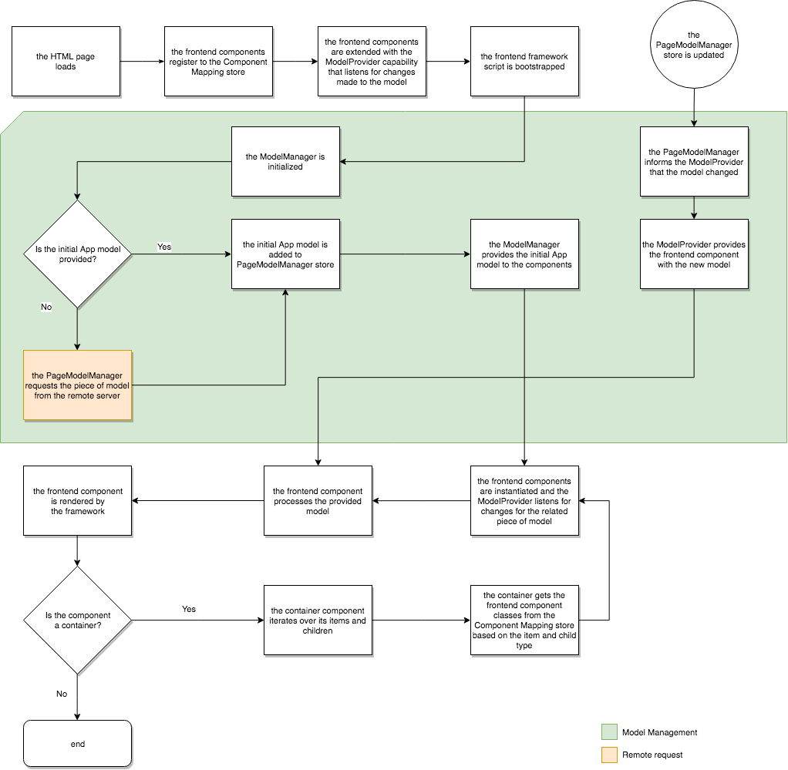

# Dynamic Model to Component Mapping for SPAs{#dynamic-model-to-component-mapping-for-spas}

This document describes how the dynamic model to component mapping occurs in the Javascript SPA SDK for AEM.

>[!NOTE]
>The Single-Page Application (SPA) Editor feature requires AEM 6.4 service pack 2 or newer.
>
>The SPA Editor is the recommended solution for projects that require SPA framework based client-side rendering (e.g. React or Angular).

## ComponentMapping Module {#componentmapping-module}

The `ComponentMapping` module is provided as an NPM package to the front-end project. It stores front-end components and provides a way for the Single Page Application to map front-end components to AEM resource types. This enables a dynamic resolution of components when parsing the JSON model of the application.

Each items present in the model contains a `:type` field that exposes an AEM resource type. When mounted, the front-end component can render itself using the fragment of model it has received from the underlying libraries.

Please refer to the [SPA Blueprint](/help/sites-developing/spa-blueprint.md) document for more information about model parsing and the front-end component access to the model.

Also see the npm package: [https://www.npmjs.com/package/@adobe/cq-spa-component-mapping](https://www.npmjs.com/package/@adobe/cq-spa-component-mapping)

## Model-Driven Single Page Application {#model-driven-single-page-application}

Single Page Applications leveraging the Javascript SPA SDK for AEM are model-driven:

1. Front-end components register themselves to the [Component Mapping Store](/help/sites-developing/spa-dynamic-model-to-component-mapping.md#componentmapping-module).
1. Then the [Container](/help/sites-developing/spa-blueprint.md#container), once provided with a model by the [Model Provider](/help/sites-developing/spa-blueprint.md#the-model-provider), iterates over its model content ( `:items`).

1. In the case of a page, its children ( `:children`) first get a component class from the [Component Mapping](/help/sites-developing/spa-blueprint.md#componentmapping) and then instantiate it.

## App Initialization {#app-initialization}

Each component is extended with the capabilities of the [ `ModelProvider`](/help/sites-developing/spa-blueprint.md#the-model-provider). Initialization therefore take the following general form:

1. Each model provider initializes itself and listens for changes made to the piece of model that corresponds to its inner component. 
1. The [ `PageModelManager`](/help/sites-developing/spa-blueprint.md#pagemodelmanager) must be initialized as represented by the [initialization flow](/help/sites-developing/spa-blueprint.md). 

1. Once stored, the page model manager returns the complete model of the app. 
1. This model is then passed to the front-end root [Container](/help/sites-developing/spa-blueprint.md#container) component of the application. 
1. Pieces of the model are finally propagated to each individual child component.

