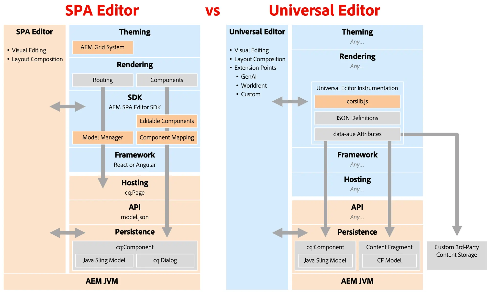

# SPA Editor Deprecation {#spa-editor-deprecation}

Though the SPA Editor remains supported by Adobe, learn what its deprecation means to your project and what options you have for future projects.

## Summary {#summary}

Adobe deprecated the SPA Editor with [release 6.5.23 of AEM 6.5,](/help/release-notes/release-notes.md#spa-editor) meaning that no further enhancements or updates will be made to its SDKs. Adobe encourages you to use the [Universal Editor](/help/sites-developing/universal-editor/introduction.md) for any new headless projects in order to take advantage of AEM’s latest innovations.

## Details of Deprecation {#details}

The deprecation of the SPA Editor **does not mean immediate removal**, and if you have existing implementations, **you can continue using it as long as it meets your needs.** However, please be aware of the following implications of its deprecation.

* Going forward Adobe will only address P1 and P2 issues and security vulnerabilities.
* No further developments, enhancements, or updates will be made to its SDKs.

The deprecation means that the following SDKs are now in feature freeze.

* [AEM Project Archetype](https://github.com/adobe/aem-project-archetype/)
* [AEM SPA Project Core](https://github.com/adobe/aem-spa-project-core)
* [AEM SPA Page Model Manager](https://github.com/adobe/aem-spa-page-model-manager)
* [AEM SPA Component Mapping](https://github.com/adobe/aem-spa-component-mapping)
* [AEM SPA React Editable Components](https://github.com/adobe/aem-react-editable-components)
  * [AEM React Core Components](https://github.com/adobe/aem-react-core-wcm-components)
  * [AEM React Core Components Base](https://github.com/adobe/aem-react-core-wcm-components-base)
  * [AEM React Core Components SPA](https://github.com/adobe/aem-react-core-wcm-components-spa)
  * [AEM React Core Components Examples](https://github.com/adobe/aem-react-core-wcm-components-examples)
* [AEM SPA Angular Editable Components](https://github.com/adobe/aem-angular-editable-components)
  * [AEM Angular Core Components](https://github.com/adobe/aem-angular-core-wcm-components)
  * [AEM Angular Core Components Base](https://github.com/adobe/aem-angular-core-wcm-components-base)
  * [AEM Angular Core Components SPA](https://github.com/adobe/aem-angular-core-wcm-components-spa)
  * [AEM Angular Core Components Examples](https://github.com/adobe/aem-angular-core-wcm-components-examples)
* [AEM SPA Vue Editable Components](https://github.com/mavicellc/aem-vue-editable-components)

## Alternatives to the SPA Editor {#alternatives}

The most suitable replacement for the SPA Editor depends on your projects needs.

* **[The Universal Editor](/help/sites-developing/universal-editor/introduction.md)** is the best direct replacement for the SPA Editor.
  * The Universal Editor is also a visual editor and was designed specifically for decoupled implementations, incorporating all of Adobe's experience from the SPA Editor.
  * The Universal Editor has also been [released for AEM as a Cloud Service](https://experienceleague.adobe.com/en/docs/experience-manager-cloud-service/content/implementing/developing/universal-editor/introduction) and therefore supports AMS and on-prem use-cases in addition to Cloud Services.
* **[The Content Fragment Editor](/help/sites-developing/universal-editor/introduction.md)** is an alternative for those who prefer a form-based editor.
  * The Content Fragment Editor is best suited when your content is structured as Content Fragments rather than as pages.

Structuring content with Content Fragments does not exclude the use of the Universal Editor as a visual editor, and both editors can be used together.

## Migrating to the Universal Editor {#migrate-ue}

The Universal Editor offers many advantages, making migration to it a great solution for new projects.

* **Visual Editing:** Like for the SPA Editor, authors can edit content directly within the preview and instantly see how their changes affect the visitor experience.
* **Future-Proofing:** AEM’s roadmap prioritizes the Universal Editor as visual editor. Adopting it ensures access to the latest innovations and enhancements.
* **Simpler Integration:** No AEM-specific SDK is required to use the Universal Editor, reducing tech stack lock-in.
* **Bring Your Own App:** The Universal Editor supports any web framework or architecture, allowing adoption without requiring complex refactoring.
* **Extensibility:** The Universal Editor benefits from a robust [extension framework,](https://experienceleague.adobe.com/en/docs/experience-manager-cloud-service/content/implementing/developing/universal-editor/extending) including integrations with GenAI, Workfront, and more.

There is no direct migration path from the SPA Editor to the Universal Editor. This is due to fundamental differences in the two technologies.

* The Universal Editor does not reintroduce features like the Template Editor, Style System, or Responsive Grid. 
  * These use cases can now be handled more efficiently with lean frontend CSS and JS in Edge Delivery Services or headless projects.
* Since the  Universal Editor is an editor-as-a-service, it cannot allow implementors to inject CSS or JS into the component dialogs.
  * This prevents automatic conversion of component dialogs from the Page Editor.
  * This affects many areas of the dialogs, like custom widgets, field validation, show/hide rules, and template-based customizations.

With these technical differences in mind, Adobe's recommendation is to:

* Keep existing SPA Editor sites as they are, since support continues.
* Adopt the Universal Editor for all new developments, including new sites, sections, or pages.

Keep in mind that even though there is no direct implementation of certain SPA Editor features in the Universal Editor, there are new ways to solve the same problems using the new flexibility of the Universal Editor.

## Comparing the SPA Editor and the Universal Editor {#spa-vs-ue}

The Universal Editor offers much more freedom to implementers of web apps, as illustrated in this diagram.

||SPA Editor|Universal Editor|
|---|---|---|
|**Theming**|App must implement layout with AEM's grid CSS.|App can use any modern CSS technique for layout.|
|**Rendering**|App must follow SPA Editor's routing structure.|App can be implemented freely, without imposed rules or patterns to follow.|
|**SDK**|Implementation must tightly integrate the SDK.|On author tier, app just loads `corlib.js` and instructs the Universal Editor via HTML annotations.|
|**Framework**|App must use a supported version of React or Angular.|App can use any framework or architecture.|
|**Hosting**|App must be hosted on AEM's domain.|App can be fully decoupled and hosted anywhere.|
|**API**|App must retrieve content from the `model.json` API.|App can use any APIs including custom ones.|
|**Persistence**|SPA Editor only supports page content for visual editing.|Universal Editor natively supports visual editing of pages and Content Fragments.|
|||Universal Editor can be extended to edit external content with the same visual capabilities.|
||Developers must deploy Sling Models and `cq:Dialog`s in AEM.|Developers need little to no AEM experience and they don't need to write any Java.|
