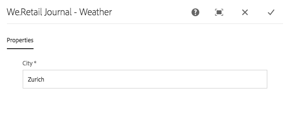
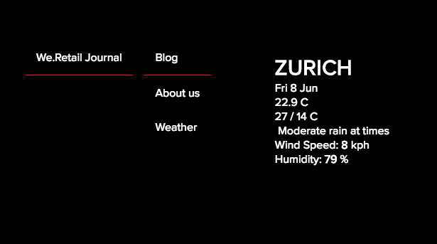

# Implementing a React Component for SPA{#implementing-a-react-component-for-spa}

Single page applications (SPAs) can offer compelling experiences for website users. Developers want to be able to build sites using SPA frameworks and authors want to seamlessly edit content within Adobe Experience Manager (AEM) for a site built using SPA frameworks.

The SPA authoring feature offers a comprehensive solution for supporting SPAs within AEM. This article presents an example of how to adapt a simple, existing React component to work with the AEM SPA Editor.

{{#ue-over-spa}}

## Introduction {#introduction}

Thanks to the simple and lightweight contract that is required by AEM and established between the SPA and the SPA Editor, taking an existing JavaScript application and adapting it for use with an SPA in AEM is a straightforward matter.

This article illustrates the example of the weather component on the We.Retail Journal sample SPA.

You should be familiar with the [structure of an SPA application for AEM](/help/sites-developing/spa-getting-started-react.md) before reading this article.

>[!CAUTION]
>This document uses the [We.Retail Journal app](https://github.com/adobe/aem-sample-we-retail-journal) for demonstration purposes only. Do not use it for any project work.
>
>Any AEM project should use the [AEM Project Archetype](https://experienceleague.adobe.com/docs/experience-manager-core-components/using/developing/archetype/overview.html), which supports SPA projects using React or Angular and uses the SPA SDK.

## The Weather Component {#the-weather-component}

The weather component is found in the top-left of the We.Retail Journal app. It displays the current weather of a defined location, pulling weather data dynamically.

### Using the Weather Widget {#using-the-weather-widget}


When authoring content of the SPA in the SPA Editor, the weather component appears as any other AEM component, complete with a toolbar, and is editable.


The city can be updated in a dialog just like any other AEM component.



The change is persisted and the component updates itself automatically with new weather data.



### Weather Component Implementation {#weather-component-implementation}

The weather component is based on a publicly available React component, called [React Open Weather](https://www.npmjs.com/package/react-open-weather). It has been adapted to work as a component within the We.Retail Journal sample SPA application.

The following are snippets of the NPM documentation of the usage of the React Open Weather component.

 

Reviewing the code of the customized weather component ( `Weather.js`) in the We.Retail Journal application:

* **Line 16**: The React Open Weather widget is loaded as required.
* **Line 46**: The `MapTo` function relates this React component to a corresponding AEM component so that it can be edited in the SPA Editor.

* **Lines 22-29**: The `EditConfig` is defined, checking if the city has been populated and defining the value if empty.

* **Lines 31-44**: The Weather component extends the `Component` class and provides the required data as defined in the NPM usage documentation for the React Open Weather component and renders the component.

```javascript
/*~~~~~~~~~~~~~~~~~~~~~~~~~~~~~~~~~~~~~~~~~~~~~~~~~~~~~~~~~~~~~~~~~~~~~~~~~~~~~~
 ~ Copyright 2018 Adobe Systems Incorporated
 ~
 ~ Licensed under the Apache License, Version 2.0 (the "License");
 ~ you may not use this file except in compliance with the License.
 ~ You may obtain a copy of the License at
 ~
 ~     https://www.apache.org/licenses/LICENSE-2.0
 ~
 ~ Unless required by applicable law or agreed to in writing, software
 ~ distributed under the License is distributed on an "AS IS" BASIS,
 ~ WITHOUT WARRANTIES OR CONDITIONS OF ANY KIND, either express or implied.
 ~ See the License for the specific language governing permissions and
 ~ limitations under the License.
 ~~~~~~~~~~~~~~~~~~~~~~~~~~~~~~~~~~~~~~~~~~~~~~~~~~~~~~~~~~~~~~~~~~~~~~~~~~~~~*/
import React, {Component} from 'react';
import ReactWeather from 'react-open-weather';
import {MapTo} from '@adobe/aem-react-editable-components';

require('./Weather.css');

const WeatherEditConfig = {

    emptyLabel: 'Weather',

    isEmpty: function() {
        return !this.props || !this.props.cq_model || !this.props.cq_model.city || this.props.cq_model.city.trim().length < 1;
    }
};

class Weather extends Component {

    render() {
        let apiKey = "12345678901234567890";
        let city;

        if (this.props.cq_model) {
            city = this.props.cq_model.city;
            return <ReactWeather key={'react-weather' + Date.now()} forecast="today" apikey={apiKey} type="city" city={city} />
        }

        return null;
    }
}

MapTo('we-retail-journal/global/components/weather')(Weather, WeatherEditConfig);

```

Although a back-end component must already exist, the front-end developer can use the React Open Weather component in the We.Retail Journal SPA with little coding.

## Next Step {#next-step}

For further information about developing SPAs for AEM see the article [Developing SPAs for AEM](/help/sites-developing/spa-architecture.md).
