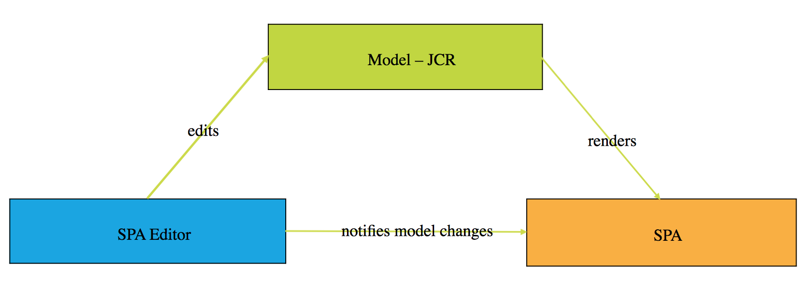
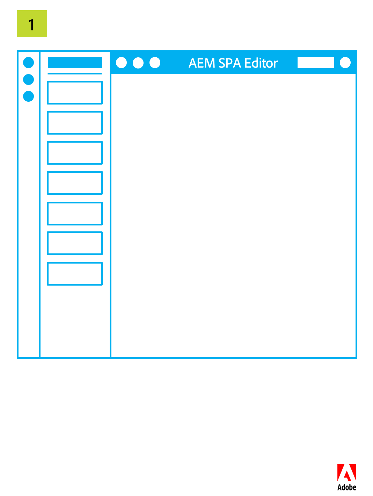
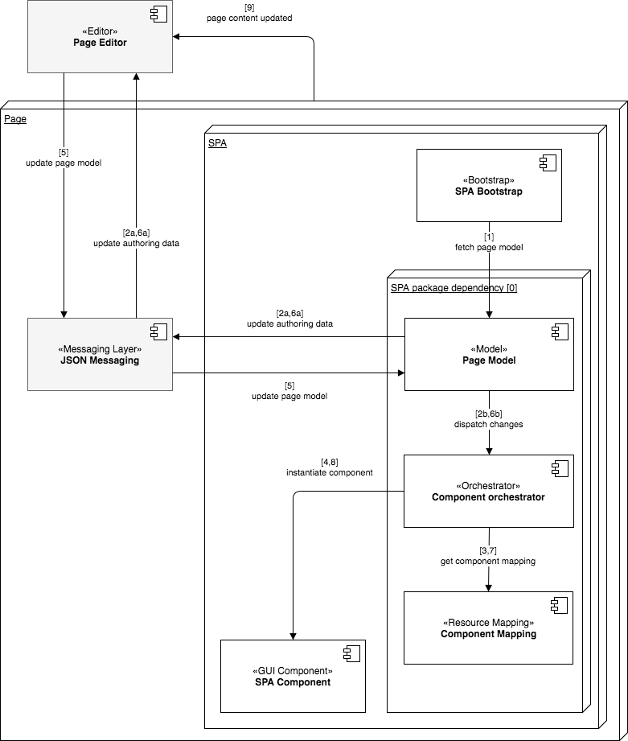

# SPA Editor Overview{#spa-editor-overview}

Single page applications (SPAs) can offer compelling experiences for website users. Developers want to be able to build sites using SPA frameworks and authors want to seamlessly edit content within AEM for a site built using such frameworks.

The SPA Editor offers a comprehensive solution for supporting SPAs within AEM. This page gives an overview of how SPA support is structured in AEM, how the SPA Editor works, and how the SPA framework and AEM keep in synch.

{{ue-over-spa}}

## Introduction {#introduction}

Sites built using common SPA frameworks such as React and Angular load their content via dynamic JSON and do not provide the HTML structure that is necessary for the AEM Page Editor to be able to place edit controls.

To enable the editing of SPAs within AEM, a mapping between the JSON output of the SPA and the content model in the AEM repository is needed to save changes to the content.

SPA support in AEM introduces a thin JS layer that interacts with the SPA JS code when loaded in the Page Editor with which events can be sent and the location for the edit controls can be activated to allow in-context editing. This feature builds upon the Content Services API Endpoint concept since the content from the SPA needs to be loaded via Content Services.

For further details about SPAs in AEM, see the following documents:

* [SPA Blueprint](/help/sites-developing/spa-blueprint.md) for the technical requirements of an SPA
* [Getting Started with SPAs in AEM](/help/sites-developing/spa-getting-started-react.md) for a quick tour of a simple SPA

## Design {#design}

The page component for a SPA does not provide the HTML elements of its child components via the JSP or HTL file. This operation is delegated to the SPA framework. The representation of child components or model is fetched as a JSON data structure from the JCR. The SPA components are then added to the page according to that structure. This behavior differentiates the page component's initial body composition from non-SPA counterparts.

### Page Model Management {#page-model-management}

The resolution and the management of the page model is delegated to a provided `PageModel` library. The SPA must use the Page Model library to be initialized and be authored by the SPA Editor. The Page Model library provided indirectly to the AEM Page component via the `aem-react-editable-components` npm. The Page Model is an interpreter between AEM and the SPA and therefore always must be present. When the page is authored, an additional library `cq.authoring.pagemodel.messaging` must be added to enable the communication with the page editor.

If the SPA page component inherits from the page core component, there are two options for making the `cq.authoring.pagemodel.messaging` client library category available:

* If the template is editable, add it to the page policy.
* Or add the categories using the `customfooterlibs.html`.

For each resource in the exported model the SPA will map an actual component which will do the
rendering. The model, represented as JSON, are then rendered using the component mappings within a container.

>[!CAUTION]
>
>The inclusion of the `cq.authoring.pagemodel.messaging` category should be limited to the context of the SPA Editor.

### Communication Data Type {#communication-data-type}

When the `cq.authoring.pagemodel.messaging` category is added to the page, it will send a message to the Page Editor to establish the JSON communication data type. When the communication data type is set to JSON, the GET requests will communicate with the Sling Model end-points of a component. After an update occurs in the page editor, the JSON representation of the updated component is sent to the Page Model library. The Page Model library then informs the SPA of updates.

## Workflow {#workflow}

You can understand the flow of the interaction between the SPA and AEM by thinking of the SPA Editor as a mediator between the two.

* The communication between the page editor and the SPA is made using JSON instead of HTML.
* The page editor provides the latest version of the page model to the SPA via the iframe and messaging API.
* The page model manager notifies the editor it is ready for edition and passes the page model as a JSON structure.
* The editor does not alter or even access the DOM structure of the page being authored rather it provides the latest page model.

### Basic SPA Editor Workflow {#basic-spa-editor-workflow}

Keeping in mind the key elements of the SPA Editor, the high-level workflow of editing a SPA within AEM appears to the author as follows.

1. SPA Editor loads.
1. SPA is loaded in a separate frame.
1. SPA requests JSON content and renders components client-side.
1. SPA Editor detects rendered components and generates overlays.
1. Author clicks overlay, displaying the component's edit toolbar.
1. SPA Editor persists edits with a POST request to the server.
1. SPA Editor requests updated JSON to the SPA Editor, which is sent to the SPA with a DOM Event.
1. SPA re-renders the concerned component, updating its DOM.

>[!NOTE]
>
>Keep in mind:
>
>* The SPA is always in charge of its display.
>* The SPA Editor is isolated from the SPA itself.
>* In production (publish), the SPA editor is never loaded.
>

### Client-Server Page Editing Workflow {#client-server-page-editing-workflow}

This is a more detailed overview of the client-server interaction when editing a SPA.

1. The SPA initializes itself and requests the page model from the Sling Model Exporter.
1. The Sling Model Exporter requests the resources that compose the page from the repository.
1. The repository returns the resources.
1. The Sling Model Exporter returns the model of the page.
1. The SPA instantiates its components based on the page model.
1. **6a** The content informs the editor that it is ready for authoring.

   **6b** The page editor requests the component authoring configurations.

   **6c** The page editor receives the component configurations.
1. When the author edits a component, the page editor posts a modification request to the default POST servlet.
1. The resource is updated in the repository.
1. The updated resource is provided to the POST servlet.
1. The default POST servlet informs the page editor that the resource has been updated.
1. The page editor requests the new page model.
1. The resources that compose the page are requested from the repository.
1. The resources that compose the page are provided by the repository to the Sling Model Exporter.
1. The updated page model is returned to the editor.
1. The page editor updates the page model reference of the SPA.
1. The SPA updates its components based on the new page model reference.
1. The component configurations of the page editors are updated.

   **17a** The SPA signals the page editor that content is ready.

   **17b** The page editor provides the SPA with component configurations.

   **17c** The SPA provides updated component configurations.

### Authoring Workflow {#authoring-workflow}

This is a more detailed overview focusing on the authoring experience.

1. The SPA fetches the page model.
1. **2a** The page model provides the editor with the data required for authoring.

   **2b** When notified, the component orchestrator update the content structure of the page.
1. The component orchestrator queries the mapping between an AEM resource type and a SPA component.
1. The component orchestrator dynamically instantiates the SPA component based on the page model and component mapping.
1. The page editor updates the page model.
1. **6a** The page model provides updated authoring data to the page editor.

   **6b** The page model dispatches changes to the component orchestrator.
1. The component orchestrator fetches the component mapping.
1. The component orchestrator updates the content of the page.
1. When the SPA completes updating the content of the page, the page editor loads the authoring environment.

## Requirements & Limitations {#requirements-limitations}

To enable the author to use the page editor to edit the content of an SPA, your SPA application must be implemented to interact with the AEM SPA Editor SDK. See [Getting Started with SPAs in AEM](/help/sites-developing/spa-getting-started-react.md) for the minimum that you need to know to get yours running.

### Supported Frameworks {#supported-frameworks}

The SPA Editor SDK supports the following minimal versions:

* React 16.x and up
* Angular 6.x and up

Previous versions of these frameworks may work with the AEM SPA Editor SDK, but are not supported.

### Additional Frameworks {#additional-frameworks}

Additional SPA frameworks can be implemented to work with the AEM SPA Editor SDK. See the [SPA Blueprint](/help/sites-developing/spa-blueprint.md) for the requirements that a framework must fulfill to create a framework-specific layer composed of modules, components, and services to work with the AEM SPA Editor.

### Using Multiple Selectors {#multiple-selectors}

Additional custom selectors can be defined and used as part of an SPA developed for the AEM SPA SDK. However this support requires that the `model` selector be the first selector and the extension be `.json` as [required by the JSON Exporter.](json-exporter-components.md#multiple-selectors)

### Text Editor Requirements {#text-editor-requirements}

If you want to use the in place editor of a text component created in SPA there is additional configuration required.

1. Set an attribute (it can be any) on the container wrapper element containing the text HTML. If there is the WKND Journal sample content, it is a `
` element and the selector that has been used is `data-rte-editelement`.
1. Set the configuration `editElementQuery` on the corresponding AEM text component's `cq:InplaceEditingConfig` that points to that selector for example, `data-rte-editelement`. This lets the editor know which HTML element wraps the HTML text.

For an example of how this is done, see the [WKND Journal sample content.](https://github.com/adobe/aem-sample-we-retail-journal/pull/16/files)

For additional information about the `editElementQuery` property and the configuration of the rich text editor, see [Configure the Rich Text Editor.](/help/sites-administering/rich-text-editor.md)

### Limitations {#limitations}

The AEM SPA Editor SDK was introduced with AEM 6.4 service pack 2. It is fully supported by Adobe, and it continues to be enhanced and expanded. The following AEM features are not yet supported by the SPA Editor:

* Target mode
* ContextHub
* Inline image editing
* Edit configs (eg. listeners)
* Undo / Redo
* Page diff and Time Warp
* Features performing HTML rewriting server-side such as Link Checker, CDN rewriter service, URL shortening, and so on.
* Developer mode
* AEM Launches
