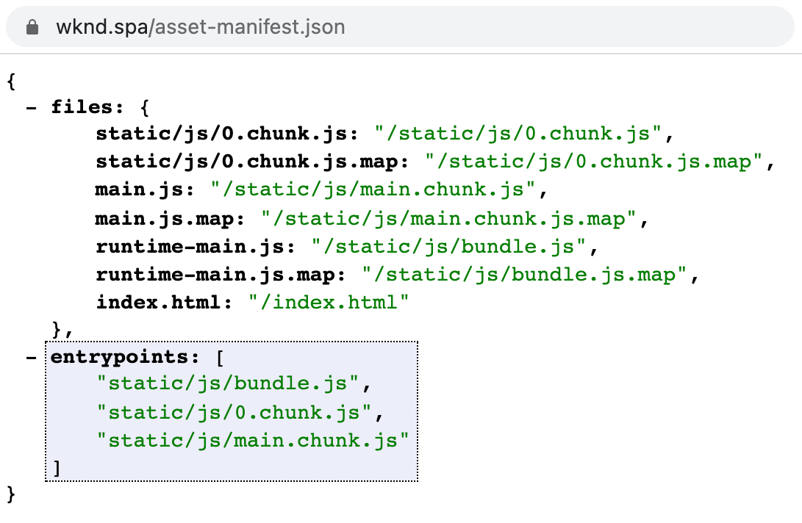

# The RemotePage Component {#remote-page-component}

When deciding what level of integration you would like to have between your external SPA and AEM, it is often clear that you need to be able to view and edit the SPA within AEM. The RemotePage Component is a custom page component just for this purpose.

{{#ue-over-spa}}

## Overview {#overview}

The RemotePage component fetches all the necessary assets from the application's generated `asset-manifest.json` and uses this for rendering the SPA within AEM.

* The RemotePage lets you inject the scripts and stylesheets of a SPA in the body of an AEM Page component.
* The Virtual Frontend Components lets you mark sections as editable in AEM SPA Editor.
* Together, a SPA hosted on a different domain can be made editable in AEM.

See the article [Editing an External SPA within AEM](spa-edit-external.md) for more details on editable, external SPAs in AEM.

## Requirements {#requirements}

* Enable CORS in development
* Configure remote URL in Page Properties
* Render the SPA in AEM
* The web application must use a bundler asset manifest like one of the following, and expose an asset-manifest.json file at the domain root that lists in an entrypoints property all CSS and JS files that are to be loaded:
  * https://github.com/shellscape/webpack-manifest-plugin
  * https://github.com/webdeveric/webpack-assets-manifest
  * https://github.com/mugi-uno/parcel-plugin-bundle-manifest

  

* The application must be able to initialize in a `

` underneath the body element. If a different markup is expected for the app to instantiate, then this must be adjusted accordingly in the HTL scripts of the proxy component that has a `sling:resourceSuperType="spa-project-core/components/remotepage`.

## Limitations {#limitations}

* The RemotePage component expects that the implementation provides an asset-manifest like the one [found here.](https://github.com/shellscape/webpack-manifest-plugin) The RemotePage component, however, has only been tested to work with the React framework (and Next.js via the remote-page-next component), and therefore does not support remotely loading applications from other frameworks, such as Angular.
* Internal CSS defined in the application's root HTML file and inline CSS on the root DOM node will not be available when doing remote rendering in AEM.

## Technical Details {#technical-details}

Like the rest of the AEM SPA project, the RemotePage Component is open source. For the full technical details of the RemotePage Component, [see the GitHub repository.](https://github.com/adobe/aem-spa-project-core/tree/master/ui.apps/src/main/content/jcr_root/apps/spa-project-core/components/remotepage)
