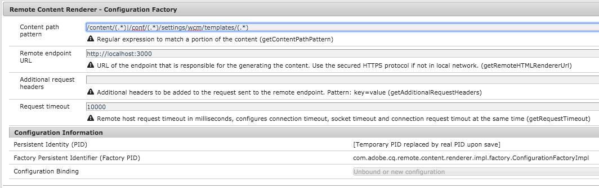

# SPA and Server-Side Rendering{#spa-and-server-side-rendering}

>[!NOTE]
>
>The SPA Editor is the recommended solution for projects that require SPA framework based client-side rendering (e.g. React or Angular).

>[!NOTE]
>
>AEM 6.5.1.0 or later is required to use the SPA server side rendering features as described in this document.

## Overview {#overview}

Single page applications (SPAs) can offer the user a rich, dynamic experience that reacts and behaves in familiar ways, often just like a native application. [This is achieved by relying on the client to load the content up front and then do the heavy lifting of handling user interaction](/help/sites-developing/spa-walkthrough.md#how-does-a-spa-work) and thus minimizing the amount of communication needed between the client and the server, making the app more reactive.

However this can lead to longer initial load times, especially if the SPA is large and rich in its content. In order to optimize load times, some of the content can be rendered server-side. Using server side rendering (SSR) can accelerate the initial load of the page and then pass further rendering on to the client.

## When to Use SSR {#when-to-use-ssr}

SSR is not required on all projects. Although AEM fully supports JS SSR for SPA, Adobe does not recommend implementing it systematically for every project.

When deciding to implement SSR you must first estimate what additional complexity, effort, and cost adding SSR realistically represents for the project, including the long term maintenance. An SSR architecture should be chosen only when the added value clearly exceeds the estimated costs.

SSR usually provides some value when there is a clear "yes" to either of the following questions:

* **SEO:** Is SSR still actually required for your site to be properly indexed by the search engines that bring traffic? Keep in mind that the main search engine crawlers now evaluate JS.
* **Page Speed:** Does SSR provide a measurable speed improvement in real-life environments and add to the overall user experience?

Only when at least one of these two questions are answered with a clear "yes" for your project does Adobe recommend implementing SSR. The following sections describe how to do this using Adobe I/O Runtime.

## Adobe I/O Runtime {#adobe-i-o-runtime}

If you [are confident that your project requires the implementation of SSR](/help/sites-developing/spa-ssr.md#when-to-use-ssr), Adobe's recommended solution is to use Adobe I/O Runtime.

For more information on Adobe I/O Runtime, please see

* [https://www.adobe.io/apis/experienceplatform/runtime.html](https://www.adobe.io/apis/experienceplatform/runtime.html) - for an overview of the service
* [https://www.adobe.io/apis/experienceplatform/runtime/docs.html](https://www.adobe.io/apis/experienceplatform/runtime/docs.html) - for detailed documentation on the platform

The following sections detail how Adobe I/O Runtime can be used to implement SSR for your SPA in two different models:

* [AEM-Driven Communication Flow](/help/sites-developing/spa-ssr.md#aem-driven-communication-flow)
* [Adobe I/O Runtime-Driven Communication Flow](/help/sites-developing/spa-ssr.md#adobe-i-o-runtime-driven-communication-flow)

>[!NOTE]
>
>Adobe recommends a separate Adobe I/O Runtime workspace per environment (stage, prod, testing, etc.). This allows for typical systems development life cycle (SDLC) patterns with different versions of a single application deployed to different environments. See the document [CI/CD for Project App Builder Applications](https://developer.adobe.com/app-builder/docs/guides/deployment/ci_cd_for_firefly_apps/) for more information.
>
>A separate workspace is not needed per instance (author, publish) unless there are differences in the runtime implementation per instance type.

## Remote Renderer Configuration {#remote-renderer-configuration}

AEM must know where the remotely-rendered content can be retrieved. Regardless of [which model you choose to implement for SSR,](#adobe-i-o-runtime) you will need to specify to AEM how to access this remote rendering service.

This is done via the **RemoteContentRenderer - Configuration Factory OSGi service**. Search for the string "RemoteContentRenderer" in the Web Console Configuration console at `http://<host>:<port>/system/console/configMgr`.



The following fields are available for the configuration:

* **Content path pattern** - Regular expression in order to match a portion of the content, if necessary
* **Remote endpoint URL** - URL of the endpoint that is responsible for generating the content
  * Use the secured HTTPS protocol if not in local network.
* **Additional request headers** - Additional headers to be added to the request sent to the remote endpoint
  * Pattern: `key=value`
* **Request timeout** - Remote host request timeout in milliseconds

>[!NOTE]
>
>Regardless of if you choose to implement the [AEM-driven communication flow](#aem-driven-communication-flow) or the [Adobe I/O Runtime-driven flow,](#adobe-i-o-runtime-driven-communication-flow) you must define a remote content renderer configuration.
>
>This configuration also must be defined if you choose to [use a custom Node.js server.](#using-node-js)

>[!NOTE]
>
>This configuration leverages the [Remote Content Renderer,](#remote-content-renderer) which has additional extension and customization options available.

## AEM-Driven Communication Flow {#aem-driven-communication-flow}

When using SSR, the [component interaction workflow](/help/sites-developing/spa-overview.md#workflow) of SPAs in AEM includes a phase in which the initial content of the app is generated on Adobe I/O Runtime.

1. The browser requests the SSR content from AEM.

1. AEM posts the model to Adobe I/O Runtime.

1. Adobe I/O Runtime returns the generated content.

1. AEM serves the HTML returned by Adobe I/O Runtime via the HTL template of the backend page component.


## Adobe I/O Runtime-Driven Communication Flow {#adobe-i-o-runtime-driven-communication-flow}

The previous section describes the standard and recommended implementation of server side rendering with regards to SPAs in AEM, where AEM performs the bootstrapping and serving of content.

Alternatively, SSR can be implemented so that Adobe I/O Runtime is responsible for the bootstrapping, effectively reversing the communication flow.

Both models are valid and supported by AEM. However, one should consider the advantages and disadvantages of each before implementing a particular model.

<table>
 <tbody>
  <tr>
   <th><strong>Bootstrapping</strong></th>
   <th><strong>Advantages</strong></th>
   <th><strong>Disadvantages</strong></th>
  </tr>
  <tr>
   <th><strong>via AEM</strong><br /> </th>
   <td>
    <ul>
     <li>AEM manages injecting libraries where needed</li>
     <li>Resources only need to be maintained on AEM<br /> </li>
    </ul> </td>
   <td>
    <ul>
     <li>Possibly unfamiliar to SPA developer<br /> </li>
    </ul> </td>
  </tr>
  <tr>
   <th><strong>via Adobe I/O Runtime<br /> </strong></th>
   <td>
    <ul>
     <li>More familiar to SPA developers<br /> </li>
    </ul> </td>
   <td>
    <ul>
     <li>Clientlib resources required by the application such as CSS and JavaScript will need to be made available by the AEM developer via the <code><a href="/help/sites-developing/clientlibs.md#locating-a-client-library-folder-and-using-the-proxy-client-libraries-servlet">allowProxy</a></code> property<br /> </li>
     <li>Resources must be synched between AEM and Adobe I/O Runtime<br /> </li>
     <li>To enable authoring of the SPA, a proxy server for Adobe I/O Runtime may be necessary</li>
    </ul> </td>
  </tr>
 </tbody>
</table>

## Planning for SSR {#planning-for-ssr}

Generally only part of an application needs to be rendered server side. The common example is the content that will be displayed above the fold on the initial load of the page is rendered server side. This saves time by delivering to the client, already rendered content. As the user interacts with the SPA, the additional content is rendered by the client.

As you consider implementing server side rendering for your SPA, you need to review for what parts of the app it will be necessary.

## Developing an SPA using SSR {#developing-an-spa-using-ssr}

SPA components could be rendered by the client (in the browser) or server side. When rendered server side, browser properties such as window size and location are not present. Therefore SPA components should be isomorphic, making no assumption about where they will be rendered.

To leverage SSR, you will need to deploy your code in AEM as well as on Adobe I/O Runtime, which is responsible for the server side rendering. Most of the code will be the same, however server-specific tasks will differ.

## SSR for SPAs in AEM {#ssr-for-spas-in-aem}

SSR for SPAs in AEM require Adobe I/O Runtime, which is called for the rendering of the app content server side. Within the HTL of the app, a resource on Adobe I/O Runtime is called to render the content.

Just as AEM supports the Angular and React SPA frameworks out-of-the box, server side rendering is also supported for Angular and React apps. See the NPM documentation for both frameworks for further details.

* React: [https://github.com/adobe/aem-sample-we-retail-journal/blob/master/react-app/DEVELOPMENT.md#enabling-the-server-side-rendering-using-the-aem-page-component](https://github.com/adobe/aem-sample-we-retail-journal/blob/master/react-app/DEVELOPMENT.md#enabling-the-server-side-rendering-using-the-aem-page-component)
* Angular: [https://github.com/adobe/aem-sample-we-retail-journal/blob/master/angular-app/DEVELOPMENT.md#enabling-the-server-side-rendering-using-the-aem-page-component](https://github.com/adobe/aem-sample-we-retail-journal/blob/master/angular-app/DEVELOPMENT.md#enabling-the-server-side-rendering-using-the-aem-page-component)

For a simplistic example, please refer to the [We.Retail Journal app](https://github.com/Adobe-Marketing-Cloud/aem-sample-we-retail-journal). It renders the entire application server side. Although this is not a real-world example, it does illustrate what is needed to implement SSR.

>[!CAUTION]
>
>The [We.Retail Journal app](https://github.com/Adobe-Marketing-Cloud/aem-sample-we-retail-journal) is for demonstration purposes only and therefore uses Node.js as a simple example instead of the recommended Adobe I/O Runtime. This example should not be used for any project work.

>[!NOTE]
>
>Any AEM project should leverage the [AEM Project Archetype](https://experienceleague.adobe.com/docs/experience-manager-core-components/using/developing/archetype/overview.html), which supports SPA projects using React or Angular and leverages the SPA SDK.

## Using Node.js {#using-node-js}

Adobe I/O Runtime is the recommended solution for implementing SSR for SPAs in AEM.

For on-premesis AEM instances, it is also possible to implement SSR using a custom Node.js instance in the same way as described above. Although this is supported by Adobe, it is not recommended.

>[!NOTE]
>
>Node.js is not supported for Adobe-hosted AEM instances.

>[!NOTE]
>
>If SSR must be implemented via Node.js, Adobe recommends a separate Node.js instance for every AEM environment (author, publish, stage, etc.).

## Remote Content Renderer {#remote-content-renderer}

The [Remote Content Renderer Configuration](#remote-content-renderer-configuration) that is required to use SSR with your SPA in AEM taps into a more generalized rendering service that can be extended and customized to meet your needs.

### RemoteContentRenderingService {#remotecontentrenderingservice}

`RemoteContentRenderingService` is an OSGi service to retrieve content rendered on a remote server, such as from Adobe I/O. The content sent to the remote server is based on the request parameter passed.

`RemoteContentRenderingService` can be injected by dependency inversion into either a custom Sling model or servlet when additional content manipulation is required.

This service is internally used by the [RemoteContentRendererRequestHandlerServlet](#remotecontentrendererrequesthandlerservlet).

### RemoteContentRendererRequestHandlerServlet {#remotecontentrendererrequesthandlerservlet}

The `RemoteContentRendererRequestHandlerServlet` can be used to programmatically set the request configuration. `DefaultRemoteContentRendererRequestHandlerImpl`, the provided default request handler implementation, allows you to create multiple OSGi configurations in order to map a location in the content structure to a remote endpoint.

To add a custom request Handler, implement the `RemoteContentRendererRequestHandler` interface. Be sure to set the `Constants.SERVICE_RANKING` component property to an integer higher than 100, which is the ranking of the `DefaultRemoteContentRendererRequestHandlerImpl`.

```
@Component(immediate = true,
        service = RemoteContentRendererRequestHandler.class,
        property={
            Constants.SERVICE_RANKING +":Integer=1000"
        })
public class CustomRemoteContentRendererRequestHandlerImpl implements RemoteContentRendererRequestHandler {}
```

### Configure the OSGi Configuration of the Default Handler {#configure-default-handler}

The configuration of the default handler must be configured as described in the section [Remote Content Renderer Configuration](#remote-content-renderer-configuration).

### Remote Content Renderer Usage {#usage}

To have a servlet fetch and return some content that can be injected into the page:

1. Ensure your remote server is accessible.
1. Add one of the following snippets to the HTL template of an AEM component.
1. Optionally, create or modify the OSGi configurations.
1. Browse the content of your site

Usually, the HTL template of a page component is the main recipient of such a feature.

```
<sly data-sly-resource="${resource @ resourceType='cq/remote/content/renderer/request/handler'}" />
```

### Requirements {#requirements}

The servlets leverage the Sling Model Exporter to serialize the component data. By default, both the `com.adobe.cq.export.json.ContainerExporter` and `com.adobe.cq.export.json.ComponentExporter` are supported as Sling Model adapters. If necessary, you can add classes that the request should be adapted to using the `RemoteContentRendererServlet` and implementing the `RemoteContentRendererRequestHandler#getSlingModelAdapterClasses`. The additional classes must extend the `ComponentExporter`.
