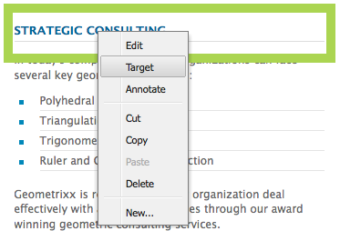
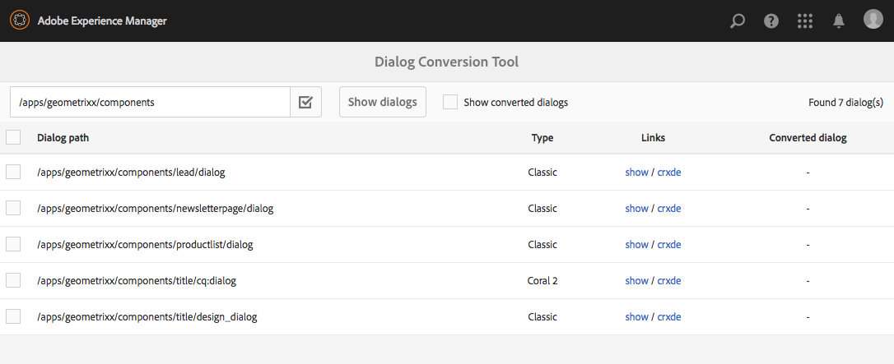

# Developing for Targeted Content{#developing-for-targeted-content}

This section describes topics about developing components for use with content targeting.

* For information about connecting with Adobe Target, see [Integrating With Adobe Target](/help/sites-administering/target.md).
* For information about authoring targeted content, see [Authoring Targeted Content Using Targeting Mode](/help/sites-authoring/content-targeting-touch.md).

>[!NOTE]
>
>When you target a component in AEM author, the component makes a series of server-side calls to Adobe Target to register the campaign, set up offers, and retrieve Adobe Target segments (if configured). No server-side calls are made from AEM publish to Adobe Target.

## Enabling Targeting with Adobe Target On Your Pages {#enabling-targeting-with-adobe-target-on-your-pages}

To use targeted components in your pages that interact with Adobe Target, include specific client-side code in the &lt;head&gt; element.

### The head Section {#the-head-section}

Add both of the following code blocks to the &lt;head&gt; section of your page:

```xml
<!--/* Include Context Hub */-->
<sly data-sly-resource="${'contexthub' @ resourceType='granite/contexthub/components/contexthub'}"/>
```

```xml
<cq:include script="/libs/cq/cloudserviceconfigs/components/servicelibs/servicelibs.jsp"/>
```

This code adds the required analytics javascript objects and loads the cloud service libraries associated with the web site. For Target service, the libraries are loaded via `/libs/cq/analytics/components/testandtarget/headlibs.jsp`

The set of libraries loaded depend on the type of target client library (mbox.js or at.js) used on Target configuration:

**For default mbox.js**

```
<script type="text/javascript" src="/libs/cq/foundation/testandtarget/parameters.js"></script>
 <script type="text/javascript" src="/libs/cq/foundation/testandtarget/mbox.js"></script>
 <script type="text/javascript" src="/libs/cq/foundation/personalization/integrations/commons.js"></script>
 <script type="text/javascript" src="/libs/cq/foundation/testandtarget/util.js"></script>
 <script type="text/javascript" src="/libs/cq/foundation/testandtarget/init.js"></script>
```

**For custom mbox.js**

```
<script type="text/javascript" src="/etc/cloudservices/testandtarget/<CLIENT-CODE>/_jcr_content/public/mbox.js"></script>
        <script type="text/javascript" src="/libs/cq/foundation/testandtarget/parameters.js"></script>
 <script type="text/javascript" src="/libs/cq/foundation/personalization/integrations/commons.js"></script>
 <script type="text/javascript" src="/libs/cq/foundation/testandtarget/util.js"></script>
 <script type="text/javascript" src="/libs/cq/foundation/testandtarget/init.js"></script>
```

**For at.js**

```
<script type="text/javascript" src="/libs/cq/foundation/testandtarget/parameters.js"></script>
 <script type="text/javascript" src="/libs/cq/foundation/testandtarget/atjs-integration.js"></script>
 <script type="text/javascript" src="/libs/cq/foundation/testandtarget/atjs.js"></script>
```

>[!NOTE]
>
>Only the version of `at.js` shipped with the product is supported. The version of `at.js` shipped with the product can be obtained by looking at the `at.js` file at location:
>
>**/libs/cq/testandtarget/clientlibs/testandtarget/atjs/source/at.js**.

**For custom at.js**

```
<script type="text/javascript" src="/etc/cloudservices/testandtarget/<CLIENT-CODE>/_jcr_content/public/at.js"></script>
    <script type="text/javascript" src="/libs/cq/foundation/testandtarget/parameters.js"></script>
 <script type="text/javascript" src="/libs/cq/foundation/testandtarget/atjs-integration.js"></script>
```

The Target functionality on the client side is managed by the `CQ_Analytics.TestTarget` object. Therefore, the page will contain some init code such as in the following example:

```
<script type="text/javascript">
            if ( !window.CQ_Analytics ) {
                window.CQ_Analytics = {};
            }
            if ( !CQ_Analytics.TestTarget ) {
                CQ_Analytics.TestTarget = {};
            }
            CQ_Analytics.TestTarget.clientCode = 'my_client_code';
        </script>
      ...

    <div class="cloudservice testandtarget">
  <script type="text/javascript">
  CQ_Analytics.TestTarget.maxProfileParams = 11;

  if (CQ_Analytics.CCM) {
   if (CQ_Analytics.CCM.areStoresInitialized) {
    CQ_Analytics.TestTarget.registerMboxUpdateCalls();
   } else {
    CQ_Analytics.CCM.addListener("storesinitialize", function (e) {
     CQ_Analytics.TestTarget.registerMboxUpdateCalls();
    });
   }
  } else {
   // client context not there, still register calls
   CQ_Analytics.TestTarget.registerMboxUpdateCalls();
  }
  </script>
 </div>
```

The JSP adds the required analytics javascript objects and references to client-side javascript libraries. The testandtarget.js file contains the mbox.js functions. The HTML that the script generates is similar to the following example:

```xml
<script type="text/javascript">
        if ( !window.CQ_Analytics ) {
            window.CQ_Analytics = {};
        }
        if ( !CQ_Analytics.TestTarget ) {
            CQ_Analytics.TestTarget = {};
        }
        CQ_Analytics.TestTarget.clientCode = 'MyClientCode';
</script>
<link rel="stylesheet" href="/etc/clientlibs/foundation/testandtarget/testandtarget.css" type="text/css">
<script type="text/javascript" src="/etc/clientlibs/foundation/testandtarget/testandtarget.js"></script>
<script type="text/javascript" src="/etc/clientlibs/foundation/testandtarget/init.js"></script>
```

#### The body Section (start) {#the-body-section-start}

Add the following code immediately following the &lt;body&gt; tag to add the client context features to the page:

```xml
<cq:include path="clientcontext" resourceType="cq/personalization/components/clientcontext"/>
```

#### The body Section (end) {#the-body-section-end}

Add the following code immediately before the &lt;/body&gt; end tag:

```xml
<cq:include path="cloudservices" resourceType="cq/cloudserviceconfigs/components/servicecomponents"/>
```

The JSP script of this component generates calls to the Target javascript API and implements other required configurations. The HTML that the script generates is similar to the following example:

```xml

<div class="servicecomponents cloudservices">
  <div class="cloudservice testandtarget">
    <script type="text/javascript">
      CQ_Analytics.TestTarget.maxProfileParams = 11;
      CQ_Analytics.CCM.addListener("storesinitialize", function(e) {
        CQ_Analytics.TestTarget.registerMboxUpdateCalls();
      });
    </script>
    <div id="cq-analytics-texthint" style="background:white; padding:0 10px; display:none;">
      <h3 class="cq-texthint-placeholder">Component clientcontext is missing or misplaced.</h3>
    </div>
    <script type="text/javascript">
      $CQ(function(){
      if( CQ_Analytics &&
          CQ_Analytics.ClientContextMgr &&
          !CQ_Analytics.ClientContextMgr.isConfigLoaded )
        {
          $CQ("#cq-analytics-texthint").show();
        }
      });
    </script>
  </div>
</div>
```

### Using a Custom Target library file {#using-a-custom-target-library-file}

>[!NOTE]
>
>If you are not using DTM or another target marketing system, you can use custom target library files.

>[!NOTE]
>
>By default, mboxes are hidden - the mboxDefault class determines this behavior. Hiding mboxes ensures that visitors do not see the default content before it is swapped; however, hiding mboxes impacts perceived performance.

The default mbox.js file that is used to create mboxes is located at /etc/clientlibs/foundation/testandtarget/mbox/source/mbox.js. To use a customer mbox.js file, add the file to the Target cloud configuration. To add the file, the mbox.js file must be available on the file system.

For example, if you want to use the [Marketing Cloud ID service](https://experienceleague.adobe.com/docs/id-service/using/home.html) you need to download mbox.js so that it contains the correct value for the `imsOrgID` variable, which is based on your tenant. This variable is required for integrating with the Marketing Cloud ID service. For information, see [Adobe Analytics as the Reporting Source for Adobe Target](https://experienceleague.adobe.com/docs/target/using/integrate/a4t/a4t.html) and [Before You Implement](https://experienceleague.adobe.com/docs/target/using/integrate/a4t/before-implement.html).

>[!NOTE]
>
>If a custom mbox is defined in a Target configuration, everyone must have read access to **/etc/cloudservices** on publish servers. Without this access, loading mbox.js files on publish website results in a 404 error.

1. Go to the CQ **Tools** page and select **Cloud Services**. ([https://localhost:4502/libs/cq/core/content/tools/cloudservices.html](https://localhost:4502/libs/cq/core/content/tools/cloudservices.html))
1. In the tree, select Adobe Target, and in the list of configurations, double-click your Target configuration.
1. On the configuration page, click Edit.
1. For the Custom mbox.js property, click Browse and select the file.
1. To apply the changes, enter the password for your Adobe Target account, click Re-connect To Target, and click OK when the connection is successful. Then, click OK on the Edit Component dialog box.

Your Target configuration includes a custom mbox.js file, [the required code in the head section](/help/sites-developing/target.md#p-the-head-section-p) of your page adds the file to the client library framework instead of a reference to the testandtarget.js library.

## Disabling the Target Command for Components {#disabling-the-target-command-for-components}

Most components can be converted to targeted components using the Target command on the context menu.



To remove the Target command from the context menu, add the following property to the cq:editConfig node of the component:

* Name: cq:disableTargeting
* Type: Boolean
* Value: True

For example, to disable targeting for the title components of the Geometrixx Demo Site pages, add the property to the /apps/geometrixx/components/title/cq:editConfig node.


## Sending Order Confirmation Information to Adobe Target {#sending-order-confirmation-information-to-adobe-target}

>[!NOTE]
>
>If you are not using DTM, you send order confirmation to Adobe Target.

For tracking the performance of your website, send purchase information from your order confirmation page to Adobe Target. (See [Create an orderConfirmPage Mbox](https://developer.adobe.com/target/implement/client-side/atjs/how-to-deployatjs/implement-target-without-a-tag-manager/?lang=en) and [Order Confirmation Mbox - Add custom parameters.](https://experienceleaguecommunities.adobe.com/t5/adobe-target-questions/order-confirmation-mbox-add-custom-parameters/m-p/275779)) Adobe Target recognizes mbox data as order confirmation data when your MBox name is `orderConfirmPage` and uses the following specific parameter names:

* productPurchasedId: A list of IDs that identify the purchased products.
* orderId: The ID of the order.
* orderTotal: The total amount of the purchase.

The code on the rendered HTML page that creates the mbox is similar to the following example:

```xml
<script type="text/javascript">
     mboxCreate('orderConfirmPage',
     'productPurchasedId=product1 product2 product3',
     'orderId=order1234',
     'orderTotal=24.54');
</script>
```

The values of each parameter are different for each order. Therefore, you require a component that generates the code based on the properties of the purchase. The CQ [eCommerce Integration Framework](/help/commerce/cif-classic/administering/ecommerce.md) enables you to integrate with your product catalogue and implement a shopping cart and checkout page.

The Geometrixx Outdoors sample displays the following confirmation page when a visitor purchases products:



The following code for the JSP script of a component accesses the properties of the shopping cart and then prints the code for creating the mbox.

```java
<%--

  confirmationmbox component.

--%><%
%><%@include file="/libs/foundation/global.jsp"%><%
%><%@page session="false"
          import="com.adobe.cq.commerce.api.CommerceService,
                  com.adobe.cq.commerce.api.CommerceSession,
                  com.adobe.cq.commerce.common.PriceFilter,
                  com.adobe.cq.commerce.api.Product,
                  java.util.List, java.util.Iterator"%><%

/* obtain the CommerceSession object */
CommerceService commerceservice = resource.adaptTo(CommerceService.class);
CommerceSession session = commerceservice.login(slingRequest, slingResponse);

/* obtain the cart items */
List<CommerceSession.CartEntry> entries = session.getCartEntries();
Iterator<CommerceSession.CartEntry> cartiterator = entries.iterator();

/* iterate the items and get the product IDs */
String productIDs = new String();
while(cartiterator.hasNext()){
 CommerceSession.CartEntry entry = cartiterator.next();
 productIDs = productIDs + entry.getProduct().getSKU();
    if (cartiterator.hasNext()) productIDs = productIDs + ", ";
}

/* get the cart price and orderID */
String total = session.getCartPrice(new PriceFilter("CART", "PRE_TAX"));
String orderID = session.getOrderId();

%><div class="mboxDefault"></div>
<script type="text/javascript">
     mboxCreate('orderConfirmPage',
     'productPurchasedId=<%= productIDs %>',
     'orderId=<%= orderID %>',
     'orderTotal=<%= total %>');
</script>
```

When the component is included in the checkout page in the previous example, the page source includes the following script that creates the mbox:

```
<div class="mboxDefault"></div>
<script type="text/javascript">

     mboxCreate('orderConfirmPage',
     'productPurchasedId=47638-S, 46587',
     'orderId=d03cb015-c30f-4bae-ab12-1d62b4d105ca',
     'orderTotal=US$677.00');

</script>
```

## Understanding the Target Component {#understanding-the-target-component}

The Target component enables authors to create dynamic mboxes from CQ content components. (See [Content Targeting](/help/sites-authoring/content-targeting-touch.md).) The Target component is located at /libs/cq/personalization/components/target.

The target.jsp script accesses the page properties to determine the targeting engine to use for the component, and then executes the appropriate script:

* Adobe Target: /libs/cq/personalization/components/target/engine_tnt.jsp
* [Adobe Target with AT.JS](/help/sites-administering/target.md): /libs/cq/personalization/components/target/engine_atjs.jsp
* [Adobe Campaign](/help/sites-authoring/target-adobe-campaign.md): /libs/cq/personalization/components/target/engine_cq_campaign.jsp
* Client-side Rules/ContextHub: /libs/cq/personalization/components/target/engine_cq.jsp

### The Creation of Mboxes {#the-creation-of-mboxes}

>[!NOTE]
>
>By default, mboxes are hidden - the mboxDefault class determines this behavior. Hiding mboxes ensures that visitors do not see the default content before it is swapped; however, hiding mboxes impacts perceived performance.

When Adobe Target drives content targeting, the engine_tnt.jsp script creates mboxes that contain the content of the targeted experience:

* Adds a `div` element with the class of `mboxDefault`, as required by the Adobe Target API.

* Adds the mbox content (the content of the targeted experience) inside the `div` element.

Following the `mboxDefault` div element, the javascript that creates the mbox is inserted:

* The mbox name, ID, and location are based on the repository path of the component.
* The script obtains Client Context parameter names and values.
* Calls are made to the functions that mbox.js and other client libraries define to create mboxes.

#### Client Libraries for Content Targeting {#client-libraries-for-content-targeting}

The following are the available clientlib categories:

* testandtarget.mbox
* testandtarget.init
* testandtarget.util
* testandtarget.atjs
* testandtarget.atjs-integration
