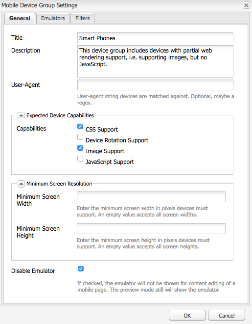
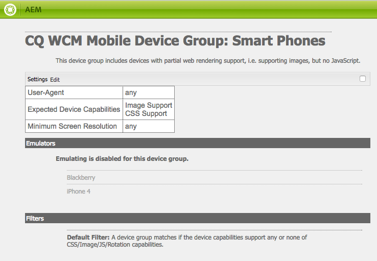
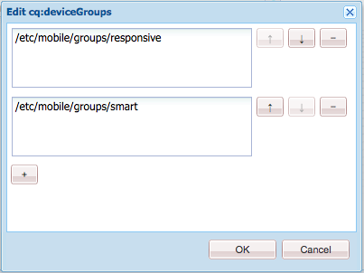
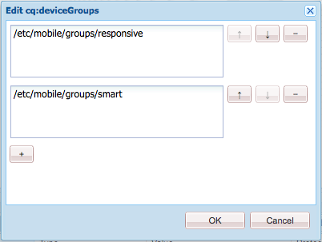
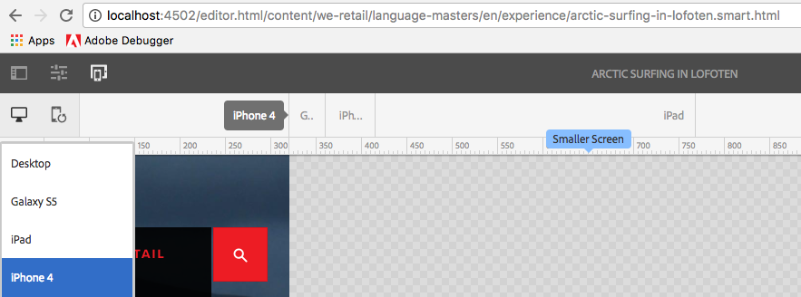

# Adaptive Template Rendering{#adaptive-template-rendering}

The adaptive template rendering provides a way to manage a page with variations. Originally useful to deliver various HTML outputs for mobile devices (for example, feature phone versus smart phone), this feature is useful when experiences have to be delivered to various devices that need different markup or HTML output.

## Overview {#overview}

Templates are built around a responsive grid, and pages created based on these templates are fully responsive, adjusting automatically to the viewport of the client device. Using the Emulator toolbar in the page editor, authors can target layouts to specific devices.

It is also possible to set up templates to support adaptive rendering. When device groups are properly configured, the page is rendered with a different selector in the URL when selecting a device in the emulator mode. Using a selector a specific page rendering can be directly called via the URL.

Remember when setting up your device groups:

* Every device must be in at least one device group.
* A device can be in multiple device groups.
* Because devices can be in multiple device groups, selectors can be combined.
* The combination of selectors is evaluated top-to-bottom as they are persisted in the repository.

>[!NOTE]
>
>The device group **Responsive Devices never have a selector because devices that are recognized as supporting responsive design are assumed to not need an adaptive layout

## Configuration {#configuration}

Adaptive rendering selectors can be configured for existing device groups or to [groups that you have created yourself.](/help/sites-developing/mobile.md#device-groups)

For this example, you are going to configure the existing device group **Smart Phones** to have an adaptive rendering selector as part of the **Experience Page** template within We.Retail.

1. Edit the device group that requires an adaptive selector in `http://localhost:4502/miscadmin#/etc/mobile/groups`

   Set the option **Disable Emulator** and save.

   

1. The selector is available for the **BlackBerry&reg;** and **iPhone 4** provided the device group **Smart Phone** is added to the template and page structures in the following steps.

   

1. Using CRXDE Lite, allow the device group to be used on your template by adding it to the multi-value string property `cq:deviceGroups` on the structure of your template.

   `/conf/<your-site>/settings/wcm/templates/<your-template>/structure/jcr:content`

   For example, if you want to add the Smart Phone device group:

   `/conf/we-retail/settings/wcm/templates/experience-page/structure/jcr:content`

   

1. Using CRXDE Lite, allow the device group to be used on your site by adding it to the multi-value string property `cq:deviceGroups` on the structure of your site.

   `/content/<your-site>/jcr:content`

   For example, if you want to allow the **Smart Phone** device group:

   `/content/we-retail/jcr:content`

   

Now when using the [emulator](/help/sites-authoring/responsive-layout.md#layout-definitions-device-emulation-and-breakpoints) in the page editor (such as when [modifying the layout](/help/sites-authoring/responsive-layout.md)) and you choose a device of the configured device group, the page is rendered with a selector as part of the URL.

In this example, when editing a page based on the **Experience Page** template, and choosing iPhone 4 in the emulator, the page is rendered including the selector as `arctic-surfing-in-lofoten.smart.html` instead of `arctic-surfing-in-lofoten.html`

The page can also be called directly using this selector.

