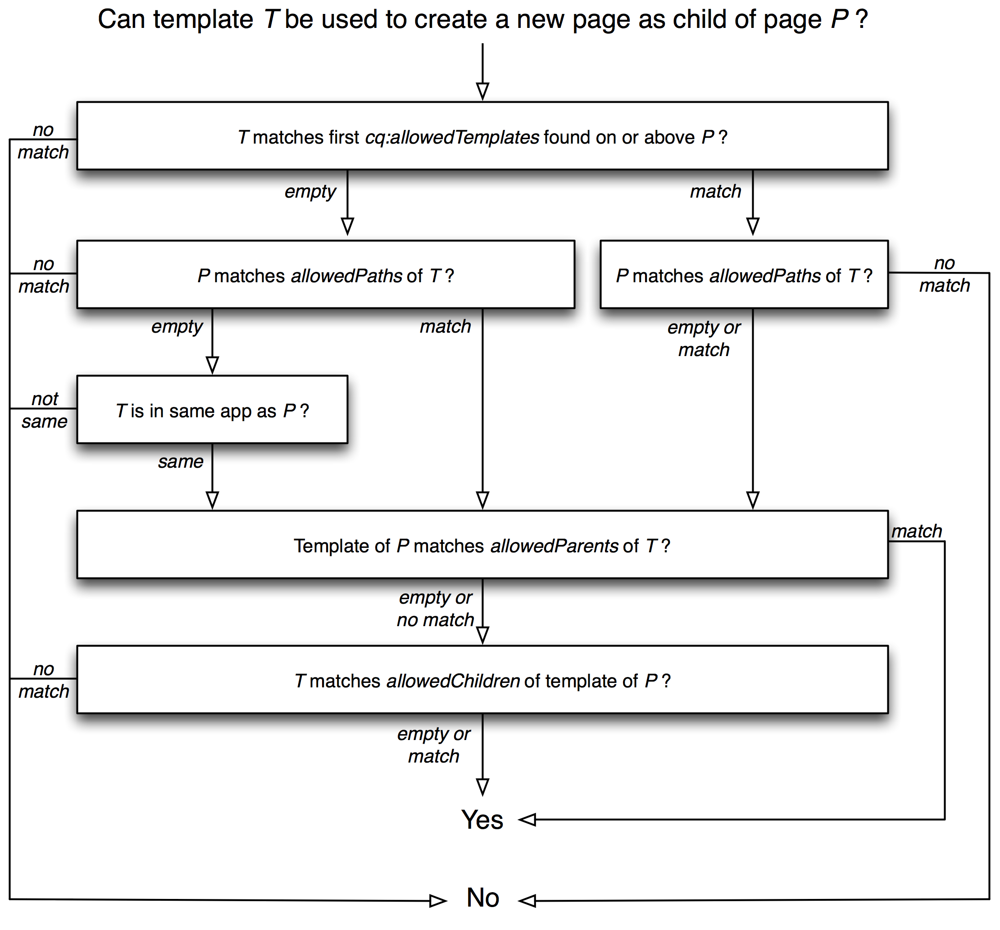

# Templates{#templates}

Templates are used at various points in AEM:

* When [creating a page you need to select a template](#templates-pages); this will be used as the base for the new page. The template defines the structure of the resultant page, any initial content and the [components](/help/sites-authoring/default-components.md) that can be used (design properties).

* When [creating a Content Fragment you also need to select a template](#templates-content-fragments). This template defines the structure, initial elements and variations.

The following templates are covered in detail:

* [Page Templates - Editable](/help/sites-developing/page-templates-editable.md)
* [Page Templates - Static](/help/sites-developing/page-templates-static.md)
* [Content Fragment Templates](/help/sites-developing/content-fragment-templates.md)
* [Adaptive Template Rendering](/help/sites-developing/templates-adaptive-rendering.md)

## Templates - Pages {#templates-pages}

AEM now offers two basic types of templates for creating pages:

>[!NOTE]
>
>When using a template to [create a new page](/help/sites-authoring/managing-pages.md#creating-a-new-page) there is no visible difference (to the page author) and no indication of the type of template being used.

### Editable Templates {#editable-templates}

Editable templates are now cosidered best practices for developing with AEM.

The advantages of Editable Templates:

* Can be [created](/help/sites-authoring/templates.md#creating-a-new-template-template-author) and [edited](/help/sites-authoring/templates.md#editing-a-template-structure-template-author) by your authors.

* Have been introduced to allow you to define the following for any pages created with the template:

    * the structure
    * the initial content
    * content policies

* After the new page is created a dynamic connection is maintained between the page and the template; this means that changes to the template structure will be reflected on any pages created with that template (changes to the initial content will not be reflected).  
* Uses content policies (edited from the template editor) to persist the design properties (does not use Design mode within the page editor).
* Are stored under `/conf`
* See [Editable Templates](/help/sites-developing/page-templates-editable.md) for further information.

>[!NOTE]
>
>An AEM Community Article is available explaining how to develop an Experience Manager site with Editable Templates, see [Creating an Adobe Experience Manager 6.4 website using Editable Templates](https://helpx.adobe.com/experience-manager/using/first_aem64_website.html).

### Static Templates {#static-templates}

Static Templates:

* Must be defined and configured by your developers.
* This was the original templating system of AEM and has been available for many versions. 
* A static template is a hierarchy of nodes that has the same structure as the page to be created, but without any actual content.
* Are copied to create the new page, no dynamic connection exists after this.
* Uses [Design Mode](/help/sites-authoring/default-components-designmode.md) to persist design properties.
* Are stored under `/apps`
* See [Static Templates](/help/sites-developing/page-templates-static.md) for further information.

>[!NOTE]
>
>As of AEM 6.4 the use of Static Templates is not considered a best practice. Use Editable Templates instead.
>
>[AEM Modernization](modernization-tools.md) tools can help you migrate from static to editable templates.

### Template Availability {#template-availability}

>[!CAUTION]
>
>AEM offers multiple properties to control the templates allowed under **Sites**. However, combining them can lead to very complex rules that are difficult to track and manage.
>
>Therefore, Adobe recommends that you start simple, by defining:
>
>* only the `cq:allowedTemplates` property  
>
>* only on the site root
>
>For an example, see We.Retail: `/content/we-retail/jcr:content`
>
>The properties `allowedPaths`, `allowedParents`, and `allowedChildren` can also be placed on the templates to define more sophisticated rules. However, when possible, it is *much* simpler to define further `cq:allowedTemplates` properties on sub-sections of the site if there is a need to further restrict the allowed templates.
>
>An additional advantage is that the `cq:allowedTemplates` properties can be updated by an author in the **Advanced** tab of the **Page Properties**. The other template properties cannot be updated using the (standard) UI, so would need a developer to maintain the rules and a code deployment for every change.

When creating a new page in the site admin interface, the list of available templates depends on the location of the new page and the restrictions on placement specified in each template.

The following properties determine whether a template `T` is allowed to be used for a new page to be placed as a child of page `P`. Each of these properties is a multi-value string holding zero or more Regular Expressions that are used for matching with paths:

* The `cq:allowedTemplates` property of the `jcr:content` subnode of `P` or an ancestor of `P`. 

* The `allowedPaths` property of `T`.

* The `allowedParents` property of `T`.

* The `allowedChildren` property of the template of `P`.

The evaluation works as follows:

* The first non-empty `cq:allowedTemplates` property found while ascending the page hierarchy starting with `P` is matched against the path of `T`. If none of the values match, `T` is rejected.

* If `T` has a non-empty `allowedPaths` property, but none of the values match the path of `P`, `T` is rejected.

* If both of the above properties are either empty or non-existent, `T` is rejected unless it belongs to the same application as `P`. `T` belongs to the same application as `P` if and only if the name of the second level of the path of `T` is the same as the name of the second level of the path of `P`. For example, the template `/apps/geometrixx/templates/foo` belongs to the same application as the page `/content/geometrixx`.

* If `T` has an non-empty `allowedParents` property, but none of the values match the path of `P`, `T` is rejected.

* If the template of `P` has a non-empty `allowedChildren` property, but none of the values match the path of `T`, `T` is rejected.

* In all other cases, `T` is allowed.

The following diagram depicts the template evaluation process:

 

#### Limiting templates used in child pages {#limiting-templates-used-in-child-pages}

To limit what templates can be used to create child pages under a given page, use the `cq:allowedTemplates` property of `jcr:content` node of the page to specify the list of templates to be allowed as child pages. Each value in the list must be an absolute path to a template for an allowed child page, for example `/apps/geometrixx/templates/contentpage`.

You can use the `cq:allowedTemplates` property on the template's  `jcr:content` node to have this configuration applied to all newly created pages that use this template.

If you want to add more constraints, for example regarding the template hierarchy, you can use the `allowedParents/allowedChildren` properties on the template. You can then explicitly specify that pages created from a template T have to be parents/children of pages created from a template T.

## Templates - Content Fragments {#templates-content-fragments}

See [Content Fragment Templates](/help/sites-developing/content-fragment-templates.md) for full information.
