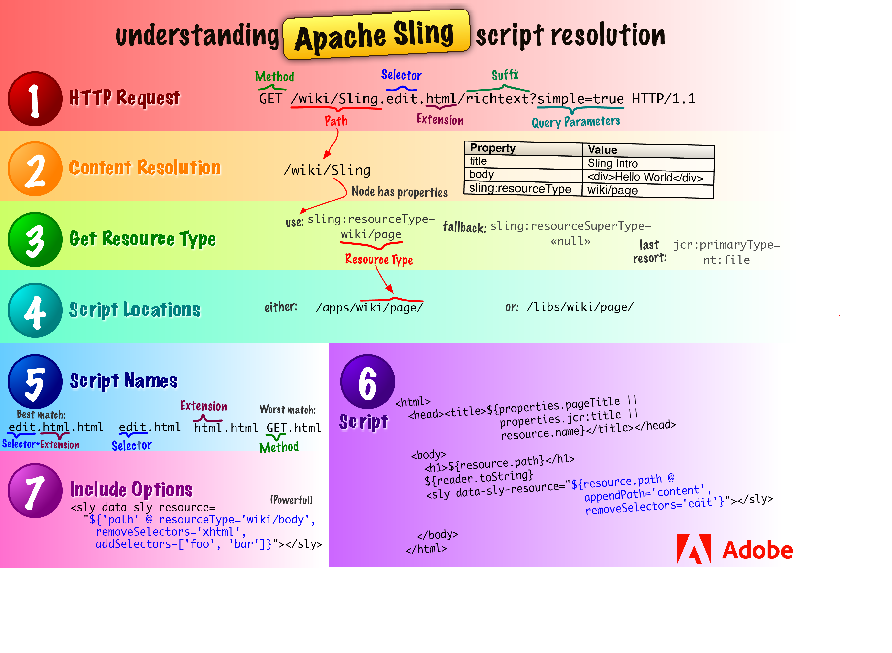
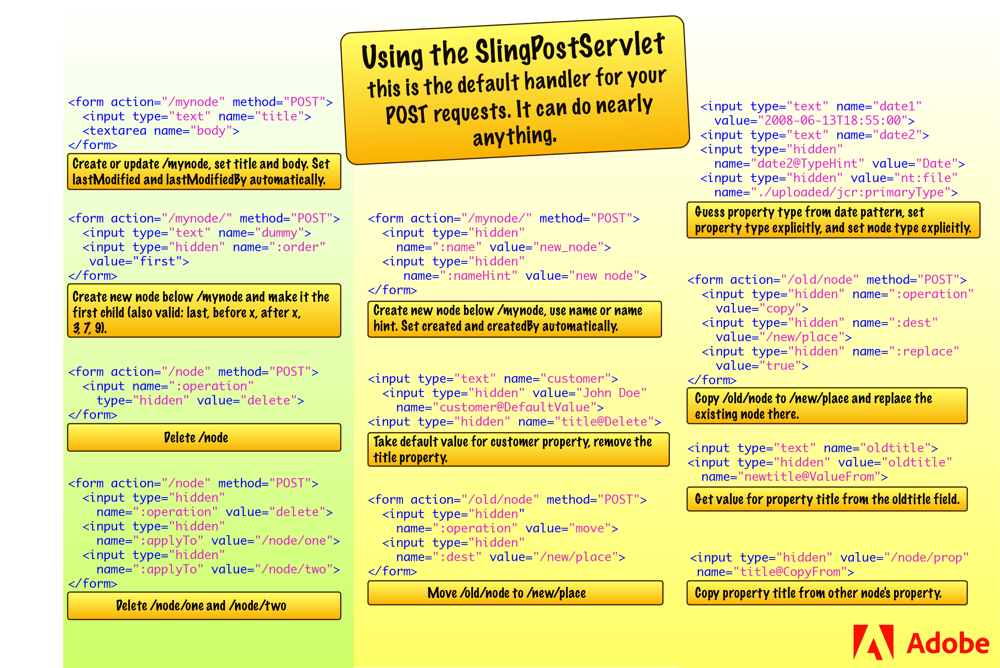
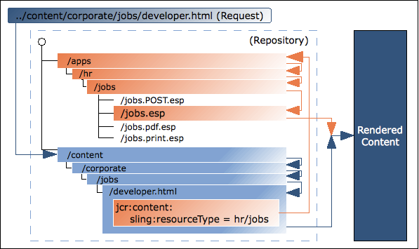

# AEM Core Concepts {#aem-core-concepts}

>[!NOTE]
>
>Before diving into the core concepts of AEM, Adobe recommends completing the WKND Tutorial in the [Getting Started Developing AEM Sites](/help/sites-developing/getting-started.md) document for an overview of the AEM development process and introduction to core concepts.

## Prerequisites for Developing on AEM {#prerequisites-for-developing-on-aem}

You need the following skills for developing on top of AEM:

* Basic knowledge of web application techniques, including:

    * the request -response (XMLHttpRequest / XMLHttpResponse) cycle
    * HTML
    * CSS
    * JavaScript

* Working knowledge of the Experience Server (CRX), including the Content Explorer
* For developing in the classic UI, basic knowledge of JSP (JavaServer Pages) including the ability to understand and modify simple JSP examples is also required.

It is also recommended that you read and follow the [Guidelines and Best Practices](/help/sites-developing/dev-guidelines-bestpractices.md).

## Java&trade; Content Repository {#java-content-repository}

The Java&trade; Content Repository (JCR) standard, [JSR 283](https://developer.adobe.com/experience-manager/reference-materials/spec/jcr/2.0/index.html), specifies a vendor-independent and implementation-independent way to access content bi-directionally on a granular level within a content repository.

Specification lead is held by Adobe Research (Switzerland) AG.

The [JCR API 2.0](https://developer.adobe.com/experience-manager/reference-materials/spec/javax.jcr/javadocs/jcr-2.0/index.html) package, javax.jcr.&ast; is used for the direct access and manipulation of repository content.

## Experience Server (CRX) and Jackrabbit {#experience-server-crx-and-jackrabbit}

The Experience Server provides the Experience Services which AEM is built on, and which can be used to build custom applications, and it embeds the Content Repository based on Jackrabbit.

[Apache Jackrabbit](https://jackrabbit.apache.org/jcr/index.html) is an open source, fully conforming, implementation of the JCR API 2.0.

## Sling Request Processing {#sling-request-processing}

### Introduction to Sling {#introduction-to-sling}

AEM is built using [Sling](https://sling.apache.org/index.html), a Web application framework based on REST principles that provides easy development of content-oriented applications. Sling uses a JCR repository, such as Apache Jackrabbit or, in the case of AEM, the CRX Content Repository, as its data store. Sling has been contributed to the Apache Software Foundation - further information can be found at Apache.

Using Sling, the type of content to be rendered is not the first processing consideration. Instead the main consideration is whether the URL resolves to a content object for which a script can then be found to perform the rendering. This provides excellent support for web content authors to build pages which are easily customized to their requirements.

The advantages of this flexibility are apparent in applications with a wide range of different content elements, or when you need pages that can be easily customized. In particular, when implementing a Web Content Management system such as the WCM in the AEM solution.

See [Discover Sling in 15 minutes](https://sling.apache.org/documentation/getting-started/discover-sling-in-15-minutes.html) for the first steps for developing with Sling.

The following diagram explains Sling script resolution: it shows how to get from HTTP request to content node, from content node to resource type, from resource type to script and what scripting variables are available.

 
 
The following diagram explains all the hidden, but powerful, request parameters you can use when dealing with the SlingPostServlet, the default handler for all POST requests that gives you endless options for creating, modifying, deleting, copying and moving nodes in the repository.



### Sling is Content Centric {#sling-is-content-centric}

Sling is *content-centric*. This means that processing is focused on the content as each (HTTP) request is mapped onto content in the form of a JCR resource (a repository node):

* the first target is the resource (JCR node) holding the content
* secondly, the representation, or script, is located from the resource properties combined with certain parts of the request (for example, selectors and/or the extension)

### RESTful Sling {#restful-sling}

Due to the content-centric philosophy, Sling implements a REST-oriented server and thus features a new concept in web application frameworks. The advantages are:

* very RESTful, not just on the surface; resources and representations are correctly modelled inside the server
* removes one or more data models

    * previously the following were needed: URL structure, business objects, DB schema;
    * this is now reduced to: URL = resource = JCR structure

### URL Decomposition {#url-decomposition}

In Sling, processing is driven by the URL of the user request. This defines the content to be displayed by the appropriate scripts. To do this, information is extracted from the URL.

If we analyze the following URL:

```xml
https://myhost/tools/spy.printable.a4.html/a/b?x=12
```

We can break it down into its composite parts:

| protocol |host |content path |selector(s) |extension |  |suffix |  |param(s)  |
|---|---|---|---|---|---|---|---|---|
| https:// |myhost |tools/spy |.printable.a4. |html |/ |a/b |? |x=12 |

**protocol** HTTP

**host** Name of the website.

**content path** Path specifying the content to be rendered. Is used in combination with the extension; in this example they translate to tools/spy.html.

**selector(s)** Used for alternative methods of rendering the content; in this example a printer-friendly version in A4 format.

**extension** Content format; also specifies the script to be used for rendering.

**suffix** Can be used to specify additional information.

**param(s)** Any parameters required for dynamic content.

#### From URL to Content and Scripts {#from-url-to-content-and-scripts}

Using these principles:

* the mapping uses the content path extracted from the request to locate the resource
* when the appropriate resource is located, the sling resource type is extracted, and used to locate the script to be used for rendering the content

The figure below illustrates the mechanism used, which will be discussed in more detail in the following sections.



With Sling, you specify which script renders a certain entity (by setting the `sling:resourceType` property in the JCR node). This mechanism offers more freedom than one in which the script accesses the data entities (as an SQL statement in a PHP script would do) as a resource can have several renditions.

#### Mapping requests to resources {#mapping-requests-to-resources}

The request is broken down and the necessary information extracted. The repository is searched for the requested resource (content node):

* first Sling checks whether a node exists at the location specified in the request; e.g. `../content/corporate/jobs/developer.html`
* if no node is found, the extension is dropped and the search repeated; e.g. `../content/corporate/jobs/developer`
* if no node is found then Sling will return the http code 404 (Not Found).

Sling also allows things other than JCR nodes to be resources, but this is an advanced feature.

### Locating the script {#locating-the-script}

When the appropriate resource (content node) is located, the **sling resource type** is extracted. This is a path, which locates the script to be used for rendering the content.

The path specified by the `sling:resourceType` can be either:

* absolute
* relative, to a configuration parameter

  Relative paths are recommended by Adobe as they increase portability.

All Sling scripts are stored in subfolders of either `/apps` or `/libs`, which will be searched in this order (see [Customizing Components and Other Elements](/help/sites-developing/dev-guidelines-bestpractices.md#customizing-components-and-other-elements)).

A few other points to note are:

* when the Method (GET, POST) is required, it will be specified in uppercase as according to the HTTP specification for example, jobs.POST.esp (see below)
* various script engines are supported:

  * HTL (HTML Template Language - Adobe Experience Manager's preferred and recommended server-side template system for HTML): `.html`
  * ECMAScript (JavaScript) Pages (server-side execution): `.esp, .ecma`
  * Java&trade; Server Pages (server-side execution): `.jsp`
  * Java&trade; Servlet Compiler (server-side execution): `.java`
  * JavaScript templates (client-side execution): `.jst`

The list of script engines supported by the given instance of AEM are listed on the Felix Management Console ( `http://<host>:<port>/system/console/slingscripting`).

Also, Apache Sling supports integration with other popular scripting engines (for example, Groovy, JRuby, Freemarker), and provides a way of integrating new scripting engines.

Using the above example, if the `sling:resourceType` is `hr/jobs` then for:

* GET/HEAD requests, and URLs ending in .html (default request types, default format)

  The script is /apps/hr/jobs/jobs.esp; the last section of the sling:resourceType forms the file name.

* POST requests (all request types excluding GET/HEAD, the method name must be uppercase)

  POST is used in the script name.

  The script is `/apps/hr/jobs/jobs.POST.esp`.

* URLs in other formats, not ending with .html

  For example, `../content/corporate/jobs/developer.pdf`

  The script will be `/apps/hr/jobs/jobs.pdf.esp`; the suffix is added to the script name.

* URLs with selectors

  Selectors can be used to display the same content in an alternative format. For example a printer friendly version, an rss feed or a summary.

  If we look at a printer friendly version where the selector could be *print*; as in `../content/corporate/jobs/developer.print.html`

  The script will be `/apps/hr/jobs/jobs.print.esp`; the selector is added to the script name.

* If no sling:resourceType has been defined then:

    * the content path will be used to search for an appropriate script (if the path based ResourceTypeProvider is active).

      For example, the script for `../content/corporate/jobs/developer.html` would generate a search in `/apps/content/corporate/jobs/`.

    * the primary node type will be used.

* If no script is found at all then the default script will be used.

  The default rendition is currently supported as plain text (.txt), HTML (.html) and JSON (.json), all of which will list the node's properties (suitably formatted). The default rendition for the extension .res, or requests without a request extension, is to spool the resource (where possible).
* For http error handling (codes 403 or 404) Sling will look for a script at either:

    * the location /apps/sling/servlet/errorhandler for [customized scripts](/help/sites-developing/customizing-errorhandler-pages.md)
    * or the location of the standard scripts /libs/sling/servlet/errorhandler/403.esp, or 404.esp respectively.

If multiple scripts apply for a given request, the script with the best match is selected. The more specific a match is, the better it is; in other words, the more selector matches the better, regardless of any request extension or method name match.

For example, consider a request to access the resource
`/content/corporate/jobs/developer.print.a4.html`
of type
`sling:resourceType="hr/jobs"`

Assuming we have the following list of scripts in the correct location:

1. `GET.esp`
1. `jobs.esp`
1. `html.esp`
1. `print.esp`
1. `print.html.esp`
1. `print/a4.esp`
1. `print/a4/html.esp`
1. `print/a4.html.esp`

Then the order of preference would be (8) - (7) - (6) - (5) - (4) - (3) - (2) - (1).

In addition to the resource types (primarily defined by the `sling:resourceType` property) there is also the resource super type. This is generally indicated by the `sling:resourceSuperType` property. These super types are also considered when trying to find a script. The advantage of resource super types is that they may form a hierarchy of resources where the default resource type `sling/servlet/default` (used by the default servlets) is effectively the root.

The resource super type of a resource may be defined in two ways:

* by the `sling:resourceSuperType` property of the resource.
* by the `sling:resourceSuperType` property of the node to which the `sling:resourceType` points.

For example:

* /

    * a
    * b

        * sling:resourceSuperType = a

    * c

        * sling:resourceSuperType = b

    * x

        * sling:resourceType = c

    * y

        * sling:resourceType = c
        * sling:resourceSuperType = a

The type hierarchy of:

* `/x` 
  * is `[ c, b, a, <default>]` 
* while for `/y` 
  * the hierarchy is `[ c, a, <default>]` 

This is because `/y` has the `sling:resourceSuperType` property whereas `/x` does not and therefore its supertype is taken from its resource type.

#### Sling Scripts cannot be called directly {#sling-scripts-cannot-be-called-directly}

Within Sling, scripts cannot be called directly as this would break the strict concept of a REST server; you would mix resources and representations.

If you call the representation (the script) directly you hide the resource inside your script, so the framework (Sling) no longer knows about it. Thus you lose certain features:

* automatic handling of http methods other than GET, including:

    * POST, PUT, DELETE which are handled with a sling default implementation
    * the `POST.jsp` script in your sling:resourceType location

* your code architecture is no longer as clean nor as clearly structured as it should be; of prime importance for large-scale development

### Sling API {#sling-api}

This uses the Sling API package, org.apache.sling.&ast;, and tag libraries.

### Referencing existing elements using sling:include {#referencing-existing-elements-using-sling-include}

A final consideration is the need to reference existing elements within the scripts.

More complex scripts (aggregating scripts) might need to access multiple resources (for example navigation, sidebar, footer, elements of a list) and do so by including the *resource*.

To do this you can use the sling:include("/&lt;path&gt;/&lt;resource&gt;") command. This will effectively include the definition of the referenced resource, as in the following statement which references an existing definition for rendering images:

```xml
%><sling:include resourceType="geometrixx/components/image/img"/><%
```

## OSGI {#osgi}

OSGi defines an architecture for developing and deploying modular applications and libraries (it is also known as the Dynamic Module System for Java). OSGi containers allow you to break your application into individual modules (are jar files with additional meta information and called bundles in OSGi terminology) and manage the cross-dependencies between them with:

* services implemented within the container
* a contract between the container and your application

These services and contracts provide an architecture which enables individual elements to dynamically discover each other for collaboration.

An OSGi framework then offers you dynamic loading/unloading, configuration and control of these bundles - without requiring restarts.

>[!NOTE]
>
>Full information on OSGi technology can be found at the [OSGi website](https://www.osgi.org).
>
>In particular, their Basic Education page holds a collection of presentations and tutorials.

This architecture allows you to extend Sling with application specific modules. Sling, and therefore CQ5, uses the [Apache Felix](https://felix.apache.org/documentation/index.html) implementation of OSGI (Open Services Gateway initiative) and is based on the OSGi Service Platform Release 4 Version 4.2 Specifications. They are both collections of OSGi bundles running within an OSGi framework.

This enables you to perform the following actions on any of the packages within your installation:

* install
* start
* stop
* update
* uninstall
* see the current status
* access more detailed information (e.g. symbolic name, version, location, etc) about the specific bundles

See [the Web Console](/help/sites-deploying/web-console.md), [OSGI Configuration](/help/sites-deploying/configuring-osgi.md) and [OSGi Configuration Settings](/help/sites-deploying/osgi-configuration-settings.md) for more information.

## Development Objects in the AEM Environment {#development-objects-in-the-aem-environment}

The following are of interest for development:

**Item** An item is either a node or a property.

For detailed information on manipulating Item objects, refer to the [Javadocs](https://developer.adobe.com/experience-manager/reference-materials/spec/javax.jcr/javadocs/jcr-2.0/javax/jcr/Item.html) of the Interface javax.jcr.Item

**Node (and their properties)** Nodes and their properties are defined in the JCR API 2.0 specification (JSR 283). They store content, object definitions, rendering scripts and other data.

Nodes define the content structure, and their properties store the actual content and metadata.

Content nodes drive the rendering. Sling gets the content node from the incoming request. The property sling:resourceType of this node points to the Sling rendering component to be used.

A node, which is a JCR name, is also called a resource in the Sling environment.

For example, to get the properties of the current node, you can use following code in your script:

`PropertyIterator properties = currentNode.getProperties();`

With currentNode being the current node object.

For more information on manipulating Node objects, refer to the [Javadocs](https://developer.adobe.com/experience-manager/reference-materials/spec/javax.jcr/javadocs/jcr-2.0/javax/jcr/Node.html).

**Widget** In AEM all user input is managed by widgets. These are often used to control the editing of a piece of content.

Dialogs are built by combining Widgets.

AEM has been developed using the ExtJS library of widgets.

**Dialog** A dialog is a special type of widget.

To edit content, AEM uses dialogs defined by the application developer. These combine a series of widgets to present the user with all fields and actions necessary to edit the related content.

Dialogs are also used for editing metadata, and by various administrative tools.

**Component** A software component is a system element offering a predefined service or event, and able to communicate with other components.

Within AEM a component is often used to render the content of a resource. When the resource is a page, the component rendering it is called a Top-Level Component or a Pagecomponent. However, a component does not have to render content, nor be linked to a specific resource; for example, a navigation component will display information about multiple resources.

The definition of a component includes:,

* the code used to render the content
* a dialog for the user input and the configuration of the resulting content.

**Template** A template is the base for a specific type of page. When creating a page in the Websites tab the user has to select a template. The new page is then created by copying this template.

A template is a hierarchy of nodes that has the same structure as the page to be created, but without any actual content.

It defines the page component used to render the page and the default content (primary top-level content). The content defines how it is rendered as AEM is content-centric.

**Page Component (Top-Level Component)** The component to be used to render the page.

**Page** A page is an 'instance' of a template.

A page has a hierarchy node of type cq:Page and a content node of type cq:PageContent. The property sling:resourceType of the content node points to the Page Component used for rendering the page.

For example, to get the name of the current page, you can use following code in your script:

S`tring pageName = currentPage.getName();`

With currentPage being the current page object. For more information on manipulating Page objects, refer to the [Javadocs](https://developer.adobe.com/experience-manager/reference-materials/6-5/javadoc/com/day/cq/wcm/api/Page.html).

**Page Manager** The page manager is an Interface that provides methods for page level operations.

For example, to get the containing page of a resource, you can use following code in your script:

Page myPage = pageManager.getContainingPage(myResource);

With pageManager being the page manager object and myResource a resource object. For more information on the methods provided by the page manager, refer to the [Javadocs](https://developer.adobe.com/experience-manager/reference-materials/6-5/javadoc/com/day/cq/wcm/api/PageManager.html).

## Structure within the Repository {#structure-within-the-repository}

The following list gives an overview of the structure that you see within the repository.

>[!CAUTION]
>
>Changes to this structure, or the files within it, should be made with care.
>
>Changes are needed when you are developing, but you should take care that you fully understand the implications of any changes you make.

>[!CAUTION]
>
>Donnot change anything in the `/libs` path. For configuration and other changes copy the item from `/libs` to `/apps` and make any changes within `/apps`.

* `/apps`

  Application related; includes component definitions specific to your website. The components that you develop can be based on the out of the box components available at `/libs/foundation/components`.

* `/content`

  Content created for your website.

* `/etc`

* `/home`

  User and Group information.

* `/libs`

  Libraries and definitions that belong to the core of AEM. The sub-folders in `/libs` represent the out-of-the-box AEM features such as search or replication. The content in `/libs` should not be modified as it affects the way AEM works. Features specific to your website should be developed under `/apps` (see [Customizing Components and Other Elements](/help/sites-developing/dev-guidelines-bestpractices.md#customizing-components-and-other-elements)).

* `/tmp`

  Temporary working area.

* `/var`

  Files that change and are updated by the system; such as audit logs, statistics, event-handling.

## Environments {#environments}

With AEM a production environment often consists of two different types of instances: an [Author and a Publish instances](/help/sites-deploying/deploy.md#author-and-publish-installs).

## The Dispatcher {#the-dispatcher}

The Dispatcher is Adobe's tool for both caching and/or load balancing. Further information can be found under [the Dispatcher](https://experienceleague.adobe.com/docs/experience-manager-dispatcher/using/dispatcher.html?lang=en).

## FileVault (source revision system) {#filevault-source-revision-system}

FileVault provides your JCR repository with file system mapping and version control. It can be used to manage AEM development projects with full support for storing and versioning project code, content, configurations, and so on, in standard version control systems (for example, Subversion).

See the [FileVault tool](/help/sites-developing/ht-vlttool.md) documentation for detailed information.

## Workflows {#workflows}

Your content is often subject to organizational processes, including steps such as approval and sign-off by various participants. These processes can be represented as workflows, [defined and developed within AEM](/help/sites-developing/workflows-models.md), then applied to the [appropriate content pages](/help/sites-administering/workflows.md) or [digital assets](/help/assets/assets-workflow.md) as required.

The Workflow Engine is used to manage the implementation of your workflows, and their subsequent application to your content.

## Multi-Site Management {#multi-site-management}

Multi Site Manager (MSM) enables you to easily manage multiple web sites that share common content. MSM lets you define relations between the sites so that content changes in one site are automatically replicated in other sites.

For example, web sites are often provided in multiple languages for international audiences. When the number of sites in the same language is low (three to five), a manual process for synchronizing content across sites is possible. However, when the number of sites grows or when multiple languages are involved, it becomes more efficient to automate the process.

* Efficiently manage different language versions of a website.
* Automatically update one or more sites based on a source site:

    * Enforce a common base structure and use common content across multiple sites.
    * Maximize the use of available resources.
    * Maintain a common look and feel.
    * Focus efforts on managing the content that differs between the sites.

For more information, see [Multi Site Manager](/help/sites-administering/msm.md).
