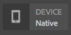
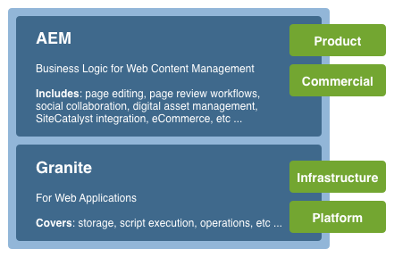
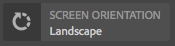
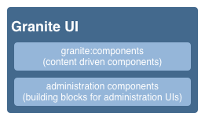
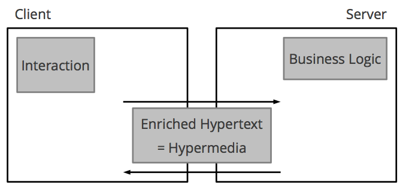
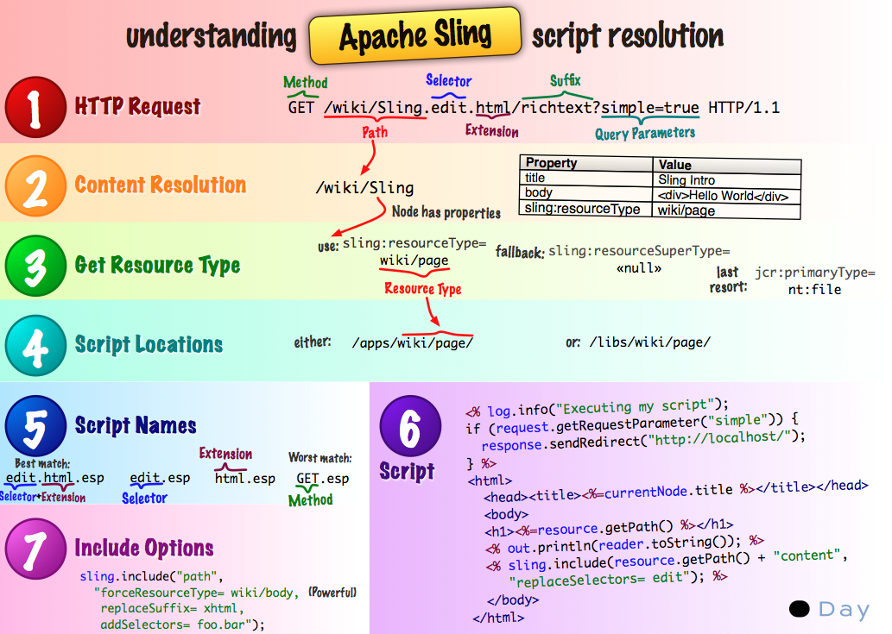
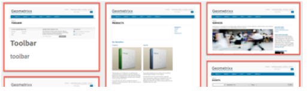

# Concepts of the Adobe Experience Manager Touch-Enabled UI{#concepts-of-the-aem-touch-enabled-ui}

Adobe Experience Manager (AEM) features a touch-enabled UI with [responsive design](/help/sites-authoring/responsive-layout.md) for the author environment which is designed to operate on both touch and desktop devices.

>[!NOTE]
>
>The touch-enabled UI is the standard UI for AEM. The classic UI was deprecated with AEM 6.4.

The touch-enabled UI includes:

* The suite header that:
    * Shows the logo
    * Provides a link to the Global Navigation
    * Provides link to other generic actions; such as Search, Help, Experience Cloud Solutions, Notifications, and User Settings.
* The left-hand rail (shown when needed and hidable), which can show:
    * Timeline
    * References
    * Filters
* The navigation header, which is again context-sensitive and can show:
    * Indicates which console that you are currently using, or your location, or both, within that console
    * Selection for the left-hand rail
    * Breadcrumbs
    * Access to appropriate **Create** actions
    * View selections
* The content area that:
    * Lists the items of content (be they pages, assets, forum posts, and so on)
    * Can be formatted as requested, for example, column, card, or list
    * Uses a responsive design (the display resizes automatically according to your device and/or window size)
    * Uses infinite scrolling (no more pagination, all items are listed in one window)



>[!NOTE]
>
>Nearly all AEM functionality has been ported to the touch-enabled UI. However, in some limited cases, functionality reverts to the classic UI. See [Touch UI Feature Status](/help/release-notes/touch-ui-features-status.md) for more information.

The touch-enabled UI has been designed by Adobe to provide consistency in the user experience across multiple products. It is based on:

* **Coral UI** (CUI) an implementation of Adobe's visual style for the touch-enabled UI. Coral UI provides everything your product / project / web application needs to adopt the UI visual style.
* **Granite UI** components are built with Coral UI.

The basic principles of the touch-enabled UI are:

* Mobile first (with desktop in mind)
* Responsive design
* Context relevant display
* Reusable
* Include embedded reference documentation
* Include embedded tests
* Bottom-up design to ensure that these principles are applied to every element and component

For a further overview of the touch-enabled UI structure, see [Structure of the AEM Touch-Enabled UI](/help/sites-developing/touch-ui-structure.md).

## AEM Technology Stack {#aem-technology-stack}

AEM uses the Granite platform as a base and the Granite platform includes, among other things, the Java&trade; Content Repository.



## Granite {#granite}

Granite is Adobe's Open Web stack, providing various components including:

* An application launcher
* An OSGi framework into which everything is deployed
* Several OSGi compendium services to support building applications
* A comprehensive Logging Framework providing various logging APIs
* The CRX Repository implementation of the JCR API Specification
* The Apache Sling Web Framework
* Additional parts of the current CRX product

>[!NOTE]
>
>Granite is run as an open development project within Adobe: contributions to the code, discussions, and issues are made from across the entire company.
>
>However, Granite is **not** an open-source project. It is heavily based on several open-source projects (Apache Sling, Felix, Jackrabbit, and Lucene in particular), but Adobe draws a clear line between what is public and what is internal.

## Granite UI {#granite-ui}

The Granite engineering platform also provides a foundation UI framework. The major goals of this are to:

* Provide granular UI widgets
* Implement the UI concepts and illustrate best practices (long lists rendering, lists filtering, object CRUD, CUD wizards...)
* Provide an extensible and plug-in based administration UI

These adhere to the requirements:

* Respect "mobile first"
* Be extensible
* Be easy to override


GraniteUI.pdf

[Get File](assets/graniteui.pdf)
The Granite UI:

* Uses the RESTful architecture of Sling
* Implements component libraries intended for building content-centric web applications
* Provides granular UI widgets
* Provides a default, standardized UI
* Is extensible
* Is designed for both mobile and desktop devices (respects mobile first)
* Can be used in any Granite-based platform/product/project; for example, AEM



* [Granite UI Foundation Components](#granite-ui-foundation-components)
  This library of foundation components can be used or extended by other libraries.
* [Granite UI Administration Components](#granite-ui-administration-components)

### Client Side vs Server Side {#client-side-vs-server-side}

The client-server communication in the Granite UI consists of hypertext, not objects, so there is no need for the client to understand the business logic

* The server enriches the HTML with semantic data
* The client enriches the hypertext with hypermedia (interaction)



#### Client-Side {#client-side}

This uses an extension of HTML vocabulary, provided so that the author can express their intention to build an interactive webapp. This is a similar approach to [WAI-ARIA](https://www.w3.org/TR/wai-aria/) and [microformats](https://microformats.org/).

It primarily consists of a collection of interaction patterns (for example, asynchronously submitting a form) that are interpreted by JS and CSS codes, run on the client-side. The role of the client-side is to enhance the markup (given as the hypermedia affordance by the server) for interactivity.

The client-side is independent of any server technology. As long as the server gives the appropriate markup, the client-side can fulfill its role.

Currently the JS and CSS codes are delivered as Granite [clientlibs](/help/sites-developing/clientlibs.md) under the category:

`granite.ui.foundation and granite.ui.foundation.admin`

These are delivered as part of the content package:

`granite.ui.content`

#### Server-Side {#server-side}

This is formed by a collection of sling components that enable the author to *compose* a webapp fast. The developer develops components, the author assembles the components to be a webapp. The role of the server-side is to give the hypermedia affordance (markup) to the client.

Currently, the components are in the Granite repository at:

`/libs/granite/ui/components/foundation`

This is delivered as part of the content package:

`granite.ui.content`

### Differences with the Classic UI {#differences-with-the-classic-ui}

The differences between Granite UI and ExtJS (used for the classic UI) are also of interest:

<table>
 <tbody>
  <tr>
   <td><strong>ExtJS</strong></td>
   <td><strong>Granite UI</strong></td>
  </tr>
  <tr>
   <td>Remote Procedure Call<br /> </td>
   <td>State Transitions</td>
  </tr>
  <tr>
   <td>Data transfer objects</td>
   <td>Hypermedia</td>
  </tr>
  <tr>
   <td>Client knows server internals</td>
   <td>Client does not know internals</td>
  </tr>
  <tr>
   <td>"Fat client"</td>
   <td>"Thin client"</td>
  </tr>
  <tr>
   <td>Specialized client libraries</td>
   <td>Universal client libraries</td>
  </tr>
 </tbody>
</table>

### Granite UI Foundation Components {#granite-ui-foundation-components}

The [Granite UI foundation components](https://developer.adobe.com/experience-manager/reference-materials/6-5/granite-ui/api/jcr_root/libs/granite/ui/index.html) provide the basic building blocks needed for building any UI. They include, among others:

* Button
* Hyperlink
* User Avatar

The foundation components can be found under:

`/libs/granite/ui/components/foundation`

This library contains a Granite UI component for each Coral element. A component is content driven, with its configuration residing in the repository. This makes it possible to compose a Granite UI application without writing HTML markup by hand.

Purpose:

* Component model for HTML Elements
* Component composition
* Automatic unit and functionality testing

Implementation:

* Repository-based composition and configuration
* Using testing facilities provided by the Granite platform
* JSP templating

This library of foundation components can be used or extended by other libraries.

### ExtJS and Corresponding Granite UI Components {#extjs-and-corresponding-granite-ui-components}

When upgrading ExtJS code to use the Granite UI, the following list provides a convenient overview of ExtJS xtypes and node types with their equivalent Granite UI resource types.

| **ExtJS xtype** |**Granite UI resource type** |
|---|---|
| `button` | `granite/ui/components/foundation/form/button` |
| `checkbox` | `granite/ui/components/foundation/form/checkbox` |
| `componentstyles` | `cq/gui/components/authoring/dialog/componentstyles` |
| `cqinclude` | `granite/ui/components/foundation/include` |
| `datetime` | `granite/ui/components/foundation/form/datepicker` |
| `dialogfieldset` | `granite/ui/components/foundation/form/fieldset` |
| `hidden` | `granite/ui/components/foundation/form/hidden` |
| `html5smartfile, html5smartimage` | `granite/ui/components/foundation/form/fileupload` |
| `multifield` | `granite/ui/components/foundation/form/multifield` |
| `numberfield` | `granite/ui/components/foundation/form/numberfield` |
| `pathfield, paragraphreference` | `granite/ui/components/foundation/form/pathbrowser` |
| `selection` | `granite/ui/components/foundation/form/select` |
| `sizefield` | `cq/gui/components/authoring/dialog/sizefield` |
| `tags` | `granite/ui/components/foundation/form/autocomplete``cq/gui/components/common/datasources/tags`|
| `textarea` | `granite/ui/components/foundation/form/textarea` |
| `textfield` | `granite/ui/components/foundation/form/textfield` |

| **Node type** |**Granite UI resource type** |
|---|---|
| `cq:WidgetCollection` | `granite/ui/components/foundation/container` |
| `cq:TabPanel` | `granite/ui/components/foundation/container``granite/ui/components/foundation/layouts/tabs`|
| `cq:panel` | `granite/ui/components/foundation/container` |

### Granite UI Administration Components {#granite-ui-administration-components}

The [Granite UI administration components](https://developer.adobe.com/experience-manager/reference-materials/6-5/granite-ui/api/jcr_root/libs/granite/ui/index.html) build on the foundation components to provide generic building blocks that any administration application can implement. These include, among others:

* Global Navigation Bar
* Rail (skeleton)
* Search Panel

Purpose:

* Unified look-and-feel for administration applications
* RAD for administration applications

Implementation:

* Pre-defined components using the foundation components
* Components can be customized

## Coral UI {#coral-ui}

CoralUI.pdf

[Get File](assets/coralui.pdf)
Coral UI (CUI) is an implementation of Adobe's visual style for the touch-enabled UI designed to provide consistency in the user experience across multiple products. Coral UI provides everything that you need to adopt the visual style used on the authoring environment.

>[!CAUTION]
>
>Coral UI is a UI library made available to AEM customers for building applications and web interfaces within the boundaries of their licensed use of the product.
>
>Use of Coral UI is only permitted:
>
>
>* When it has been shipped and bundled with AEM.
>* For use when extending the existing UI of the authoring environment.
>* Adobe corporate collateral, ads, and presentations.
>* The UI of Adobe-branded applications (the font must not be readily available for other uses).
>* With minor customizations.
>
>Use of Coral UI should be avoided in:
>
>* Documents and other items not related to Adobe.
>* Content-creation environments (where the preceding items might be generated by others).
>* Applications/components/web pages that are not clearly connected to Adobe.
>

The Coral UI is a collection of building blocks for developing web applications.



Designed to be modular from the start, each module forms a distinct layer based on its primary role. Although the layers have been designed to support each other, they can also be used independently if needed. This makes it possible to implement Coral's user experience in any HTML-capable environment.

With the Coral UI, it is not mandatory to use a particular development model and/or platform. The primary goal of Coral is to provide unified and clean HTML5 markup, independent of the actual method used to emit this markup. This might be used for client or server-side rendering, templates, JSP, PHP, or even Adobe Flash RIA applications - to name just a few.

### HTML Elements - The Markup Layer {#html-elements-the-markup-layer}

The HTML elements provide a common look and feel for all base UI elements (including navigation bar, button, menu, rail, among others).

At the most basic level, an HTML element is an HTML tag with a dedicated class name. More complex elements can be composed of multiple tags, nested inside each other (in a specific manner).

The CSS is used to provide the actual look and feel. To make it possible to easily customize the look-and-feel (for example, for the case of branding), actual style values are declared as variables that are expanded by the [LESS](https://lesscss.org/) pre-processor during runtime.

Purpose:

* Provide basic UI elements with a common look-and-feel
* Provide the default grid system

Implementation:

* HTML tags with styles inspired by [Bootstrap](https://twitter.github.com/bootstrap/)
* Classes are defined in LESS files
* Icons are defined as font sprites

For example, the markup:

```xml
<button class="btn btn-large btn-primary" type="button">Large button</button>
<button class="btn btn-large" type="button">Large button</button>
```

Is displayed as:


The look-and-feel is defined in LESS, tied to an element by dedicated class name (the following extract has been shortened for the sake of brevity):

```xml
.btn {
    font-size: @baseFontSize;
    line-height: @baseLineHeight;
    .buttonBackground(@btnBackground,
                                @btnBackgroundHighlight,
                                @grayDark, 0 1px 1px rgba(255,255,255,.75));
```

Actual values are defined in a LESS variable file (the following extract has been shortened for the sake of brevity):

```xml
@btnBackgroundHighlight: darken(@white, 10%);
@btnPrimaryBackgroundHighlight: spin(@btnPrimaryBackground, 20%);
@baseFontSize: 17px;
@baseFontFamily: @sansFontFamily;
```

### Element Plugins {#element-plugins}

Many of the HTML elements need to exhibit some sort of dynamic behavior, such as opening and closing pop-up menus. This is the role of the element plugins, which accomplish such tasks by manipulating the DOM using JavaScript.

A plugin is either:

* Designed to operate on a specific DOM element. For example, a dialog plugin expects to find `DIV class=dialog`
* Generic in nature. For example, a layout manager provides layout for any list of `DIV` or `LI` elements

Plugin behavior can be customized with parameters, by either:

* Passing the parameters with a JavaScript call
* Using dedicated `data-*` attributes tied to the HTML markup

Though the developer can select the best approach for any plugin, the rule of thumb is to use:

* `data-*` attributes for options related to HTML layout. For example, to specify the number of columns
* API options/classes for functionality related to data. For example, constructing the list of items to display

The same concept is used to implement form validation. For an element that you want validated, you must specify the required input form as a custom `data-*` attribute. This attribute is then used as an option for a validation plugin.

>[!NOTE]
>
>HTML5-native form validation should be used whenever possible and/or expanded upon.

Purpose:

* Provide dynamic behavior for HTML Elements
* Provide custom layouts not possible with pure CSS
* Perform form validation
* Perform advanced DOM manipulation

Implementation:

* jQuery plugin, tied to specific DOM elements
* Using `data-*` attributes to customize behavior

An extract of example markup (note the options specified as data-&#42; attributes):

```xml
<ul data-column-width="220" data-layout="card" class="cards">
  <li class="item">
    <div class="thumbnail">
      
      <div class="caption">
        <h4>Toolbar</h4>
          <p><small>toolbar</small><br></p>
      </div>
    </div>
  </li>
  <li class="item">
    <div class="thumbnail">
      
      <div class="caption">
        <h4>Toolbar</h4>
        <p><small>toolbar</small><br></p>
      </div>
    </div>
  </li>
```

The call to the jQuery plugin:

```
$('.cards').cardlayout ();
```

This shows as:



The `cardLayout` plugin lays out the enclosed `UL` elements based on their respective heights and also taking the parent's width into consideration.

### HTML Elements Widgets {#html-elements-widgets}

A widget combines one or more basic elements with a JavaScript plugin to form "higher level" UI elements. These can implement more complex behavior and also a more complex look and feel than a single element could deliver. Good examples are the tag-picker or rail widgets.

A widget can both trigger and listen to custom events to cooperate with other widgets on the page. Some widgets are native jQuery widgets that use the Coral HTML elements.

Purpose:

* Implement higher-level UI elements exhibiting complex behavior
* Triggering and handling events

Implementation:

* jQuery plugin + HTML markup
* Can use client/server side templates

Example markup is:

```
<input type="text" name="tags" placeholder="Tags" class="tagManager"/>
```

The call to the jQuery plugin (with options):

```
$(".tagManager").tagsManager({
        prefilled: ["Pisa", "Rome"] })
```

The plugin emits HTML markup (this markup uses basic elements, which may use other plugins internally):

```
<span>Pisa</code>
<a title="Removing tag" tagidtoremove="0"
   id="myRemover_0" class="myTagRemover" href="#">x</a></code>

<span id="myTag_1" class="myTag"><span>Rome</code>
<a title="Removing tag" tagidtoremove="1"
   id="myRemover_1" class="myTagRemover" href="#">x</a></code>

<input type="text" data-original-title="" class="input-medium tagManager"
       placeholder="Tags" name="tags" data-provide="typeahead" data-items="6"
       autocomplete="off">
```

This shows as:


### Utility Library {#utility-library}

This library is a collection of JavaScript helper plugins and/or functions that are:

* UI independent
* Yet crucial for building full featured web applications

These include XSS handling and the event bus.

Although the HTML element plugins and widgets may rely on functionality provided by the utility library, the utility library cannot have any hard dependency on the elements nor widgets themselves.

Purpose:

* Provide common functionality
* Event bus implementation
* Client-side templates
* XSS

Implementation:

* jQuery plugins or AMD-compliant JavaScript modules
