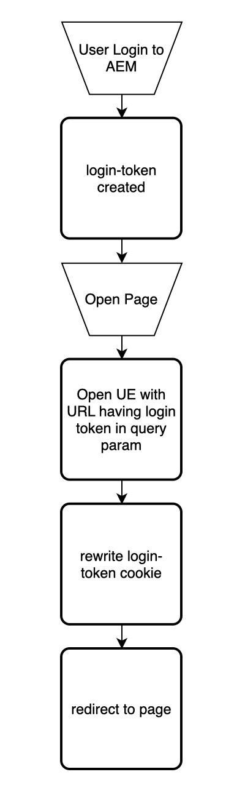

# The Universal Editor {#universal-editor}

Learn about the flexibility and power of the Universal Editor and how it can help power your headless experiences using AEM 6.5.

>[!NOTE]
>
>The Universal Editor is available in AEM 6.5 as part of an [early adoption program.](/help/release-notes/release-notes.md#sites)

## Overview {#overview}

The Universal Editor is a versatile visual editor that is part of Adobe Experience Manager Sites. It enables authors to do what-you-see-is-what-you-get (WYSIWYG) editing of any headless experience.

* Authors benefit from the Universal Editor’s flexibility as it is supports the same consistent visual editing for all forms of AEM headless content.
* Developers benefit from Universal Editor’s versatility as it also supports true decoupling of the implementation. It allows developers to utilize virtually any framework or architecture of their choice, without imposing any SDK or technology constraints.

Please see the [AEM as a Cloud Service documentation on the Universal Editor](https://experienceleague.adobe.com/en/docs/experience-manager-cloud-service/content/implementing/developing/universal-editor/introduction) for more detail.

## Architecture {#architecture}

The Universal Editor is a service that works in tandem with AEM to author content headlessly.

* The Universal Editor is hosted at `https://experience.adobe.com/#/aem/editor/canvas` and can edit an AEM 6.5 rendered page.
* The AEM page is read by the Universal Editor via the dispatcher from the AEM author instance.
* The Universal Editor writes changes back to the AEM author instance using the Universal Editor Service via the dispatcher.


## Authentication {#authentication}

1. User login (regardless if using SAML, OAuth, or LDAP) creates a `login-token` cookie which is returned to the user
1. All subsequent requests include the `login-token` cookie to prevent multiple round trips via the authentication providers.
1. When opening a page within the Universal Editor, the request opens the Universal Editor with the desired page as a query parameter.
   * Authentication Handler checks for the query parameter and authenticates the user as appropriate.
1. All subsequent requests within the Universal Editor will include the `login-token` cookie with the `samesite=none; partitioned` attribute to authenticate requests.



## Setup {#setup}

In order to test the Universal Editor you will need to:

1. Configure your AEM authoring instance.
1. Set up a local Universal Editor Service.
1. Adjust your dispatcher to allow the Universal Editor Service.

### Update and Configure AEM {#update-configure-aem}

There are a number of bundles that must be updated and configurations that must be set in order to use the Universal Editor with AEM 6.5.

#### Apply Latest Service Pack {#latest}

First make sure that you are running the latest service pack for AEM 6.5. You can download the latest service pack from [Software Distribution.](https://experienceleague.adobe.com/docs/experience-cloud/software-distribution/home.html)

#### Upgrade the Adobe Granite Token Authentication bundle. {#token-authentication}

Once you are running the latest service pack of AEM 6.5, you will need to make additional specific updates to your AEM authoring instance to support authoring with the Universal Editor. Begin by upgrading the **Adobe Granite Token Authentication** bundle.

1. Open the bundles page of the Configuration Manager.
   * `https://<host>:<port>/system/console/bundles`
1. Click **Install/Update...** at the top of the list of bundles.
1. In the **Upload/Install Bundles** dialog, select the **Start Bundle**, **Refresh Packages**, and **Install Version in Parallel** options.
1. Click **Choose file** and browse for the `crx-auth-token-2.7.0.jar` file provided to you by Adobe and then click **Install or Update**.
1. Refresh the list of bundles and then use the search field at the top of the list of bundles to search for **Adobe Granite Token Authentication**, clicking on **Apply Filter** to search the list.
1. You should see two **Adobe Granite Token Authentication** bundles: one with version `2.6.12` and one with version `2.7.0`.
1. Stop bundle with version `2.6.12` and then delete it.
1. Restart AEM.

#### Set the SameSite Attribute for the `login-token` cookie. {#samesite-attribute}

1. Open the Configuration Manager.
   * `http://<host>:<port>/system/console/configMgr`
1. Edit the **Adobe Granite Token Authentication Handler** in the list and change the **SameSite attribute for the login-token cookie** value to `Partitioned`.
1. Click **Save**.
   * There is no need to restart AEM.

#### Remove the `SAMEORIGIN` headers X-Frame option. {#sameorigin}

1. Open the Configuration Manager.
   * `http://<host>:<port>/system/console/configMgr`
1. Edit the **Apache Sling Main Servlet** in the list and click **Edit the configuration values**.
1. Delete the `X-Frame-Options=SAMEORIGIN` value from the **Additional response headers** attribute if it exists.
1. Click **Save**.
   * There is no need to restart AEM.

#### Install the Adobe Granite Query Token Authentication Handler. {#token-handler}

1. Open the bundles page of the Configuration Manager.
   * `https://<host>:<port>/system/console/bundles`
1. Click **Install/Update...** at the top of the list of bundles.
1. In the **Upload/Install Bundles** dialog, select the **Start Bundle**, **Refresh Packages**, and **Install Version in Parallel** options.
1. Click **Choose file** and browse for the `com.adobe.granite.auth.querytoken-1.0.8.jar` file provided to you by Adobe and then click **Install or Update**.
1. Refresh the list of bundles and then use the search field at the top of the list of bundles to search for **Adobe Granite Query Token Authentication Handler**, clicking on **Apply Filter** to search the list.
1. You should now see the **Adobe Granite Query Token Authentication Handler** bundle running.
1. Restart AEM.

#### Configure the Adobe Granite Query Parameter Authentication Handler. {#query-parameter}

1. Open the Configuration Manager.
   * `http://<host>:<port>/system/console/configMgr`
1. Edit the **Adobe Granite Query Parameter Authentication Handler** in the list and click **Edit the configuration values**.
1. Define the the authorization steps for query token authorization.
   * In the **Path** field, provide the repository path for which this authentication handler should be used by Sling.
   * In the **Query Parameter name** field, provide the query parameter which is used for authentication.
1. Click **Save**.
   * There is no need to restart AEM.

#### Configure the Apache Sling Login Admin Whitelist Configuration Fragment. {#whitelist-configuration}

1. Open the Configuration Manager.
   * `http://<host>:<port>/system/console/configMgr`
1. Search for **Apache Sling Login Admin Whitelist Configuration Fragment** in the list.
1. Below the **Apache Sling Login Admin Whitelist Configuration Fragment** entry, find the **granite** sub-configuration and click **Edit the configuration values**.
1. Add `com.adobe.granite.auth.querytoken` to the **Whitelisted BSNs** list.
1. Click **Save**.
   * There is no need to restart AEM.

#### Upgrade the Day Communique 5 WCM Core Implementation bundle. {#cq5-core}

1. Open the bundles page of the Configuration Manager.
   * `https://<host>:<port>/system/console/bundles`
1. Click **Install/Update...** at the top of the list of bundles.
1. In the **Upload/Install Bundles** dialog, select the **Start Bundle**, **Refresh Packages**, and **Install Version in Parallel** options.
1. Click **Choose file** and browse for the `cq-wcm-core-5.12.268-CQ650-B0008.jar` file provided to you by Adobe and then click **Install or Update**.
1. Refresh the list of bundles and then use the search field at the top of the list of bundles to search for **Day Communique 5 WCM Core Implementation**, clicking on **Apply Filter** to search the list.
1. You should see two **Day Communique 5 WCM Core Implementation** bundles: one with version `5.12.260` and one with version `5.12.268.CQ650-B0008`.
1. Stop bundle with version `5.12.260` and then delete it.
1. Restart AEM.

#### Define for which content paths or `sling:resourceTypes` the Universal Editor shall be opened. {#paths}

1. Open the Configuration Manager.
   * `http://<host>:<port>/system/console/configMgr`
1. Edit the **Universal Editor URL Service** in the list and click **Edit the configuration values**.
1. Define for which content paths or `sling:resourceTypes` the Universal Editor shall be opened.
   * In the **Universal Editor Opening Mapping** field, provide the paths for which the Universal Editor is opened.
   * In the **Sling:resourceTypes which shall be opened by Universal Editor** field, provide a list of resources which are opened directly by the Universal Editor.
1. Click **Save**.
   * There is no need to restart AEM.

You have updated and configured AEM 6.5 to use the Universal Editor. You must now set up a Universal Editor Service for development and update your Dispatcher to permit it.

### Set Up Universal Editor Service {#set-up-ue}

With AEM updated and configured, you can set up a local Universal Editor Service for your own local development and testing.

1. Install Node.js version >=20.
1. Download and unpack latest Universal Editor Service from [Software Distribution](https://experienceleague.adobe.com/en/docs/experience-cloud/software-distribution/home)
1. Configure Universal Editor Service via environment variables or `.env` file.
   * [See the AEM as a Cloud Service Universal Editor documentation for details.](https://experienceleague.adobe.com/en/docs/experience-manager-cloud-service/content/implementing/developing/universal-editor/local-dev#setting-up-service)
   * Note that you may need to use the `UES_MAPPING` option if internal IP rewriting is required.
1. Run `universal-editor-service.cjs`

### Update the Dispatcher {#update-dispatcher}

With AEM configured and a local Universal Editor service running, you will need to allow a reverse proxy for the new service [in the dispatcher.](https://experienceleague.adobe.com/en/docs/experience-manager-dispatcher/using/dispatcher)

1. Adjust the vhost file of author instance to include a reverse proxy.

   ```html
   <IfModule mod_proxy.c>
    ProxyPass "/universal-editor" "http://localhost:8008"
    ProxyPassReverse "/universal-editor" "http://localhost:8008"
   </IfModule>
   ```

1. Restart Apache.

## Instrument Your App {#instrumentation}

With AEM updated and a local Universal Editor Service running, you can start editing headless content using the Universal Editor.

However that content must be instrumented to take advantage of the Universal Editor. This involves including meta tags to instruct the editor how and where to persist the content. Details of this instrumentation are available in the [Universal Editor documentation for AEM as a Cloud Service.](https://experienceleague.adobe.com/en/docs/experience-manager-cloud-service/content/implementing/developing/universal-editor/getting-started#instrument-page)

Note that when following documentation for the Universal Editor with AEM as a Cloud Service, the following changes apply when using it with AEM 6.5.

* The protocol in meta tag must be `aem65` instead of `aem`.
  
  ```html
  <meta name="urn:adobe:aue:system:aemconnection" content={`aem65:${getAuthorHost()}`}/>
  ```

* The Universal Editor Service endpoint must be announced via a meta tag.

   ```html
   <meta name="urn:adobe:aue:config:service" content={`${getAuthorHost()}/universal-editor`}/>
   ```

* In the `plugins` section of the components definition, `aem65` must be used instead of `aem`.

>[!TIP]
>
>For a comprehensive guide for developers getting started with the Universal Editor, please see the document [Universal Editor Overview for AEM Developers](https://experienceleague.adobe.com/en/docs/experience-manager-cloud-service/content/implementing/developing/universal-editor/developer-overview) in the AEM as a Cloud Service documentation while keeping in mind the necessary changes needed for AEM 6.5 support as mentioned in this section.
