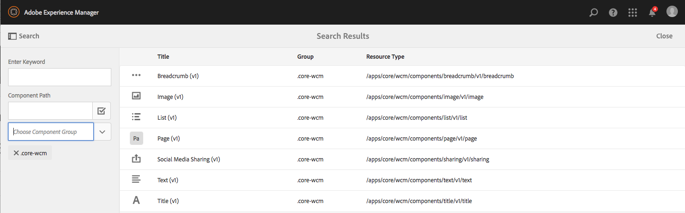
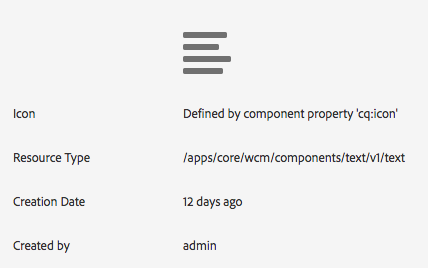
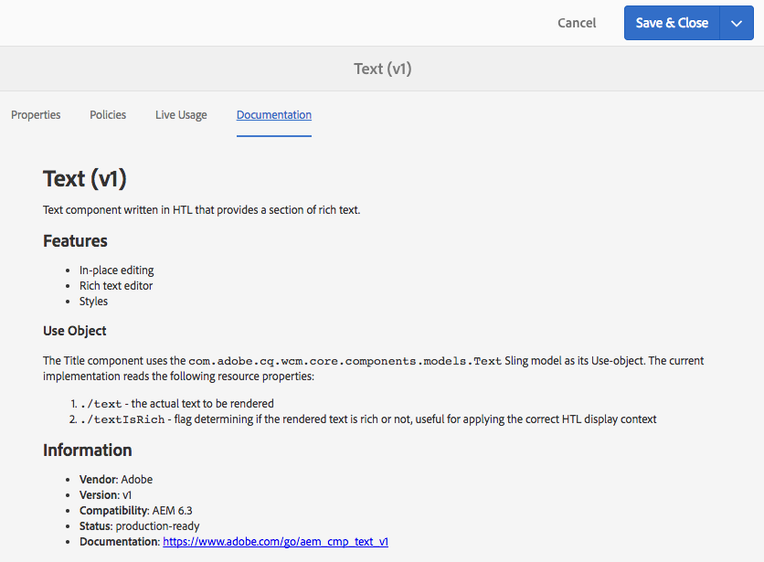
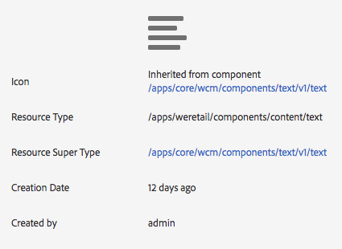
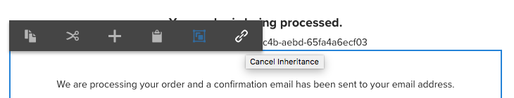
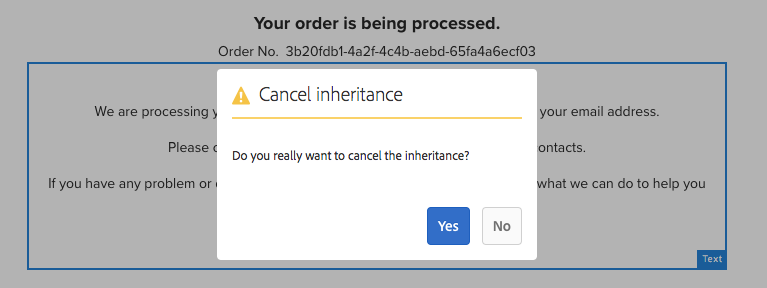
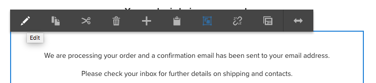
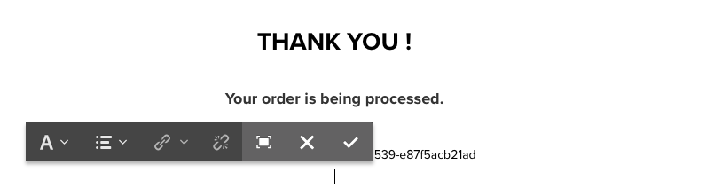
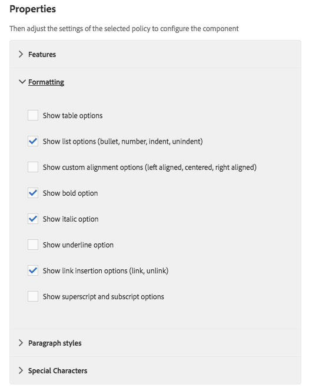

# Trying out Core Components in We.Retail{#trying-out-core-components-in-we-retail}

The core components are modern, flexible components featuring easy extensibility and allowing for simple integration into your projects. The core components have been built around several major design principles such as HTL, usability out-of-the-box, configurability, versioning, and extensibility. We.Retail has been built on core components.

## Trying it out {#trying-it-out}

1. Start Adobe Experience Manager (AEM) with the We.Retail sample content and open the [Components Console](/help/sites-authoring/default-components-console.md).

   **Global Navigation > Tools > Components**

1. Opening the rail in the Components Console, you can filter for a particular component group. The core components can be found in

    * `.core-wcm`: The standard core components
    * `.core-wcm-form`: The form submission core components

   Choose `.core-wcm`.

   

1. All core components are named **v1**, reflecting that this is the first version of this core component. Regular versions will be released going forward, which will be version-compatible with AEM and allowing easy upgrading so you can take advantage of the latest features.
1. Click **Text (v1)**.

   See that the **Resource Type** of the component is `/apps/core/wcm/components/text/v1/text`. Core components are found under `/apps/core/wcm/components` and are versioned per component.

   

1. Click the **Documentation** tab to see the developer documentation for the component.

   

1. Return to the Component Console. Filter for the group **We.Retail** and select the **Text** component.
1. See that the **Resource Type** points to a component as expected under `/apps/weretail` but the **Resource Super Type** points back to the core component `/apps/core/wcm/components/text/v1/text`.

   

1. Click the **Live Usage** tab to see on which pages this component is being used. Click the first **Thank You** page to edit the page.

   

1. On the Thank You page, select the text component and in the edit menu of the component click the Cancel Inheritance icon.

   [We.Retail has a globalized site structure](/help/sites-developing/we-retail-globalized-site-structure.md) where content is pushed from language masters to [live copies through a mechanism called inheritance](/help/sites-administering/msm.md). For this reason, inheritance must be canceled to allow a user to manually edit text.

   

1. Confirm the cancellation by clicking **Yes**.

   

1. Once the inheritance is canceled and you select the text components, many more options are available. Click **Edit**.

   

1. You can now see what edit options are available to the text component.

   

1. From the **Page Information** menu, select **Edit Template**.
1. In the Template Editor of the page, click the **Policy** icon of the Text component in the **Layout Container** of the page.

   

1. The core components allow a template author to configure which Properties are available to the page authors. These include features such as allowed paste sources, formatting options, and available paragraph styles.

   Such design dialogs are available for many core components and work hand-in-hand with the template editor. Once enabled, they are available to the author through the component editors.

   

## Further Information {#further-information}

For further information on the core components, see the authoring document [Core Components](https://experienceleague.adobe.com/docs/experience-manager-core-components/using/introduction.html) for an overview of the capabilities of the core components and the developer document [Developing Core Components](https://experienceleague.adobe.com/docs/experience-manager-core-components/using/developing/overview.html) for a technical overview.

Also you may wish to further investigate [editable templates](/help/sites-developing/we-retail-editable-templates.md). Refer to the authoring document [Creating Page Templates](/help/sites-authoring/templates.md) or the developer document Page [Templates - Editable](/help/sites-developing/page-templates-editable.md) for complete details on editable templates.
