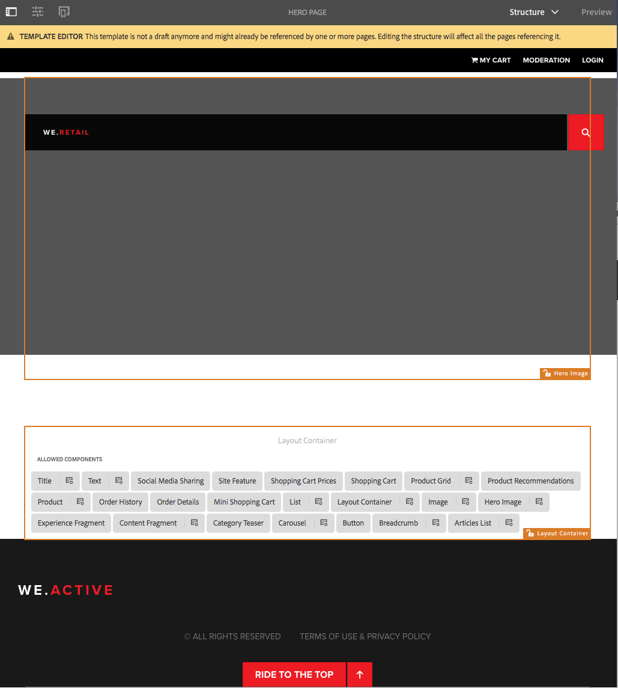
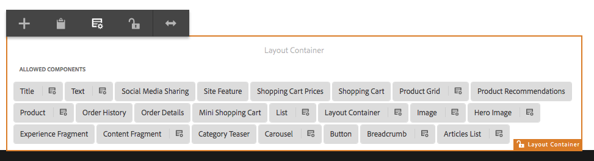
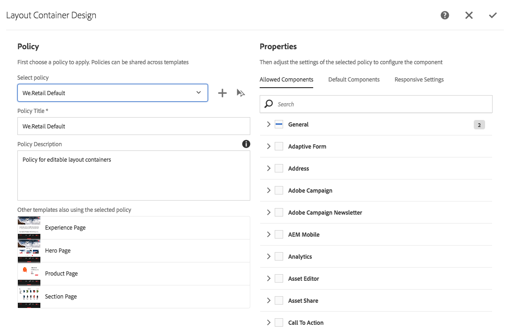
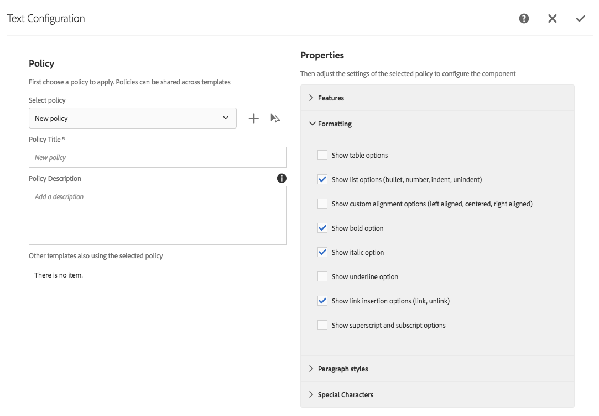

# Trying out Editable Templates in We.Retail{#trying-out-editable-templates-in-we-retail}

With the editable templates, creating and maintaining templates is no longer a developer-only task. A type of power-user, who is called a template author, can now create templates. Developers are still required to setup the environment, create client libraries, and create the components to be used, but once these basics are in place the template author has the flexibility to create and configure templates without a development project.

All pages in We.Retail are based on editable templates, allowing non-developers to adapt and customize the templates.

## Trying it out {#trying-it-out}

1. Edit the Equipment page of the language master branch.

   http://localhost:4502/editor.html/content/we-retail/language-masters/en/equipment.html

1. The mode selector no longer offers a Design mode. All pages for We.Retail are based on editable templates and to alter the design of editable templates they must be edited in the template editor.
1. From the **Page information** menu select **Edit Template**.
1. You are now editing the Hero Page template.

   The structure mode of the page lets you modify the structure of the template. This includes for example, the components that are allowed in the layout container.

   

1. Configure the policies for the Layout Container to define which components are allowed in the container.

   Policies are the equivalent of design configurations.

   

1. In the design dialog of the layout container, you can

    * Select an existing policy or create a policy for the container
    * Select which components are allowed in the container
    * Define the default components to be placed when an asset is dragged to the container

   

1. Back in the template editor, you can edit the policy of the text component within the layout container.

   This lets you:

    * Select an existing policy or create a policy for the container
    * Define the features available to the page author when using this component such as

        * Allowed paste sources
        * Formatting options
        * Allowed paragraph styles
        * Allowed special characters

   Many components based on the core components allow the configuration of options at the component level through the editable templates, removing the need for customization by developers.

   

1. Back in the template editor, you can use the mode selector to change to **Initial Content** mode to define what content is required on the page.

   **Layout** mode can be used as it is on a normal page to define the layout for the template.

## More Information {#more-information}

For further information see the authoring document [Creating Page Templates](/help/sites-authoring/templates.md) or the developer document Page [Templates - Editable](/help/sites-developing/page-templates-editable.md) for complete technical details on editable templates.

You may also wish to investigate [core components](/help/sites-developing/we-retail-core-components.md). See the authoring document [Core Components](https://experienceleague.adobe.com/docs/experience-manager-core-components/using/introduction.html) for an overview of the capabilities of the core components and the developer document [Developing Core Components](https://helpx.adobe.com/experience-manager/core-components/using/developing.html) for a technical overview.
