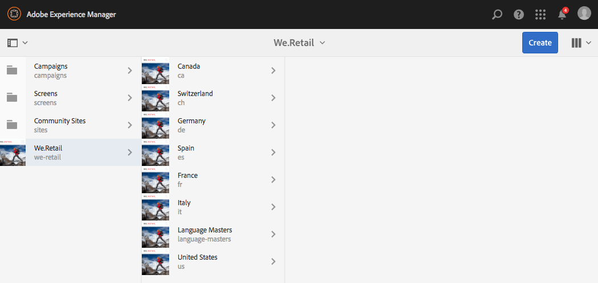
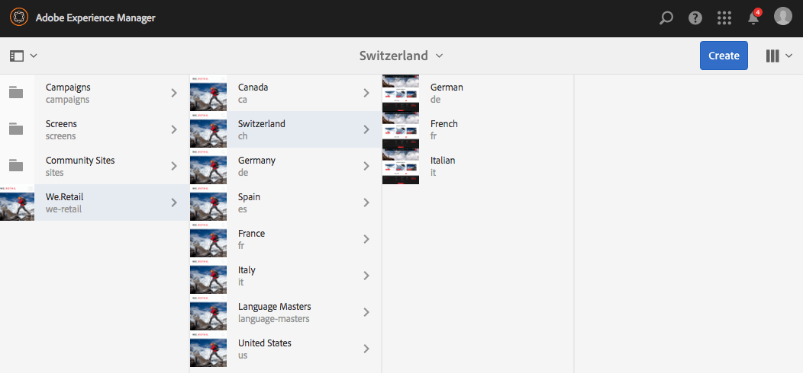
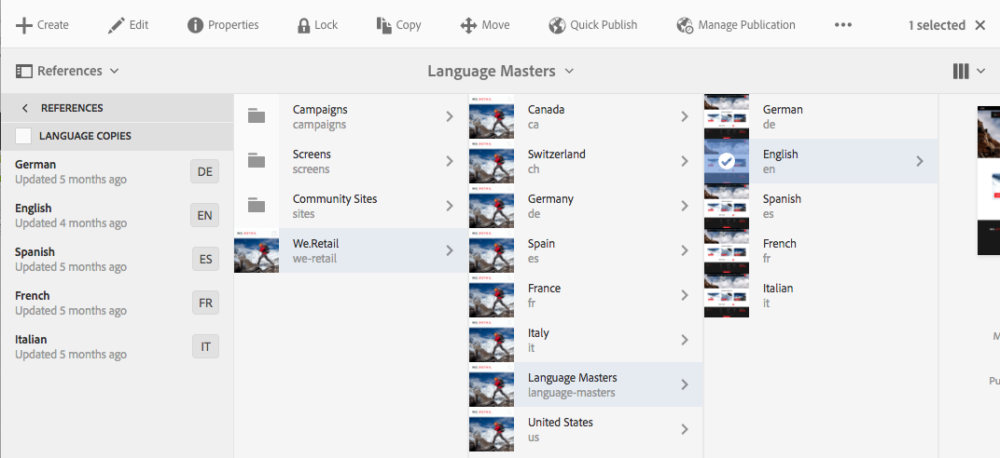
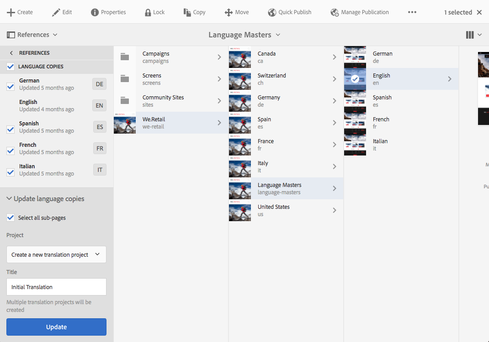
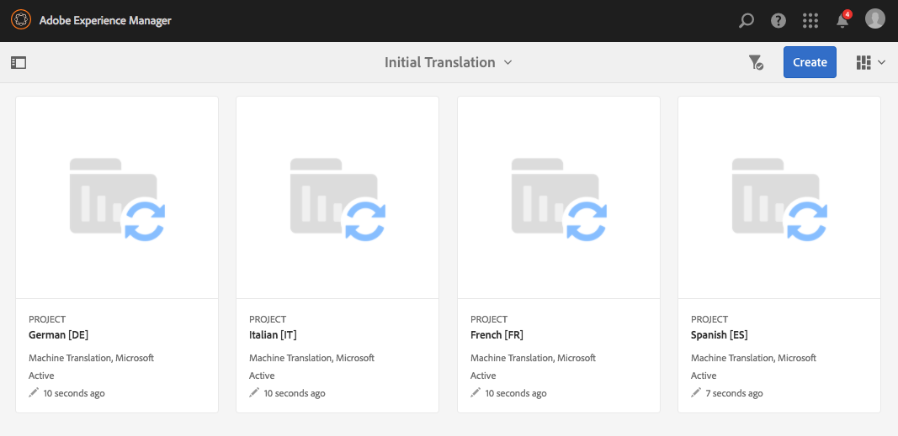
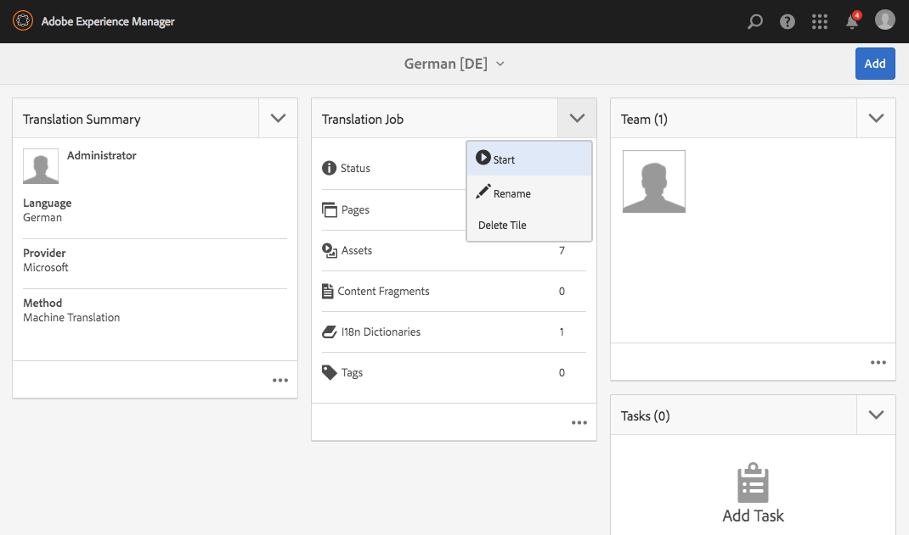
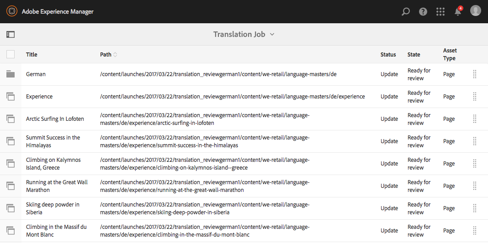
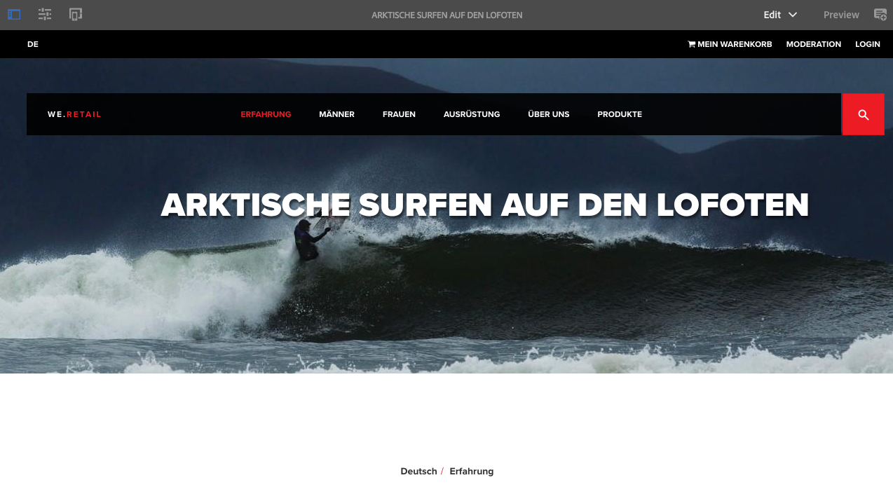

# Trying out the Globalized Site Structure in We.Retail{#trying-out-the-globalized-site-structure-in-we-retail}

We.Retail has been built with a globalized site structure offering a language master that can be live-copied to country-specific web sites. Everything is set up out-of-the-box to let you experiment with this structure and the built-in translation capabilities.

## Trying it out {#trying-it-out}

1. Open the sites console from **Global Navigation > Sites**.
1. Switch to column view (if not already active) and select We.Retail. Note the example country structure with Switzerland, the United States, France, and so on, along side the Language Master.

   

1. Select Switzerland and see the language roots for the languages of that country. There is not yet any content below these roots.

   

1. Switch to the list view and see that the language copies for the countries are all live copies.

   

1. Return to column view and click the Language Master and see the language master roots with content. Only English has content.

   We.Retail does not come with any translated content, but the structure and configuration is in place to let you demonstrate the translation services.

   

1. With the English Language Master selected, open the **References** rail in the sites console and select **Language Copies**.

   

1. Tick the checkbox next to the **Language Copies** label to select all language copies. In the **Update language copies** section of the rail, select the option to **Create a new translation project**. Provide a name for the project and click **Update**.

   

1. A project is created for each language translation. View them under **Navigation > Projects**.

   

1. Click German to see the details of the translation project. The status is in **Draft**. To start the translation with Microsoft&reg;'s translation service, click the chevron next to the **Translation Job** heading and select **Start**.

   

1. The translation project starts. Click the ellipsis at the bottom of the card labeled Translation Job to see the details. Pages with the state **Ready for review** have already been translated by the translation service.

   

1. Selecting one of the pages in the list and then **Preview in Sites** in the toolbar opens the translated page in the page editor.

   

>[!NOTE]
>
>This procedure demonstrated the built-in integration with Microsoft&reg; machine translation. Using the [AEM Translation Integration Framework](/help/sites-administering/translation.md), you can integrate with many standard translation services to orchestrate the translation of AEM.

## More information {#further-information}

For more information, see the authoring document [Translating Content for Multilingual Sites](/help/sites-administering/translation.md) for complete technical details.
