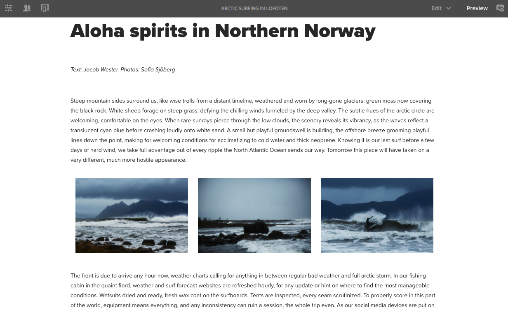
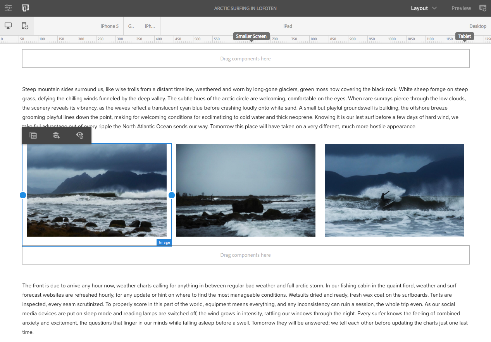
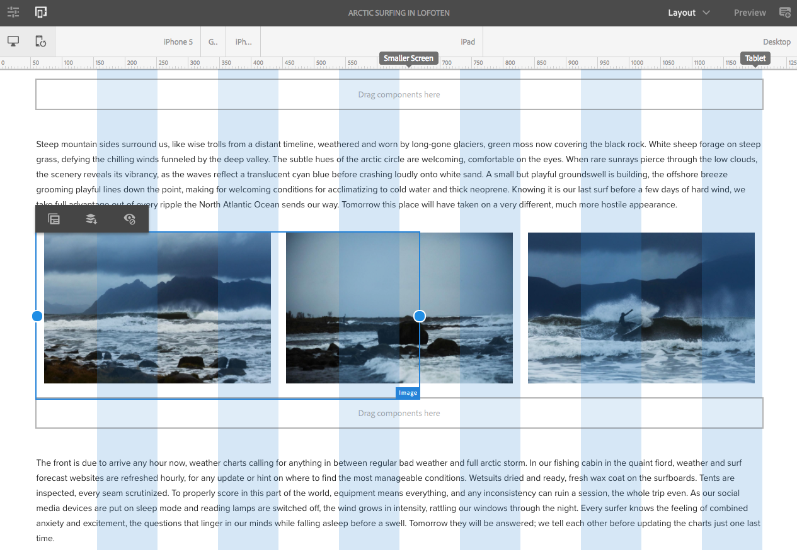

# Trying out Responsive Layout in We.Retail{#trying-out-responsive-layout-in-we-retail}

All We.Retail pages use the Layout Container component to implement responsive design. The layout container provides a paragraph system that lets you position components within a responsive grid. This grid can rearrange the layout according to the device/window size and format. The component is used in conjunction with the **Layout** mode in the page editor, which lets you create and edit your responsive layout dependent on device.

## Trying it out {#trying-it-out}

1. Edit the Arctic Surfing page in the Experiences section of the language master branch.

   http://localhost:4502/editor.html/content/we-retail/language-masters/en/experience/arctic-surfing-in-lofoten.html

1. Switch to **Preview** to see the page as it would be rendered to a visitor of the website. Scroll down to the content of the article *Aloha spirits in Norther Norway*.

   

1. Resize your browser window and watch as the layout adapts dynamically to the resizing.

   

1. Switch to Layout mode. The emulator toolbar is automatically shown, allowing you to plan your layout per targeted device.

   Selecting a component displays floating and hiding options in the edit menu along with resizing handles for the component.

   

1. Grabbing and dragging the resize handle of the component automatically shows the layout grid to assit you with the resizing.

   

## Further Information {#further-information}

For more information, see the authoring document [Responsive Layout](/help/sites-authoring/responsive-layout.md) or the administrator document [Configuring Layout Container and Layout Mode](/help/sites-administering/configuring-responsive-layout.md) for complete technical details.
