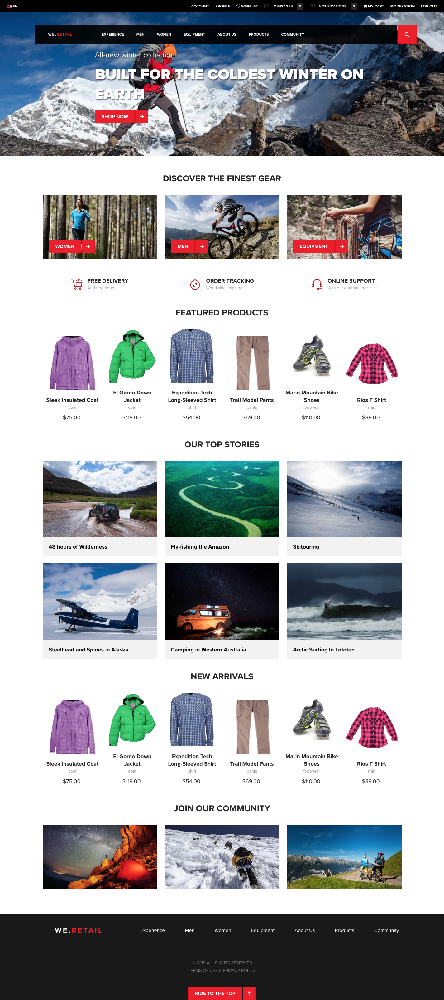

# We.Retail Reference Implementation{#we-retail-reference-implementation}

## Introduction {#introduction}

We.Retail is a reference implementation and sample content that illustrates the recommended way of setting up an online presence with Adobe Experience Manager.

We.Retail uses the latest Adobe Experience Manager (AEM) technologies such as HTL, responsive layouts, editable templates, core components, and much more.

While it illustrates a retail vertical, the way the site is set up can be applied to any vertical, and only the product catalog and cart features are retail-specific.

## Features {#features}

As AEM's standard reference implementation, We.Retail showcases some of the most powerful features of AEM.

| **Feature** |**Description** |**Interested?** |
|---|---|---|
| [Globalized site structure](/help/sites-administering/tc-bp.md) |We.Retail includes language masters which are live-copied into country-specific sites. | [Try it!](/help/sites-developing/we-retail-globalized-site-structure.md) |
| [Responsive layout](/help/sites-authoring/responsive-layout.md) |All pages feature a responsive layout to adapt dynamically to screen and device size. | [Try it!](/help/sites-developing/we-retail-responsive-layout.md) |
| [Editable templates](/help/sites-developing/page-templates-editable.md) |All pages are based on editable templates, allowing non-developers to adapt and customize the templates. | [Try it!](/help/sites-developing/we-retail-editable-templates.md) |
| [HTML Template Language](https://experienceleague.adobe.com/en/docs/experience-manager-htl/content/overview) |All components are based on HTL |  |
| [eCommerce capabilities](/help/commerce/cif-classic/developing/ecommerce.md) |Features a product catalog |  |
| [Communities sites](/help/communities/overview.md) |Allowing visitors to join in community discussions, read blogs, and much more |  |
| [Core Components](https://experienceleague.adobe.com/en/docs/experience-manager-core-components/using/introduction) |All components are based on the new core components and are more usable and user-configurable out-of-the-box | [Try it!](/help/sites-developing/we-retail-core-components.md) |
| [Content Fragments](/help/assets/content-fragments/content-fragments.md) |The We.Retail Experiences section showcases the power of reusing content by way of content fragments. | [Try them!](/help/sites-developing/we-retail-content-fragments.md) |
| [Experience Fragments](/help/sites-authoring/experience-fragments.md) |An Experience Fragment is a group of one or more components including content and layout that can be referenced within pages. | [Try them!](/help/sites-developing/we-retail-experience-fragments.md) |

## Getting Started {#getting-started}

We.Retail is delivered as AEM's sample content. To use, simply [start AEM as you normally would](/help/sites-deploying/deploy.md#getting-started), making sure that sample content is not disabled.

>[!CAUTION]
>
>Do not install We.Retail on production instances. Production instances should be started in `nosamplecontent` [run mode](/help/sites-deploying/configure-runmodes.md).

>[!CAUTION]
>
>We.Retail is based on the latest AEM technology and therefore does not support [classic UI authoring](/help/sites-classic-ui-authoring/classic-page-author-first-steps.md).

### Latest Version {#latest-version}

Although We.Retail is distributed with the AEM release, updates to the content and its features may be made after the release. Therefore it is possible to [download the latest release from GitHub](https://github.com/Adobe-Marketing-Cloud/aem-sample-we-retail/releases) and then [upload](/help/sites-administering/package-manager.md#uploading-packages-from-your-file-system) and [install](/help/sites-administering/package-manager.md#installing-packages) it as a package on your AEM instance.

### First Steps {#first-steps}

1. Once AEM is started (and/or We.Retail is installed), the site **We.Retail** is available in the [Sites console](/help/sites-authoring/basic-handling.md#global-navigation).
1. For example, the following page can be opened and it should look as displayed in the [appendix](#appendix) below:

   `https://<server name>:<port number>/editor.html/content/we-retail/language-masters/en.html`

## We.Retail & Geometrixx {#we-retail-geometrixx}

Geometrixx and its many incarnations served as sample content in earlier versions of AEM. Since version 6.3, We.Retail has been the sample content delivered with AEM and serves as the new standard reference implementation.

We.Retail is technically more robust and exploits the latest AEM technology to be more flexible and scalable, while also demonstrating the newest features of the product.

### Feature Comparison {#feature-comparison}

The following table gives an overview of the major features that are available in We.Retail as compared to Geometrixx.

* **Available** means that examples of the feature are found in the sample content.
* **Not available** means that examples of the feature are not available in the sample content, but does not mean that the feature itself is not.

| **Feature** |**We.Retail** |**Geometrixx** |
|---|---|---|
| Globalized site structure |Language masters live-copied into country-specific sites |Not available |
| Content Fragments |Available |Not available |
| Experience Fragments |Available |Not available |
| Responsive Layout |For all pages |Only Geometrixx Media |
| Editable Templates |For all pages |Not available |
| HTL |All components |Limited |
| Targeting |For all pages |Only Geometrixx Outdoors |
| Screens |Available |Not available |
| Mobile |Not available |Available |
| Manuscripts |Not available |Available |
| Carousel viewer, downloads, and chart components |Not available |Available |
| Column control |Replaced by layout container |Available |
| Forms |Not available |Available |
| Campaign |No email samples |Available |

>[!NOTE]
>
>This list strives to be complete, but should not be considered exhaustive.

## Contribute {#contribute}

We.Retail has been released as an open-source project and the latest version of the source code can be downloaded from GitHub.

CODE ON GITHUB

You can find the code of this page on GitHub.

* [Open aem-sample-we-retail project on GitHub](https://github.com/Adobe-Marketing-Cloud/aem-sample-we-retail)
* Download the project as [a ZIP file](https://codeload.github.com/Adobe-Marketing-Cloud/aem-sample-we-retail/zip/refs/heads/master)

The latest release can also be [downloaded directly](https://github.com/Adobe-Marketing-Cloud/aem-sample-we-retail/releases/tag/we.retail.reactor-4.0.0) as an installable package.

If you encounter problems, file a [GitHub issue](https://github.com/Adobe-Marketing-Cloud/aem-sample-we-retail/issues).

Feel free to fork or to contribute with [pull requests](https://github.com/Adobe-Marketing-Cloud/aem-sample-we-retail/pulls).

## Preview {#preview}

Preview of the We.Retail welcome page:

