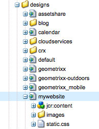
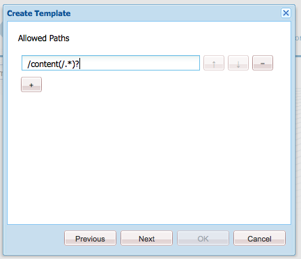
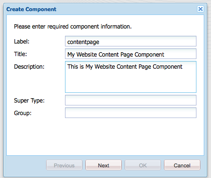
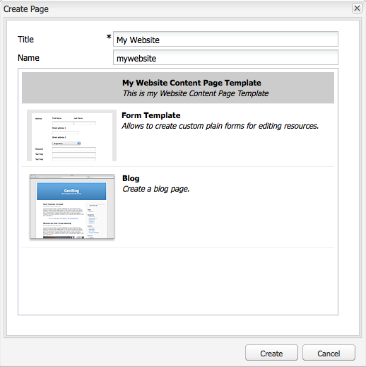
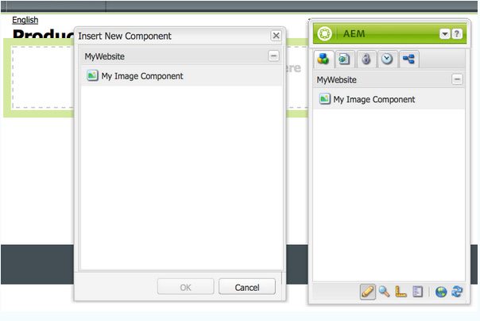
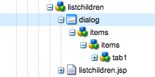
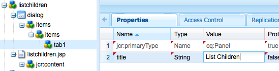
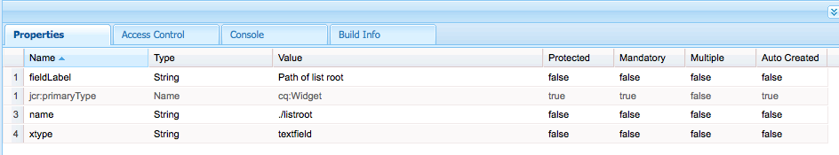
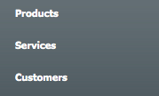
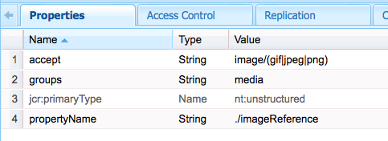

# Create a Fully-Featured Website (JSP){#create-a-fully-featured-website-jsp}

>[!CAUTION]
>
>This article describes how to create a website using JSP and based on the classic UI. Adobe recommends leveraging the latest AEM technologies for your websites as described in detail in the article [Getting Started Developing AEM Sites](/help/sites-developing/getting-started.md).

This tutorial enables you to create a fully featured website with Adobe Experience Manager (AEM). The website will be based on a generic website and is targeted primarily at web developers. All development will take place within an author environment.

This tutorial describes how to:

1. Install AEM.
1. Access CRXDE Lite (the development environment).  
1. Set up the project structure in CRXDE Lite.  
1. Create the template, component, and scripts used as the basis for creating content pages.
1. Create the root page for your website and then content pages.
1. Create the following components for use on your pages:

    * **[!UICONTROL Top Navigation]** 
    * **[!UICONTROL List Children]** 
    * **[!UICONTROL Logo]** 
    * **[!UICONTROL Image]** 
    * **[!UICONTROL Text-Image]** 
    * **[!UICONTROL Search]**

1. Include various foundation components.

After performing all the steps, your pages will look as follows:


**Download the final result**

To follow along with the tutorial rather than performing the exercises, download website-1.0.zip. This file is an AEM content package that contains the results of this tutorial. Use [Package Manager](/help/sites-administering/package-manager.md) to install the package to your author instance.

>[!NOTE]
>Installing this package will overwrite any resources on your authoring instance that you have created using this tutorial.

Website content package

[Get File](assets/website-1_0.zip)

## Installing Adobe Experience Manager {#installing-adobe-experience-manager}

To install an AEM instance for developing your website, follow the instructions for setting up a [deployment environment with author and publish instances](/help/sites-deploying/deploy.md#author-and-publish-installs), or perform a [generic installation](/help/sites-deploying/deploy.md#default-local-install). The generic installation involves downloading the AEM Quickstart JAR file, placing the license.properties file in the same directory as the JAR file, and double-clicking the JAR file.

After you have installed AEM, access the CRXDE Lite development environment by clicking the CRXDE Lite link on the Welcome page: 


>[!NOTE]
>
>The URL of CRXDE Lite for an AEM authoring instance that is installed locally using the default port is [http://localhost:4502/crx/de/](http://localhost:4502/crx/de/).

## Setting up the project structure in CRXDE Lite {#setting-up-the-project-structure-in-crxde-lite}

Use CRXDE Lite to create the mywebsite application structure in the repository:

1. In the tree on the left side of CRXDE Lite, right-click the **`/apps`** folder and click **[!UICONTROL Create > Create Folder]**. In the **Create Folder** dialog, type `mywebsite` as the folder name and click **[!UICONTROL OK**.
1. Right-click the `/apps/mywebsite` folder and click **[!UICONTROL Create > Create Folder]**. In the **[!UICONTROL Create Folder]** dialog, type `components` as the folder name and click **[!UICONTROL OK]**.
1. Right-click the `/apps/mywebsite` folder and click **[!UICONTROL Create > Create Folder]**. In the **[!UICONTROL Create Folder]** dialog, type `templates` as the folder name and click **[!UICONTROL OK]**.

   The structure in the tree should now look something like this:

   

1. Click **[!UICONTROL Save All]**.

## Setting up the Design {#setting-up-the-design}

In this section, you create the design for your application using the Designer tool. The design provides CSS and image resources for your web site.

>[!NOTE]
>
>Click the following link to download ``mywebsite.zip``. The archive contains the static.css and image files for your design.

Sample static.css file and images

[Get File](assets/mywebsite.zip)

1. On the AEM Welcome page, click **[!UICONTROL Tools]**. ([http://localhost:4502/libs/cq/core/content/welcome.html](http://localhost:4502/libs/cq/core/content/welcome.html))

   

1. In the folder tree, select the **[!UICONTROL Designs]** folder and then click **[!UICONTROL New > New Page]**. Type `mywebsite` as the title and click **[!UICONTROL Create]**.  

1. If the mywebsite item does not appear in the table, refresh the tree or the table.  

1. [Using WebDAV](/help/sites-administering/webdav-access.md) access to the URL at http://localhost:4502, copy the sample `static.css` file and `images` folder from the downloaded mywebsite.zip file into the `/etc/designs/mywebsite` folder. 

   

## Creating the Contentpage Template, Component, and Script {#creating-the-contentpage-template-component-and-script}

In this section, you create the following:

* The contentpage template that will be used to create content pages in the example website
* The contentpage component that will be used to render pages of content
* The contentpage script

### Creating the Contentpage Template {#creating-the-contentpage-template}

Create a template to use as the basis of the web pages of your site.

A template defines the default content of a new page. Complex websites may use several templates for creating the different types of pages in the site. In this exercise, all pages are based on one simple template.

1. In the folder tree of CRXDE Lite, right-click `/apps/mywebsite/templates` and click **[!UICONTROL Create > Create Template]**.  

1. In the Create Template dialog, type the following values and then click **[!UICONTROL Next]**:

    * **[!UICONTROL Label]**: contentpage
    * **[!UICONTROL Title]**: My Website Content Page Template
    * **[!UICONTROL Description]**: This is my Website Content Page Template
    * **[!UICONTROL Resource Type]**: mywebsite/components/contentpage

   Use the default value for the Ranking property.

   

   The resource type identifies the component that renders the page. In this case, all pages created using the contentpage template are rendered by the `mywebsite/components/contentpage` component.

1. To specify the paths of the pages that can use this template, click the plus button and type `/content(/.*)?` in the text box that appears. Then, click **[!UICONTROL Next]**.

   

   The value of the allowed path property is a *regular expression.* Pages that have a path that matches the expression can use the template. In this is case the regular expression matches the path of the `/content` folder and all subpages.

   When an author creates a page below `/content`, the **[!UICONTROL contentpage]** template appears in a list of available templates to use.

1. Click **[!UICONTROL Next** in the **[!UICONTROL Allowed Parents]** and **[!UICONTROL Allowed Children]** panels and click **[!UICONTROL OK]**. In CRXDE Lite, click **[!UICONTROL Save All]**.

   

#### Creating the Contentpage Component {#creating-the-contentpage-component}

Create the *component* that defines the content and renders the pages that use the contentpage template. The location of the component must correspond with the value of the Resource Type property of the contentpage template.

1. In CRXDE Lite, right-click `/apps/mywebsite/components` and click **[!UICONTROL Create > Component]**.
1. In the **[!UICONTROL Create Component]** dialog, type the following property values:

    * **[!UICONTROL Label]**: contentpage
    * **[!UICONTROL Title]**: My Website Content Page Component
    * **[!UICONTROL Description]**: This is My Website Content Page Component

   

   The location of the new component is `/apps/mywebsite/components/contentpage`. This path corresponds with the resource type of the contentpage template (minus the initial `/apps/` part of the path).

   This correspondence connects the template to the component and is critical to the correct functioning of the website.

1. Click **[!UICONTROL Next]** until the **[!UICONTROL Allowed Children]** panel of the dialog appears, and then click **[!UICONTROL OK]**. In CRXDE Lite, click **[!UICONTROL Save All]**.

   The structure now looks as follows:

   

#### Developing the Contentpage Component Script {#developing-the-contentpage-component-script}

Add code to the contentpage.jsp script to define the page content.

1. In CRXDE Lite, open the file `contentpage.jsp` in `/apps/mywebsite/components/contentpage`. The file contains the following code by default:

   ```java
   <%--
   
     My Website Content Page Component component.
   
     This is My Website Content Page Component.
   
   --%><%
   %><%@include file="/libs/foundation/global.jsp"%><%
   %><%@page session="false" %><%
   %><%
       /* TODO add you code here */
   %>
   ```

1. Copy the following code and paste it in contentpage.jsp after the default code:

   ```java
   <%@ page language="java" contentType="text/html; charset=ISO-8859-1"
       pageEncoding="ISO-8859-1"%>
   <!DOCTYPE html PUBLIC "-//W3C//DTD HTML 4.01 Transitional//EN" 
   "https://www.w3.org/TR/html4/loose.dtd">
   <html>
   <head>
   <meta http-equiv="Content-Type" content="text/html; charset=ISO-8859-1">
   <title>My title</title>
   </head>
   <body>
   <div>My body</div>
   </body>
   </html>
   ```

1. Click **[!UICONTROL Save All]** to save your changes.

### Creating your Website Page and Content Pages {#creating-your-website-page-and-content-pages}

In this section, you create the following pages which all use the contentpage template: My Website, English, Products, Services, and Customers.

1. On the AEM Welcome page ([http://localhost:4502/libs/cq/core/content/welcome.html](http://localhost:4502/libs/cq/core/content/welcome.html)), click Websites.

   

1. In the folder tree, select the **[!UICONTROL Websites]** folder and then click **[!UICONTROL New > New Page]**.
1. In the **[!UICONTROL Create Page]** window, enter the following:

    * **[!UICONTROL Title]**: `My Website`
    * **[!UICONTROL Name]**: `mywebsite`
    * Select the **[!UICONTROL My Website Content Page Template]**

   

1. Click **[!UICONTROL Create]**. In the folder tree, select the `/Websites/My Website` page and click **[!UICONTROL New > New Page]**.
1. In the **[!UICONTROL Create Page]** dialog, enter the following property values and then click Create:

    * **[!UICONTROL Title]**: English
    * **[!UICONTROL Name]**: en
    * Select the **[!UICONTROL My Website Content Page Template]**

1. In the folder tree, select the `/Websites/My Website/English` page and click **[!UICONTROL New > New Page]**.
1. In the **[!UICONTROL Create Page]** dialog, enter the following property values and then click **[!UICONTROL Create]**:

    * **[!UICONTROL Title]**: Products
    * Select the **[!UICONTROL My Website Content Page Template]**

1. In the folder tree, select the `/Websites/My Website/English` page and click **[!UICONTROL New > New Page]**.
1. In the **[!UICONTROL Create Page]** dialog, enter the following property values and then click **[!UICONTROL Create]**:

    * **Title**: Services
    * Select the **[!UICONTROL My Website Content Page Template]**

1. In the folder tree, select the `/Websites/My Website/English` page and click **[!UICONTROL New > New Page]**. 
1. In the **[!UICONTROL Create Page]** dialog, enter the following property values and then click **[!UICONTROL Create]**:

    * **Title**: Customers
    * Select the **[!UICONTROL My Website Content Page Template]**

   Your structure looks as follows:

   

1. To link your pages to the mywebsite design, in CRXDE Lite, select the `/content/mywebsite/en/jcr:content` node. On the **[!UICONTROL Properties]** tab, type the following values for a new property and then click Add:

    * **[!UICONTROL Name]**: cq:designPath
    * **[!UICONTROL Type]**: String
    * **[!UICONTROL Value]**: /etc/designs/mywebsite

   

1. In a new web browser tab or window, open [http://localhost:4502/content/mywebsite/en/products.html](http://localhost:4502/content/mywebsite/en/products.html) to see the Products page:

   

### Enhancing the Contentpage Script {#enhancing-the-contentpage-script}

This section describes how to enhance the contentpage script using the AEM foundation component scripts and by writing your own scripts.

The **[!UICONTROL Products]** page will look as follows:

 

#### Using the Foundation Page Scripts {#using-the-foundation-page-scripts}

In this exercise, you configure your pagecontent component so that its supertype is the AEM Page component. Because components inherit the features of their supertype, your pagecontent inherits the scripts and properties of the Page component.

For example, in your component JSP code, you can reference the scripts that the supertype component provides as though they are included in your component.

1. In CRXDE Lite, add a property to the `/apps/mywebsite/components/contentpage` node.

    1. Select the `/apps/mywebsite/components/contentpage` node.
    1. At the bottom of the Properties tab, type the following property values and then click Add:

        * **[!UICONTROL Name]**: sling:resourceSuperType
        * **[!UICONTROL Type]**: String
        * **[!UICONTROL Value]**: foundation/components/page

    1. Click **[!UICONTROL Save All]**.

1. Open the `contentpage.jsp` file under `/apps/mywebsite/components/contentpage` and replace the existing code with the following code:

   ```xml
   <%@include file="/libs/foundation/global.jsp"%><%
   %><%@page session="false" contentType="text/html; charset=utf-8" %><%
   %><!DOCTYPE HTML PUBLIC "-//W3C//DTD HTML 4.01//EN" "https://www.w3.org/TR/html4/strict.dtd">
   <html>
   <cq:include script="head.jsp"/>
   <cq:include script="body.jsp"/>
   </html>
   ```

1. Save your changes.
1. In your browser, reload the **[!UICONTROL Products]** page. It looks as follows:

   

   Open the page source to see the javascript and HTML elements that the head.jsp and body.jsp scripts generated. The following script snippet opens Sidekick when you open the page:

   ```java
   CQ.WCM.launchSidekick("/content/mywebsite/en/products",
               {propsDialog: "/libs/foundation/components/page/dialog",
                  locked: false locked: false
                }); 
   ```

#### Using your own scripts {#using-your-own-scripts}

In this section you create several scripts that each generate a part of the page body. You then create the body.jsp file in the pagecontent component to override the body.jsp of the AEM Page component. In your body.jsp file, you include your scripts that generate the different parts of the page body.

**Tip:** When a component includes a file that has the same name and relative location as a file in the component's supertype, it is called *overlaying*.

1. In CRXDE Lite, create the file `left.jsp` under `/apps/mywebsite/components/contentpage`:

    1. Right-click the node `/apps/mywebsite/components/contentpage`, then select **[!UICONTROL Create]** then **[!UICONTROL Create File]**.
    1. In the window, type `left.jsp` as the** Name** and click **[!UICONTROL OK]**.

1. Edit the file `left.jsp` to remove the existing content and replace with the following code:

   ```java
   <%@include file="/libs/foundation/global.jsp"%><%
   %><div class="left">
   <div>logo</div>
   <div>newslist</div>
   <div>search</div>
   </div>
   ```

1. Save the changes.
1. In CRXDE Lite, create the file `center.jsp` under `/apps/mywebsite/components/contentpage`:

    1. Right-click the node `/apps/mywebsite/components/contentpage`, select **[!UICONTROL Create]**, then **[!UICONTROL Create File]**.
    1. In the dialog, type `center.jsp` as **[!UICONTROL Name]** and click **[!UICONTROL OK]**.

1. Edit the file `center.jsp` to remove the existing content and replace it with the following code:

   ```java
   <%@include file="/libs/foundation/global.jsp"%><%
   %><div class="center">
   <div>trail</div>
   <div>title</div>
   <div>parsys</div>
   </div>
   ```

1. Save the changes.
1. In CRXDE Lite, create the file `right.jsp` under `/apps/mywebsite/components/contentpage`:

    1. Right-click the node `/apps/mywebsite/components/contentpage`, select **[!UICONTROL Create]**, then **[!UICONTROL Create File]**.
    1. In the dialog box, type `right.jsp` as **[!UICONTROL Name]** and click **[!UICONTROL OK]**.

1. Edit the file `right.jsp` to remove the existing content and replace with the following code:

   ```java
   <%@include file="/libs/foundation/global.jsp"%><%
   %><div class="right">
   <div>iparsys</div>
   </div>
   ```

1. Save the changes.
1. In CRXDE Lite, create the file `body.jsp` under `/apps/mywebsite/components/contentpage`:
1. Edit the file `body.jsp` to remove the existing content and replace with the following code:

   ```java
   <%@include file="/libs/foundation/global.jsp"%><%
   %><body>
   <div id="CQ">
   <div class="topnav">topnav</div>
   <div class="content">
   <cq:include script="left.jsp" />
   <cq:include script="center.jsp" />
   <cq:include script="right.jsp" />
   </div>
   <div class="footer">
   <div class="toolbar">toolbar</div>
   </div>
   </div>
   </body>
   ```

1. Save the changes.
1. In your browser, reload the **[!UICONTROL Products]** page. It looks as follows:

   

### Creating the Top Navigation Component {#creating-the-top-navigation-component}

In this section, you create a component that displays links to all top level pages of the website as to ease navigation. This component content appears at the top of all pages that are created using the contentpage template.

In the first version of the top navigation component (topnav) the navigation items are text links only. In the second version you implement topnav with image navigation links.

Your top navigation will look as follows:

 

#### Creating the Top Navigation Component {#creating-the-top-navigation-component-1}

1. In CRXDE Lite, right-click `/apps/mywebsite/components`, select **[!UICONTROL Create]**, then **[!UICONTROL Create Component]**.
1. In the **[!UICONTROL Create Component]** window, enter the following:

    * **[!UICONTROL Label]**: `topnav`
    * **[!UICONTROL Title]**: `My Top Navigation Component`
    * **[!UICONTROL Description]**: `This is My Top Navigation Component`

1. Click **[!UICONTROL Next]** until you come to the last window where you click **[!UICONTROL OK]**. Save your changes.

#### Creating the Top Navigation Script with Textual Links {#creating-the-top-navigation-script-with-textual-links}

Add the rendering script to topnav to generate text links to child pages:

1. In CRXDE Lite, open the file `topnav.jsp` under `/apps/mywebsite/components/topnav`.
1. Replace the code that is there by copying and pasting the following code:

   ```xml
   <%@include file="/libs/foundation/global.jsp"%><% 
   %><%@ page import="java.util.Iterator,
           com.day.text.Text, 
           com.day.cq.wcm.api.PageFilter, com.day.cq.wcm.api.Page" %><% 
       /* get starting point of navigation */
       Page navRootPage = currentPage.getAbsoluteParent(2); 
       if (navRootPage == null && currentPage != null) { 
       navRootPage = currentPage; 
       }
       if (navRootPage != null) { 
           Iterator<Page> children = navRootPage.listChildren(new PageFilter(request));
           while (children.hasNext()) { 
               Page child = children.next(); 
               %><a href="<%= child.getPath() %>.html"><%=child.getTitle() %></a><% 
           } 
       } 
   %> 
   ```

#### Including Top Navigation in the Contentpage Component {#including-top-navigation-in-the-contentpage-component}

To include topnav in your contentpage component:

1. In CRXDE Lite, open the `body.jsp` under `/apps/mywebsite/components/contentpage`and replace:

   ```xml
   <div class="topnav">topnav</div>
   ```

   with:

   ```xml
   <cq:include path="topnav" resourceType="mywebsite/components/topnav" />
   ```

1. Save the changes.
1. In your browser, reload the **[!UICONTROL Products]** Page. The top navigation appears as follows:

   

#### Enhancing Pages with Subtitles {#enhancing-pages-with-subtitles}

The **[!UICONTROL Page]** component defines properties that enable you to provide subtitles for pages. Add subtitles that provide information about the page content.

1. In your browser, open the **[!UICONTROL Products]** page.
1. On the Sidekick **[!UICONTROL Page]** tab, click **[!UICONTROL Page Properties]**.
1. On the **[!UICONTROL Basic]** tab of the dialog, expand **[!UICONTROL More Titles and Description]** and for the **[!UICONTROL Subtitle]** property, type `what we do`. Click **[!UICONTROL OK]**.
1. Repeat the previous steps to add the subtitle **about our services** to the **[!UICONTROL Services]** page.
1. Repeat the previous steps to add the subtitle **the trust we earn** to the **[!UICONTROL Customers]** page.

   **Tip:** In CRXDE Lite, select the /content/mywebsite/en/products/jcr:content node to see that the subtitle property is added.

#### Enhance Top Navigation by Using Image Links {#enhance-top-navigation-by-using-image-links}

Enhance the rendering script of the topnav component to use image links instead of hypertext for the navigation controls. The image includes the title and subtitle of the link target.

This exercise demonstrates [Sling request processing](/help/sites-developing/the-basics.md#sling-request-processing). The topnav.jsp script is modified to call a script that dynamically generates images to use for the page navigation links. In this exercise, Sling parses the URL of image source files to determine the script to use to render the images.

For example, the source for the image link to the Products page could be http://localhost:4502/content/mywebsite/en/products.navimage.png. Sling parses this URL to determine the resource type and the script to use to render the resource:

1. Sling determines the path of the resource to be `/content/mwebysite/en/products.png.`
1. Sling matches this path with the `/content/mywebsite/en/products` node.
1. Sling determines the `sling:resourceType` of this node to be `mywebsite/components/contentpage`.

1. Sling finds the script in this component that best matches the URL selector ( `navimage`) and file name extension ( `png`).

In this exercise, Sling matches these URLs to the /apps/mywebsite/components/contentpage/navimage.png.java script that you create.

1. In CRXDE Lite, open the `topnav.jsp` under `/apps/mywebsite/components/topnav.`Locate the content of the anchor element (line 14):

   ```xml
   <%=child.getTitle() %>
   ```

1. Replace the anchor content with the following code:

   ```xml
   " src="<%= child.getPath() %>.navimage.png">
   ```

1. Save the changes.
1. Right-click the `/apps/mywebsite/components/contentpage` node and click **[!UICONTROL Create > Create File]**.
1. In the **[!UICONTROL Create File]** window, as **[!UICONTROL Name]**, type `navimage.png.java`.

   The .java file name extension indicates to Sling that the Apache Sling Scripting Java Support should be used to compile the script and create a servlet.

1. Copy the following code into `navimage.png.java.`The code extends the AbstractImageServlet class:

    * [AbstractImageServlet](https://helpx.adobe.com/experience-manager/6-4/sites/developing/using/reference-materials/javadoc/com/day/cq/wcm/commons/AbstractImageServlet.html) creates an ImageContext object that stores the properties of the current resource.
    * The parent page of the resource is extracted from the ImageContext object. The page title and subtitle are then obtained. 
    * [ImageHelper](https://helpx.adobe.com/experience-manager/6-4/sites/developing/using/reference-materials/javadoc/com/day/cq/commons/ImageHelper.html) is used to generate the image from the navimage_bg.jpg file of the site design, the page title, and the page subtitle.

   ```java
   package apps.mywebsite.components.contentpage;
   
   import java.awt.Color; 
   import java.awt.Paint; 
   import java.awt.geom.Rectangle2D; 
   
   import java.io.IOException;
   import javax.jcr.RepositoryException; 

   import com.day.cq.wcm.api.Page; 
   import com.day.cq.wcm.api.PageManager; 
   import com.day.cq.wcm.api.components.Component; 
   import com.day.cq.wcm.api.designer.Designer;
   
   import com.day.cq.commons.SlingRepositoryException; 
   import com.day.cq.wcm.commons.WCMUtils; 
   import com.day.cq.wcm.commons.AbstractImageServlet; 
   import com.day.cq.commons.ImageHelper; 
   
   import com.day.image.Font; 
   import com.day.image.Layer; 
   
   import org.apache.sling.api.SlingHttpServletRequest; 
   import org.apache.sling.api.SlingHttpServletResponse; 
   import org.apache.sling.api.resource.Resource; 
   import org.apache.sling.api.servlets.SlingSafeMethodsServlet; 
   
   /**
     * Renders the navigation image
     */ 
   public class navimage_png extends AbstractImageServlet {
   
         protected Layer createLayer(ImageContext ctx)
                throws RepositoryException, IOException {
            PageManager pageManager = ctx.resolver.adaptTo(PageManager.class);
            Page currentPage = pageManager.getContainingPage(ctx.resource);
   
            /* constants for image appearance */
            int scale = 6;
            int paddingX = 24;
            int paddingY = 24;
            Color bgColor = new Color(0x004a565c, true);

            /* obtain the page title */
            String title = currentPage.getTitle();
            if (title == null) {
                title = currentPage.getName();
            }

            /* format the title text */
            title = title.toUpperCase();
            Paint titleColor = Color.WHITE;
            Font titleFont = new Font("Myriad Pro", 10 * scale, Font.BOLD);
            int titleBase = 10 * scale;
   
            /* obtain and format the page subtitle */
            String subtitle = currentPage.getProperties().get("subtitle", "");
            Paint subtitleColor = new Color(0xffa9afb1, true);
            Font subTitleFont = new Font("Tahoma", 7);
            int subTitleBase = 20;
   
            /* create a layer that contains the background image from the mywebsite design */
            Designer dg = ctx.resolver.adaptTo(Designer.class);
            String imgPath = new String(dg.getDesignPath(currentPage)+"/images/navimage_bg.jpg");
            Layer bg = ImageHelper.createLayer(ctx.resolver.resolve(imgPath));
   
            /* draw the title text (4 times bigger) */
            Rectangle2D titleExtent = titleFont.getTextExtent(0, 0, 0, 0, title, Font.ALIGN_LEFT, 0, 0);
            Rectangle2D subtitleExtent = subTitleFont.getTextExtent(0, 0, 0, 0, subtitle, Font.ALIGN_LEFT, 0, 0);
   
            /* ensure subtitleExtent is wide enough */
            if ( subtitle.length() > 0 ) {
                int titleWidth = (int)titleExtent.getWidth() / scale;
                if ( subtitleExtent.getWidth() > titleWidth && subtitleExtent.getWidth() + 2 * paddingX >
    bg.getWidth() ) {
                    int charWidth = (int)subtitleExtent.getWidth() / subtitle.length();
                    int maxWidth = (bg.getWidth() > titleWidth + 2  * paddingX ? bg.getWidth() - 2 * paddingX : titleWidth);
                    int len = (maxWidth - ( 2 * charWidth) ) / charWidth;
                    subtitle = subtitle.substring(0, len) + "...";
                    subtitleExtent = subTitleFont.getTextExtent(0, 0, 0, 0, subtitle, Font.ALIGN_LEFT, 0, 0);
                }
            }
            int width = Math.max((int) titleExtent.getWidth(), (int) subtitleExtent.getWidth());
           /* create the text layer */
            Layer text = new Layer(width, (int) titleExtent.getHeight() + 40, new Color(0x01ffffff, true));
            text.setPaint(titleColor);
            text.drawText(0, titleBase, 0, 0, title, titleFont, Font.ALIGN_LEFT | Font.ALIGN_BASE, 0, 0);
            text.resize(text.getWidth() / scale, text.getHeight() / scale);
            text.setX(0);
            text.setY(0);
   
            if (subtitle.length() > 0) {
                /* draw the subtitle normal sized */
                text.setPaint(subtitleColor);
                text.drawText(0, subTitleBase, 0, 0, subtitle, subTitleFont, Font.ALIGN_LEFT | Font.ALIGN_BASE, 0, 0); 
            }
   
            /* merge the image and text layers */
            text.setY(paddingY);
            text.setX(paddingX);
            text.setBackgroundColor(bgColor);
   
            int bgWidth = bg.getWidth();
            if ( text.getWidth() + 2 * paddingX > bgWidth ) {
                bgWidth = text.getWidth() + 2 * paddingX;
                bg.resize(bgWidth, bg.getHeight());
            }
            bg.merge(text);
   
            return bg;
        }
    }
   ```

1. Save the changes.
1. In your browser, reload the **[!UICONTROL Products]** page. The top navigation now appears as follows:

   

### Creating the List Children Component {#creating-the-list-children-component}

Create the listchildren component that generates a list of page links that include the title, description, and date of pages (for example, product pages). The links target the child pages of the current page, or of a root page that is specified in the component dialog.

 

#### Creating Product Pages {#creating-product-pages}

Create two pages located below the **[!UICONTROL Products]** page. For each page, which describe two specific products, you set a title, a description, and a date.

1. In the folder tree of the **[!UICONTROL Websites]** page, select the **[!UICONTROL Websites/My Website/English/Products]** item and click **[!UICONTROL New > New Page]**.
1. In the dialog enter the following property values and then click **[!UICONTROL Create]**:

    * **[!UICONTROL Title]**: Product 1.
    * **[!UICONTROL Name]**: product1.
    * Select **[!UICONTROL My Website Content Page Template]**

1. Create another page below Products using the following property values:

    * **[!UICONTROL Title]**: Product 2
    * **[!UICONTROL Name]**: product2
    * Select **[!UICONTROL My Website Content Page Template]**

1. In CRXDE Lite, set a description and a date for the Product 1 page:

    1. Select the `/content/mywebsite/en/products/product1/jcr:content` node. 
    1. In the **[!UICONTROL Properties]** tab, enter the following values:

        * **[!UICONTROL Name]**: `jcr:description`
        * **[!UICONTROL Type]**: `String`
        * **[!UICONTROL Value]**: `This is a description of the Product 1!.`

    1. Click **[!UICONTROL Add]**.
    1. In the **[!UICONTROL Properties]** tab, create another property using the following values:

        * **[!UICONTROL Name]**: date
        * **[!UICONTROL Type]**: String
        * **[!UICONTROL Value]**: 02/14/2008
        * Click **[!UICONTROL Add]**.

    1. Click **[!UICONTROL Save All]**.

1. In CRXDE Lite, set a description and a date for the Product 2 page:

    1. Select the `/content/mywebsite/en/products/product2/jcr:content` node. 
    1. In the **[!UICONTROL Properties]** tab, enter the following values:

        * **[!UICONTROL Name]**: jcr:description
        * **[!UICONTROL Type]**: String
        * **[!UICONTROL Value]**: This is a description of the Product 2!.

    1. Click **[!UICONTROL Add]**.
    1. In the same text boxes, replace the previous values with the following values:

        * **[!UICONTROL Name]**: date
        * **[!UICONTROL Type]**: String
        * **[!UICONTROL Value]**: 05/11/2012
        * Click **[!UICONTROL Add]**.

    1. Click **[!UICONTROL Save All]**.

#### Creating the List Children Component {#creating-the-list-children-component-1}

To create the listchildren component:

1. In CRXDE Lite, right-click `/apps/mywebsite/components`, select **[!UICONTROL Create]**, then **[!UICONTROL Create Component]**.
1. In the dialog enter the following property values and then click **[!UICONTROL Next]**:

    * **[!UICONTROL Label]**: listchildren.
    * **[!UICONTROL Title]**: My Listchildren Component.
    * **[!UICONTROL Description]**: This is My Listchildren Component.

1. Continue clicking **[!UICONTROL Next]** until the **[!UICONTROL Allowed Children]** panel appears, and then click **[!UICONTROL OK]**.

#### Creating the List Children Script {#creating-the-list-children-script}

Develop the script for the listchildren component.

1. In CRXDE Lite, open the file `listchildren.jsp` under `/apps/mywebsite/components/listchildren`.
1. Replace the default code with the following code:

   ```xml
   <%@include file="/libs/foundation/global.jsp"%><%
   %><%@ page import="java.util.Iterator,
            com.day.cq.wcm.api.PageFilter"%><%
        /* Create a new Page object using the path of the current page */ 
         String listroot = properties.get("listroot", currentPage.getPath());
        Page rootPage = pageManager.getPage(listroot);
        /* iterate through the child pages and gather properties */
        if (rootPage != null) {
            Iterator<Page> children = rootPage.listChildren(new PageFilter(request));
            while (children.hasNext()) {
                Page child = children.next();
                String title = child.getTitle() == null ? child.getName() : child.getTitle();
                String date = child.getProperties().get("date","");
                %><div class="item">
                <a href="<%= child.getPath() %>.html"><b><%= title %></b></a>
                <span><%= date %></span><br>
                <%= child.getProperties().get("jcr:description","") %><br>
                </div><%
            }
        }
    %>
   ```

1. Save the changes.

#### Creating the List Children Dialog {#creating-the-list-children-dialog}

Create the dialog that is used to configure the listchildren component properties.

1. Create the dialog node under the listchildren component:

    1. In CRXDE Lite, right-click the `/apps/mywebsite/components/listchildren`node and click **[!UICONTROL Create > Create Dialog]**.
    1. In the dialog, enter the following property values and click OK

        * **[!UICONTROL Label]**: `dialog`
        * **[!UICONTROL Title]**: `Edit Component` and click **[!UICONTROL OK]**.

   

   With the following properties:

   

1. Select the `/apps/mywebsite/components/listchildren/dialog/items/items/tab1` node.
1. In the **[!UICONTROL Properties]** tab, change the value of the **[!UICONTROL title]** property to `List Children`

   

1. Select the **tab1** node and click **[!UICONTROL Create > Create Node]**, enter the following property values, and click **[!UICONTROL OK]**:

    * **[!UICONTROL Name]**: items
    * **[!UICONTROL Type]**: cq:WidgetCollection

   

1. Create a node below the items node using the following property values:

    * **[!UICONTROL Name]**: listroot
    * **[!UICONTROL Type]**: cq:Widget

   

1. Add properties for the listroot node to configure it as a text field. Each row in the following table represents a property. When finished, click **[!UICONTROL Save All]**.

   | Name |Type |Value |
   |---|---|---|
   | fieldLabel |String |Path of list root |
   | name |String |./listroot |
   | xtype |String |textfield |

   

#### Including List Children in the Contentpage Component {#including-list-children-in-the-contentpage-component}

In order to include the listchildren component in your contentpage component, proceed as follows:

1. In CRXDE Lite, open the file `left.jsp` under `/apps/mywebsite/components/contentpage` and locate the following code (line 4):

   ```xml
   <div>newslist</div>
   ```

1. Replace that code with the following code:

   ```xml
   <cq:include path="newslist" resourceType="mywebsite/components/listchildren" />
   ```

1. Save the changes.

#### Viewing List Children in a Page {#viewing-list-children-in-a-page}

To see the full operation of this component you can view the Products page:

* when the parent page ("Path of list root") is not defined.
* when the parent page ("Path of list root") is defined.

1. In your browser, reload the **[!UICONTROL Products]** page. The listchildren component appears as follows:

   

1. 

1. As Path of list root, enter: `/content/mywebsite/en`. Click **[!UICONTROL OK]**. The listchildren component on your page now looks as follows:

   

### Creating the Logo Component {#creating-the-logo-component}

Create a component that displays the company logo and provides a link to the home page of the site. The component contains a design-mode dialog so that property values are stored in the site design (/etc/designs/mywebsite):

* The property values apply to all instances of the component that are added to pages that use the design.
* The properties can be configured using any instance of the component that is on a page that uses the design.

Your design-mode dialog contains properties for setting the image and the link path. The logo component will be placed on the upper left side of all pages in the website.

It will look as follows:


>[!NOTE]
>
>Adobe Experience Manager provides a more full-featured logo component ( `/libs/foundation/components/logo`).

#### Creating the Logo Component Node {#creating-the-logo-component-node}

To create the logo component, follow the steps:

1. In CRXDE Lite, right-click /apps/mywebsite/components, select **[!UICONTROL Create]**, then **[!UICONTROL Create Component]**.
1. In the Create Component dialog enter the following property values and then click Next:

    * **[!UICONTROL Label]**: `logo`.
    * **[!UICONTROL Title]**: `My Logo Component`.
    * **[!UICONTROL Description]**: `This is My Logo Component`.

1. Click Next until you reach the final panel of the dialog and then click **[!UICONTROL OK]**.

#### Creating the Logo Script {#creating-the-logo-script}

This section describes how to create the script to display the logo image with a link to the homepage.

1. In CRXDE Lite, open the file `logo.jsp` under `/apps/mywebsite/components/logo`.
1. The following code creates the link to the site home page and adds a reference to the logo image. Copy the code to `logo.jsp`:

   ```xml
   <%@include file="/libs/foundation/global.jsp"%><%
   %><%@ page import="com.day.text.Text,
                      com.day.cq.wcm.foundation.Image,
                      com.day.cq.commons.Doctype" %><%
       /* obtain the path for home */
       long absParent = currentStyle.get("absParent", 2L);
       String home = Text.getAbsoluteParent(currentPage.getPath(), (int) absParent);
       /* obtain the image */
       Resource res = currentStyle.getDefiningResource("imageReference");
       if (res == null) {
           res = currentStyle.getDefiningResource("image");
       }
       /* if no image use text link, otherwise draw the image */
       %>
   <a href="<%= home %>.html"><%
       if (res == null) {
           %>Home<%
       } else {
           Image img = new Image(res);
           img.setItemName(Image.NN_FILE, "image");
           img.setItemName(Image.PN_REFERENCE, "imageReference");
           img.setSelector("img");
           img.setDoctype(Doctype.fromRequest(request));
           img.setAlt("Home");
           img.draw(out);
       }
       %></a>
   ```

1. Save the changes.

#### Creating the Logo Design Dialog {#creating-the-logo-design-dialog}

Create the dialog for configuring your logo component in Design mode. Design-mode dialog nodes must be named `design_dialog`.

1. Create the dialog node under the logo component:

    1. Right-click the `/apps/mywebsite/components/logo` node and click **[!UICONTROL Create > Create Dialog]**.
    1. Type the following property values and then click **[!UICONTROL OK]**:

        * **[!UICONTROL Label]** `design_dialog` 
        * **[!UICONTROL Title]** `Logo (Design)`

1. Right-click the tab1 node in the design_dialog branch and click Delete. Click **[!UICONTROL Save All]**.
1. Under the `design_dialog/items/items`node, create a new node named `img` of type `cq:Widget`. Add the following properties and then click **[!UICONTROL Save All]**:

   | Name |Type |Value |
   |---|---|---|
   | fileNameParameter |String |./imageName |
   | fileReferenceParameter |String |./imageReference |
   | name |String |./image |
   | title |String |Image |
   | xtype |String |html5smartimage |

   

#### Creating the logo render script {#creating-the-logo-render-script}

Create the script that retrieves the logo image and writes it to the page.

1. Right-click the logo component node and click **[!UICONTROL Create > Create File]** to create the script file named img.GET.java.
1. Open the file, copy the following code into the file, and then click **[!UICONTROL Save All]**:

```java
package apps.mywebsite.components.logo;

import java.io.IOException;
import java.io.InputStream;

import javax.jcr.RepositoryException;
import javax.jcr.Property;
import javax.servlet.http.HttpServletResponse;

import com.day.cq.wcm.foundation.Image;
import com.day.cq.wcm.commons.RequestHelper;
import com.day.cq.wcm.commons.WCMUtils;
import com.day.cq.wcm.commons.AbstractImageServlet;
import com.day.cq.commons.SlingRepositoryException;
import com.day.image.Layer;
import org.apache.commons.io.IOUtils;
import org.apache.sling.api.SlingHttpServletRequest;
import org.apache.sling.api.SlingHttpServletResponse;
import org.apache.sling.api.resource.Resource;
import org.apache.sling.api.resource.ValueMap;
import org.apache.sling.api.servlets.SlingSafeMethodsServlet;

/**
 * Renders an image
 */
public class img_GET extends AbstractImageServlet {

    protected Layer createLayer(ImageContext c)
            throws RepositoryException, IOException {
        /* don't create the layer yet. handle everything later */
        return null;
    }

    protected void writeLayer(SlingHttpServletRequest req,
                              SlingHttpServletResponse resp,
                              ImageContext c, Layer layer)
            throws IOException, RepositoryException {

        Image image = new Image(c.resource);
        image.setItemName(Image.NN_FILE, "image");
        image.setItemName(Image.PN_REFERENCE, "imageReference");
        if (!image.hasContent()) {
            resp.sendError(HttpServletResponse.SC_NOT_FOUND);
            return;
        }
        /* get pure layer */
        layer = image.getLayer(false, false, false);

        /* do not re-encode layer, just spool */
        Property data = image.getData();
        InputStream in = data.getStream();
        resp.setContentLength((int) data.getLength());
        String contentType = image.getMimeType();
        if (contentType.equals("application/octet-stream")) {
            contentType=c.requestImageType;
        }
        resp.setContentType(contentType);
        IOUtils.copy(in, resp.getOutputStream());
        in.close();

        resp.flushBuffer();
    }
}
```

#### Adding the Logo Component to the Contentpage Component {#adding-the-logo-component-to-the-contentpage-component}

1. In CRXDE Lite, open the `left.jsp` under `/apps/mywebsite/components/contentpage file` and locate the following line of code:

   ```xml
   <div>logo</div>
   ```

1. Replace that code with the following line of code:

   ```xml
   <cq:include path="logo" resourceType="mywebsite/components/logo" />
   ```

1. Save the changes.
1. In your browser, reload the **[!UICONTROL Products]** page. The logo looks as follows, though currently it only shows the underlying link:

   

#### Setting the Logo Image in a Page {#setting-the-logo-image-in-a-page}

This section describes how to set an image as your logo using the design mode dialog.

1. With the **[!UICONTROL Products]** page open in your browser, click the **[!UICONTROL Design]** button at the bottom of Sidekick to enter **[!UICONTROL Design]** mode.

   

1. In the Design of logo bar, click **[!UICONTROL Edit]** to use the dialog to edit the settings for the logo component.
1. In the dialog, click in the panel of the **[!UICONTROL Image]** tab, browse for the `logo.png` image that you extracted from the `mywebsite.zip` file, and click **[!UICONTROL OK]**.

   

1. Click the triangle on the Sidekick title bar to return to **[!UICONTROL Edit]** mode.

   

1. In CRXDE Lite, go to the following node to see the stored property values:

   `/etc/designs/mywebsite/jcr:content/contentpage/logo`

### Including the Breadcrumb Component {#including-the-breadcrumb-component}

In this section, you include the breadcrumb (trail) component, which is one of the foundation components.

1. In CRXDE Lite, browse to `/apps/mywebsite/components/contentpage`, open the file `center.jsp` and replace:

   ```java
   <div>trail</div>
   ```

   with:

   ```xml
   <cq:include path="trail" resourceType="foundation/components/breadcrumb" />
   ```

1. Save the changes.
1. In your browser, reload the **[!UICONTROL Products 1]** page. The trail component looks as follows:

   

### Including the Title Component {#including-the-title-component}

In this section, you include the title component, which is one of the foundation components.

1. In CRXDE Lite, browse to `/apps/mywebsite/components/contentpage`, open the file `center.jsp` and replace:

   ```xml
   <div>title</div>
   ```

   with:

   ```xml
   <cq:include path="title" resourceType="foundation/components/title" />
   ```

1. Save the changes.
1. In your browser, reload the **[!UICONTROL Products]** page. The title component looks as follows:

   

>[!Note]
>You can set a different Title and the Type/Size in **[!UICONTROL Edit]** mode.

### Including the Paragraph System Component {#including-the-paragraph-system-component}

The paragraph system (parsys) is a significant part of a website as it manages a list of paragraphs. It enables authors to add paragraph components to the page and provides structure.

Add the parsys component (one of the foundation components) to your contentpage component.

1. In CRXDE Lite, browse to `/apps/mywebsite/components/contentpage`, open the file `center.jsp` and locate the following line of code:

   ```xml
   <div>parsys</div>
   ```

1. Replace that line of code with the following code, then save the changes:

   ```xml
   <cq:include path="par" resourceType="foundation/components/parsys" />
   ```

1. In your browser, refresh the **[!UICONTROL Products]** page. It now has the parsys component, which is seen as follows:

   

### Creating the Image Component {#creating-the-image-component}

Create a component that displays an image in the paragraph system. To save time, the image component is created as a copy of the logo component with some property changes.

>[!NOTE]
>
>Adobe Experience Manager provides a more full-featured image component ( `/libs/foundation/components/image`).

#### Creating the Image Component {#creating-the-image-component-1}

1. Right click the `/apps/mywebsite/components/logo` node and click **[!UICONTROL Copy]**.
1. Right-click the `/apps/mywebsite/components` node and click **[!UICONTROL Paste]**.
1. Right-click the `Copy of logo` node, click **[!UICONTROL Rename]**, delete the existing text and type `image`.

1. Select the `image` component node, and change the following property values:

    * `jcr:title:` My Image Component.
    * `jcr:description`: This is My Image Component.

1. Add a property to the `image` node with the following property values:

    * **[!UICONTROL Name]**: componentGroup
    * **[!UICONTROL Type]**: String
    * **[!UICONTROL Value]**: MyWebsite

1. Below the `image` node, rename the `design_dialog` node to `dialog`.

1. Rename `logo.jsp` to `image.jsp.`

1. Open img.GET.java and change the package to `apps.mywebsite.components.image`.

 

#### Creating the Image Script {#creating-the-image-script}

This section describes how to create the image script.

1. Open `/apps/mywebsite/components/image/` `image.jsp`
1. Replace the existing code with the following code, then save the changes:

   ```xml
   <%@include file="/libs/foundation/global.jsp"%><%
   %><%@ page import="com.day.cq.commons.Doctype,
                       com.day.cq.wcm.foundation.Image,
                       com.day.cq.wcm.api.components.DropTarget,
                       com.day.cq.wcm.api.components.EditConfig,
                       com.day.cq.wcm.commons.WCMUtils" %><%
    /* global.jsp provides access to the current resource through the resource object */
           Image img = new Image(resource);
           img.setItemName(Image.NN_FILE, "image");
           img.setItemName(Image.PN_REFERENCE, "imageReference");
           img.setSelector("img");
           img.setDoctype(Doctype.fromRequest(request));
           img.setAlt("Home");
           img.draw(out); %>
   ```

1. Save the changes.

#### Creating the Image cq:editConfig Node {#creating-the-image-cq-editconfig-node}

The `cq:editConfig` node type enables you to configure certain behaviors of components when editing their properties.

In this section, you use a cq:editConfig node to enable you to drag assets from Content Finder into your image component.

1. In CRXDE Lite, under the node /apps/mywebsite/components/image, create a new node as follows:

    * **[!UICONTROL Name]**: cq:editConfig.
    * **[!UICONTROL Type]**: cq:EditConfig.

1. Under the node cq:editConfig, create a new node as follows:

    * **[!UICONTROL Name]**: cq:dropTargets.
    * **[!UICONTROL Type]**: cq:DropTargetConfig.

1. Under the node cq:dropTargets, create a new node as follows:

    * **[!UICONTROL Name]**: image.
    * **[!UICONTROL Type]**: nt:unstructured.

1. In CRXDE set the properties as follows:

| Name |Type |Value |
|---|---|---|
| accept |String |image/(gif|jpeg|png) |
| groups |String |media |
| propertyName |String |./imageReference |

 

#### Adding the icon {#adding-the-icon}

In this section, you add the icon to appear beside the image component when it is listed in Sidekick:

1. In CRXDE Lite, right-click the file `/libs/foundation/components/image/icon.png` and select **[!UICONTROL Copy]**.
1. Right-click the node `/apps/mywebsite/components/image` and click **[!UICONTROL Paste]**, then click **[!UICONTROL Save All]**.

#### Using the Image Component {#using-the-image-component}

In this section, you will view the **[!UICONTROL Products]** page and add your image component to the paragraph system.

1. In your browser, reload the **[!UICONTROL Products]** page.
1. In the Sidekick, click the **[!UICONTROL Design mode]** icon.
1. Click the **[!UICONTROL Edit]** button to edit the design dialog of par.
1. In the dialog, a list of **[!UICONTROL Allowed Components]** is shown; navigate to **[!UICONTROL MyWebsite]**, select the **[!UICONTROL My Image Component]** and click **[!UICONTROL OK]**.
1. Return to **[!UICONTROL Edit mode]**.
1. Double-click the parsys frame (on **[!UICONTROL Drag components or assets here**). The **[!UICONTROL Insert New Component]** and **[!UICONTROL Sidekick]** selectors look as follows:

   

### Including the Toolbar Component {#including-the-toolbar-component}

In this section, you include the toolbar component, which is one of the foundation components.

You have several options, in edit mode as well as design mode.

1. In CRXDE Lite, navigate to `/apps/mywebsite/components/contentpage`, open the `body.jsp` file and locate the following code:

   ```java
   <div class="toolbar">toolbar</div>
   ```

1. Replace that code with the following code, and then save the changes.

   ```java
   <cq:include path="toolbar" resourceType="foundation/components/toolbar"/>
   ```

1. In the folder tree of the AEM Websites page, select `Websites/My Website/English`, then click **[!UICONTROL New > New Page]**. Specify the following property values and click Create:

    * **[!UICONTROL Title]**: Toolbar
    * Select **[!UICONTROL My Website Content Page Template]**

1. In the list of pages, right-click the **[!UICONTROL Toolbar]** page and click **[!UICONTROL Properties]**. Select **[!UICONTROL Hide In Navigation]**, and click **[!UICONTROL OK]**.

   The **[!UICONTROL Hide in Navigation]** option prevents the page from appearing in navigation components, such as topnav and listchildren.

1. Under **[!UICONTROL Toolbar]**, create following pages:

    * Contacts
    * Feedback
    * Login
    * Search

1. In your browser, reload the **[!UICONTROL Products]** page. It looks as follows:

   

### Creating the Search Component {#creating-the-search-component}

In this section, you create the component to search for content on the website. This search component can be placed in the paragraph system of any page (for example, on a specialized search result page).

Your search input box will look as follows on the **[!UICONTROL English]** page:

 

#### Creating the Search Component {#creating-the-search-component-1}

1. In CRXDE Lite, right-click `/apps/mywebsite/components`, select **[!UICONTROL Create]**, then **[!UICONTROL Create Component]**.
1. Use the dialog to configure the component:

    1. One first panel, specify the following property values:

        * **[!UICONTROL Label]**: search
        * **[!UICONTROL Title]**: My Search Component
        * **[!UICONTROL Description]**: This is My Search Component
        * **[!UICONTROL Group]**: MyWebsite

    1. Click **[!UICONTROL Next]**, then click **[!UICONTROL Next]** again.
    1. On the **[!UICONTROL Allowed Parents** panel, click the **[!UICONTROL +]** button and type `*/parsys`.
    1. Click **[!UICONTROL Next]** and then click **[!UICONTROL OK]**.

1. Click **[!UICONTROL Save All]**.
1. Copy the following nodes and paste them to the `apps/mywebsite/components/search` node:

    * `/libs/foundation/components/search/dialog`
    * `` `/libs/foundation/components/search/i18n` 
    * `/libs/foundation/components/search/icon.png`

1. Click **[!UICONTROL Save All]**.

#### Creating the Search Script {#creating-the-search-script}

This section describes how to create the search script:

1. Open the `/apps/mywebsite/components/search/search.jsp` file.
1. Copy the following code to `search.jsp`:

   ```java
   <%@ page import="com.day.cq.wcm.foundation.Search,com.day.cq.tagging.TagManager" %>
   <%@include file="/libs/foundation/global.jsp" %><%
   %><cq:setContentBundle/><%
       Search search = new Search(slingRequest);

       String searchIn = (String) properties.get("searchIn");
       String requestSearchPath = request.getParameter("path");
       if (searchIn != null) {
           /* only allow the "path" request parameter to be used if it
            is within the searchIn path configured */
           if (requestSearchPath != null && requestSearchPath.startsWith(searchIn)) {
               search.setSearchIn(requestSearchPath);
           } else {
               search.setSearchIn(searchIn);
           }
       } else if (requestSearchPath != null) {
           search.setSearchIn(requestSearchPath);
       }

       pageContext.setAttribute("search", search);
       TagManager tm = resourceResolver.adaptTo(TagManager.class);
   %><c:set var="trends" value="${search.trends}"/><%
   %><center>
     <form action="${currentPage.path}.html">
       <input size="41" maxlength="2048" name="q" value="${fn:escapeXml(search.query)}"/>
       <input value="<fmt:message key="searchButtonText"/>" type="submit" />
     </form>
   </center>
   <br/>
   <c:set var="result" value="${search.result}"/>
   <c:choose>
     <c:when test="${empty result && empty search.query}">
     </c:when>
     <c:when test="${empty result.hits}">
       <c:if test="${result.spellcheck != null}">
         <p><fmt:message key="spellcheckText"/> <a href="<c:url value="${currentPage.path}.html"><c:param name="q" value="${result.spellcheck}"/></c:url>"><b><c:out value="${result.spellcheck}"/></b></a></p>
       </c:if>
       <fmt:message key="noResultsText">
         <fmt:param value="${fn:escapeXml(search.query)}"/>
       </fmt:message>
     </c:when>
     <c:otherwise>
       <p class="searchmeta">Results ${result.startIndex + 1} - ${result.startIndex + fn:length(result.hits)} of ${result.totalMatches} for <b>${fn:escapeXml(search.query)}</b>. (${result.executionTime} seconds)</p>
      <br/>

     <div class="searchresults"> 
       <div class="results">
         <c:forEach var="hit" items="${result.hits}" varStatus="status">
           <div class="hit">
           <a href="${hit.URL}">${hit.title}</a>
           <div class="excerpt">${hit.excerpt}</div>
          <div class="hiturl"> ${hit.URL}<c:if test="${!empty hit.properties['cq:lastModified']}"> - <c:catch><fmt:formatDate value="${hit.properties['cq:lastModified'].time}" dateStyle="medium"/></c:catch></c:if> - <a href="${hit.similarURL}"><fmt:message key="similarPagesText"/></a>
           </div></div>
         </c:forEach>
       </div>
         <br/>

        <div class="searchRight">
             <c:if test="${fn:length(trends.queries) > 0}">
                 <p><fmt:message key="searchTrendsText"/></p>
                 <div class="searchTrends">
                     <c:forEach var="query" items="${trends.queries}">
                         <a href="<c:url value="${currentPage.path}.html"><c:param name="q" value="${query.query}"/></c:url>"><span style="font-size:${query.size}px"><c:out value="${query.query}"/></span></a>
                     </c:forEach>
                 </div>
             </c:if> 
             <c:if test="${result.facets.languages.containsHit}">
                 <p>Languages</p>
                 <c:forEach var="bucket" items="${result.facets.languages.buckets}">
                     <c:set var="bucketValue" value="${bucket.value}"/>
                     <c:set var="label" value='<%= new java.util.Locale((String) pageContext.getAttribute("bucketValue")).getDisplayLanguage(request.getLocale()) %>'/>
                     <c:choose>
                         <c:when test="${param.language != null}">${label} (${bucket.count}) - <a href="<cq:requestURL><cq:removeParam name="language"/></cq:requestURL>">remove filter</a></c:when>
                         <c:otherwise><a title="filter results" href="<cq:requestURL><cq:addParam name="language" value="${bucket.value}"/></cq:requestURL>">${label} (${bucket.count})</a></c:otherwise>
                     </c:choose><br/>
                 </c:forEach>
             </c:if> 
             <c:if test="${result.facets.tags.containsHit}">
                 <p>Tags</p>
                 <c:forEach var="bucket" items="${result.facets.tags.buckets}">
                     <c:set var="bucketValue" value="${bucket.value}"/>
                     <c:set var="tag" value="<%= tm.resolve((String) pageContext.getAttribute("bucketValue")) %>"/>
                     <c:if test="${tag != null}">
                         <c:set var="label" value="${tag.title}"/>
                         <c:choose>
                             <c:when test="<%= request.getParameter("tag") != null && java.util.Arrays.asList(request.getParameterValues("tag")).contains(pageContext.getAttribute("bucketValue")) %>">${label} (${bucket.count}) - <a href="<cq:requestURL><cq:removeParam name="tag" value="${bucket.value}"/></cq:requestURL>">remove filter</a></c:when>
                             <c:otherwise><a title="filter results" href="<cq:requestURL><cq:addParam name="tag" value="${bucket.value}"/></cq:requestURL>">${label} (${bucket.count})</a></c:otherwise>
                         </c:choose><br/>
                     </c:if>
                 </c:forEach>
             </c:if> 
             <c:if test="${result.facets.mimeTypes.containsHit}">
                 <jsp:useBean id="fileTypes" class="com.day.cq.wcm.foundation.FileTypes"/>
                 <p>File types</p>
                 <c:forEach var="bucket" items="${result.facets.mimeTypes.buckets}">
                     <c:set var="bucketValue" value="${bucket.value}"/>
                     <c:set var="label" value="${fileTypes[bucket.value]}"/>
                     <c:choose>
                         <c:when test="<%= request.getParameter("mimeType") != null && java.util.Arrays.asList(request.getParameterValues("mimeType")).contains(pageContext.getAttribute("bucketValue")) %>">${label} (${bucket.count}) - <a href="<cq:requestURL><cq:removeParam name="mimeType" value="${bucket.value}"/></cq:requestURL>">remove filter</a></c:when>
                         <c:otherwise><a title="filter results" href="<cq:requestURL><cq:addParam name="mimeType" value="${bucket.value}"/></cq:requestURL>">${label} (${bucket.count})</a></c:otherwise>
                     </c:choose><br/>
                 </c:forEach>
             </c:if>
             <c:if test="${result.facets.lastModified.containsHit}">
                 <p>Last Modified</p>
                 <c:forEach var="bucket" items="${result.facets.lastModified.buckets}">
                     <c:choose>
                         <c:when test="${param.from == bucket.from && param.to == bucket.to}">${bucket.value} (${bucket.count}) - <a href="<cq:requestURL><cq:removeParam name="from"/><cq:removeParam name="to"/></cq:requestURL>">remove filter</a></c:when>
                         <c:otherwise><a title="filter results" href="<cq:requestURL><cq:removeParam name="from"/><cq:removeParam name="to"/><c:if test="${bucket.from != null}"><cq:addParam name="from" value="${bucket.from}"/></c:if><c:if test="${bucket.to != null}"><cq:addParam name="to" value="${bucket.to}"/></c:if></cq:requestURL>">${bucket.value} (${bucket.count})</a></c:otherwise>
                     </c:choose><br/>
                 </c:forEach>
             </c:if>
   
         <c:if test="${fn:length(search.relatedQueries) > 0}">

          <br/><br/><div class="related">
           <fmt:message key="relatedSearchesText"/>
           <c:forEach var="rq" items="${search.relatedQueries}">
               <a href="${currentPage.path}.html?q=${rq}"><c:out value="${rq}"/></a>
           </c:forEach></div>
         </c:if>
         </div> 

         <c:if test="${fn:length(result.resultPages) > 1}">
           <div class="pagination"> 
               <fmt:message key="resultPagesText"/>
           <c:if test="${result.previousPage != null}">
             <a href="${result.previousPage.URL}"><fmt:message key="previousText"/></a>
           </c:if>
           <c:forEach var="page" items="${result.resultPages}">
             <c:choose>
               <c:when test="${page.currentPage}">${page.index + 1}</c:when>
               <c:otherwise>
                 <a href="${page.URL}">${page.index + 1}</a>
               </c:otherwise>
             </c:choose>
           </c:forEach>
           <c:if test="${result.nextPage != null}">
             <a href="${result.nextPage.URL}"><fmt:message key="nextText"/></a>
           </c:if>
           </div>
         </c:if>
         </div>

     </c:otherwise>
   </c:choose>
   ```

1. Save the changes.

#### Including a Search Box in the Contentpage Component {#including-a-search-box-in-the-contentpage-component}

To include a search input box in the left section of your contentpage, proceed as follows:

1. In CRXDE Lite, open the file `left.jsp` under `/apps/mywebsite/components/contentpage` and locate the following code (line 2):

   ```xml
   %><div class="left">
   ```

1. Insert the following code *before* that line:

   ```java
   %><%@ page import="com.day.text.Text"%><%
   %><% String docroot = currentDesign.getPath(); 
   String home = Text.getAbsoluteParent(currentPage.getPath(), 2);%><%
   ```

1. Locate the following line of code:

   ```xml
   <div>search</div>
   ```

1. Replace that code with the following code, and then save the changes.

   ```java
   <div class="form_1">
        <form class="geo" action="<%= home %>/toolbar/search.html" id="form" >
             <p>
                  <input class="geo" type="text" name="q"><br> 
                  <a href="<%= home %>/toolbar/search.html" class="link_1">advanced search</a> 
             </p>
        </form>
   </div>
   ```

1. In your browser, reload the **[!UICONTROL Products]** page. The search component looks as follows:

   

#### Including the Search Component in the Search Page {#including-the-search-component-in-the-search-page}

In this section, you add your search component to the paragraph system.

1. In your browser, open the **Search** page.
1. In the Sidekick, click the **[!UICONTROL Design]** mode icon.
1. In the Design of par block (below the Search title), click **[!UICONTROL Edit]**.
1. In the dialog, scroll down to the **[!UICONTROL My Websites]** group, select **[!UICONTROL My Search Component]** and click **[!UICONTROL OK]**.
1. On Sidekick, click the triangle to return to **[!UICONTROL Edit]** mode.
1. Drag the **[!UICONTROL My Search]** component from the Sidekick into the parsys frame. It looks as follows:

   

1. Navigate to your **[!UICONTROL Products]** page. Search for customers in the input box and press **[!UICONTROL Enter]**. You are redirected to the **[!UICONTROL Search]** page. Switch to **[!UICONTROL Preview]** mode: the output is in a similar format as the following:

   

### Including the Iparsys Component {#including-the-iparsys-component}

In this section, you include the Inheritance Paragraph System (iparsys) component, which is one of the foundation components. This component enables you to create a structure of paragraphs on a parent page, and have child pages inherit the paragraphs.

For this component you can set several parameters in both edit mode and design mode.

1. In CRXDE Lite, navigate to `/apps/mywebsite/components/contentpage`, open the file `right.jsp` and replace:

   ```java
   <div>iparsys</div>
   ```

   with:

   ```java
   <cq:include path="rightpar" resourceType="foundation/components/iparsys" />
   ```

1. Save the changes.
1. In your browser, reload the **[!UICONTROL Products]** page. The whole page looks as follows:

   

