# Using and Extending Widgets (Classic UI){#using-and-extending-widgets-classic-ui}

>[!NOTE]
>
>This page describes the usage of widgets within the classic UI, which was deprecated in AEM 6.4.
>
>Adobe recommends that you use the modern, [touch-enabled UI](/help/sites-developing/touch-ui-concepts.md) based on [Coral UI](/help/sites-developing/touch-ui-concepts.md#coral-ui) and [Granite UI](/help/sites-developing/touch-ui-concepts.md#granite-ui-foundation-components).

Adobe Experience Manager's (AEM) web-based interface uses AJAX and other modern browser technologies to enable WYSIWYG editing and formatting of content by authors right on the web page.

AEM uses the [ExtJS](https://www.sencha.com/) widgets library, which provides the highly polished user interface elements that work across all the most important browsers and allow the creation of desktop-grade UI experiences.

These widgets are included within AEM and, in addition to being used by AEM itself, can be used by any website built using AEM.

For a complete reference of all the available widgets in AEM, see the [widget API documentation](https://developer.adobe.com/experience-manager/reference-materials/6-5/widgets-api/index.html) or the [list of existing xtypes](/help/sites-developing/xtypes.md). In addition, many examples showing how to use the ExtJS framework are available on the [Sencha](https://examples.sencha.com/extjs/7.6.0/) site, the owner of the framework.

This page gives some insights about how to use and extend widgets. It first describes how to [include client-sided code in a page](#including-the-client-sided-code-in-a-page). It then describes some sample components that have been created to illustrate some basic use and extension. Those components are available in the **Using ExtJS Widgets** package on **Package Share**.

The package includes examples of:

* [Basic dialogs](#basic-dialogs) built with out-of-the-box widgets.
* [Dynamic dialogs](#dynamic-dialogs) built with out-of-the-box widgets and customized JavaScript logic.
* Dialogs based on [custom widgets](#custom-widgets).
* A [tree panel](#tree-overview) displaying a JCR tree below a given path.
* A [grid panel](#grid-overview) displaying data in a tabular format.

>[!NOTE]
>
>The classic UI of Adobe Experience Manager is built upon [ExtJS 3.4.0](https://extjs.cachefly.net/ext-3.4.0/docs/).

## Including the Client-Sided Code in a Page {#including-the-client-sided-code-in-a-page}

Client sided JavaScript and style sheet code should be placed in a client library.

To create a client library:

1. Create a node below `/apps/<project>` with the following properties:

    * name="clientlib"
    * jcr:mixinTypes="[mix:lockable]"
    * jcr:primaryType="cq:ClientLibraryFolder"
    * sling:resourceType="widgets/clientlib"
    * categories="[&lt;category-name&gt;]"
    * dependencies="[cq.widgets]"

   `Note: <category-name> is the name of the custom library (e.g. "cq.extjstraining") and is used to include the library on the page.`

1. Below `clientlib` create the `css` and `js` folders (nt:folder).

1. Below `clientlib` create the `css.txt` and `js.txt` files (nt:files). Those .txt files list the files that are included in the library.

1. Edit `js.txt`: it must start with ' `#base=js`' followed by the list of the files that are aggregated by the CQ client library service, for example:

   ```
   #base=js
    components.js
    exercises.js
    CustomWidget.js
    CustomBrowseField.js
    InsertTextPlugin.js
   ```

1. Edit `css.txt`: it must start with ' `#base=css`' followed by the list of the files that are aggregated by the CQ client library service, for example:

   ```
   #base=css
    components.css
   ```

1. Below the `js` folder, place the JavaScript files that belong to the library.

1. Below the `css` folder, place the `.css` files and the resources used by the css files (for example, `my_icon.png`).

>[!NOTE]
>
>The handling of style sheets described before is optional.

To include the client library in the page component jsp:

* to include both JavaScript code and style sheets:
  `<ui:includeClientLib categories="<category-name1>, <category-name2>, ..."/>`
  where `<category-nameX>` is the name of the client-sided library.

* to only include JavaScript code:
  `<ui:includeClientLib js="<category-name>"/>`

For more details refer to the description of the [&lt;ui:includeClientLib&gt;](/help/sites-developing/taglib.md#lt-ui-includeclientlib) tag.

Sometimes a client library should only be available in author mode and should be excluded in publish mode. It can be achieved as follows:

```xml
    if (WCMMode.fromRequest(request) != WCMMode.DISABLED) {
        %><ui:includeClientLib categories="cq.collab.blog"/><%
    }
```

### Getting Started with the Samples {#getting-started-with-the-samples}

To follow the tutorials on this page, install the package **Using ExtJS Widgets** in a local AEM instance and create a sample page in which the components are included. To do so, do the following:

1. In your AEM instance, download the package called **Using ExtJS Widgets (v01)** from Package Share and install the package. It creates the project `extjstraining` below `/apps` in the repository.
1. Include the client library containing the scripts (js) and the style sheet (css) in the head tag of the Geometrixx page jsp. You are going to include the sample components in a new page of the **Geometrixx** branch:
   in **CRXDE Lite** open the file `/apps/geometrixx/components/page/headlibs.jsp` and add the `cq.extjstraining` category to the existing `<ui:includeClientLib>` tag as follows:
   `%><ui:includeClientLib categories="apps.geometrixx-main, cq.extjstraining"/><%`
1. Create a page in the **Geometrixx** branch below `/content/geometrixx/en/products` and call it **Using ExtJS Widgets**.
1. Go in design mode and add all the components of the group called **Using ExtJS Widgets** to the design of Geometrixx
1. Go back in edit mode: the components of the group **Using ExtJS Widgets** are available in the Sidekick.

>[!NOTE]
>
>The examples on this page are based on the Geometrixx sample content, which is no longer shipped with AEM, having been replaced by We.Retail. See the [We.Retail Reference Implementation](/help/sites-developing/we-retail.md#we-retail-geometrixx) for how to download and install Geometrixx.

### Basic Dialogs {#basic-dialogs}

Dialogs are typically used to edit content, but can also display information. An easy way to view a complete dialog is to access its representation in json format. To do so, point your browser to:

`https://localhost:4502/<path-to-dialog>.-1.json`

The first component of the **Using ExtJS Widgets** group in the Sidekick is called **1. Dialog Basics** and includes four basic dialogs that are built with out-of-the-box widgets and without customized JavaScript logic. The dialogs are stored below `/apps/extjstraining/components/dialogbasics`. The basic dialogs are:

* the Full dialog ( `full` node): it displays a window with three tabs, each tab having two text fields.
* the Single Panel dialog( `singlepanel` node): it displays a window with one tab that has two text fields.
* the Multi Panel dialog( `multipanel` node): its display is the same as the Full dialog but it is built differently.
* the Design dialog( `design` node): it displays a window with two tabs. The first tab has a text field, a drop-down menu, and a collapsible text area. The second tab has a field set with four text fields and a collapsible field set with two text fields.

Include the **1. Dialog Basics** component in the sample page:

1. Add the **1. Dialog Basics** component to the sample page from the **Using ExtJS Widgets** tab in the **Sidekick**.
1. The component displays a title, some text, and a **PROPERTIES** link. Selecting the link displays the properties of the paragraph stored in the repository. Select the link again to hide the properties.

The component displays as follows:

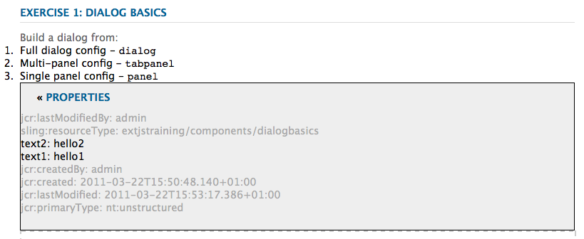

#### Example 1: Full Dialog {#example-full-dialog}

The **Full** dialog displays a window with three tabs, each tab having two text fields. It is the default dialog of the **Dialog Basics** component. Its characteristics are:

* Is defined by a node: node type = `cq:Dialog`, xtype = ` [dialog](/help/sites-developing/xtypes.md#dialog)`.
* Displays three tabs (node type = `cq:Panel`).
* Each tab has two textfields (node type = `cq:Widget`, xtype = ` [textfield](/help/sites-developing/xtypes.md#textfield)`).
* Is defined by the node:
  `/apps/extjstraining/components/dialogbasics/full`
* Is rendered in JSON format by requesting:
  `https://localhost:4502/apps/extjstraining/components/dialogbasics/full.-1.json`

The dialog displays as follows:

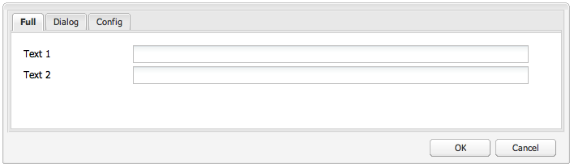

#### Example 2: Single Panel Dialog {#example-single-panel-dialog}

The **Single Panel** dialog displays a window with one tab that has two text fields. Its characteristics are:

* Displays one tab (node type = `cq:Dialog`, xtype = ` [panel](/help/sites-developing/xtypes.md#panel)`)
* The tab has two textfields (node type = `cq:Widget`, xtype = ` [textfield](/help/sites-developing/xtypes.md#textfield)`)
* Is defined by the node:
  `/apps/extjstraining/components/dialogbasics/singlepanel`
* Is rendered in json format by requesting:
  `https://localhost:4502/apps/extjstraining/components/dialogbasics/singlepanel.-1.json`
* One advantage over the **Full Dialog** is that less configuration is needed.
* Recommended use: for simple dialogs that display information or only have just a few fields.

To use the Single Panel dialog:

1. Replace the dialog of the **Dialog Basics** component with the **Single Panel** dialog:
    1. In **CRXDE Lite**, delete the node: `/apps/extjstraining/components/dialogbasics/dialog`
    1. Click **Save All** to save the changes.
    1. Copy the node: `/apps/extjstraining/components/dialogbasics/singlepanel`
    1. Paste the copied node below: `/apps/extjstraining/components/dialogbasics`
    1. Select the node: `/apps/extjstraining/components/dialogbasics/Copy of singlepanel`and rename it `dialog`.
1. Edit the component: the dialog displays as follows:


#### Example 3: Multi Panel Dialog {#example-multi-panel-dialog}

The **Multi Panel** dialog has the same display as the **Full** dialog but it is built differently. Its characteristics are:

* Is defined by a node (node type = `cq:Dialog`, xtype = ` [tabpanel](/help/sites-developing/xtypes.md#tabpanel)`).
* Displays three tabs (node type = `cq:Panel`).
* Each tab has two textfields (node type = `cq:Widget`, xtype = ` [textfield](/help/sites-developing/xtypes.md#textfield)`).
* Is defined by the node:
  `/apps/extjstraining/components/dialogbasics/multipanel`
* Is rendered in json format by requesting:
  `https://localhost:4502/apps/extjstraining/components/dialogbasics/multipanel.-1.json`
* One advantage over the **Full Dialog** is that it has a simplified structure.
* Recommended use: for multi-tab dialogs.

To use the Multi Panel dialog:

1. Replace the dialog of the **Dialog Basics** component with the **Multi Panel** dialog:
   follow the steps described for the [Example 2: Single Panel Dialog](#example-single-panel-dialog)
1. Edit the component: the dialog displays as follows:


#### Example 4: Rich Dialog {#example-rich-dialog}

The **Rich** dialog displays a window with two tabs. The first tab has a text field, a drop-down menu, and a collapsible text area. The second tab has a field set with four text fields and a collapsible field set with two text fields. Its characteristics are:

* Is defined by a node (node type = `cq:Dialog`, xtype = ` [dialog](/help/sites-developing/xtypes.md#dialog)`).
* Displays two tabs (node type = `cq:Panel`).
* The first tab has a ` [dialogfieldset](/help/sites-developing/xtypes.md#dialogfieldset)` widget with a ` [textfield](/help/sites-developing/xtypes.md#textfield)` and a ` [selection](/help/sites-developing/xtypes.md#selection)` widget with three options, and a collapsible ` [dialogfieldset](/help/sites-developing/xtypes.md#dialogfieldset)` with a ` [textarea](/help/sites-developing/xtypes.md#textarea)` widget.
* The second tab has a ` [dialogfieldset](/help/sites-developing/xtypes.md#dialogfieldset)` widget with four ` [textfield](/help/sites-developing/xtypes.md#textfield)` widgets, and a collapsible `dialogfieldset` with two ` [textfield](/help/sites-developing/xtypes.md#textfield)` widgets.
* Is defined by the node:
  `/apps/extjstraining/components/dialogbasics/rich`
* Is rendered in json format by requesting:
  `https://localhost:4502/apps/extjstraining/components/dialogbasics/rich.-1.json`

To use the **Rich** dialog:

1. Replace the dialog of the **Dialog Basics** component with the **Rich** dialog:
   follow the steps described for the [Example 2: Single Panel Dialog](#example-single-panel-dialog)
1. Edit the component: the dialog displays as follows:

 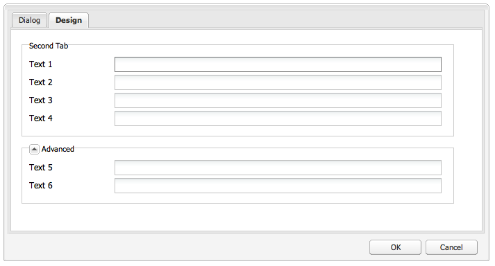

### Dynamic Dialogs {#dynamic-dialogs}

The second component of the **Using ExtJS Widgets** group in the Sidekick is called **2. Dynamic Dialogs** and includes three dynamic dialogs that are built with out-of-the-box widgets and **with customized JavaScript logic**. The dialogs are stored below `/apps/extjstraining/components/dynamicdialogs`. The dynamic dialogs are:

* the Switch Tabs dialog ( `switchtabs` node): it displays a window with two tabs. The first tab has a radio selection with three options: when an option is selected, a tab that relates to the option is displayed. The second tab has two text fields.
* the Arbitrary dialog ( `arbitrary` node): it displays a window with one tab. The tab has a field to drop or upload an asset and a field that displays some information about the containing page and about the asset if one is referenced.
* the Toggle Fields dialog ( `togglefield` node): it displays a window with one tab. The tab has a checkbox: when it is checked a field set with two text fields is displayed.

To include the **2. Dynamic Dialogs** component on the sample page:

1. Add the **2. Dynamic Dialogs** component to the sample page from the **Using ExtJS Widgets** tab in the **Sidekick**.
1. The component displays a title, some text, and a **PROPERTIES** link. Selecting the link displays the properties of the paragraph stored in the repository. Select the link again to hide the properties.

The component displays as follows:

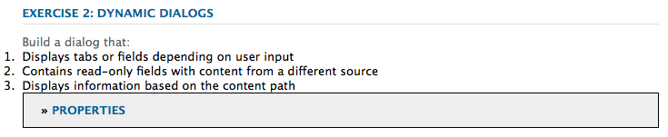

#### Example 1: Switch Tabs Dialog {#example-switch-tabs-dialog}

The **Switch Tabs** dialog displays a window with two tabs. The first tab has a radio selection with three options: when an option is selected, a tab that relates to the option is displayed. The second tab has two text fields.

Its main characteristics are:

* Is defined by a node (node type = `cq:Dialog`, xtype = ` [dialog](/help/sites-developing/xtypes.md#dialog)`).
* Displays two tabs (node type = `cq:Panel`): one selection tab, the second tab depends on the selection in the first tab (three options).
* Has three optional tabs (node type = `cq:Panel`), each one has two textfields (node type = `cq:Widget`, xtype = ` [textfield](/help/sites-developing/xtypes.md#textfield)`). Only one optional tab is displayed at a time.
* Is defined by the `switchtabs` node at:
  `/apps/extjstraining/components/dynamicdialogs/switchtabs`
* Is rendered in json format by requesting:
  `https://localhost:4502/apps/extjstraining/components/dynamicdialogs/switchtabs.-1.json`

The logic is implemented through event listeners and JavaScript code as follows:

* The dialog node has a " `beforeshow`" listener that hides all the optional tabs before the dialog is shown:
  `beforeshow="function(dialog){Ejst.x2.manageTabs(dialog.items.get(0));}"`
  `dialog.items.get(0)` gets the `tabpanel` that contains the selection panel and the three optional panels.
* The `Ejst.x2` object is defined in the `exercises.js` file at:
  `/apps/extjstraining/clientlib/js/exercises.js`
* In the `Ejst.x2.manageTabs()` method, as the value of `index` is -1, all the optional tabs are hidden (i goes from 1 to 3).
* The selection tab has two listeners: one that shows the selected tab when the dialog is loaded (" `loadcontent`" event) and one that shows the selected tab when the selection is changed (" `selectionchanged`" event):
  `loadcontent="function(field,rec,path){Ejst.x2.showTab(field);}"`
  `selectionchanged="function(field,value){Ejst.x2.showTab(field);}"`
* For the `Ejst.x2.showTab()` method,
  `field.findParentByType('tabpanel')` gets the `tabpanel` that contains all the tabs ( `field` represents the selection widget)
  `field.getValue()` gets the value of the selection, for example, tab2
  `Ejst.x2.manageTabs()` displays the selected tab.
* Each optional tab has a listener that hides the tab on " `render`" event:
  `render="function(tab){Ejst.x2.hideTab(tab);}"`
* For the `Ejst.x2.hideTab()` method,
  `tabPanel` is the `tabpanel` that contains all the tabs
  `index` is the index of the optional tab
  `tabPanel.hideTabStripItem(index)` hides the tab

It displays as follows:

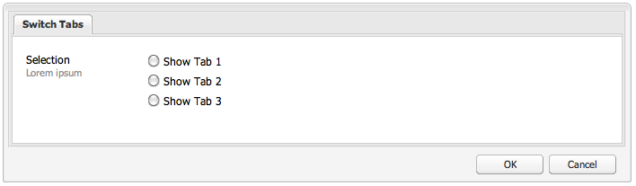

#### Example 2: Arbitrary Dialog {#example-arbitrary-dialog}

Often a dialog displays content from the underlying component. The dialog described here, called **Arbitrary** dialog, pulls content from a different component.

The **Arbitrary** dialog displays a window with one tab. The tab has two fields: one to drop or upload an asset and one that displays some information about the containing page and about the asset if one has been referenced.

Its main characteristics are:

* Is defined by a node (node type = `cq:Dialog`, xtype = ` [dialog](/help/sites-developing/xtypes.md#dialog)`).
* Displays one `tabpanel` widget (node type = `cq:Widget`, xtype = ` [tabpanel](/help/sites-developing/xtypes.md#tabpanel)`) with one panel (node type = `cq:Panel`)
* The panel has a smartfile widget (node type = `cq:Widget`, xtype = ` [smartfile](/help/sites-developing/xtypes.md#smartfile)`) and an ownerdraw widget (node type = `cq:Widget`, xtype = ` [ownerdraw](/help/sites-developing/xtypes.md#ownerdraw)`)
* Is defined by the `arbitrary` node at:
  `/apps/extjstraining/components/dynamicdialogs/arbitrary`
* Is rendered in json format by requesting:
  `https://localhost:4502/apps/extjstraining/components/dynamicdialogs/arbitrary.-1.json`

The logic is implemented through event listeners and JavaScript code as follows:

* The `ownerdraw` widget has a " `loadcontent`" listener that shows information about the page containing the component. That is, the asset referenced by the smartfile widget when the content is loaded:
  `loadcontent="function(field,rec,path){Ejst.x2.showInfo(field,rec,path);}"`
  `field` is set with the `ownerdraw` object
  `path` is set with the content path of the component (for example, `/content/geometrixx/en/products/triangle/ui-tutorial/jcr:content/par/dynamicdialogs`)
* The `Ejst.x2` object is defined in the `exercises.js` file at:
  `/apps/extjstraining/clientlib/js/exercises.js`
* For the `Ejst.x2.showInfo()` method,
  `pagePath` is the path of the page containing the component;
  `pageInfo` represents the page properties in json format;
  `reference` is the path of the referenced asset;
  `metadata` represents the metadata of the asset in json format;
  `ownerdraw.getEl().update(html);` displays the created html in the dialog

To use the **Arbitrary** dialog:

1. Replace the dialog of the **Dynamic Dialog** component with the **Arbitrary** dialog:
   follow the steps described for the [Example 2: Single Panel Dialog](#example-single-panel-dialog)
1. Edit the component: the dialog displays as follows:

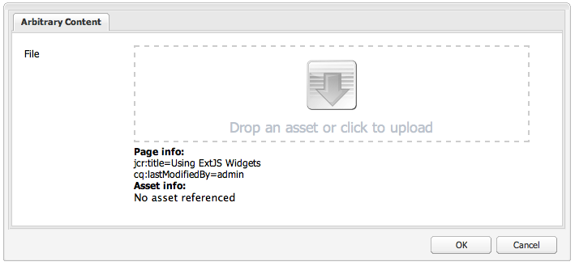

#### Example 3: Toggle Fields Dialog {#example-toggle-fields-dialog}

The **Toggle Fields** dialog displays a window with one tab. The tab has a checkbox: when it is checked a field set with two text fields is displayed.

Its main characteristics are:

* Is defined by a node (node type = `cq:Dialog`, xtype = ` [dialog](/help/sites-developing/xtypes.md#dialog)`).
* Displays one `tabpanel` widget (node type = `cq:Widget`, xtype = ` [tabpanel](/help/sites-developing/xtypes.md#textpanel)`) with one panel (node type = `cq:Panel`).
* The panel has a selection/checkbox widget (node type = `cq:Widget`, xtype = ` [selection](/help/sites-developing/xtypes.md#selection)`, type = ` [checkbox](/help/sites-developing/xtypes.md#checkbox)`) and a collapsible dialogfieldset widget (node type = `cq:Widget`, xtype = ` [dialogfieldset](/help/sites-developing/xtypes.md#dialogfieldset)`) that is hidden by default, with two textfield widgets (node type = `cq:Widget`, xtype = ` [textfield](/help/sites-developing/xtypes.md#textfield)`).
* Is defined by the `togglefields` node at:
  `/apps/extjstraining/components/dynamicdialogs/togglefields`
* Is rendered in json format by requesting:
  `https://localhost:4502/apps/extjstraining/components/dynamicdialogs/togglefields.-1.json`

The logic is implemented through event listeners and JavaScript code as follows:

* the selection tab has two listeners: one that shows the dialogfieldset when the content is loaded (" `loadcontent`" event) and one that shows the dialogfieldset when the selection is changed (" `selectionchanged`" event):
  `loadcontent="function(field,rec,path){Ejst.x2.toggleFieldSet(field);}"`
  `selectionchanged="function(field,value){Ejst.x2.toggleFieldSet(field);}"`
* The `Ejst.x2` object is defined in the `exercises.js` file at:
  `/apps/extjstraining/clientlib/js/exercises.js`
* For the `Ejst.x2.toggleFieldSet()` method,
  `box` is the selection object;
  `panel` is the panel containing the selection and the dialogfieldset widgets;
  `fieldSet` is the dialogfieldset object;
  `show` is the value of the selection (true or false);
  based on ' `show`' the dialogfieldset is displayed or not

To use the **Toggle Fields** dialog, do the following:

1. Replace the dialog of the **Dynamic Dialog** component with the **Toggle Fields** dialog:
   follow the steps described for the [Example 2: Single Panel Dialog](#example-single-panel-dialog)
1. Edit the component: the dialog displays as follows:

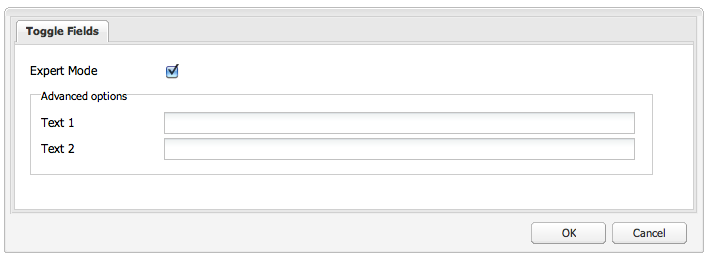

### Custom Widgets {#custom-widgets}

The out-of-the-box widgets shipped with AEM should cover most use cases. However it might be sometimes necessary to create a custom widget to cover a project-specific requirement. Custom widgets can be created by extending existing ones. To help you get started with such customization, the **`Using ExtJS Widgets`** package includes three dialogs that use three different custom widgets:

* the Multi Field dialog ( `multifield` node) displays a window with one tab. The tab has a customized multifield widget that has two fields: a drop-down menu with two options and a text field. As it is based on the out-of-the-box `multifield` widget (that only has a text field), it has all the features of the `multifield` widget.
* the Tree Browse dialog ( `treebrowse` node) displays a window with one tab containing a path browse widget: when you click the arrow, a window opens up in which you can browse a hierarchy and select an item. The path of the item is then added to the path field and is persisted when the dialog is closed.
* a Rich Text Editor Plug-in based dialog ( `rteplugin` node) that adds a custom button to the Rich Text Editor to insert some custom text to the main text. It consists of a `richtext` widget (RTE) and of a custom feature that is added through the RTE plug-in mechanism.

The custom widgets and the plugin are included in the component called **3. Custom Widgets** of the **Using ExtJS Widgets** package. To include this component to the sample page:

1. Add the **3. Custom Widgets** component to the sample page from the **Using ExtJS Widgets** tab in the **Sidekick**.
1. The component displays a title, some text and, when clicking the **PROPERTIES** link, the properties of the paragraph stored in the repository. Clicking again hides the properties.
   The component displays as follows:

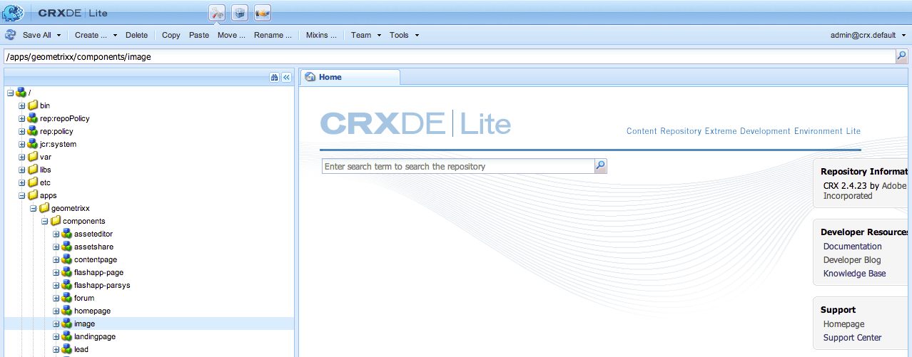

#### Example 1: Custom Multifield Widget {#example-custom-multifield-widget}

The **Custom Multifield** widget-based dialog displays a window with one tab. The tab has a customized multifield widget that, unlike the standard one which has one field, has two fields: a drop-down menu with two options and a text field.

The **Custom Multifield** widget-based dialog:

* Is defined by a node (node type = `cq:Dialog`, xtype = ` [dialog](/help/sites-developing/xtypes.md#dialog)`).
* Displays one `tabpanel` widget (node type = `cq:Widget`, xtype = ` [tabpanel](/help/sites-developing/xtypes.md#tabpanel)`) containing a panel (node type = `cq:Widget`, xtype = ` [panel](/help/sites-developing/xtypes.md#panel)`).
* The panel has a `multifield` widget (node type = `cq:Widget`, xtype = ` [multifield](/help/sites-developing/xtypes.md#multifield)`).
* The `multifield` widget has a fieldconfig (node type = `nt:unstructured`, xtype = `ejstcustom`, optionsProvider = `Ejst.x3.provideOptions`) that is based on the custom xtype ' `ejstcustom`':
    * ' `fieldconfig`' is a config option of the ` [CQ.form.MultiField](https://developer.adobe.com/experience-manager/reference-materials/6-5/widgets-api/index.html?class=CQ.form.MultiField)` object.
    * ' `optionsProvider`' is a configuration of the `ejstcustom` widget. It is set with the `Ejst.x3.provideOptions` method which is defined in `exercises.js` at:
      `/apps/extjstraining/clientlib/js/exercises.js`
      and returns two options.
* Is defined by the `multifield` node at:
  `/apps/extjstraining/components/customwidgets/multifield`
* Is rendered in json format by requesting:
  `https://localhost:4502/apps/extjstraining/components/customwidgets/multifield.-1.json`

The custom `multifield` widget (xtype = `ejstcustom`):

* Is a JavaScript object called `Ejst.CustomWidget`
* Is defined in the `CustomWidget.js` JavaScript file at:
  `/apps/extjstraining/clientlib/js/CustomWidget.js`
* Extends the ` [CQ.form.CompositeField](https://developer.adobe.com/experience-manager/reference-materials/6-5/widgets-api/index.html?class=CQ.form.CompositeField)` widget.
* Has three fields: `hiddenField` (Textfield), `allowField` (ComboBox), and `otherField` (Textfield)
* Overrides `CQ.Ext.Component#initComponent` to add the three fields:
    * `allowField` is a [CQ.form.Selection](https://developer.adobe.com/experience-manager/reference-materials/6-5/widgets-api/index.html?class=CQ.form.Selection) object of type 'select'. optionsProvider is a configuration of the Selection object that is instantiated with the optionsProvider configuration of the CustomWidget defined in the dialog
    * `otherField` is a [CQ.Ext.form.TextField](https://developer.adobe.com/experience-manager/reference-materials/6-5/widgets-api/index.html?class=CQ.Ext.form.TextField) object
* Overrides the methods `setValue`, `getValue`, and `getRawValue` of [CQ.form.CompositeField](https://developer.adobe.com/experience-manager/reference-materials/6-5/widgets-api/index.html?class=CQ.form.CompositeField) to set and retrieve the value of CustomWidget with the format:
  `<allowField value>/<otherField value>, for example: 'Bla1/hello'`.
* Registers itself as ' `ejstcustom`' xtype:
  `CQ.Ext.reg('ejstcustom', Ejst.CustomWidget);`

The **Custom Multifield** widget-based dialog displays as follows:

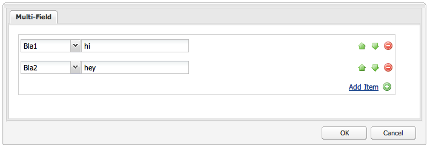

#### Example 2: Custom `Treebrowse` Widget {#example-custom-treebrowse-widget}

The custom **`Treebrowse`** widget-based dialog displays a window with one tab containing a custom path browse widget. When you select the arrow, a window opens up in which you can browse a hierarchy and select an item. The path of the item is then added to the path field and is persisted when the dialog is closed.

The custom `treebrowse` dialog:

* Is defined by a node (node type = `cq:Dialog`, xtype = ` [dialog](/help/sites-developing/xtypes.md#dialog)`).
* Displays one `tabpanel` widget (node type = `cq:Widget`, xtype = ` [tabpanel](/help/sites-developing/xtypes.md#tabpanel)`) containing a panel (node type = `cq:Widget`, xtype = ` [panel](/help/sites-developing/xtypes.md#panel)`).
* The panel has a custom widget (node type = `cq:Widget`, xtype = `ejstbrowse`)
* Is defined by the `treebrowse` node at:
  `/apps/extjstraining/components/customwidgets/treebrowse`
* Is rendered in json format by requesting:
  `https://localhost:4502/apps/extjstraining/components/customwidgets/treebrowse.-1.json`

The custom treebrowse widget (xtype = `ejstbrowse`):

* Is a JavaScript object called `Ejst.CustomWidget`
* Is defined in the `CustomBrowseField.js` JavaScript file at:
  `/apps/extjstraining/clientlib/js/CustomBrowseField.js`
* Extends ` [CQ.Ext.form.TriggerField](https://developer.adobe.com/experience-manager/reference-materials/6-5/widgets-api/index.html?class=CQ.Ext.form.TriggerField)`.
* Defines a browse window called `browseWindow`.
* Overrides ` [CQ.Ext.form.TriggerField](https://developer.adobe.com/experience-manager/reference-materials/6-5/widgets-api/index.html?class=CQ.Ext.form.TriggerField)#onTriggerClick` to show the browse window when the arrow is clicked.
* Defines a [CQ.Ext.tree.TreePanel](https://developer.adobe.com/experience-manager/reference-materials/6-5/widgets-api/index.html?class=CQ.Ext.tree.TreePanel) object:
    * It gets its data by calling the servlet registered at `/bin/wcm/siteadmin/tree.json`.
    * Its root is " `apps/extjstraining`".
* Defines a `window` object ( ` [CQ.Ext.Window](https://developer.adobe.com/experience-manager/reference-materials/6-5/widgets-api/index.html?class=CQ.Ext.Window)`):
    * Based on the pre-defined panel.
    * Has an **OK** button that sets the value of the selected path and hides the panel.
* The window is anchored below the **Path** field.
* The selected path is passed from the browse field to the window on `show` event.
* Registers itself as ' `ejstbrowse`' xtype:
  `CQ.Ext.reg('ejstbrowse', Ejst.CustomBrowseField);`

To use the **Custom Treebrowse** widget-based dialog:

1. Replace the dialog of the **Custom Widgets** component with the **Custom Treebrowse** dialog:
   follow the steps described for the [Example 2: Single Panel Dialog](#example-single-panel-dialog)
1. Edit the component: the dialog displays as follows:

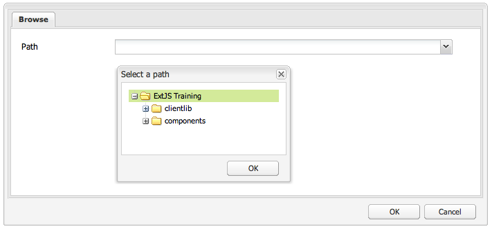

#### Example 3: Rich Text Editor (RTE) Plug-In {#example-rich-text-editor-rte-plug-in}

The **Rich Text Editor (RTE) Plug-in** based dialog is a Rich Text Editor based dialog that has a custom button to insert some custom text within square brackets. The custom text can be parsed by some server-side logic (not implemented in this example), for example to add some text that is defined at the given path:

The **RTE plugin** based dialog:

* Is defined by the rteplugin node at:
  `/apps/extjstraining/components/customwidgets/rteplugin`
* Is rendered in json format by requesting:
  `https://localhost:4502/apps/extjstraining/components/customwidgets/rteplugin.-1.json`
* The `rtePlugins` node has a child node `inserttext` (node type = `nt:unstructured`) that is named after the plugin. It has a property called `features` that defines which of the plugin features are available to the RTE.

The RTE plugin:

* Is a JavaScript object called `Ejst.InsertTextPlugin`
* Is defined in the `InsertTextPlugin.js` JavaScript file at:
  `/apps/extjstraining/clientlib/js/InsertTextPlugin.js`
* Extends the ` [CQ.form.rte.plugins.Plugin](https://developer.adobe.com/experience-manager/reference-materials/6-5/widgets-api/index.html?class=CQ.form.rte.plugins.Plugin)` object.
* The following methods define the ` [CQ.form.rte.plugins.Plugin](https://developer.adobe.com/experience-manager/reference-materials/6-5/widgets-api/index.html?class=CQ.form.rte.plugins.Plugin)` object and are overridden in the implementing plugin:
    * `getFeatures()` returns an array of all the features that the plugin makes available.
    * `initializeUI()` adds the new button to the RTE toolbar.
    * `notifyPluginConfig()` displays title and text when the button is hovered.
    * `execute()` is called when the button is clicked and performs the plugin action: it displays a window that is used to define the text to be included.
* `insertText()` inserts a text using the corresponding dialog object `Ejst.InsertTextPlugin.Dialog` (see afterwards).
* `executeInsertText()` is called by the `apply()` method of the dialog, which is triggered when the **OK** button is clicked.
* Registers itself as ' `inserttext`' plugin:
  `CQ.form.rte.plugins.PluginRegistry.register("inserttext", Ejst.InsertTextPlugin);`
* the `Ejst.InsertTextPlugin.Dialog` object defines the dialog that is opened when the plugin button is clicked. The dialog consists of a panel, a form, a textfield, and two buttons (**OK** and **Cancel**).

To use the **Rich Text Editor (RTE) Plug-in** based dialog:

1. Replace the dialog of the **Custom Widgets** component with the **Rich Text Editor (RTE) Plug-in** based dialog:
   follow the steps described for the [Example 2: Single Panel Dialog](#example-single-panel-dialog)
1. Edit the component.
1. Click the last icon on the right (the one with four arrows). Enter a path and click **OK**:
   The path is displayed within brackets ([ ]).
1. Click **OK** so you close the Rich Text Editor.

The **Rich Text Editor (RTE) Plug-in** based dialog displays as follows:


>[!NOTE]
>
>This example only shows how to implement the client-side part of the logic: the placeholders (*[text]*) have then to be parsed on the server-side explicitly (for example, in the component JSP).

### Tree Overview {#tree-overview}

The out-of-the-box ` [CQ.Ext.tree.TreePanel](https://developer.adobe.com/experience-manager/reference-materials/6-5/widgets-api/index.html?class=CQ.Ext.tree.TreePanel)` object provides tree-structured UI representation of tree-structured data. The Tree Overview component included in the **Using ExtJS Widgets** package shows how to use the `TreePanel` object to display a JCR tree below a given path. The window itself can be docked/undocked. In this example, the window logic is embedded in the component jsp between &lt;script&gt;&lt;/script&gt; tags.

To include the **Tree Overview** component to the sample page:

1. Add the **4. Tree Overview** component to the sample page from the **Using ExtJS Widgets** tab in the **Sidekick**.
1. The component displays:
    * a title, with some text
    * a **PROPERTIES** link: click to display the properties of the paragraph stored in the repository. Click again to hide the properties.
    * a floating window with a tree representation of the repository that can be expanded.

The component displays as follows:


The Tree Overview component:

* Is defined at:
  `/apps/extjstraining/components/treeoverview`

* The dialog lets you set the size of the window and to dock or undock the window (see details below).

The component jsp:

* Retrieves the width, height, and docked properties from the repository.
* Displays some text about the tree overview data format.
* Embeds the window logic in the component jsp between JavaScript tags.
* Is defined at:
  `apps/extjstraining/components/treeoverview/content.jsp`

The JavaScript code embedded in the component jsp:

* Defines a `tree` object by trying to retrieve a tree window from the page.
* If the window displaying the tree does not exist, `treePanel` ([CQ.Ext.tree.TreePanel](https://developer.adobe.com/experience-manager/reference-materials/6-5/widgets-api/index.html?class=CQ.Ext.tree.TreePanel)) is created:
    * `treePanel` contains the data that is used to create the window.
    * The data are retrieved by calling the servlet registered at:
      `/bin/wcm/siteadmin/tree.json`
* The `beforeload` listener makes sure that the selected node is loaded.
* The `root` object sets the path `apps/extjstraining` as the tree root.
* `tree` ( ` [CQ.Ext.Window](https://developer.adobe.com/experience-manager/reference-materials/6-5/widgets-api/index.html?class=CQ.Ext.Window)`) is set based on the pre-defined `treePanel`, and is displayed with:
  `tree.show();`
* If the window exists, it is displayed based on the width, height, and docked properties retrieved from the repository.

The component dialog:

* Displays one tab with two fields to set the size (width and height) of the tree overview window and one field to dock/undock the window
* Is defined by a node (node type = `cq:Dialog`, xtype = ` [panel](/help/sites-developing/xtypes.md#panel)`).
* The panel has a sizefield widget (node type = `cq:Widget`, xtype = ` [sizefield](/help/sites-developing/xtypes.md#sizefield)`) and a selection widget (node type = `cq:Widget`, xtype = ` [selection](/help/sites-developing/xtypes.md#selection)`, type = `radio`) with two options (true/false)
* Is defined by the dialog node at:
  `/apps/extjstraining/components/treeoverview/dialog`
* Is rendered in json format by requesting:
  `https://localhost:4502/apps/extjstraining/components/treeoverview/dialog.-1.json`
* Displays as follows:

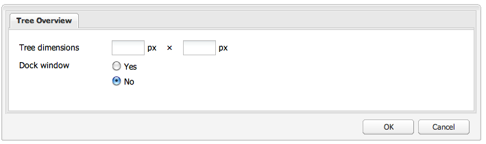

### Grid Overview {#grid-overview}

A Grid Panel represents data in a tabular format of rows and columns. It is composed of the following:

* Store : the model holding the data records (rows).
* Column model : the column makeup.
* View : encapsulates the user interface.
* Selection model : the selection behavior.

The Grid Overview component included in the **Using ExtJS Widgets** package shows how to display data in a tabular format:

* The example 1 uses static data.
* The example 2 uses data retrieved from the repository.

To include the Grid Overview component to the sample page:

1. Add the **5. Grid Overview** component to the sample page from the **Using ExtJS Widgets** tab in the **Sidekick**.
1. The component displays:
    * a title with some text
    * a **PROPERTIES** link: click to display the properties of the paragraph stored in the repository. Click again to hide the properties.
    * a floating window containing data in tabular format.

The component displays as follows:

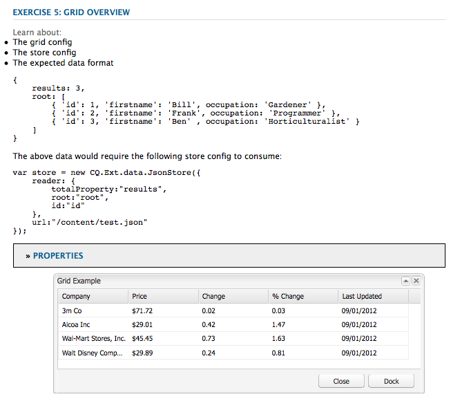

#### Example 1: Default Grid {#example-default-grid}

In its out-of-the-box version, the **Grid Overview** component displays a window with static data in a tabular format. In this example, the logic is embedded in the component jsp in two ways:

* the generic logic is defined between &lt;script&gt;&lt;/script&gt; tags
* the specific logic is available in a separate .js file and is linked to in the jsp. This setup lets you switch between the two logic (static/dynamic) by commenting the desired &lt;script&gt; tags.

The Grid Overview component:

* Is defined at:
  `/apps/extjstraining/components/gridoverview`
* The dialog lets you set the size of the window and to dock or undock the window.

The component jsp:

* Retrieves the width, height, and docked properties from the repository.
* Displays some text as introduction to the grid overview data format.
* References JavaScript code that defines the GridPanel object:
  `<script type="text/javascript" src="/apps/extjstraining/components/gridoverview/defaultgrid.js"></script>`
  `defaultgrid.js` defines some static data as a base for the GridPanel object.
* Embeds JavaScript code between JavaScript tags that defines the Window object consuming the GridPanel object.
* Is defined at:
  `apps/extjstraining/components/gridoverview/content.jsp`

The JavaScript code embedded in the component jsp:

* Defines the `grid` object by trying to retrieve the window component from the page:
  `var grid = CQ.Ext.getCmp("<%= node.getName() %>-grid");`
* If `grid` does not exist, a [CQ.Ext.grid.GridPanel](https://developer.adobe.com/experience-manager/reference-materials/6-5/widgets-api/index.html?class=CQ.Ext.grid.GridPanel) object ( `gridPanel`) is defined by calling the `getGridPanel()` method (see below). This method is defined in `defaultgrid.js`.
* `grid` is a ` [CQ.Ext.Window](https://developer.adobe.com/experience-manager/reference-materials/6-5/widgets-api/index.html?class=CQ.Ext.Window)` object, based on the pre-defined GridPanel, and is displayed: `grid.show();`
* If `grid` exists, it is displayed based on the width, height, and docked properties retrieved from the repository.

The JavaScript file ( `defaultgrid.js`) referenced in the component jsp defines the `getGridPanel()` method which is called by the script embedded in the JSP and returns a ` [CQ.Ext.grid.GridPanel](https://developer.adobe.com/experience-manager/reference-materials/6-5/widgets-api/index.html?class=CQ.Ext.grid.GridPanel)` object, based on static data. The logic is as follows:

* `myData` is an array of static data formatted as a table of five columns and four rows.
* `store` is a `CQ.Ext.data.Store` object that consumes `myData`.
* `store` is loaded in memory:
  `store.load();`
* `gridPanel` is a ` [CQ.Ext.grid.GridPanel](https://developer.adobe.com/experience-manager/reference-materials/6-5/widgets-api/index.html?class=CQ.Ext.grid.GridPanel)` object that consumes `store`:
    * the column widths are always reproportioned:
      `forceFit: true`
    * only one row at a time can be selected:
      `singleSelect:true`

#### Example 2: Reference Search Grid {#example-reference-search-grid}

When you install the package, the `content.jsp` of the **Grid Overview** component displays a grid that is based on static data. It is possible to modify the component to display a grid with the following characteristics:

* Has three columns.
* Is based on data retrieved from the repository by calling a servlet.
* The cells of the last column can be edited. The value is persisted in a `test` property below the node defined by the path displayed in the first column.

As explained in the section before, the window object gets its ` [CQ.Ext.grid.GridPanel](https://developer.adobe.com/experience-manager/reference-materials/6-5/widgets-api/index.html?class=CQ.Ext.grid.GridPanel)` object by calling the `getGridPanel()` method defined in the `defaultgrid.js` file at `/apps/extjstraining/components/gridoverview/defaultgrid.js`. The **Grid Overview **component provides a different implementation for the `getGridPanel()` method, defined in the `referencesearch.js` file at `/apps/extjstraining/components/gridoverview/referencesearch.js`. By switching the .js file that is referenced in the component jsp, the grid is based on data retrieved from the repository.

Switch the .js file that is referenced in the component jsp:

1. In **CRXDE Lite**, in the `content.jsp` file of the component, comment the line that includes the `defaultgrid.js` file, so that it looks as follows:
   `<!-- script type="text/javascript" src="/apps/extjstraining/components/gridoverview/defaultgrid.js"></script-->`
1. Remove the comment from the line that includes the `referencesearch.js` file, so that it looks as follows:
   `<script type="text/javascript" src="/apps/extjstraining/components/gridoverview/referencesearch.js"></script>`
1. Save the changes.
1. Refresh the sample page.

The component displays as follows:

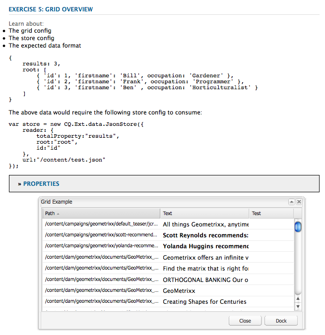

The JavaScript code referenced in the component jsp ( `referencesearch.js`) defines the `getGridPanel()` method called from the component jsp and returns a ` [CQ.Ext.grid.GridPanel](https://developer.adobe.com/experience-manager/reference-materials/6-5/widgets-api/index.html?class=CQ.Ext.grid.GridPanel)` object, based on data that are dynamically retrieved from the repository. The logic in `referencesearch.js` defines some dynamic data as a base for the GridPanel:

* `reader` is a ` [CQ.Ext.data.JsonReader](https://developer.adobe.com/experience-manager/reference-materials/6-5/widgets-api/index.html?class=CQ.Ext.data.JsonReader)`object that reads the servlet response in json format for three columns.
* `cm` is a ` [CQ.Ext.grid.ColumnModel](https://developer.adobe.com/experience-manager/reference-materials/6-5/widgets-api/index.html?class=CQ.Ext.grid.ColumnModel)` object for three columns.
  The "Test" column cells can be edited as they are defined with an editor:
  `editor: new [CQ.Ext.form.TextField](https://developer.adobe.com/experience-manager/reference-materials/6-5/widgets-api/index.html?class=CQ.Ext.form.TextField)({})`
* the columns are sortable:
  `cm.defaultSortable = true;`
* `store` is a ` [CQ.Ext.data.GroupingStore](https://developer.adobe.com/experience-manager/reference-materials/6-5/widgets-api/index.html?class=CQ.Ext.data.GroupingStore)` object:
    * it gets its data by calling the servlet registered at " `/bin/querybuilder.json`" with a few parameters used to filter the query
    * it is based on `reader`, defined beforehand
    * the table is sorted according to the '**jcr:path**' column in ascending order
* `gridPanel` is a ` [CQ.Ext.grid.EditorGridPanel](https://developer.adobe.com/experience-manager/reference-materials/6-5/widgets-api/index.html?class=CQ.Ext.grid.EditorGridPanel)` object that can be edited:
    * it is based on the pre-defined `store` and on the column model `cm`
    * only one row at a time can be selected:
      `sm: new [CQ.Ext.grid.RowSelectionModel](https://developer.adobe.com/experience-manager/reference-materials/6-5/widgets-api/index.html?class=CQ.Ext.grid.RowSelectionModel)({singleSelect:true})`
    * the `afteredit` listener makes sure that after a cell in the "**Test**" column has been edited:
        * the property ' `test`' of the node at the path defined by the "**jcr:path**" column is set in the repository with the value of the cell
        * if the POST is successful, the value is added to the `store` object, otherwise it is rejected
