# Extending Workflow Functionality{#extending-workflow-functionality}

This topic describes how to develop custom step components for your workflows, then how to interact programmatically with workflows.

Creating a custom workflow step involves the following activities:

* Develop the workflow step component.
* Implement the step functionality as an OSGi service or an ECMA script.

You can also [interact with your workflows from your programs and scripts](/help/sites-developing/workflows-program-interaction.md).

## Workflow Step Components - The Basics {#workflow-step-components-the-basics}

A workflow step component defines the appearance and behavior of the step when creating workflow models:

* The category and step name in the workflow sidekick.
* The appearance of the step in workflow models.
* The edit dialog for configuring component properties.
* The service or script that is executed at runtime.

As with [all components](/help/sites-developing/components.md), workflow step components inherit from the component that is specified for the `sling:resourceSuperType` property. The following diagram shows the hierarchy of `cq:component` nodes that form the basis of all workflow step components. The diagram also includes the **Process Step**, **Participant Step**, and **Dynamic Participant Step** components, as these are the most common (and basic) starting points for developing custom step components.

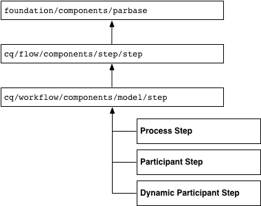

>[!CAUTION]
>
>You ***must*** not change anything in the `/libs` path.
>
>This is because the content of `/libs` is overwritten the next time you upgrade your instance (and may well be overwritten when you apply either a hotfix or feature pack).
>
>The recommended method for configuration and other changes is:
>
>1. Recreate the required item (that is, as it exists in `/libs` under `/apps`
>2. Make any changes within `/apps`

The `/libs/cq/workflow/components/model/step` component is the nearest common ancestor of the **Process Step**, **Participant Step**, and **Dynamic Participant Step**, which all inherit the following items:

* `step.jsp`

  The `step.jsp` script renders the title of the step component when it is added to a model.

  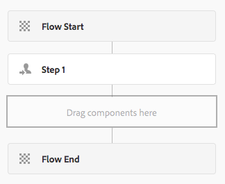

* [cq:dialog](/help/sites-developing/developing-components.md#creating-and-configuring-a-dialog)

  A dialog with the following tabs:

    * **Common**: for editing the title and description.
    * **Advanced**: for editing email notification properties.

  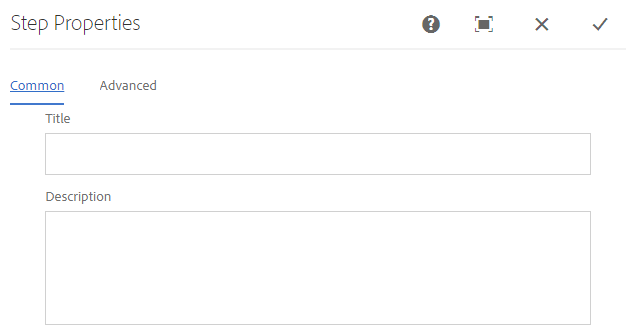 

  >[!NOTE]
  >
  >When the tabs of the edit dialog of a step component do not match this default appearance, the step component has defined scripts, node properties, or dialog tabs that override these inherited tabs.

### ECMA Scripts {#ecma-scripts}

The following objects are available (dependent on step type) within ECMA scripts:

* [WorkItem](https://helpx.adobe.com/experience-manager/6-5/sites/developing/using/reference-materials/javadoc/com/day/cq/workflow/exec/WorkItem.html) workItem
* [WorkflowSession](https://helpx.adobe.com/experience-manager/6-5/sites/developing/using/reference-materials/javadoc/com/day/cq/workflow/WorkflowSession.html) workflowSession
* [WorkflowData](https://helpx.adobe.com/experience-manager/6-5/sites/developing/using/reference-materials/javadoc/com/day/cq/workflow/exec/WorkflowData.html) workflowData
* `args`: array with the process arguments.

* `sling`: to access other osgi services.
* `jcrSession`

### MetaDataMaps {#metadatamaps}

You can use workflow metadata to persist information that is required during the lifetime of the workflow. A common requirement of workflow steps is to persist data for future use in the workflow, or to retrieve the persisted data.

There are three types of MetaDataMap objects - for `Workflow`, `WorkflowData` and `WorkItem` objects. They all have the same intended purpose - to store metadata.

A WorkItem has its own MetaDataMap that can be only used while that workitem (for example, step) is running.

Both `Workflow` and `WorkflowData` metadatamaps are shared over the entire workflow. For these cases it is recommended to only use the `WorkflowData` metadata map.

## Creating Custom Workflow Step Components {#creating-custom-workflow-step-components}

Workflow step components can be [created in the same manner as any other component](/help/sites-developing/components.md).

To inherit from one of the (existing) base step components, add the following property to the `cq:Component` node:

* Name: `sling:resourceSuperType`
* Type: `String`
* Value: One of the following paths that resolves to a base component:

    * `cq/workflow/components/model/process`
    * `cq/workflow/components/model/participant`
    * `cq/workflow/components/model/dynamic_participant`

### Specifying the Default Title and Description for Step Instances {#specifying-the-default-title-and-description-for-step-instances}

Use the following procedure to specify default values for the **Title** and **Description** fields on the **Common** tab.

>[!NOTE]
>
>The field values appear on the step instance when both of the following requirements are satisfied:
>
>* The edit dialog of the step stores the title and description in the following locations: >
>* `./jcr:title`
>* `./jcr:description` locations
>
>  This requirement is satisfied when the edit dialog uses the Common tab that the `/libs/cq/flow/components/step/step` component implements.
>
>* The step component or an ancestor of the component does not override the `step.jsp` script that the `/libs/cq/flow/components/step/step` component implements.

1. Below the `cq:Component` node, add the following node:

    * Name: `cq:editConfig`
    * Type: `cq:EditConfig`

   >[!NOTE]
   >
   >For more information about the cq:editConfig node, see [Configuring the Edit Behavior of a Component](/help/sites-developing/developing-components.md#configuring-the-edit-behavior).

1. Below the `cq:EditConfig` node, add the following node:

    * Name: `cq:formParameters`
    * Type: `nt:unstructured`

1. Add `String` properties of the following names to the `cq:formParameters` node:

    * `jcr:title`: The value fills the **Title** field of the **Common** tab.
    * `jcr:description`: The value fills the **Description** field of the **Common** tab.

### Saving Property Values in Workflow Metadata {#saving-property-values-in-workflow-metadata}

>[!NOTE]
>
>See [Persisting and Accessing Data](#persisting-and-accessing-data). In particular, for information about accessing the property value at runtime, see [Accessing Dialog Property Values at Runtime](#accessing-dialog-property-values-at-runtime).

The name property of `cq:Widget` items specifies the JCR node that stores the widget's value. When widgets in the dialog of workflow step compnents store values below the `./metaData` node, the value is added to the workflow `MetaDataMap`.

For example, a text field in a dialog is a `cq:Widget` node that has the following properties:

| Name |Type |Value |
|---|---|---|
| `xtype` | `String` | `textarea` |
| `name` | `String` | `./metaData/subject` |
| `fieldLabel` | `String` | `Email Subject` |

The value that is specified in this text field is added to the workflow instance's ` [MetaDataMap](#metadatamaps)` object, and is associated with the `subject` key.

>[!NOTE]
>
>When the key is `PROCESS_ARGS`, the value is readily available in ECMA script implementations via the `args` variable. In this case, the value of the name property is `./metaData/PROCESS_ARGS.`

### Overriding the Step Implementation {#overriding-the-step-implementation}

Each base step component enable workflow model developers to configure the following key features at design time:

* Process Step: The service or ECMA script to execute at runtime.
* Participant Step: The ID of the user that is assigned the generated work item.
* Dynamic Participant Step: The service or ECMA script that selects the ID of the user that is assigned the work item.

To focus the component for use in a specific workflow scenario, configure the key feature in the design and remove the ability for model developers to change it.

1. Below the cq:component node, add the following node:

    * Name: `cq:editConfig`
    * Type: `cq:EditConfig`

   For more information about the cq:editConfig node, see [Configuring the Edit Behaviour of a Component](/help/sites-developing/developing-components.md#configuring-the-edit-behavior).

1. Below the cq:EditConfig node, add the following node:

    * Name: `cq:formParameters`
    * Type: `nt:unstructured`

1. Add a `String` property to the `cq:formParameters` node. The component super type determines the name of the property:

    * Process Step: `PROCESS`
    * Participant Step: `PARTICIPANT`
    * Dynamic Participant Step: `DYNAMIC_PARTICIPANT`

1. Specify the value of the property:

    * `PROCESS`: The path to the ECMA script or the PID of the service that implements the step behavior.
    * `PARTICIPANT`: The ID of the user who is assigned the work item.
    * `DYNAMIC_PARTICIPANT`: The path to the ECMA script or the PID of the service that selects the user to assign the work item.

1. To remove the ability of model developers to change your property values, override the dialog of the component super type.

### Adding Forms and Dialogs to Participant Steps {#adding-forms-and-dialogs-to-participant-steps}

Customize your participant step component to provide features that are found in the [Form Participant Step](/help/sites-developing/workflows-step-ref.md#form-participant-step) and [Dialog Participant Step](/help/sites-developing/workflows-step-ref.md#dialog-participant-step) components:

* Present a form to the user when they open the generated work item.
* Present a custom dialog to the user when they complete the generated work item.

Peform the following procedure on your new component (see [Creating Custom Workflow Step Components](#creating-custom-workflow-step-components)):

1. Below the `cq:Component` node, add the following node:

    * Name: `cq:editConfig`
    * Type: `cq:EditConfig`

   For more information about the cq:editConfig node, see [Configuring the Edit Behavior of a Component](/help/sites-developing/components-basics.md#edit-behavior).

1. Below the cq:EditConfig node, add the following node:

    * Name: `cq:formParameters`
    * Type: `nt:unstructured`

1. To present a form when the user opens the work item, add the following property to the `cq:formParameters` node:

    * Name: `FORM_PATH`
    * Type: `String`
    * Value: The path that resolves to the form

1. To present a custom dialog when the user completes the work item, add the following property to the `cq:formParameters` node

    * Name: `DIALOG_PATH`
    * Type: `String`
    * Value: The path that resolves to the dialog

### Configuring the Workflow Step Runtime Behavior {#configuring-the-workflow-step-runtime-behavior}

Below the `cq:Component` node, add a `cq:EditConfig` node. Below that add an `nt:unstructured` node (must be named `cq:formParameters`) and to that node add the following properties:

* Name: `PROCESS_AUTO_ADVANCE`

    * Type: `Boolean`
    * Value:

        * when set to `true` the workflow will run that step and continue - this is default and also recommended
        * when `false`, the workflow will run and stop; this needs extra handling, so `true` is recommended

* Name: `DO_NOTIFY`

    * Type: `Boolean`
    * Value: indicates whether email notifications should be sent for user participation steps (and assumes that the mail server is correctly configured)

## Persisting and Accessing Data {#persisting-and-accessing-data}

### Persisting Data for Subsequent Workflow Steps {#persisting-data-for-subsequent-workflow-steps}

You can use workflow metadata to persist information that is required during the lifetime of the workflow - and between steps. A common requirement of workflow steps is to persist data for future use, or to retrieve the persisted data from prior steps.

Workflow metadata is stored in a [`MetaDataMap`](#metadatamaps) object. The Java API provides the [`Workflow.getWorkflowData`](https://helpx.adobe.com/experience-manager/6-5/sites/developing/using/reference-materials/javadoc/com/adobe/granite/workflow/exec/Workflow.html) method to return a [`WorkflowData`](https://helpx.adobe.com/experience-manager/6-5/sites/developing/using/reference-materials/javadoc/com/adobe/granite/workflow/exec/WorkflowData.html) object that provides the appropriate `MetaDataMap` object. This `WorkflowData` `MetaDataMap` object is available to the OSGi service or ECMA script of a step component.

#### Java {#java}

The execute method of the `WorkflowProcess` implementation is passed the `WorkItem` object. Use this object to obtain the `WorkflowData` object for the current workflow instance. The following example adds an item to the workflow `MetaDataMap` object and then logs each item. The ("mykey", "My Step Value") item is available to subsequent steps in the workflow.

```java
public void execute(WorkItem item, WorkflowSession session, MetaDataMap args) throws WorkflowException {

    MetaDataMap wfd = item.getWorkflow().getWorkflowData().getMetaDataMap();

    wfd.put("mykey", "My Step Value");

    Set<String> keyset = wfd.keySet();
    Iterator<String> i = keyset.iterator();
    while (i.hasNext()){
     Object key = i.next();
     log.info("The workflow medata includes key {} and value {}",key.toString(),wfd.get(key).toString());
    }
}
```

#### ECMA Script {#ecma-script}

The `graniteWorkItem` variable is the ECMA script representation of the current `WorkItem` Java object. Therefore, you can use the `graniteWorkItem` variable to obtain the workflow metadata. The following ECMA script can be used to implement a **Process Step** to add an item to the workflow `MetaDataMap` object and then log each item. These items are then available to subsequent steps in the workflow.

>[!NOTE]
>
>The `metaData` variable that is immediately available to the step script is the metadata of the step. The step metadata is different from the workflow metadata.

```
var currentDateInMillis = new Date().getTime();

graniteWorkItem.getWorkflowData().getMetaDataMap().put("hardcodedKey","theKey");

graniteWorkItem.getWorkflowData().getMetaDataMap().put("currentDateInMillisKey",currentDateInMillis);

var iterator = graniteWorkItem.getWorkflowData().getMetaDataMap().keySet().iterator();
while (iterator.hasNext()){
    var key = iterator.next();
    log.info("Workflow metadata key, value = " + key.toString() + ", " + graniteWorkItem.getWorkflowData().getMetaDataMap().get(key));
}
```

### Accessing Dialog Property Values at Runtime {#accessing-dialog-property-values-at-runtime}

The `MetaDataMap` object of workflow instances is useful for storing and retrieving data throughout the lifetime of the workflow. For workflow step components implementations, the `MetaDataMap` is especially useful for retrieving component property values at runtime.

>[!NOTE]
>
>For information about configuring the component dialog to store properties as workflow metadata, see [Saving Property Values in Workflow Metadata](#saving-property-values-in-workflow-metadata).

The workflow `MetaDataMap` is available to Java and ECMA script process implementations:

* In Java implementations of the WorkflowProcess interface, the `args` parameter is the `MetaDataMap` object for the workflow.

* In ECMA script implementations, the value is available using the `args` and `metadata` variables.

### Example: Retrieving the Arguments of the Process Step Component {#example-retrieving-the-arguments-of-the-process-step-component}

The edit dialog of the **Process Step** component includes the **Arguments** property. The value of the **Arguments** property is stored in the workflow metadata, and is associated with the `PROCESS_ARGS` key.

In the following diagram, the value of the **Arguments** property is `argument1, argument2`:

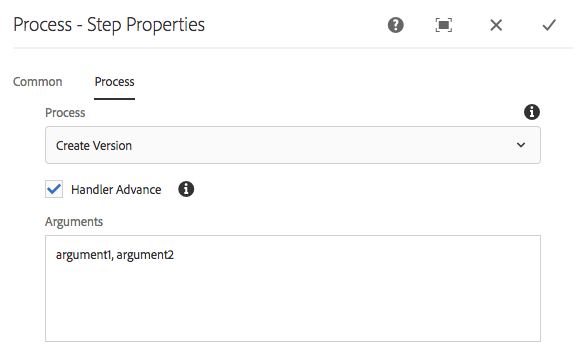

#### Java {#java-1}

The following Java code is the `execute` method for a `WorkflowProcess` implementation. The method logs the value in the `args` `MetaDataMap` that is associated with the `PROCESS_ARGS` key.

```java
public void execute(WorkItem item, WorkflowSession session, MetaDataMap args) throws WorkflowException {
     if (args.containsKey("PROCESS_ARGS")){
      log.info("workflow metadata for key PROCESS_ARGS and value {}",args.get("PROCESS_ARGS","string").toString());
     }
    }
```

When a process step that uses this Java implementation executes, the log contains the following entry:

```xml
16.02.2018 12:07:39.566 *INFO* [JobHandler: /var/workflow/instances/server0/2018-02-16/model_855140139900189:/content/we-retail/de] com.adobe.example.workflow.impl.process.LogArguments workflow metadata for key PROCESS_ARGS and value argument1, argument2
```

#### ECMA Script {#ecma-script-1}

The following ECMA script is used as the process for the **Process Step**. It logs the number of arguments and the argument values:

```
var iterator = graniteWorkItem.getWorkflowData().getMetaDataMap().keySet().iterator();
while (iterator.hasNext()){
    var key = iterator.next();
    log.info("Workflow metadata key, value = " + key.toString() + ", " + graniteWorkItem.getWorkflowData().getMetaDataMap().get(key));
}
log.info("hardcodedKey "+ graniteWorkItem.getWorkflowData().getMetaDataMap().get("hardcodedKey"));
log.info("currentDateInMillisKey "+ graniteWorkItem.getWorkflowData().getMetaDataMap().get("currentDateInMillisKey"));
```

>[!NOTE]
>
>This section describes how to work with arguments for process steps. The information also applies to dynamic participant choosers.

>[!NOTE]
>For another example of storing component properties in workflow metadata, see Example: Create a Logger Workflow Step. This example features a dailog that associates metadata value with a key other than PROCESS_ARGS.

### Scripts and Process Arguments {#scripts-and-process-arguments}

Within a script for a **Process Step** component, arguments are available through the `args` object.

When creating a custom step component, the object `metaData` is available in a script. This object is limited to a single string argument.

## Developing Process Step Implementations {#developing-process-step-implementations}

When process steps are started during the process of a workflow, the steps send a request to an OSGi service or execute an ECMA script. Develop the service or ECMA script that performs the actions that your workflow requires.

>[!NOTE]
>
>For information about associating your Process Step component with the service or script, see [Process Step](/help/sites-developing/workflows-step-ref.md#process-step) or [Overriding the Step Implementation](#overriding-the-step-implementation).

### Implementing a Process Step with a Java Class {#implementing-a-process-step-with-a-java-class}

To define a process step as an OSGI service component (Java bundle):

1. Create the bundle and deploy it into the OSGI container. Refer to the documentation about creating a bundle with [CRXDE Lite](/help/sites-developing/developing-with-crxde-lite.md) or [Eclipse](/help/sites-developing/howto-projects-eclipse.md).

   >[!NOTE]
   >
   >The OSGI component needs to implement the `WorkflowProcess` interface with its `execute()` method. See the example code below.

   >[!NOTE]
   >
   >The package name needs to be added to the `<*Private-Package*>` section of the `maven-bundle-plugin` configuration.

1. Add the SCR property `process.label`  and set the value as you require. This will be the name which your process step is listed as when using the generic **Process Step** component. See the example below.
1. In the **Models** editor, add the process step to the workflow using the generic **Process Step** component.
1. In the edit dialog (of the **Process Step**), go to the **Process** tab and select your process implementation.
1. If you use arguments in your code, set the **Process Arguments**. For example: false.
1. Save the changes, for both the step and the workflow model (top left corner of the model editor).

The java methods, respectively the classes that implement the executable Java method are registered as OSGI services, enabling you to add methods at anytime during runtime.

The following OSGI component adds the property `approved` to the page content node when the payload is a page:

```java
package com.adobe.example.workflow.impl.process;

import com.adobe.granite.workflow.WorkflowException;
import com.adobe.granite.workflow.WorkflowSession;
import com.adobe.granite.workflow.exec.WorkItem;
import com.adobe.granite.workflow.exec.WorkflowData;
import com.adobe.granite.workflow.exec.WorkflowProcess;
import com.adobe.granite.workflow.metadata.MetaDataMap;

import org.apache.felix.scr.annotations.Component;
import org.apache.felix.scr.annotations.Property;
import org.apache.felix.scr.annotations.Service;

import org.osgi.framework.Constants;

import javax.jcr.Node;
import javax.jcr.RepositoryException;
import javax.jcr.Session;

/**
 * Sample workflow process that sets an <code>approve</code> property to the payload based on the process argument value.
 */
@Component
@Service
public class MyProcess implements WorkflowProcess {

 @Property(value = "An example workflow process implementation.")
 static final String DESCRIPTION = Constants.SERVICE_DESCRIPTION;
 @Property(value = "Adobe")
 static final String VENDOR = Constants.SERVICE_VENDOR;
 @Property(value = "My Sample Workflow Process")
 static final String LABEL="process.label";

 private static final String TYPE_JCR_PATH = "JCR_PATH";

 public void execute(WorkItem item, WorkflowSession session, MetaDataMap args) throws WorkflowException {
  WorkflowData workflowData = item.getWorkflowData();
  if (workflowData.getPayloadType().equals(TYPE_JCR_PATH)) {
   String path = workflowData.getPayload().toString() + "/jcr:content";
   try {
    Session jcrSession = session.adaptTo(Session.class);
    Node node = (Node) jcrSession.getItem(path);
    if (node != null) {
     node.setProperty("approved", readArgument(args));
     jcrSession.save();
    }
   } catch (RepositoryException e) {
    throw new WorkflowException(e.getMessage(), e);
   }
  }
 }

 private boolean readArgument(MetaDataMap args) {
  String argument = args.get("PROCESS_ARGS", "false");
  return argument.equalsIgnoreCase("true");
 }
}

```

>[!NOTE]
>
>If the process fails three times in a row, an item is placed in the Inbox of the workflow administrator.

### Using ECMAScript {#using-ecmascript}

ECMA scripts enable script developers to implement process steps. The scripts are in the JCR repository and executed from there.

The following table lists the variables that are immediately available to process scripts, providing access to objects of the workflow Java API.

| Java Class |Script variable name |Description |
|---|---|---|
| `com.adobe.granite.workflow.exec.WorkItem` | `graniteWorkItem` |The current step instance. |
| `com.adobe.granite.workflow.WorkflowSession` | `graniteWorkflowSession` |The workflow session of the current step instance. |
| `String[]` (contains process arguments) | `args` |The step arguments. |
| `com.adobe.granite.workflow.metadata.MetaDataMap` | `metaData` |The meta data of the current step instance. |
| `org.apache.sling.scripting.core.impl.InternalScriptHelper` | `sling` |Provides access to the Sling runtime environment. |

The following example script demonstrates how to access the JCR node that represents the workflow payload. The `graniteWorkflowSession` variable is adapted to a JCR session variable, which is used to obtain the node from the payload path.

```
var workflowData = graniteWorkItem.getWorkflowData();
if (workflowData.getPayloadType() == "JCR_PATH") {
    var path = workflowData.getPayload().toString();
    var jcrsession = graniteWorkflowSession.adaptTo(Packages.javax.jcr.Session);
    var node = jcrsession.getNode(path);
    if (node.hasProperty("approved")){
     node.setProperty("approved", args[0] == "true" ? true : false);
     node.save();
 }
}
```

The following script checks if the payload is an image ( `.png` file), creates a black and white image from it, and saves it as a sibling node.

```
var workflowData = graniteWorkItem.getWorkflowData();
if (workflowData.getPayloadType() == "JCR_PATH") {
    var path = workflowData.getPayload().toString();
    var jcrsession = graniteWorkflowSession.adaptTo(Packages.javax.jcr.Session);
    var node = jcrsession.getRootNode().getNode(path.substring(1));
     if (node.isNodeType("nt:file") && node.getProperty("jcr:content/jcr:mimeType").getString().indexOf("image/") == 0) {
        var is = node.getProperty("jcr:content/jcr:data").getStream();
        var layer = new Packages.com.day.image.Layer(is);
        layer.grayscale();
                var parent = node.getParent();
                var gn = parent.addNode("grey" + node.getName(), "nt:file");
        var content = gn.addNode("jcr:content", "nt:resource");
                content.setProperty("jcr:mimeType","image/png");
                var cal = Packages.java.util.Calendar.getInstance();
                content.setProperty("jcr:lastModified",cal);
                var f = Packages.java.io.File.createTempFile("test",".png");
        var tout = new Packages.java.io.FileOutputStream(f);
        layer.write("image/png", 1.0, tout);
        var fis = new Packages.java.io.FileInputStream(f);
                content.setProperty("jcr:data", fis);
                parent.save();
        tout.close();
        fis.close();
        is.close();
        f.deleteOnExit();
    }
}
```

To use the script:

1. Create the script (for example, with CRXDE Lite) and save it in the repository below `//apps/workflow/scripts/`
1. To specify a title that identifies the script in the **Process Step** edit dialog, add the following properties to the `jcr:content` node of your script:

   | Name |Type |Value |
   |---|---|---|
   | `jcr:mixinTypes` | `Name[]` | `mix:title` |
   | `jcr:title` | `String` |The name to appear in the edit dialog. |

1. Edit the **Process Step** instance and specify the script to be used.

## Developing Participant Choosers {#developing-participant-choosers}

You can develop participant choosers for **Dynamic Participant Step** components.

When a **Dynamic Participant Step** component is started during a workflow, the step needs to detemine the participant to which the generated work item can be assigned. To do this the step either:

* sends a request to an OSGi service
* executes an ECMA script to select the participant

You can develop a service or ECMA script that selects the participant according to the requirements of your workflow.

>[!NOTE]
>
>For information about associating your **Dynamic Participant Step** component with the service or script, see [Dynamic Participant Step](/help/sites-developing/workflows-step-ref.md#dynamic-participant-step) or [Overriding the Step Implementation](#persisting-and-accessing-data).

### Developing a Participant Chooser Using a Java class {#developing-a-participant-chooser-using-a-java-class}

To define a participant step as an OSGI service component (Java class):

1. The OSGI component needs to implement the `ParticipantStepChooser` interface with its `getParticipant()` method. See the example code below.

   Create the bundle and deploy it into the OSGI container.

1. Add the SCR property `chooser.label` and set the value as required. This will be the name as which your participant chooser is listed, using the **Dynamic Participant Step** component. See the example:

   ```java
   package com.adobe.example.workflow.impl.process;

   import com.adobe.granite.workflow.WorkflowException;
   import com.adobe.granite.workflow.WorkflowSession;
   import com.adobe.granite.workflow.exec.ParticipantStepChooser;
   import com.adobe.granite.workflow.exec.WorkItem;
   import com.adobe.granite.workflow.exec.WorkflowData;
   import com.adobe.granite.workflow.metadata.MetaDataMap;

   import org.apache.felix.scr.annotations.Component;
   import org.apache.felix.scr.annotations.Property;
   import org.apache.felix.scr.annotations.Service;

   import org.osgi.framework.Constants;

   /**
    * Sample dynamic participant step that determines the participant based on a path given as argument.
    */
   @Component
   @Service

   public class MyDynamicParticipant implements ParticipantStepChooser {

    @Property(value = "An example implementation of a dynamic participant chooser.")
    static final String DESCRIPTION = Constants.SERVICE_DESCRIPTION;
       @Property(value = "Adobe")
       static final String VENDOR = Constants.SERVICE_VENDOR;
       @Property(value = "Dynamic Participant Chooser Process")
       static final String LABEL=ParticipantStepChooser.SERVICE_PROPERTY_LABEL;

       private static final String TYPE_JCR_PATH = "JCR_PATH";

       public String getParticipant(WorkItem workItem, WorkflowSession workflowSession, MetaDataMap args) throws WorkflowException {
           WorkflowData workflowData = workItem.getWorkflowData();
           if (workflowData.getPayloadType().equals(TYPE_JCR_PATH)) {
               String path = workflowData.getPayload().toString();
               String pathFromArgument = args.get("PROCESS_ARGS", String.class);
               if (pathFromArgument != null && path.startsWith(pathFromArgument)) {
                   return "admin";
               }
           }
           return "administrators";
       }
   }
   ```

1. In the **Models** editor, add the dynamic participant step to the workflow using the generic **Dynamic Participant Step** component.
1. In the edit dialog select the **Participant Chooser** tab and select your chooser implementation.
1. If you use arguments in your code set the **Process Arguments**. For this example: `/content/we-retail/de`.
1. Save the changes, for both the step and the workflow model.

### Developing a Participant Chooser Using an ECMA Script {#developing-a-participant-chooser-using-an-ecma-script}

You can create an ECMA script that selects the user that is assigned the work item that the **Participant Step** generates. The script must include a function named `getParticipant` that requires no argumemts, and returns a `String` that contains the ID of a user or group.

Scripts are in the JCR repository and executed from there.

The following table lists the variables that provide immediate access to workflow Java objects in your scripts.

| Java Class |Script variable name |
|---|---|
| `com.adobe.granite.workflow.exec.WorkItem` | `graniteWorkItem` |
| `com.adobe.granite.workflow.WorkflowSession` | `graniteWorkflowSession` |
| `String[]` (contains process arguments) | `args` |
| `com.adobe.granite.workflow.metadata.MetaDataMap` | `metaData` |
| `org.apache.sling.scripting.core.impl.InternalScriptHelper` | `sling` |

```
function getParticipant() {
    var workflowData = graniteWorkItem.getWorkflowData();
    if (workflowData.getPayloadType() == "JCR_PATH") {
        var path = workflowData.getPayload().toString();
        if (path.indexOf("/content/we-retail/de") == 0) {
            return "admin";
        } else {
            return "administrators";
        }
    }
}
```

1. Create the script (for example, with CRXDE Lite) and save it in the repository below `//apps/workflow/scripts`
1. To specify a title that identifies the script in the **Process Step** edit dialog, add the following properties to the `jcr:content` node of your script:

   | Name |Type |Value |
   |---|---|---|
   | `jcr:mixinTypes` | `Name[]` | `mix:title` |
   | `jcr:title` | `String` |The name to appear in the edit dialog. |

1. Edit the [Dynamic Participant Step](/help/sites-developing/workflows-step-ref.md#dynamic-participant-step) instance and specify the script to be used.

## Handling Workflow Packages {#handling-workflow-packages}

[Workflow packages](/help/sites-authoring/workflows-applying.md#specifying-workflow-details-in-the-create-workflow-wizard) can be passed to a workflow for processing. Workflow packages contain references to resources such as pages and assets.

>[!NOTE]
>
>The following workflow process steps accept workflow packages for bulk page activation:
>
>* [`com.day.cq.wcm.workflow.process.ActivatePageProcess`](https://helpx.adobe.com/experience-manager/6-5/sites/developing/using/reference-materials/javadoc/com/day/cq/wcm/workflow/process/ActivatePageProcess.html)
>* [`com.day.cq.wcm.workflow.process.DeactivatePageProcess`](https://helpx.adobe.com/experience-manager/6-5/sites/developing/using/reference-materials/javadoc/com/day/cq/wcm/workflow/process/DeactivatePageProcess.html)
>

You can develop workflow steps that obtain the package resources and process them. The following members of the `com.day.cq.workflow.collection` package provide access to workflow packages:

* `ResourceCollection`: Workflow package class.
* `ResourceCollectionUtil`: Use to retrieve ResourceCollection objects.
* `ResourceCollectionManager`: Creates and retrieves collections. An implementation is deployed as an OSGi service.

The following example Java class demonstrates how to obtain package resources:

```java
package com.adobe.example;

import java.util.ArrayList;
import java.util.List;

import com.day.cq.workflow.WorkflowException;
import com.day.cq.workflow.WorkflowSession;
import com.day.cq.workflow.collection.ResourceCollection;
import com.day.cq.workflow.collection.ResourceCollectionManager;
import com.day.cq.workflow.collection.ResourceCollectionUtil;
import com.day.cq.workflow.exec.WorkItem;
import com.day.cq.workflow.exec.WorkflowData;
import com.day.cq.workflow.exec.WorkflowProcess;
import com.day.cq.workflow.metadata.MetaDataMap;

import org.apache.felix.scr.annotations.Component;
import org.apache.felix.scr.annotations.Property;
import org.apache.felix.scr.annotations.Service;
import org.apache.felix.scr.annotations.Reference;
import org.osgi.framework.Constants;

import org.slf4j.Logger;
import org.slf4j.LoggerFactory;

import javax.jcr.Node;
import javax.jcr.PathNotFoundException;
import javax.jcr.RepositoryException;
import javax.jcr.Session;

@Component
@Service
public class LaunchBulkActivate implements WorkflowProcess {

 private static final Logger log = LoggerFactory.getLogger(LaunchBulkActivate.class);

 @Property(value="Bulk Activate for Launches")
  static final String PROCESS_NAME ="process.label";
 @Property(value="A sample workflow process step to support Launches bulk activation of pages")
 static final String SERVICE_DESCRIPTION = Constants.SERVICE_DESCRIPTION;

 @Reference
 private ResourceCollectionManager rcManager;
public void execute(WorkItem workItem, WorkflowSession workflowSession) throws Exception {
    Session session = workflowSession.getSession();
    WorkflowData data = workItem.getWorkflowData();
    String path = null;
    String type = data.getPayloadType();
    if (type.equals(TYPE_JCR_PATH) && data.getPayload() != null) {
        String payloadData = (String) data.getPayload();
        if (session.itemExists(payloadData)) {
            path = payloadData;
        }
    } else if (data.getPayload() != null && type.equals(TYPE_JCR_UUID)) {
        Node node = session.getNodeByUUID((String) data.getPayload());
        path = node.getPath();
    }

    // CUSTOMIZED CODE IF REQUIRED....

    if (path != null) {
        // check for resource collection
        ResourceCollection rcCollection = ResourceCollectionUtil.getResourceCollection((Node)session.getItem(path), rcManager);
        // get list of paths to replicate (no resource collection: size == 1
        // otherwise size >= 1
        List<String> paths = getPaths(path, rcCollection);
        for (String aPath: paths) {

            // CUSTOMIZED CODE....

        }
    } else {
        log.warn("Cannot process because path is null for this " + "workitem: " + workItem.toString());
    }
}

/**
 * helper
 */
private List<String> getPaths(String path, ResourceCollection rcCollection) {
    List<String> paths = new ArrayList<String>();
    if (rcCollection == null) {
        paths.add(path);
    } else {
        log.debug("ResourceCollection detected " + rcCollection.getPath());
        // this is a resource collection. the collection itself is not
        // replicated. only its members
        try {
            List<Node> members = rcCollection.list(new String[]{"cq:Page", "dam:Asset"});
            for (Node member: members) {
                String mPath = member.getPath();
                paths.add(mPath);
            }
        } catch(RepositoryException re) {
            log.error("Cannot build path list out of the resource collection " + rcCollection.getPath());
        }
    }
    return paths;
}
}
```

## Example: Creating a Custom Step {#example-creating-a-custom-step}

An easy way to start creating your own custom step is to copy an existing step from:

`/libs/cq/workflow/components/model`

### Creating the Basic Step {#creating-the-basic-step}

1. Recreate the path under /apps; for example:

   `/apps/cq/workflow/components/model`

   The new folders are of type `nt:folder`:

   ```xml
   - apps
     - cq
       - workflow (nt:folder)
         - components (nt:folder)
           - model (nt:folder)
   ```

   >[!NOTE]
   >
   >This step does not apply to the classic UI Model editor.

1. Then place the copied step in your /apps folder; for example, as:

   `/apps/cq/workflow/components/model/myCustomStep`

   Here is the result of our example customized step:

   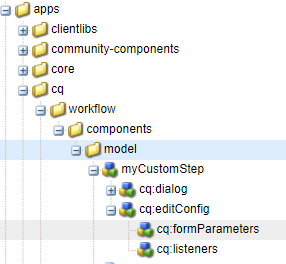

   >[!CAUTION]
   >
   >Because in standard UI, only the title and not the details are not displayed on the card, `details.jsp` is not needed as it was for the classic UI editor.

1. Apply the following properties to the node:

   `/apps/cq/workflow/components/model/myCustomStep`

   **Properties of interest:**

    * `sling:resourceSuperType`

      Must inherit from an existing step.

      In this example we are inheriting from the base step at `cq/workflow/components/model/step`, but you can use other super types like `participant`, `process`, and so on.

    * `jcr:title`

      Is the title displayed when the component is listed in the step browser (left side panel of the workflow model editor).

    * `cq:icon`

      Used to specify a [Coral icon](https://helpx.adobe.com/experience-manager/6-5/sites/developing/using/reference-materials/coral-ui/coralui3/Coral.Icon.html) for the step.

    * `componentGroup`

      Must be one of the following:

        * Collaboration Workflow
        * DAM Workflow
        * Forms Workflow
        * Projects
        * WCM Workflow
        * Workflow

   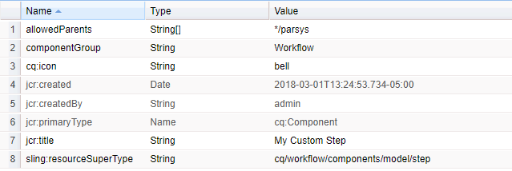

1. You can now open a workflow model for editing. In the steps browser you can filter to see **My Custom Step**:

   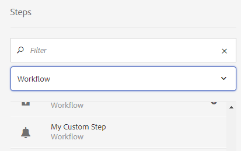

   Dragging **My Custom Step** on to the model displays the card:

   

   If no `cq:icon` has been defined for the step, then a default icon is rendered using the first two letters of the title. For example:

   

#### Defining the Step Configure Dialog {#defining-the-step-configure-dialog}

After [Creating the Basic Step](#creating-the-basic-step), define the step **Configure** dialog as follows:

1. Configure the properties on the node `cq:editConfig` as follows:

   **Properties of interest:**

    * `cq:inherit`

      When set to `true`, then your step component will inherit properties from the step you specified in `sling:resourceSuperType`.

    * `cq:disableTargeting`

      Set as required.

   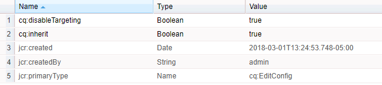

1. Configure the properties on the node `cq:formsParameter` as follows:

   **Properties of interest:**

    * `jcr:title`

      Sets the default title on the step card in the model map and in the **Title** field of the **My Custom - Step Properties** configuration dialog.

    * You can also define your own custom properties.

   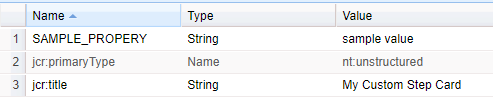

1. Configure the properties on the node `cq:listeners`.

   The `cq:listener` node and its properties lets you set event handlers that react to events in the touch-enabled UI model editor; such as dragging a step onto a model page or editing a step properties.

   **Properties of Interest:**

    * `afterMove: REFRESH_PAGE`
    * `afterdelete: CQ.workflow.flow.Step.afterDelete`
    * `afteredit: CQ.workflow.flow.Step.afterEdit`
    * `afterinsert: CQ.workflow.flow.Step.afterInsert`

   This configuration, is essential for the proper functioning of the editor. In the most cases this configuration must not be changed.

   However, setting `cq:inherit` to true (on the `cq:editConfig` node, see above) lets you inherit this configuration, without needing to explicitly include it in your step definition. If no inheritance is in place, then you do need to add this node with the following properties and values.

   In this example, inheritance has been activated so we could remove the `cq:listeners` node and the step will still function correctly.

   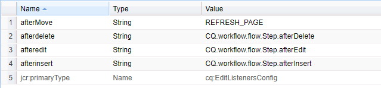

1. You can now add an instance of your step to a workflow model. When you **Configure** the step you will see the dialog:

   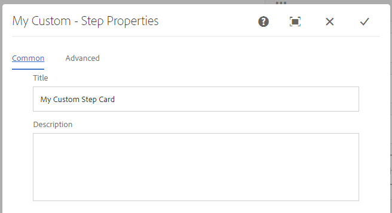 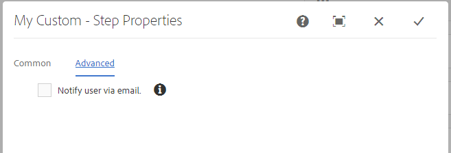

#### Sample Markup used in this Example {#sample-markup-used-in-this-example}

Markup for a custom step is be represented in the `.content.xml` of the component root node. The sample `.content.xml` used for this example:

`/apps/cq/workflow/components/model/myCustomStep/.content.xml`

```xml
<?xml version="1.0" encoding="UTF-8"?>
<jcr:root xmlns:sling="https://sling.apache.org/jcr/sling/1.0" xmlns:cq="https://www.day.com/jcr/cq/1.0" xmlns:jcr="https://www.jcp.org/jcr/1.0"
    cq:icon="bell"
    jcr:primaryType="cq:Component"
    jcr:title="My Custom Step"
    sling:resourceSuperType="cq/workflow/components/model/process"
    allowedParents="[*/parsys]"
    componentGroup="Workflow"/>
```

The `_cq_editConfig.xml` sample used in this example:

```xml
<?xml version="1.0" encoding="UTF-8"?>
<jcr:root xmlns:cq="https://www.day.com/jcr/cq/1.0" xmlns:jcr="https://www.jcp.org/jcr/1.0" xmlns:nt="https://www.jcp.org/jcr/nt/1.0"
    cq:disableTargeting="{Boolean}true"
    cq:inherit="{Boolean}true"
    jcr:primaryType="cq:EditConfig">
    <cq:formParameters
        jcr:primaryType="nt:unstructured"
        jcr:title="My Custom Step Card"
        SAMPLE_PROPERY="sample value"/>
    <cq:listeners
        jcr:primaryType="cq:EditListenersConfig"
        afterdelete="CQ.workflow.flow.Step.afterDelete"
        afteredit="CQ.workflow.flow.Step.afterEdit"
        afterinsert="CQ.workflow.flow.Step.afterInsert"
        afterMove="REFRESH_PAGE"/>
</jcr:root>
```

The `_cq_dialog/.content.xml` sample used in this example:

```xml
<?xml version="1.0" encoding="UTF-8"?>
<jcr:root xmlns:sling="https://sling.apache.org/jcr/sling/1.0" xmlns:cq="https://www.day.com/jcr/cq/1.0" xmlns:jcr="https://www.jcp.org/jcr/1.0" xmlns:nt="https://www.jcp.org/jcr/nt/1.0"
    jcr:primaryType="nt:unstructured"
    jcr:title="My Custom - Step Properties"
    sling:resourceType="cq/gui/components/authoring/dialog">
    <content
        jcr:primaryType="nt:unstructured"
        sling:resourceType="granite/ui/components/coral/foundation/tabs">
        <items jcr:primaryType="nt:unstructured">
            <common
                cq:hideOnEdit="true"
                jcr:primaryType="nt:unstructured"
                jcr:title="Common"
                sling:resourceType="granite/ui/components/coral/foundation/fixedcolumns"/>
            <process
                cq:hideOnEdit="true"
                jcr:primaryType="nt:unstructured"
                jcr:title="Process"
                sling:resourceType="granite/ui/components/coral/foundation/fixedcolumns"/>
            <mycommon
                jcr:primaryType="nt:unstructured"
                jcr:title="Common"
                sling:resourceType="granite/ui/components/coral/foundation/fixedcolumns">
                <items jcr:primaryType="nt:unstructured">
                    <columns
                        jcr:primaryType="nt:unstructured"
                        sling:resourceType="granite/ui/components/coral/foundation/container">
                        <items jcr:primaryType="nt:unstructured">
                            <title
                                jcr:primaryType="nt:unstructured"
                                sling:resourceType="granite/ui/components/coral/foundation/form/textfield"
                                fieldLabel="Title"
                                name="./jcr:title"/>
                            <description
                                jcr:primaryType="nt:unstructured"
                                sling:resourceType="granite/ui/components/coral/foundation/form/textarea"
                                fieldLabel="Description"
                                name="./jcr:description"/>
                        </items>
                    </columns>
                </items>
            </mycommon>
            <advanced
                jcr:primaryType="nt:unstructured"
                jcr:title="Advanced"
                sling:resourceType="granite/ui/components/coral/foundation/fixedcolumns">
                <items jcr:primaryType="nt:unstructured">
                    <columns
                        jcr:primaryType="nt:unstructured"
                        sling:resourceType="granite/ui/components/coral/foundation/container">
                        <items jcr:primaryType="nt:unstructured">
                            <email
                                jcr:primaryType="nt:unstructured"
                                sling:resourceType="granite/ui/components/coral/foundation/form/checkbox"
                                fieldDescription="Notify user via email."
                                fieldLabel="Email"
                                name="./metaData/PROCESS_AUTO_ADVANCE"
                                text="Notify user via email."
                                value="true"/>
                        </items>
                    </columns>
                </items>
            </advanced>
        </items>
    </content>
</jcr:root>
```

>[!NOTE]
>
>Notice the common and process nodes in the dialog definition. These are inherited from the process step we used as supertype for our custom step:
>
>`sling:resourceSuperType : cq/workflow/components/model/process`

>[!NOTE]
>
>Classic UI model editor dialogs will still work with the standard, touch-enabled UI editor.
>
>Though AEM has [modernization tools](/help/sites-developing/modernization-tools.md) if you want to upgrade your classic UI step dialogs to standard UI dialogs. After conversion there are still some manual improvements that could be done to the dialog for certain cases.
>
>* In cases where an upgraded dialog is empty you can look at dialogs in `/libs` that have similar functionality as examples of how to provide a solution. For example:
>
>* `/libs/cq/workflow/components/model`
>* `/libs/cq/workflow/components/workflow`
>* `/libs/dam/components`
>* `/libs/wcm/workflow/components/autoassign`
>* `/libs/cq/projects`
>
>  Do not edit anything in `/libs`, simply use them as examples. If you want to use any of the existing steps, copy them to `/apps` and edit them there.
