# Creating Workflow Models{#creating-workflow-models}

>[!CAUTION]
>
>For use of the classic UI, see the [AEM 6.3 documentation](https://helpx.adobe.com/experience-manager/6-3/help/sites-developing/workflows-models.html) for reference.

You create a [workflow model](/help/sites-developing/workflows.md#model) to define the series of steps executed when a user starts the workflow. You can also define model properties, such as whether the workflow is transient or uses multiple resources.

When a user starts a workflow, an instance is started; this is the corresponding runtime model, created when you [Sync](#sync-your-workflow-generate-a-runtime-model) your changes.

## Creating a New Workflow {#creating-a-new-workflow}

When you first create a workflow model, it contains:

* The steps, **Flow Start** and **Flow End**.
  These represent the beginning and end of the workflow. These steps are required and cannot be edited/removed.
* An example **Participant** step named **Step 1**.
  This step is configured to assign a work item to the workflow initiator. Edit or delete this step, and add steps as required.

To create a workflow with the editor:

1. Open the **Workflow Models** console; via **Tools**, **Workflow**, **Models** or, for example: [https://localhost:4502/aem/workflow](https://localhost:4502/aem/workflow)
1. Select **Create**, then **Create Model**.
1. The **Add Workflow Model** dialog appears. Enter the **Title** and **Name** (optional) before selecting **Done**.
1. The new model is listed in the **Workflow Models** console.
1. Select your new workflow, then use [**Edit** to open it for configuration](#editinganexistingworkflow):
   

>[!NOTE]
>
>If creating models programmatically (using a crx package) you can also create a sub-folder within:
>
>`/var/workflow/models`
>
>For example, `/var/workflow/models/prototypes`
>
>This folder can then be used for [managing access to the models in that folder](/help/sites-administering/workflows-managing.md#create-a-subfolder-in-var-workflow-models-and-apply-the-acl-to-that).

## Editing a Workflow {#editing-a-workflow}

You can edit any existing workflow model to:

* [define steps](#addingasteptoamodel-) and their [parameters](#configuring-a-workflow-step)
* configure workflow properties, including [stages](#configuring-workflow-stages-that-show-workflow-progress), [whether the workflow is transient](#creatingatransientworkflow-) and/or [uses multiple resources](#configuring-a-workflow-for-multi-resource-support)

Editing a [**Default and/or Legacy** (out-of-the-box) workflow](#editing-a-default-or-legacy-workflow-for-the-first-time) has an additional step, to ensure that a [safe copy](/help/sites-developing/workflows-best-practices.md#locations-workflow-models) is taken prior to your changes being made.

When updates to your workflow are complete you must use **Sync** to **Generate a Runtime Model**. See [Sync your Workflow](#sync-your-workflow-generate-a-runtime-model) for details.

### Sync your Workflow - Generate a Runtime Model {#sync-your-workflow-generate-a-runtime-model}

**Sync** (right in the editor toolbar) generates a [runtime model](/help/sites-developing/workflows.md#runtime-model). The runtime model is the model actually used when a user starts a workflow. If you do not **Sync** your changes, then the changes will not be available at runtime.

When you (or any other user) make any changes to the workflow you must use **Sync** to generate a runtime model - even when individual dialogs (for example, for steps) have had their own save options.

When the changes are synchronized with the runtime (saved) model, **Synched** is shown instead.

Some steps have mandatory fields and/or built in validation. When these conditions are not satisfied an error is shown when you attempt to **Sync** the model. For example, when no participant has been defined for a **Participant** step:

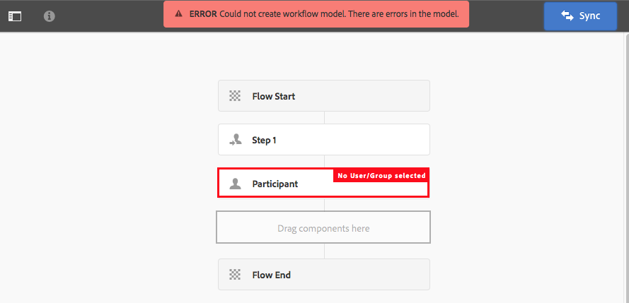

### Editing a Default or Legacy Workflow for the First Time {#editing-a-default-or-legacy-workflow-for-the-first-time}

When you open a [Default and/or Legacy model](/help/sites-developing/workflows.md#workflow-types) for editing:

* The Steps browser is not available (left side).
* There is an **Edit** action available in the toolbar (right side).
* Initially the model, and its properties, is presented in read-only mode as:
    * Default workflows are in `/libs`
    * Legacy workflows are in `/etc`
Selecting **Edit** will:
* take a copy of the workflow into `/conf`
* make the Steps browser available
* enable you to make changes

>[!NOTE]
>
>See [Locations of Workflow Models](/help/sites-developing/workflows-best-practices.md#locations-workflow-models) for further information.

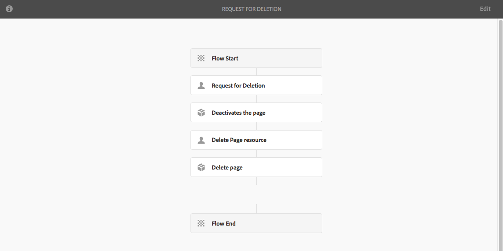

### Adding a Step to a Model {#adding-a-step-to-a-model}

Add steps to your model to represent the activity to perform - each step performs a specific activity. A selection of step components are available in a standard AEM instance.

When you edit a model, the available steps appear in the various groups of the **Steps browser**. For example:


>[!NOTE]
>
>For information about the primary step components that are installed with AEM, see [Workflow Steps Reference](/help/sites-developing/workflows-step-ref.md).

To add steps to your workflow model:

1. Open an existing workflow model for editing. From the **Workflows Model** console, select the required model, then **Edit**.
1. Open the Steps browser; using **Toggle Side Panel**, at the far left of the top toolbar. Here you can:

    * **Filter** for specific steps.
    * Use the drop-down selector to limit the selection to a specific group of steps.
    * Select the Show Description icon  to show more details about the appropriate step.

   

1. Drag the appropriate step(s) to the required location in the model.

   For example, a **Participant Step**.

   Once added to the flow you can [configure the step](#configuring-a-workflow-step).

   

1. Add as many steps, or other updates, as required.

   At run time, steps are executed in the order in which they appear in the model. After adding step components, you can drag them to a different location in the model.

   You can also copy, cut, paste, group or delete existing steps; as with the [page editor.](/help/sites-authoring/editing-content.md)

   Split steps can also be collapsed/expanded using the toolbar option: 

1. Confirm the changes with **Sync** (editor toolbar) to generate the runtime model.

   See [Sync your Workflow](#sync-your-workflow-generate-a-runtime-model) for details.

### Configuring a Workflow Step {#configuring-a-workflow-step}

You can **Configure** and customize the behavior of a workflow step using the **Step Properties** dialogs.

1. To open the **Step Properties** dialog for a step either:

    * Click the* *step in the workflow model and select **Configure** from the component toolbar.

    * Double-click the step.

   >[!NOTE]
   >
   >For information about the primary step components that are installed with AEM, see [Workflow Steps Reference](/help/sites-developing/workflows-step-ref.md).

1. Configure the **Step Properties** as required; the properties available depend on the step type, there may also be several tabs available. For example, the default **Participant Step**, present in a new workflow as `Step 1`:

   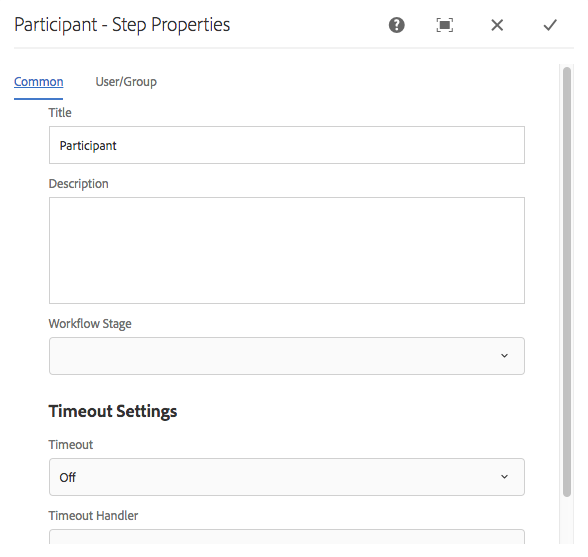

1. Confirm your updates with the tick.
1. Confirm the changes with **Sync** (editor toolbar) to generate the runtime model.

   See [Sync your Workflow](#sync-your-workflow-generate-a-runtime-model) for details.

### Creating a Transient Workflow {#creating-a-transient-workflow}

You can create a [Transient](/help/sites-developing/workflows.md#transient-workflows) workflow model when creating a model, or by editing an existing one:

1. Open the workflow model for [editing](#editinganexistingworkflow).
1. Select **Workflow Model Properties** from the toolbar.
1. In the dialog activate **Transient Workflow** (or deactivate if necessary):

   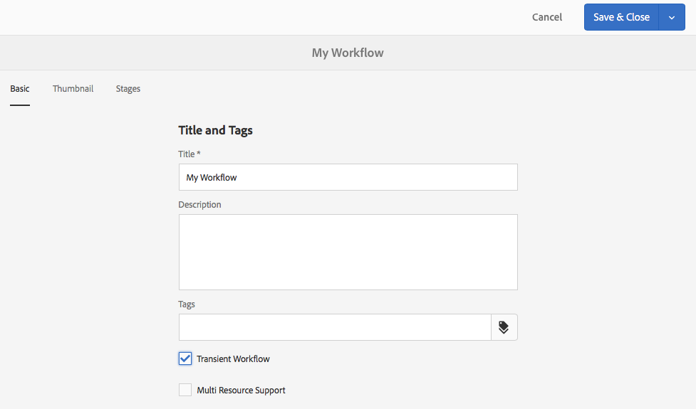

1. Confirm the change with **Save & Close**; followed by **Sync** (editor toolbar) to generate the runtime model.

   See [Sync your Workflow](#sync-your-workflow-generate-a-runtime-model) for details.

>[!NOTE]
>
>When you run a workflow in [transient](/help/sites-developing/workflows.md#transient-workflows) mode AEM does not store any workflow history. Therefore, [Timeline](/help/sites-authoring/basic-handling.md#timeline) does not display any information related to that workflow. 

## Make workflow models available in Touch UI {#classic2touchui}

If a workflow model is present in Classic UI, but missing in the selection popup menu in the **[!UICONTROL Timeline]** rail of Touch UI, then follow the configuration to make it available. The following steps illustrates using the workflow model called **[!UICONTROL Request for Activation]**.

1. Confirm that the model is not available in Touch-enabled UI. Access an asset using `/assets.html/content/dam` path. Select an asset. Open **[!UICONTROL Timeline]** in left rail. Click **[!UICONTROL Start Workflow]** and confirm that the **[!UICONTROL Request for Activation]** model is not present in the popup list.

1. Navigate through **[!UICONTROL Tools > General > Tagging]**. Select **[!UICONTROL Workflow]**.

1. Select **[!UICONTROL Create > Create Tag]**. Set **[!UICONTROL Title]** as `DAM` and **[!UICONTROL Name]** as `dam`. Select **[!UICONTROL Submit]**.
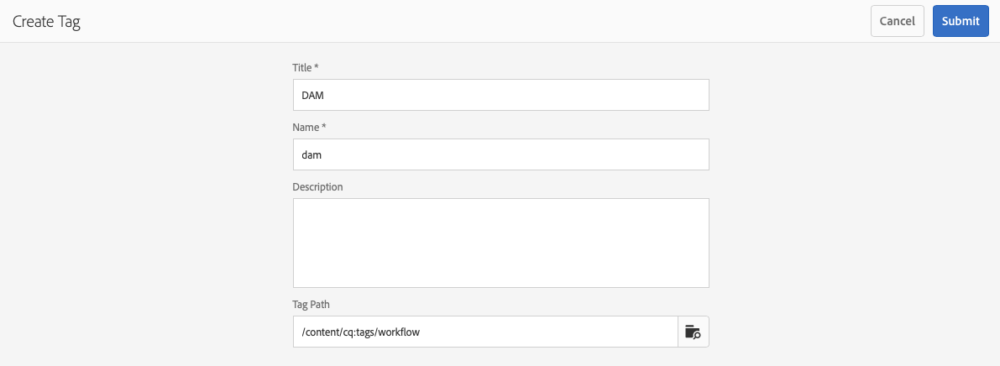

1. Navigate to **[!UICONTROL Tools > Workflow > Models]**. Select **[!UICONTROL Request for Activation]**, then select **[!UICONTROL Edit]**.

1. Select **[!UICONTROL Edit]**, open the **[!UICONTROL Page Information]** menu, and from there select **[!UICONTROL Open Properties]** and go to the **[!UICONTROL Basic]** tab (if not already open).

1. Add `Workflow : DAM` to **[!UICONTROL Tags]** field. Confirm the selection with the check (tick). 

1. Confirm the addition of the tag with **[!UICONTROL Save & Close]**.
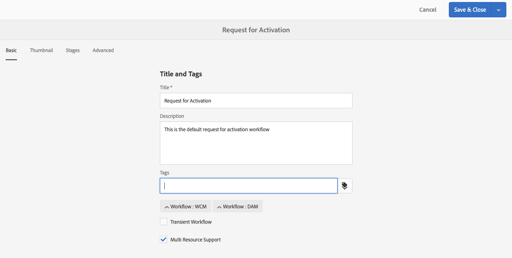

1. Complete the process with **[!UICONTROL Sync]**. The workflow is now available in the Touch-enabled UI.
   
### Configuring a Workflow for Multi Resource Support {#configuring-a-workflow-for-multi-resource-support}

You can configure a workflow model for [Multi Resource Support](/help/sites-developing/workflows.md#multi-resource-support) when creating a model, or by editing an existing one:

1. Open the workflow model for [editing](#editinganexistingworkflow).
1. Select **Workflow Model Properties** from the toolbar.

1. In the dialog activate **Multi Resource Support** (or deactivate if necessary):

   

1. Confirm the change with **Save & Close**; followed by **Sync** (editor toolbar) to generate the runtime model.

   See [Sync your Workflow](#sync-your-workflow-generate-a-runtime-model) for details.

### Configuring Workflow Stages (that show Workflow Progress) {#configuring-workflow-stages-that-show-workflow-progress}

[Workflow Stages](/help/sites-developing/workflows.md#workflow-stages) help visualize the progress of a workflow when handling tasks.

>[!CAUTION]
>
>If workflow stages are defined in **Page Properties**, but not used for any of the workflow steps, then the progress bar will not show any progress (regardless of the current workflow step).

The stages to be available are defined in the workflow models; existing workflow models can be updated to include stage definitions. You can define any number of stages for the workflow model.

To define **Stages** for your workflow:

1. Open your workflow model for editing.
1. Select **Workflow Model Properties** from the toolbar. Then open the **Stages** tab.
1. Add (and position) your required **Stages**. You can define any number of stages for the workflow model.

   For example:

   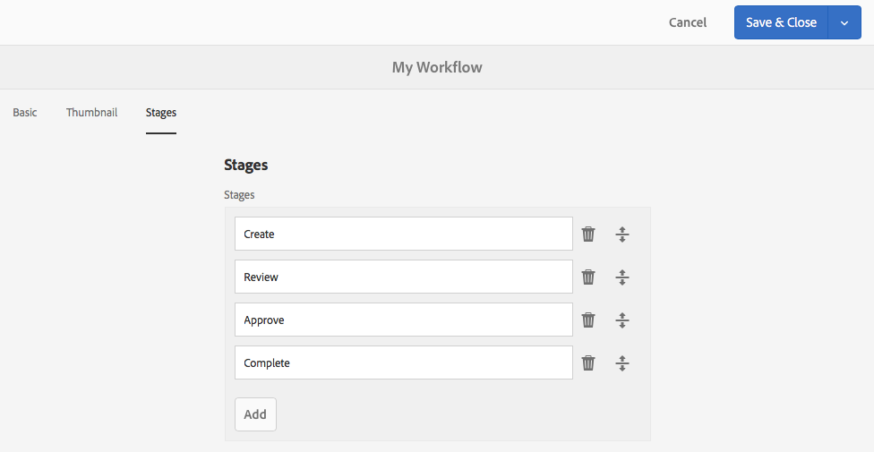

1. Click **Save & Close** to save the properties.
1. Assign a stage to each of the steps in the workflow model. For example:

   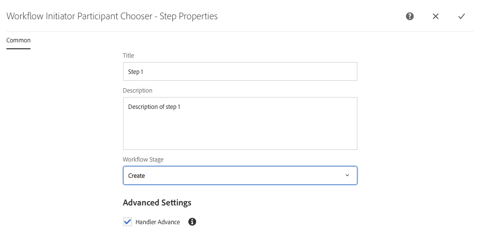

   A stage can be assigned to more than one step. For example:

   | **Step** |**Stage** |
   |---|---|
   | Step 1 |Create |
   | Step 2 |Create |
   | Step 3 |Review |
   | Step 4 |Approve |
   | Step 5 |Approve |
   | Step 6 |Complete |

1. Confirm the changes with **Sync** (editor toolbar) to generate the runtime model.

   See [Sync your Workflow](#sync-your-workflow-generate-a-runtime-model) for details.

## Exporting a Workflow Model in a Package {#exporting-a-workflow-model-in-a-package}

To export a workflow model in a package:

1. Create a package using the [Package Manager](/help/sites-administering/package-manager.md#package-manager):

    1. Navigate to the Package Manager via **Tools**, **Deployment**, **Packages**.

    1. Click **Create Package**.
    1. Specify the **Package Name**, and any other details as required.
    1. Click **OK**.

1. Click **Edit** on the toolbar of your new package.

1. Open the **Filters** tab.

1. Select **Add Filter** and specify the path of your workflow model *design*:

   `/conf/global/settings/workflow/models/<*your-model-name*>`

   Click **Done**.

1. Select **Add Filter** and specify the path of your *runtime* workflow model:

   `/var/workflow/models/<*your-model-name*>`

   Click **Done**.

1. Add additional filters for any custom scripts that are used by your model.
1. Click **Save** to confirm your filter definitions.
1. Select **Build** from the toolbar of your package definition.
1. Select **Download** from the package toolbar.

## Using Workflows to Process Form Submissions {#using-workflows-to-process-form-submissions}

You can configure a form to be processed by the selected workflow. When users submit the form, a new workflow instance is created with the data of the form submission as its payload.

To configure the workflow to be used with your form:

1. Create a page and open it for editing.
1. Add a **Form** component to the page.
1. **Configure** the **Form Start** component that appeared in the page.
1. Use **Start Workflow** to select the desired workflow from those available:

   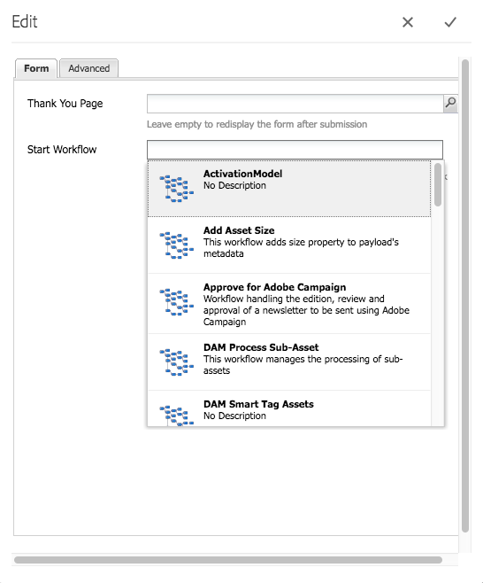

1. Confirm the new form configuration with the tick.

## Testing Workflows {#testing-workflows}

It is a good practice when testing a workflow to use a variety of payload types; including types that are different to the one for which it has been developed. For example, if you intend your workflow to deal with Assets, test it by setting a Page as payload and make sure that it does not throw errors.

For example, test your new workflow as follows:

1. [Start your workflow model](/help/sites-administering/workflows-starting.md) from the console.
1. Define the **Payload** and confirm.

1. Take actions as required so that the workflow proceeds.
1. Monitor the log files while the workflow is running.

You can also configure AEM to display **DEBUG** messages in the log files. See [Logging](/help/sites-deploying/configure-logging.md) for further information and when the development is finished, set the **Log Level** back to **Info**.

## Examples {#examples}

### Example: Creating a (Simple) Workflow to Accept or Reject a Request for Publication {#example-creating-a-simple-workflow-to-accept-or-reject-a-request-for-publication}

To illustrate some of the possibilities for creating a workflow, the following example creates a variation of the `Publish Example` workflow.

1. [Create a workflow model](#creating-a-new-workflow).

   The new workflow will contain:

    * **Flow Start**
    * `Step 1`
    * **Flow End**

1. Delete `Step 1` (as it is the wrong step type for this example):

    * Click on the step and select **Delete** from the component toolbar. Confirm the action.

1. From the **Workflow** selection of the steps browser, drag a **Participant Step** onto the workflow and position it between **Flow Start** and **Flow End**.
1. To open the properties dialog either:

    * Click on the participant step and select **Configure** from the component toolbar.
    * Double-click participant step.

1. In the **Common** tab enter `Validate Content` for both the **Title** and **Description**.
1. Open the **User/Group** tab:

    * Activate **Notify user via email**.
    * Select `Administrator` ( `admin`) for the **User/Group** field.

   >[!NOTE]
   >
   >For emails to be sent, [the mail service and user account details need to be configured](/help/sites-administering/notification.md).

1. Confirm the updates with the tick.

   You will be returned to the overview of the workflow model, here the participant step will have been renamed to `Validate Content`.

1. Drag an **Or Split** onto the workflow and position it between `Validate Content` and **Flow End**.
1. Open the **Or Split** for configuration.
1. Configure:

    * **Common**: specify the split name.
    * **Branch 1**: select **Default Route**.

    * **Branch 2**: ensure **Default Route** is not selected.

1. Confirm your updates to the **OR Split**.
1. Drag a **Participant Step** to the left-hand branch, open the properties, specify the following values, then confirm the changes:

    * **Title**: `Reject Publish Request`

    * **User/Group**: for example, `projects-administrators`

    * **Notify user via email**: Activate to have the user notified by email.

1. Drag a **Process Step** to the right-hand branch, open the properties, specify the following values, then confirm the changes:

    * **Title**: `Publish Page as Requested`

    * **Process**: select `Activate Page`. This process publishes the selected page to the publisher instances.

1. Click **Sync** (editor toolbar) to generate the runtime model.

   See [Sync your Workflow](#sync-your-workflow-generate-a-runtime-model) for details.

   Your new workflow model will look like:

   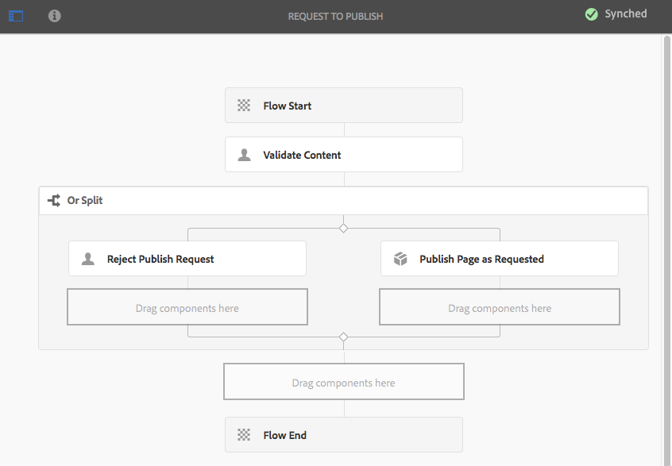

1. Apply this workflow to your page, so that when the user moves to **Complete** the **Validate Content** step, they can select whether they want to **Publish Page as Requested**, or **Reject Publish Request**.

   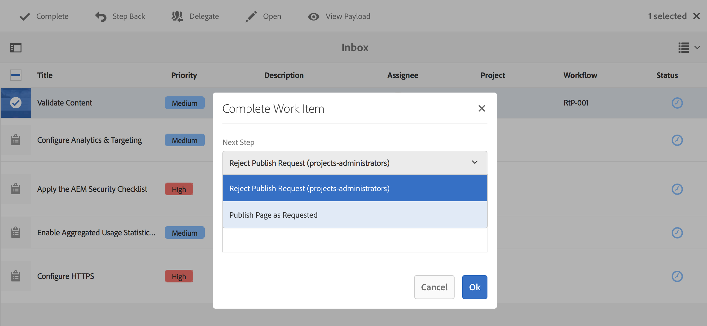

### Example: Defining a Rule for an OR Split using ECMA script {#defineruleecmascript}

**OR Split** steps let you introduce conditional processing paths into your workflow.

To define an OR rule, proceed as follows:

1. Create two scripts and save them in the repository, for example, under:

   `/apps/myapp/workflow/scripts`

   >[!NOTE]
   >
   >The scripts must have a [function `check()`](#function-check) that returns a boolean.

1. Edit the workflow and add the **OR Split** to the model.
1. Edit the properties of **Branch 1** of the **OR Split**:

    * Define this as the **Default Route** by setting the **Value** to `true`.

    * As **Rule**, set the path to the script. For example:
      `/apps/myapp/workflow/scripts/myscript1.ecma`

   >[!NOTE]
   >
   >You can switch the branch order if necessary.

1. Edit the properties of the **Branch 2** of the **OR Split**.

    * As **Rule**, set the path to the other script. For example:
      `/apps/myapp/workflow/scripts/myscript2.ecma`

1. Set the properties of the individual steps in each branch. Make sure the **User/Group** is set.
1. Click **Sync** (editor toolbar) to persist your changes to the runtime model.

   See [Sync your Workflow](#sync-your-workflow-generate-a-runtime-model) for details.

#### Function Check() {#function-check}

>[!NOTE]
>
>See [Using ECMAScript](/help/sites-developing/workflows-customizing-extending.md#using-ecmascript).

The following sample script returns `true` if the node is a `JCR_PATH` located under `/content/we-retail/us/en`:

```
function check() {
    if (workflowData.getPayloadType() == "JCR_PATH") {
      var path = workflowData.getPayload().toString();
      var node = jcrSession.getItem(path);

      if (node.getPath().indexOf("/content/we-retail/us/en") >= 0) {
       return true;
      } else {
       return false;
      }
     } else {
      return false;
     }
}

```

### Example: Customized Request for Activation {#example-customized-request-for-activation}

You can customize any of the out-of-the-box workflows. To have customized behavior you overlay details of the appropriate workflow.

For example, **Request for Activation**. This workflow is used for publishing pages within **Sites** and is automatically triggered when a content author does not have the appropriate replication rights. See [Customizing Page Authoring - Customizing the Request for Activation Workflow](/help/sites-developing/customizing-page-authoring-touch.md#customizing-the-request-for-activation-workflow) for further details.
