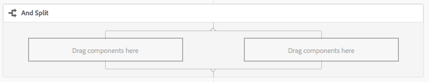
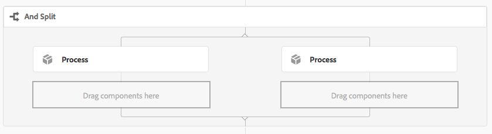
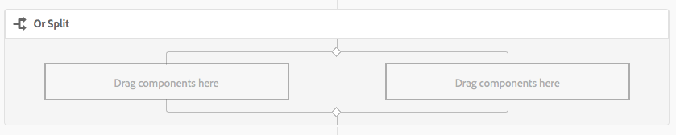
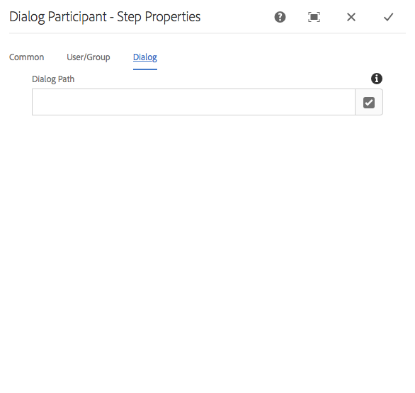

# Workflow Step Reference{#workflow-step-reference}

Workflow models consist of a series of steps of various types. According to the type, these steps can be configured and extended with parameters and scripts to provide the functionality and control you require.

>[!NOTE]
>
>This section covers the standard Workflow steps. 
>
>For module specific steps see also:
>
>* [AEM Forms Workflow Step Reference](/help/forms/using/aem-forms-workflow-step-reference.md)
>* [Processing Assets Using Media Handlers and Workflows](/help/assets/media-handlers.md)
>

## Step Properties {#step-properties}

Each step component has a **[!UICONTROL Step Properties]** dialog that lets you define and edit the required properties.

### Step Properties - Common tab {#step-properties-common-tab}

A combination of the following properties are available for most workflow step components, on the **[!UICONTROL Common]** tab of the properties dialog:

* **[!UICONTROL Title]** 

  The title for the step.

* **[!UICONTROL Description]** 

  A description of the step.

* **[!UICONTROL Workflow Stage]** 

  A drop-down selector to apply a [Stage](/help/sites-developing/workflows.md#workflow-stages) to the step.  

* **[!UICONTROL Timeout]** 

  The period after which the step will be "timed out".  
  
  You can select between: **[!UICONTROL Off]**, **[!UICONTROL Immediate]**, **[!UICONTROL 1h]**, **[!UICONTROL 6h]**, **[!UICONTROL 12h]**, **[!UICONTROL 24h]**.

* **[!UICONTROL Timeout Handler]** 

  The handler which will control the workflow when the step times out; for example:  

  `Auto Advancer`

* **[!UICONTROL Handler Advance]** 

  Select this option to automatically advance the workflow to the next step after execution. If not selected, the implementation script must handle workflow advancement.

#### Step Properties - User/Group tab {#step-properties-user-group-tab}

The following properties are available for many workflow step components, on the **[!UICONTROL User/Group]** tab of the properties dialog:

* **[!UICONTROL Notify user via email]**

    * You can notify participant(s) by sending them an email when the workflow reaches the step.
    * If enabled, an email will be sent to the user defined by the property **[!UICONTROL User/Group]** or to each member of the group if a group is defined.

* **[!UICONTROL User/Group]**

    * A drop down selection box will allow you to navigate and select a user or group. 
    * If you assign the step to a specific user, then only this user can take action on the step. 
    * If you assign the step to an entire group, then when the workflow reaches this step all users in this group will have the action in their **[!UICONTROL Workflow Inbox]**. 
    * See [Participating in Workflows](/help/sites-authoring/workflows-participating.md) for more information.

## AND Split {#and-split}

The **[!UICONTROL AND Split]** creates a split in the workflow, after which both branches will be active. You add workflow steps to each branch as required. This step enables you to introduce multiple processing paths into the workflow. For example, you can allow certain review steps to occur in parallel, so saving time.

 

### AND Split - Configuration {#and-split-configuration}

* Edit the **[!UICONTROL AND Split]** properties:

    * **[!UICONTROL Split Name]**: assign a name for explanatory purposes.
    * Select the number of branches required; 2, 3, 4 or 5.

* Add workflow steps to the branches as required.

  

## Container Step {#container-step}

A **[!UICONTROL Container]** step starts another workflow model that runs as a child workflow.

This **[!UICONTROL Container]]** lets you reuse workflow models to implement common sequences of steps. For example a translation workflow model could be used in multiple editing workflows.

 

### Container Step - Configuration {#container-step-configuration}

To configure the step, edit and use the following tabs:

* [**[!UICONTROL Common]**](#step-properties-common-tab)
* **[!UICONTROL Container]**

    * **[!UICONTROL Sub Workflow]**: Select the workflow to start.

## Goto Step {#goto-step}

The **[!UICONTROL Goto Step]** allows you to specify the next step in the workflow model to execute, dependent on the result of an ECMAScript:

* `true`: The **[!UICONTROL Goto Step]** completes and the workflow engine executes the specified step.

* `false`: The **[!UICONTROL Goto Step]** completes and the normal routing logic determines the next step to execute.

The **[!UICONTROL Goto Step]** enables you to implement advanced routing structures in your workflow models. For example, to implement a loop, the **[!UICONTROL Goto Step]** can be defined to execute a prior step in the workflow, with the script evaluating a loop condition.

### Goto Step - Configuration {#goto-step-configuration}

To configure the step, edit and use the following tabs:

* [**[!UICONTROL Common]**](#step-properties-common-tab)
* **[!UICONTROL Process]**

    * **[!UICONTROL The step to go to]]**: Select the step to execute.
    * **[!UICONTROL Script Path]**: The path to the ECMAScript that determines whether to execute the **[!UICONTROL Goto Step]**.
    * **[!UICONTROL Script]**: The ECMAScript that determines whether to execute the **[!UICONTROL Goto Step]**.

>[!CAUTION]
>
>Specify either the **[!UICONTROL Script Path]** or **[!UICONTROL Script]**. Both options cannot be used at the same time. If you specify values for both properties, the step uses the **[!UICONTROL Script Path]**.

#### Simulating a for Loop {#simulating-a-for-loop}

Simulating a for loop requires that you maintain a count of the number of loop iterations that have occurred:

* The count typically represents an index of items that are acted on in the workflow.
* The count is evaluated as the exit criteria of the loop.

For example, to implement a workflow that performs an action on several JCR nodes you can use a loop counter as an index for the nodes. To persist the count, store an `integer` value in the data map of the workflow instance. Use the script of the **[!UICONTROL Goto Step]** to increment the count as well as to compare the count to the exit criteria.

```
function check(){
   var count=0;
   var keyname="loopcount"
   try{
      if (workflowData.getMetaDataMap().containsKey(keyname)){ 
        log.info("goto script: found loopcount key");
        count= parseInt(workflowData.getMetaDataMap().get(keyname))+1;
      } 
 
     workflowData.getMetaDataMap().put(keyname,count);
 
     }catch(err) {
         log.info(err.message);
         return false;
    }
   if (parseInt(count) <7){
       return true;
   } else {
      return false;
   }
}
```

## OR Split {#or-split}

The **[!UICONTROL OR Split]** creates a split in the workflow, after which only one branch will be active. This step enables you to introduce conditional processing paths into your workflow. You add workflow steps to each branch as required.

>[!NOTE]
>
>For additional information on creating an OR Split see: [https://helpx.adobe.com/experience-manager/using/aem64_workflow_servlet.html](https://helpx.adobe.com/experience-manager/using/aem64_workflow_servlet.html)

 

### OR Split - Configuration {#or-split-configuration}

* Edit the **[!UICONTROL OR Split]** properties:

    * **[!UICONTROL Common]**

        * Select the number of branches required; 2, 3, 4 or 5.

    * **[!UICONTROL Branch : *x*>]**

        * **[!UICONTROL Script Path]**: The path to a file that contains the script.
        * **[!UICONTROL Script]**: Add the script in the box.
        * **[!UICONTROL Default Route]**: The default branch is followed when multiple branches evaluate to true. You can specify only one branch as the default.

  >[!NOTE]
  >
  >There is a separate tab for each branch:
  >
  >* The script of each branch is evaluated one at a time.
  >* The branches are evaluated left to right.
  >* The first script that evaluates to true is executed.
  >* If no branch evaluates to true, then the workflow does not advance.

  >[!CAUTION]
  >
  >Specify either the **[!UICONTROL Script Path]** or **[!UICONTROL Script]**. Both options cannot be used at the same time. If you specify values for both properties, the step uses the **[!UICONTROL Script Path]**.

  >[!NOTE]
  >
  >See [Defining a Rule for an OR Split](/help/sites-developing/workflows-models.md#example-defining-a-rule-for-an-or-split).

* Add workflow steps to the branches as required.

## Participant Steps and Choosers {#participant-steps-and-choosers}

### Participant Step {#participant-step}

A **[!UICONTROL Participant Step]** enables you to assign ownership for a particular action. The workflow will only proceed when the user has manually acknowledged the step. This is used when you want someone to take an action on the workflow; for example, a review step.

Although not directly related, user authorization must be considered when assigning an action; the user must have access to the page that is the workflow payload.

#### Participant Step - Configuration {#participant-step-configuration}

To configure the step, edit and use the following tabs:

* [**[!UICONTROL Common]**](#step-properties-common-tab)
* [**[!UICONTROL User/Group]**](#step-properties-user-group-tab)

>[!NOTE]
>
>The workflow initiator is always notified when:
>
>* The workflow is completed (finished).
>* The workflow is aborted (terminated).
>

>[!NOTE]
>
>Some properties need to be configured to enable email notifications. You can also customize the email template or add an email template for a new language. See [Configuring Email Notification](/help/sites-administering/notification.md) to configure email notifications in AEM.

### Dialog Participant Step {#dialog-participant-step}

Use a **[!UICONTROL Dialog Participant Step]** to collect information from the user who is assigned the work item. This step is useful for collecting small amounts of data that is used later in the workflow.

Upon completing the step, the **[!UICONTROL Complete Work Item]** dialog contains the fields that you define in your dialog. The data that is collected in the fields is stored in nodes of the workflow payload. Subsequent workflow steps can then read the value from the repository.

To configure the step, you specify the group or user to assign the work item to, and the path to the dialog.

#### Dialog Participant Step - Configuration {#dialog-participant-step-configuration}

To configure the step, edit and use the following tabs:

* [**[!UICONTROL Common]**](#step-properties-common-tab)
* [**[!UICONTROL User/Group]**](#step-properties-user-group-tab)
* **[!UICONTROL Dialog]**

    * **[!UICONTROL Dialog Path**: The path to the dialog node of the [dialog you create](#dialog-participant-step-creating-a-dialog).

#### Dialog Participant Step &ndash; Creating a dialog{#dialog-participant-step-creating-a-dialog}

To create a dialog:

* Decide where the resulting data will be [stored in the payload](#dialog-participant-step-storing-data-in-the-payload).
* [Define the dialog; this includes defining the fields used to collect (and save) the data](#dialog-participant-step-dialog-definition).

#### Dialog Participant Step - Storing Data in the Payload {#dialog-participant-step-storing-data-in-the-payload}

You can store widget data in the workflow payload or in the work item metadata. The format of the `name` property of the widget node determines where the data is stored.

* **[!UICONTROL Store Data with the Payload]**

    * To store widget data as a property of the workflow payload, use the following format for the value of the name property of the widget node:  

      `./jcr:content/nodename`

    * The data is stored in the `nodename` property of the payload node. If the node does not contain that property, the property is created.
    * When stored with the payload, subsequent uses of the dialog with the same payload overwrites the value of the property.

* **[!UICONTROL Store Data with the Work Item]**

    * To store widget data as a property of the work item metadata, use the following format for the value of the name property:  

      `nodename`

    * The data is stored in the `nodename` property of the work item `metadata`. The data is preserved if the dialog subsequently used with the same payload.

#### Dialog Participant Step - Dialog Definition {#dialog-participant-step-dialog-definition}

1. **[!UICONTROL Dialog Structure]**

   Dialogs for Dialog Participant Steps are similar to dialogs that you create for authoring components. They are stored under:

   `/apps/myapp/workflow/dialogs`

   Dialogs for the standard, touch-enabled UI have the following node structure:

   ```xml
   newComponent (cq:Component)
     |- cq:dialog (nt:unstructured)
       |- content 
         |- layout 
           |- items 
             |- column 
               |- items 
                 |- component0
                 |- component1
                 |- ...
   ```

   >[!NOTE]
   >
   >For further information see [Creating and Configuring a Dialog](/help/sites-developing/developing-components.md#creating-and-configuring-a-dialog).

1. **[!UICONTROL Dialog Path Property]**

   The **[!UICONTROL Dialog Participant Step]** has the **[!UICONTROL Dialog Path]** property (together with the properties of a [Participant Step](#participant-step)). The value of the **[!UICONTROL Dialog Path]** property is the path to the `dialog` node of your dialog.

   For example, the dialog is contained in a component named `EmailWatch` that is stored in the node:

   `/apps/myapp/workflows/dialogs`

   For the touch-enabled UI the following value is used for the **[!UICONTROL Dialog Path]** property:

   `/apps/myapp/workflow/dialogs/EmailWatch/cq:dialog`

   

1. **Example Dialog Definition**

   The following XML code snippet represents a dialog that stores a `String` value in the `watchEmail` node of the payload content. The title node represents the [TextField](https://helpx.adobe.com/experience-manager/6-4/sites/developing/using/reference-materials/granite-ui/api/jcr_root/libs/granite/ui/components/coral/foundation/form/textfield/index.html) component:

   ```xml
   jcr:primaryType="nt:unstructured" 
       jcr:title="Watcher Email Address Dialog" 
       sling:resourceType="cq/gui/components/authoring/dialog">
       <content jcr:primaryType="nt:unstructured"
           sling:resourceType="granite/ui/components/foundation/container">
           <layout jcr:primaryType="nt:unstructured" 
               margin="false" 
               sling:resourceType="granite/ui/components/foundation/layouts/fixedcolumns"
           />
           <items jcr:primaryType="nt:unstructured">
               <column jcr:primaryType="nt:unstructured"
                   sling:resourceType="granite/ui/components/foundation/container">
                   <items jcr:primaryType="nt:unstructured">
                       <title jcr:primaryType="nt:unstructured" 
                           fieldLabel="Notification Email Address" 
                           name="./jcr:content/watchEmails"
                           sling:resourceType="granite/ui/components/foundation/form/textfield"
                       />
                   </items>
               </column>
           </items>
       </content>
   </cq:dialog>
   ```

   This example will, in the case of the touch-enabled UI, result in a dialog such as:

   

### Dynamic Participant Step {#dynamic-participant-step}

The **[!UICONTROL Dynamic Participant Step]** component is similar to **[!UICONTROL Participant Step]** with the difference that the participant is selected automatically at run time.

To configure the step, you select a **[!UICONTROL Participant Chooser]** that identifies the participant to assign the work item to, together with a dialog.

#### Dynamic Participant Step - Configuration {#dynamic-participant-step-configuration}

To configure the step, edit and use the following tabs:

* [**[!UICONTROL Common]**](#step-properties-common-tab)
* **[!UICONTROL Participant Chooser]**

    * **[!UICONTROL Participant Chooser]**: The name of the [participant chooser that you create](#dynamic-participant-step-developing-the-participant-chooser).
    * **[!UICONTROL Arguments]**: Any required arguments.
    * **[!UICONTROL Email]**: Whether an email notification should be sent to the user.

* **[!UICONTROL Dialog]**

    * **[!UICONTROL Dialog Path]**: The path to the dialog node of the [dialog you create (as with the **Dialog Participant Step**)](#dialog-participant-step-creating-a-dialog).

#### Dynamic Participant Step - Developing the participant chooser {#dynamic-participant-step-developing-the-participant-chooser}

You create the participant chooser. Therefore, you can use any selection logic or criteria. For example, your participant chooser can select the user (within a group) that has the fewest work items. You can create any number of participant choosers to use with different instances of the **Dynamic Participant Step*]* component in your workflow models.

Create an OSGi service or an ECMAScript that selects a user to assign the work item to.

* **[!UICONTROL ECMAscript]**

  Scripts must include a function named getParticipant that returns a user ID as a `String` value. Store your custom scripts in, for example, the `/apps/myapp/workflow/scripts` folder, or a subfolder.

  A sample script is included in a standard AEM instance:

  `/libs/workflow/scripts/initiator-participant-chooser.ecma`

  >[!CAUTION]
  >
  >You *must* not change anything in the `/libs` path.
  >
  >
  >This is because the content of `/libs` is overwritten the next time you upgrade your instance (and may be overwritten when you apply either a hotfix or feature pack).

  This script selects the workflow initiator as the participant:

  ```
  function getParticipant() {
      return workItem.getWorkflow().getInitiator();
  }
  ```

  >[!NOTE]
  >
  >The **[!UICONTROL Workflow Initiator Participant Chooser]** component extends the **[!UICONTROL Dynamic Participant Step]** and uses this script as the step implementation.

* **[!UICONTROL OSGi service]**

  Services must implement the [com.day.cq.workflow.exec.ParticipantStepChooser](https://helpx.adobe.com/experience-manager/6-4/sites/developing/using/reference-materials/javadoc/com/day/cq/workflow/exec/ParticipantStepChooser.html) interface. The interface defines the following members:

    * `SERVICE_PROPERTY_LABEL` field: Use this field to specify the name of the participant chooser. The name appears in a list of available participant choosers in the **[!UICONTROL Dynamic Participant Step]** properties.
    * `getParticipant` method: Returns the the dynamically resolved Principal id as a `String` value.

  >[!CAUTION]
  >
  >The `getParticipant` method returns the the dynamically resolved Principal id. This can be either a group id or user id.
  >
  >
  >However, a group id can only be used for a **[!UICONTROL Participant Step]**, when a list of participants is returned. For a **[!UICONTROL Dynamic Participant Step]** an empty list is returned and this cannot be used for delegation.

  To make your implementation available to **[!UICONTROL Dynamic Participant Step]** components, add your Java class to an OSGi bundle that exports the service, and deploy the bundle to the AEM server.

  >[!NOTE]
  >
  >**[!UICONTROL Random Participant Chooser]** is a sample service that selects a random user ( `com.day.cq.workflow.impl.process.RandomParticipantChooser`). The **[!UICONTROL Random Participant Chooser]** step component sample extends the **[!UICONTROL Dynamic Participant Step]** and uses this service as the step implementation.

#### Dynamic Participant Step - Example Participant Chooser Service {#dynamic-participant-step-example-participant-chooser-service}

The following Java class implements the `ParticipantStepChooser` interface. The class returns the name of the participant who initiated the workflow. The code uses the same logic that the sample script ( `initator-participant-chooser.ecma`) uses.

The `@Property` annotation sets the value of the `SERVICE_PROPERTY_LABEL` field to `Workflow Initiator Participant Chooser`.

```java
package com.adobe.example;

import org.apache.felix.scr.annotations.Component;
import org.apache.felix.scr.annotations.Properties;
import org.apache.felix.scr.annotations.Property;
import org.apache.felix.scr.annotations.Service;
import org.osgi.framework.Constants;
import org.slf4j.Logger;
import org.slf4j.LoggerFactory;

import com.adobe.granite.workflow.WorkflowException;
import com.adobe.granite.workflow.WorkflowSession;
import com.adobe.granite.workflow.exec.ParticipantStepChooser;
import com.adobe.granite.workflow.exec.WorkItem;
import com.adobe.granite.workflow.metadata.MetaDataMap;

@Component
@Service
@Properties({
        @Property(name = Constants.SERVICE_DESCRIPTION, value = "An example implementation of a dynamic participant chooser."),
        @Property(name = ParticipantStepChooser.SERVICE_PROPERTY_LABEL, value = "Workflow Initiator Participant Chooser (service)") })
public class InitiatorParticipantChooser implements ParticipantStepChooser {

 private Logger logger = LoggerFactory.getLogger(this.getClass());

 public String getParticipant(WorkItem arg0, WorkflowSession arg1,
   MetaDataMap arg2) throws WorkflowException {

  String initiator = arg0.getWorkflow().getInitiator();
  logger.info("Assigning Dynamic Participant Step work item to {}",initiator);

  return initiator;
 }
}
```

In the **[!UICONTROL Dynamic Participant Step]** properties dialog, the **[!UICONTROL Participant Chooser]** list includes the item `Workflow Initiator Participant Chooser (script)`, which represents this service.

``When the workflow model is started, the log indicates the ID of the user who initiated the workflow and who is assigned the work item. In this example, the `admin` user started the workflow.

`13.09.2015 15:48:53.037 *INFO* [10.176.129.223 [1347565733037] POST /etc/workflow/instances HTTP/1.1] com.adobe.example.InitiatorParticipantChooser Assigning Dynamic Participant Step work item to admin`

### Form Participant Step {#form-participant-step}

The **[!UICONTROL Form Participant Step]** presents a form when the work item is opened. When the user fills and submits the form, the field data is stored in the nodes of the workflow payload.

To configure the step, you specify the group or user to assign the work item to, and the path to the form.

>[!CAUTION]
>
>This section deals with the [Forms section of Foundation Components for Page Authoring](/help/sites-authoring/default-components-foundation.md#form).

#### Form Participant Step - Configuration {#form-participant-step-configuration}

To configure the step, edit and use the following tabs:

* [**[!UICONTROL Common]**](#step-properties-common-tab)
* [**[!UICONTROL User/Group]**](#step-properties-user-group-tab)
* **[!UICONTROL Form]**

    * **[!UICONTROL Form Path**: The path to the [form you create](#form-participant-step-creating-the-form).

#### Form Participant Step - Creating the form {#form-participant-step-creating-the-form}

Create a form for use with a **[!UICONTROL Form Participant Step]** as normal. However, forms for a Form Participant Step must have the following configurations:

* The **[!UICONTROL Start of Form]** component must have the **[!UICONTROL Action Type]** property set to `Edit Workflow Controlled Resource(s)`.

* The **[!UICONTROL Start of Form]** component must have a value for the the `Form Identifier` property.

* The form components must have the **Element Name** property set to the path of the node where the field data is stored. The path must locate a node in the workflow payload content. The value uses the following format:

  `./jcr:content/path_to_node`

* The form must include a **[!UICONTROL Workflow Submit Button(s)]** component. You do not configure any properties of the component.

The requirements of your workflow determine where you should store field data. For example, field data can be used to configure the properties of page content. The following value of an **[!UICONTROL Element Name]** property stores field data as the value of the `redirectTarget` property of the `jcr:content` node:

`./jcr:content/redirectTarget`

In the following example, the field data is used as the content of a **[!UICONTROL Text]** component on the payload page:

`./jcr:content/par/text_3/text`

``The first example can be used for any page that the `cq:Page` component renders. The second example can only be used when the payload page includes a **Text** component that has an ID of `text_3`.

The form can be located anywhere in the repository, however workflow users must be authorized to read the form.

### Random Participant Chooser {#random-participant-chooser}

The **[!UICONTROL Random Participant Chooser]** step is a participant chooser that assigns the generated work item to a user that is randomly selected from a list. 

 

#### Random Participant Chooser - Configuration {#random-participant-chooser-configuration}

To configure the step, edit and use the following tabs:

* [**[!UICONTROL Common]**](#step-properties-common-tab)
* **[!UICONTROL Arguments]**

    * **[!UICONTROL Participants]**: Specifies the list of users available for selection. To add a user to the list, click **[!UICONTROL Add Item]** and type the home path of the user node or the user ID. The order of the users does not affect the likelihood of being assigned a work item.

### Workflow Initiator Participant Chooser {#workflow-initiator-participant-chooser}

The **[!UICONTROL Workflow Initiator Participant Chooser]** step is a participant chooser that assigns the generated work item to the user who started the workflow. There are no properties to configure other than the **[!UICONTROL Common]** properties.

#### Workflow Initiator Participant Chooser - Configuration {#workflow-initiator-participant-chooser-configuration}

To configure the step, edit using the following tabs:

* [**[!UICONTROL Common]**](#step-properties-common-tab)

## Process Step {#process-step}

A **[!UICONTROL Process Step]** runs an ECMAScript or calls an OSGi service to perform automatic processing.

 

### Process Step - Configuration {#process-step-configuration}

To configure the step, edit and use the following tabs:

* [**[!UICONTROL Common]**](#step-properties-common-tab)
* **[!UICONTROL Process]**

    * **[!UICONTROL Process]**: The process implementation to execute. Use the drop-down menu to select the ECMAScript or OSGi service. For information about:

        * The standard ECMAScripts and OSGi services, see [Built-In Processes for Process Steps](/help/sites-developing/workflows-process-ref.md).
        * Creating ECMAScripts for a **[!UICONTROL Process]** step, see [Implementing a Process Step with an ECMAScript](/help/sites-developing/workflows-customizing-extending.md#using-ecmascript).
        * Creating OSGi services for a **[!UICONTROL Process]** step, see [Implementing a Process Step with a Java Class](/help/sites-developing/workflows-customizing-extending.md#implementing-a-process-step-with-a-java-class).

    * **[!UICONTROL Handler Advance]**: Select this option to automatically advance the workflow to the next step after execution. If not selected, the implementation script must handle workflow advancement.
    * **[!UICONTROL Arguments]**: Arguments to be passed to the process.

