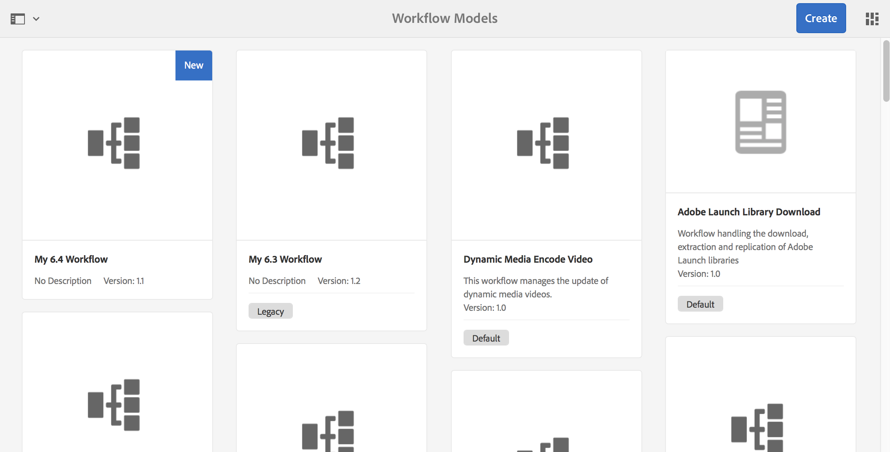

# Developing and Extending Workflows{#developing-and-extending-workflows}

AEM provides several tools and resources for creating workflow models, developing workflow steps, and for programmatically interacting with workflows.

Workflows enable you to automate processes for managing resources and publishing content in your AEM environment. Workflows are comprised of a series of steps, with each step accomplishing a discrete task. You can use logic and runtime data to make decisions as to when a process can continue and select the next step from one of multiple possible steps.

For example, business processes for creating and publishing web pages include approval and sign-off tasks by various participants. These processes can be modeled using AEM workflows and applied to specific content.

Key aspects are covered below, while the following pages cover further details:

* [Creating Workflow Models](/help/sites-developing/workflows-models.md)
* [Extending Workflow Functionality](/help/sites-developing/workflows-customizing-extending.md)
* [Interacting with Workflows Programmatically](/help/sites-developing/workflows-program-interaction.md)
* [Workflow Step Reference](/help/sites-developing/workflows-step-ref.md)
* [Workflow Process Reference](/help/sites-developing/workflows-process-ref.md)
* [Workflow Best Practices](/help/sites-developing/workflows-best-practices.md)

>[!NOTE]
>
>For information about:
>
>* Participating in workflows, see [Using Workflows](/help/sites-authoring/workflows.md).
>* Administering workflows and workflow instances, see [Administering Workflows](/help/sites-administering/workflows.md).
>* For an end-to-end Community Article see [Modifying Digital Assets using Adobe Experience Manager Workflows.](https://helpx.adobe.com/experience-manager/using/modify_asset_workflow.html)
>* See the [Ask the AEM Experts Webinar on Workflows](https://bit.ly/ATACE218).
>* For an end-to-end Community Article see [Creating a custom Adobe Experience Manager 6.3 Dynamic Participant step](https://helpx.adobe.com/experience-manager/using/dynamic-steps-aem63.html).
>* Changes to the locations of information see [Repository Restructuring in AEM 6.5](/help/sites-deploying/repository-restructuring.md) and [Workflow Best Practices - Locations](/help/sites-developing/workflows-best-practices.md#locations).
>

## Model {#model}

A `WorkflowModel` represents a definition (model) of a workflow. It is made of `WorkflowNodes` and `WorkflowTransitions`. The transitions connect the nodes and define the *flow*. The Model has always a start node and an end node.

### Runtime Model {#runtime-model}

Workflow models are versioned. When you run a workflow instance it will use (and keep) the runtime model of the workflow (as available at the time the workflow was started).

A runtime model is [generated when **Sync** is triggered in the workflow model editor](/help/sites-developing/workflows-models.md#sync-your-workflow-generate-a-runtime-model).

Edits to the workflow model that occur, and/or runtime models that are generated, *after* the specific instance was started will not be applied to that instance.

>[!CAUTION]
>
>The steps performed are those as defined by the [runtime model](/help/sites-developing/workflows-models.md#sync-your-workflow-generate-a-runtime-model); this is generated at the time the **Sync** action is triggered in the workflow model editor.
>
>If the workflow model is changed after this point in time (without **Sync** being triggered), then the runtime instance will not reflect those changes. Only runtime models generated after the update will reflect the changes. The exceptions are the underlying ECMA scripts, which are held only once so changes to these are taken.

### Step {#step}

Each step accomplishes a discrete task. There are different types of workflow steps:

* Participant (User/Group): These steps generate a work item and assign it to a user or group. A user must complete the work item to advance the workflow.
* Process (Script, Java method call): These steps are executed automatically by the system. An ECMA script or Java class implements the step. Services can be developed to listen to special workflow events and perform tasks according to the business logic.
* Container (Sub Workflow): This type of step starts another workflow model.
* OR Split/Join: Use logic to decide which step to execute next in the workflow.
* AND Split/Join: Allows multiple steps to be executed simultaneously.

All the steps share the following common properties: `Autoadvance` and `Timeout` alerts (scriptable).

### Transition {#transition}

A `WorkflowTransition` represents a transition between two `WorkflowNodes` of a `WorkflowModel`.

* It defines the link between two consecutive steps.
* It is possible to apply rules.

### WorkItem {#workitem}

A `WorkItem` is the unit that is passed through an `Workflow` instance of a `WorkflowModel`. It contains the `WorkflowData` that the instance acts on and a reference to the `WorkflowNode` that describes the underlying workflow step.

* It is used to identify the task and is put into the respective inbox.
* A workflow instance can have one or many `WorkItems` at the same time (depending on the workflow model).
* The `WorkItem` references the workflow instance.
* In the repository the `WorkItem` is stored below the workflow instance.

### Payload {#payload}

References the resource that has to be advanced through a workflow.

The payload implementation references a resource in the repository (by path, UUID or URL) or by a serialized java object. Referencing a resource in the repository is very flexible and in conjunction with sling very productive; for example the referenced node could be rendered as a form.

### Lifecycle {#lifecycle}

Is created when starting a new workflow (by choosing the respective workflow model and defining the payload) and ends when the end node is processed.

The following actions are possible on a workflow instance:

* Terminate
* Suspend
* Resume
* Restart

Completed and terminated instances are archived.

### Inbox {#inbox}

Each user account has its own workflow inbox in which the assigned `WorkItems` are accessible.

The `WorkItems` are assigned to either the user account directly or to the group to which they belongs.

### Workflow Types {#workflow-types}

There are various types of workflow as indicated in the Workflow Models console:

* **Default**

  These are the out-of-the-box workflows included in a standard AEM instance.

* Custom workflows (no indicator in the console)

  These are workflows that have been created as new, or from out-of-the-box workflows that have been overlaid with customizations.

* **Legacy**

  Workflows created in a prior version of AEM. These can be retained during an upgrade, or exported as a workflow package from the prior version, then imported into the new version.

### Transient Workflows {#transient-workflows}

Standard workflows save runtime (history) information during their execution. You can also define a workflow model as **Transient** to avoid such history being persisted. This is used for performance tuning as it saves/avoids the time/resources used for persisting the information.

Transient workflows can be used for any workflows that:

* are run often.
* do not need the workflow history.

Transient workflows were introduced for loading a large number of assets, where the asset information is important, but not the workflow runtime history.

>[!NOTE]
>
>See [Creating a Transient Workflow](/help/sites-developing/workflows-models.md#creating-a-transient-workflow) for further details.

>[!CAUTION]
>
>When a workflow model has been flagged as Transient, there are a few scenarios when the runtime information will still be persisted:
>
>* The payload type (for example, video) requires external steps for processing; in such cases the runtime history is needed for status confirmation.
>* The workflow enters an **AND Split**; in such cases the runtime history is needed for status confirmation.
>* When the transient workflow enters a participant step it changes mode (at runtime) to non-transient; as the task is being passed to a person the history needs to be persisted
>

>[!CAUTION]
>
>Within a transient workflow you should not use a **Goto Step**.
>
>This is as the **Goto Step** creates a sling job to continue the workflow at the `goto` point. This defeats the purpose of making the workflow transient and generates an error in the log file.
>
>To make decisions in a transient workflow you can use the **OR Split**.

>[!NOTE]
>
>See [Best Practices for Assets](/help/assets/performance-tuning-guidelines.md#transient-workflows) for further information about how Transient Workflows impact Asset performance.

### Multi Resource Support {#multi-resource-support}

Activating **Multi Resource Support** for your workflow model means that a single workflow instance will be started even when you select multiple resources; these will be attached as a package.

If **Multi Resource Support** is not activated for your workflow model and multiple resources are selected, then an individual workflow instance will be started for each resource.

>[!NOTE]
>
>See [Configuring a Workflow for Multi Resource Support](/help/sites-developing/workflows-models.md#configuring-a-workflow-for-multi-resource-support) for further details.

### Workflow Stages {#workflow-stages}

Workflow Stages help visualize the progress of a workflow when handling tasks. They can be used to provide an overview of how far the workflow is through processing, as when the workflow is run, the user can view the progress described by **Stage** (as opposed to individual step).

As the individual step names can be specific and technical, the stage names can be defined to provide a conceptual view of the workflow progress.

For example, for a workflow with six steps and four stages:

1. You can [configure Workflow Stages (that show Workflow Progress) and then assign the appropriate stage to each step in your workflow](/help/sites-developing/workflows-models.md#configuring-workflow-stages-that-show-workflow-progress):

    * Multiple stage names can be created.
    * Then an individual stage name is assigned to each step (a stage name can be assigned to one or more steps).

   | **Step Name** |**Stage (assigned to the step)** |
   |---|---|
   | Step 1 |Create |
   | Step 2 |Create |
   | Step 3 |Review |
   | Step 4 |Approve |
   | Step 5 |Complete |
   | Step 6 |Complete |

1. When the workflow is run, the user can view the progress according to the Stage names (instead of the step names). The workflow progress will be displayed in the [WORKFLOW INFO tab of the task details window of the workitem](/help/sites-authoring/workflows-participating.md#opening-a-workflow-item-to-view-details-and-take-actions) listed in the [Inbox](/help/sites-authoring/inbox.md).

### Workflows and Forms {#workflows-and-forms}

Typically, workflows are used to process form submissions in AEM. This can be with the [core components form components](https://helpx.adobe.com/experience-manager/core-components/using/form-container.html) available in a standard AEM instance, or with the [AEM Forms solution](/help/forms/using/aem-forms-workflow.md).

When creating a new form, the form submission can be easily associated with a workflow model; for example to store the content in a particular location of the repository or to notify a user about the form submission and its content.

### Workflows and Translation {#workflows-and-translation}

Workflows are also an integral part of the [Translation](/help/sites-administering/translation.md) process.
