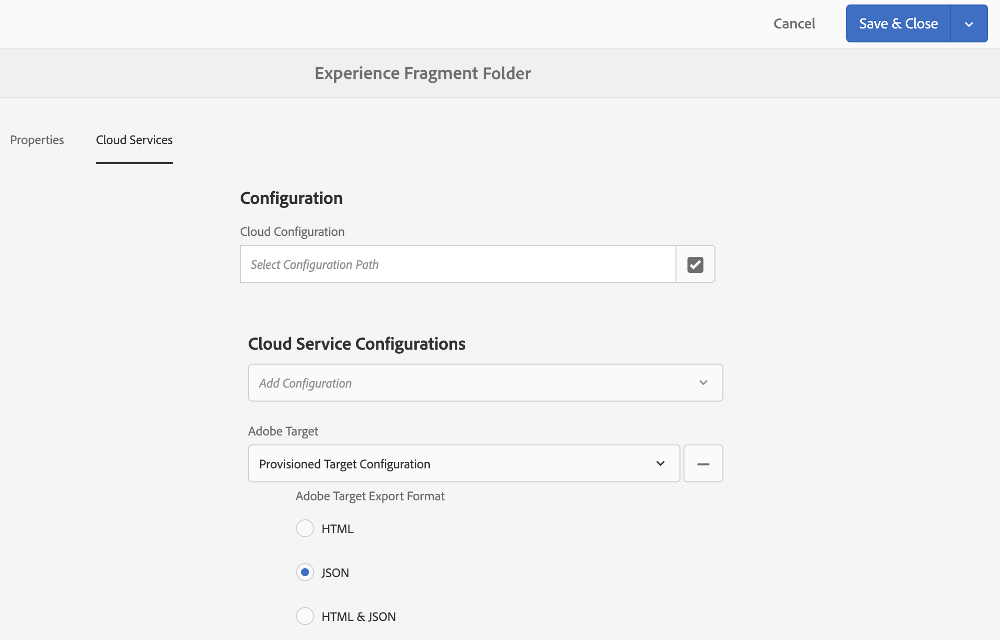

# Exporting Experience Fragments to Adobe Target{#exporting-experience-fragments-to-adobe-target}

You can export [Experience Fragments](../../../sites/authoring/using/experience-fragments.md), created in Adobe Experience Manager (AEM), to Adobe Target (Target). They can then be used as offers in Target activities, to test and personalize experiences at scale.

There are three format options available for exporting an Experience Fragment to Adobe Target:

* HTML (default): Support for web and hybrid content delivery  
* JSON: Support for headless content delivery  
* HTML & JSON

The AEM Experience Fragments are exported to the default workspace in Adobe Target.

## Prerequisites {#prerequisites}

Various actions are required:

1. You have to integrate AEM with Target. See [Integrating with Adobe Target](/sites/administering/using/target.md) for more information.
1. Experience Fragments are exported from the AEM author instance, so you need to [Configure the AEM Link Externalizer](../../../sites/administering/using/target-requirements.md#configuring-the-aem-link-externalizer) on the author instance to ensure that any references within the Experience Fragment are externalized for web delivery.

   >[!NOTE]
   >
   >For link rewriting not covered by the default, the [Experience Fragment Link Rewriter Provider](../../../sites/developing/using/experience-fragments.md#the-experience-fragment-link-rewriter-provider-html) is available. With this, customized rules can be developed for your instance.

## Add the Cloud Configuration {#add-the-cloud-configuration}

Before exporting a fragment you need to add the **Cloud Configuration** for **Adobe Target** to the fragment, or folder. This also enables you to specify the format option(s) to be used for the export.

The required options can be selected in **Page Properties** of the required folder and/or fragment; the specification will be inherited as necessary.

1. Navigate to the **Experience Fragments** console.
1. Open **Page Properties** for the appropriate folder or fragment.

   >[!NOTE]
   >
   >If you add the cloud configuration to the Experience Fragment parent folder, the configuration is inherited by all the children.
   >
   >
   >If you add the cloud configuration to the Experience Fragment itself, the configuration is inherited by all varations.

1. Select the **Cloud Services** tab.  

1. Under **Cloud Service Configuration**, select **Adobe Target** from the drop down list.
1. Under **Adobe Target** select:

    * the appropriate configuration
    * the required format option

   For example, for a folder:

   

1. **Save & Close**.

## Exporting an Experience Fragment to Adobe Target {#exporting-an-experience-fragment-to-adobe-target}

>[!CAUTION]
>
>For media assets, such as images, only a reference is exported to Target. The asset itself remains stored in AEM Assets and is delivered from the AEM publish instance.
>
>Due to this the Experience Fragment, with all related assets, needs to be published before exporting to Target.

To export an experience fragment from AEM to Target (after specifying the Cloud Configuration):

1. Navigate to the Experience Fragment console.
1. Select the Experience Fragment you would like to export to target.

   >[!NOTE]
   >
   >It has to be an Experience Fragment Web variation.

1. Tap/click **Export to Adobe Target**.

   >[!NOTE]
   >
   >If the Experience Fragment has already been exported, select **Update in Adobe Target**.

1. Tap/click **Export without publishing** or **Publish** as required.

   >[!NOTE]
   >
   >Selecting** Publish** will publish the experience fragment right away and send it to Target.

1. Tap/click **OK** in the confirmation dialog.

   Your experience fragment should now be in Target.

   >[!NOTE]
   >
   >[Various details](../../../sites/authoring/using/experience-fragments.md#details-of-your-experience-fragment) of the export can be seen in **List View** of the console and **Properties**.

   >[!NOTE]
   >
   >When viewing an Experience Fragment in Adobe Target, the *last modified* date that is seen is the date that the fragment was last modified in AEM, not the date that the fragment was last exported to Adobe Target.

>[!NOTE]
>
>Alternatively, you can perform the export from the page editor, using comparable commands in the [Page Information](../../../sites/authoring/using/author-environment-tools.md#page-information) menu.

## Using your Experience Fragments in Adobe Target {#using-your-experience-fragments-in-adobe-target}

After performing the preceding tasks, the experience fragment displays on the Offers page in Target. Please have a look at the [specific Target documentation](https://experiencecloud.adobe.com/resources/help/en_US/target/target/aem-experience-fragments.html) to learn about what you can achieve there.

>[!NOTE]
>
>When viewing an Experience Fragment in Adobe Target, the *last modified* date that is seen is the date that the fragment was last modified in AEM, not the date that the fragment was last exported to Adobe Target.

## Deleting an Experience Fragment already exported to Adobe Target {#deleting-an-experience-fragment-already-exported-to-adobe-target}

Deleting an Experience Fragment that has already been exported to Target may cause problems if the fragment is already being used in an offer in Target. Deleting the fragment would render the offer unusable as the fragment content is being delivered by AEM.

To avoid such situations:

* If the Experience Fragment is not being currently used in an activity, AEM allows the user to delete the fragment without a warning message.
* If the Experience Fragment is currently in use by an activity in Target, an error message warns the AEM user about possible consequences that deleting the fragment will have on the activity.

  The error message in AEM does not prohibit the user from (force-)deleting the Experience Fragment. If the Experience Fragment is deleted:

    * The Target offer with AEM Experience Fragment may show undesired behavior

        * The offer will likely still render, as the Experience Fragment HTML was pushed to Target
        * Any references in the Experience Fragment may not work correctly if referenced assets were deleted in AEM as well.

    * Of course, any further modifications to the Experience Fragment are impossible as the Experience Fragment does not exist anymore in AEM.

