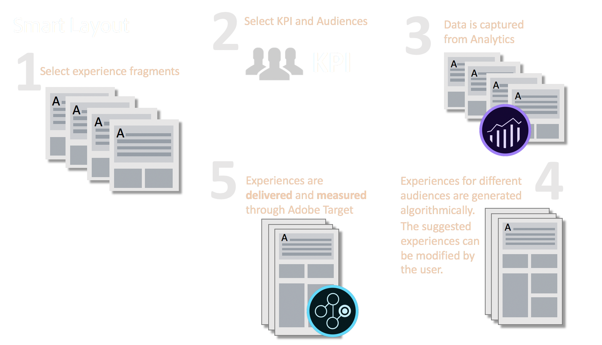

# DO NOT PUBLISH Smart Layout{#do-not-publish-smart-layout}

<!--
Comment Type: draft

test

<a href="../../../managing/using/best-practices-glossary.md">test</a>

<a href="/managing/using/best-practices-glossaries.md">test</a>

test

-->

<!--
Comment Type: draft

test

<a href="../../../managing/using/best-practices-glossary.md">test</a>

<a href="/managing/using/best-practices-glossaries.md">test</a>

test

-->

<!--
Comment Type: draft

test

test

test

-->

<!--
Comment Type: remark
Last Modified By: Alison Heimoz (aheimoz)
Last Modified Date: 2019-04-03T23:24:50.977-0400

This page is not tagged (as <strong>otherwise</strong> it breaks the Help Container page)  

-->

<!--
Comment Type: remark
Last Modified By: Alison Heimoz (aheimoz)
Last Modified Date: 2019-04-03T06:57:12.849-0400

also set as noindex

-->

<!--
Comment Type: remark
Last Modified By: Alison Heimoz (aheimoz)
Last Modified Date: 2018-11-08T05:38:12.145-0500

Test page (nightly)

<ul>
<li>http://qa-fluidxp-snapshot.corp.adobe.com:4602/smartlayout_test/sites.html/content/smartlayout</li>
</ul>
-->

<!--
Comment Type: remark
Last Modified By: Alison Heimoz (aheimoz)
Last Modified Date: 2018-11-05T03:12:05.329-0500

See

<ul>
<li>/Users/aheimoz/WiP/SmartLayout/DemoScriptAndTest.odt</li>
</ul>
-->

<!--
Comment Type: remark
Last Modified By: Alison Heimoz (aheimoz)
Last Modified Date: 2018-11-08T05:38:32.935-0500

<strong>what to install:</strong>

<ul>
<li>https://www.adobeprerelease.com/beta/F915BBE2-0DFE-45C4-D89D-E092EF684B22
<ul>
<li>Installation on DEV environment
<ul>
<li>Use with AEM <a href="https://www.adobeaemcloud.com/content/marketplace/marketplaceProxy.html?packagePath=/content/companies/public/adobe/packages/cq640/servicepack/AEM-6.4.2.0">6.4 SP2</a> with sample content </li>
<li>Install cq-6.4.0-featurepack-24238-0.1.2.zip (see Download section below) using PackageManager that contains the feature and a demo</li>
</ul> </li>
</ul> </li>
<li>https://wiki.corp.adobe.com/display/DMSArchitecture/KT+-+Smart+Layout
<ul>
<li>Installation
<ul>
<li>Use with AEM <a href="https://artifactory.corp.adobe.com/artifactory/maven-aem-release-local/com/adobe/cq/aem-service-pkg/6.4.2-load8/aem-service-pkg-6.4.2-load8.zip">6.4 SP2</a>.</li>
<li>Install <a href="https://artifactory.corp.adobe.com/artifactory/maven-aem-release-local/com/adobe/cq/feature/cq-6.4.0-featurepack-24238/">NPR-24238</a>.</li>
<li>Install <a href="https://artifactory.corp.adobe.com/artifactory/maven-aem-release-local/com/adobe/cq/smartlayout-it-common-content/">demo package</a> - only for demos not for limited beta participants! - this connects with Analytics and Target demo accounts.</li>
</ul> </li>
</ul> </li>
</ul>
-->

## What is Smart Layout? {#what-is-smart-layout}

Creating page variations for targeting personalized content is time-consuming. A lot of decisions have to be made: including the order and placement of content to determine how prominent it will be. Furthermore, to use a KPI-driven approach you need to obtain data from Adobe Analytics, then analyze it to determine the best order and placement of the Experience Fragments.

Smart Layout automates this process to allow you (as a marketer) to create page variations according to categories, based on analytical data from Adobe Analytics. This automation unlocks the power of personalization and KPI-driven experience generation.

<!--
Comment Type: remark
Last Modified By: Alison Heimoz (aheimoz)
Last Modified Date: 2018-11-28T08:06:55.862-0500

consider merging  

-->

<!--
Comment Type: draft

Using attribution participation data to optimize personalize pages is a great way to increase relevance and customer engagements. Currently, the process of obtaining and analyzing the attribution participation data and using that to inform the creation of layout variations is a unsustainable effort that requires data science expertise and at lot of manual layout work.

-->

<!--
Comment Type: draft

The goal of Smart Layout is to democratize the access to this process by automating the process of fetching attribution participation data from Adobe Analytics for relevant audiences and optimizing the placement of experience fragments, which allows the marketer to create category page variations that are based on a data at scale.

-->

## What does Smart Layout do? {#what-does-smart-layout-do}

Smart Layout automates the retrieval of KPI data from Adobe Analytics filtered by segment; then uses Artificial Intelligence (AI) to optimize the order and placement of the content within a category page.

Smart Layout uses Experience Fragments placed within a container. A fragment needs to contain a link to a destination page on the site. Smart Layout uses the attribution participation data from the link to retrieve the data from Adobe Analytics.

<!--
Comment Type: remark
Last Modified By: Alison Heimoz (aheimoz)
Last Modified Date: 2018-11-05T07:47:10.915-0500

<strong>Digital Attribution</strong> Methodologies. <strong>Attribution</strong> is the process of identifying a set of user actions (“events”) across screens and touch points that contribute in some manner to a desired outcome, and then assigning value to each of these events.

A <strong>participation metric</strong> is a visit based <strong>metric</strong> that assigns full credit from success events to all values of a variable. In simple words, it allows you to determine which pages, campaigns or any other custom variable values are contributing most to your site's success.

In marketing, <strong>attribution</strong> is the identification of a set of user actions ("events" or "touchpoints") that contribute in some manner to a desired outcome, and then the assignment of a value to each of these events.

-->

<!--
Comment Type: remark
Last Modified By: Alison Heimoz (aheimoz)
Last Modified Date: 2018-11-16T03:11:50.412-0500

does the user create the variations, or does AEM?:

<ul>
<li>Smart Layout allows you to create variations</li>
<li>the variations are automatically generated</li>
</ul>

Can the user manually create variations of this sort? Would they want to?
 

-->

Smart Layout allows you to create variations of your experience that are tailored to the typical audiences visiting the page.

* The variations are automatically generated by [Adobe Sensei](https://www.adobe.com/sensei.html) based on data and segments from [Adobe Analytics](https://www.adobe.com/analytics/adobe-analytics.html).

* The variations are delivered using [Adobe Target](https://www.adobe.com/marketing/target.html).
* You can review and make changes to the proposed variations before publishing.

<!--
Comment Type: remark
Last Modified By: Alison Heimoz (aheimoz)
Last Modified Date: 2018-11-13T03:37:02.670-0500

do the use cases in the following note work?

-->

>[!NOTE]
>
>To get the information critical to determing the audience, some sites will require the visitor to be logged in with a detailed profile; for example, an online store with preferences and past purchases. Whereas others can use information such as geolocation; for example, an airline website displaying local offers or checkin details.

>[!NOTE]
>
>Variations of the Experience Fragments are created for the various audiences.

 

## Prerequisites and Configuration {#prerequisites-and-configuration}

<!--
Comment Type: remark
Last Modified By: Alison Heimoz (aheimoz)
Last Modified Date: 2018-11-02T02:37:26.972-0400

Might need to be relocated, depending on whether this is FP or GA docs.

-->

<!--
Comment Type: remark
Last Modified By: Alison Heimoz (aheimoz)
Last Modified Date: 2018-11-02T02:47:09.351-0400

Adobe Target needs to be configured to have access to shared segments from the Experience Cloud

<ul>
<li><strong><em>this requirement will be removed in future version for customers that have Adobe Target Premium</em></strong></li>
</ul>
-->

<!--
Comment Type: remark
Last Modified By: Alison Heimoz (aheimoz)
Last Modified Date: 2018-11-05T02:58:00.300-0500

Are the experience fragments tagged as being appropriate to a specific audience?

Or does SL parse the text for key terms?

Or.....something Analytics and/or Targeting?

-->

<!--
Comment Type: remark
Last Modified By: Alison Heimoz (aheimoz)
Last Modified Date: 2018-11-13T02:11:35.825-0500
<ul>
<li>Demo package - Smart Layout Testing 
<ul>
<li>food-network pages - purpose?</li>
<li>XF-pages - purpose?</li>
</ul> </li>
</ul>
-->

To use Smart Layout you need:

* Adobe Analytics account:

    * With the web services permissions necessary to configure AEM access to Analytics data
    * With the segmentation configuration in Adobe Analytics aligned to the common audiences

* Adobe Target Classic API account:

    * Configured to have access to shared segments from the Experience Cloud  
    * For the integration API account, the permissions for the type of activity that can be created should not be `xt_only`

* Adobe Experience Manager (AEM):

    * Integrated with Adobe Analytics
    * Integrated with Adobe Target
    * An AEM template:

        * based on the Layout Container component (that uses the AEM Grid)
        * with the components Smart Layout Container and Targeted Layout Container enabled in the template policy

    * Experience Fragments:

        * Each fragment must contain a link to the destination page on the site; if there is more than one link, they must all point to the same destination
        * Optionally, the Experience Fragments can have the width property per variation defined

## Creating Smart Layout Variations {#creating-smart-layout-variations}

<!--
Comment Type: remark
Last Modified By: Alison Heimoz (aheimoz)
Last Modified Date: 2018-11-16T03:29:10.513-0500

What's the purpose of variations in this context?

<ul>
<li>different audiences?</li>
<li>different channels?</li>
<li>both?</li>
</ul>

How does Smart Layouting consider/select from the various variations? Or does the user have to configure each?
 

-->

Using Smart Layout follows the work flow:

To use Smart Layouting to create variations targeted at the appropriate audience there are several stages:

* [Create a new page with the targeting and smart layout containers, the latter holding experience fragments](../../../sites/authoring/using/smart-layout.md#create-a-page-with-containers).
* [Create an activity](../../../sites/authoring/using/smart-layout.md#create-an-activity).
* [Configure targeting](../../../sites/authoring/using/smart-layout.md#configure-targeting).

### Create a Page with Containers {#create-a-page-with-containers}

1. Create a new page based on the appropriate template. Open for editing (**Edit** mode).

   <!--
   Comment Type: remark
   Last Modified By: Alison Heimoz (aheimoz)
   Last Modified Date: 2019-01-14T03:52:20.690-0500
   
eg http://localhost:4502/editor.html/content/smartlayout/en/test-01.html  

   -->

1. Add an instance of the **Targeted Layout Container** to the page.  

1. Configure the **Targeted Layout Container** according to your requirements:

   <!--
   Comment Type: remark
   Last Modified By: Alison Heimoz (aheimoz)
   Last Modified Date: 2019-01-14T03:24:36.284-0500
   
eg location - SLBeta

   -->

    * **Location**
    * **Engine**: Adobe Target

1. Add an instance of the **Smart Layout Container** to the page, below the **Targeted Layout Container**.
1. Configure the **Smart Layout Container**:

   <!--
   Comment Type: remark
   Last Modified By: Alison Heimoz (aheimoz)
   Last Modified Date: 2019-01-14T03:51:53.354-0500
   
eg

   
KPI

   
- second instance of Page Views

   
Date range

   
- 2018-09-01 - 2018-09-30

   -->

    * **KPI**: select from the drop down list
    * **Date range for data aggregation**: specify the from and to dates

1. From the Assets browser, add a selection of **Experience Fragments **to the **Smart Layout Container**.

   <!--
   Comment Type: remark
   Last Modified By: Alison Heimoz (aheimoz)
   Last Modified Date: 2019-01-14T03:53:01.668-0500
   
filter XFs on path /content/experience-fragments/Smart_Layout_demo_XFs

   -->

### Create an Activity {#create-an-activity}

<!--
Comment Type: remark
Last Modified By: Alison Heimoz (aheimoz)
Last Modified Date: 2018-11-13T01:56:09.061-0500
<ul>
<li>what exactly is an activity in this context?</li>
<li>what can be done with it?</li>
<li>need to cross-reference Analytics/Targeting docs?  </li>
</ul>
-->

1. Change to **Targeting** mode.

   >[!NOTE]
   >
   >You can still add Experience Fragments to the **Smart Layout Container** at this stage.

1. Create a new Activity and configure:

   <!--
   Comment Type: remark
   Last Modified By: Alison Heimoz (aheimoz)
   Last Modified Date: 2019-01-14T03:56:52.240-0500
   
eg any name / Adobe Target / sitesc / Smart Layout Delivery  

   -->

    * **Name** 
    
    * **Targeting engine**: Adobe Target
    * **Target configuration**: *your Target configuration.*
    
    * **Activity type**: Smart Layout Delivery

### Configure Targeting {#configure-targeting}

<!--
Comment Type: remark
Last Modified By: Alison Heimoz (aheimoz)
Last Modified Date: 2018-11-13T01:56:57.077-0500
<ul>
<li>what exactly happens here, and at which step?  </li>
</ul>
-->

1. Select **Start Targeting**. You will be in the **Create** step.  

1. From the **Audiences** panel (right hand side), select **Add Experience Targeting**. The **Choose Audience** dialog will open.  

1. Select the audiences for which you want to create variations. Confirm the selection, they will now be shown in the **Audiences** panel.

   <!--
   Comment Type: remark
   Last Modified By: Alison Heimoz (aheimoz)
   Last Modified Date: 2018-11-13T00:29:34.045-0500
   
There are additional actions for each audience - what can be done with each:

   <ul>
   <li>Edit Audience</li>
   <li>Rename Experience</li>
   <li>Duplicate</li>
   <li>Delete</li>
   </ul>
   -->

1. Select a specific audience in the **Audience** panel, then select the **Smart Layout Container** to show the toolbar.

   <!--
   Comment Type: remark
   Last Modified By: Alison Heimoz (aheimoz)
   Last Modified Date: 2018-11-13T02:28:56.440-0500
   
does this <em><strong>have</strong></em> to be done for <em><strong>each</strong></em> audience - to format the layout?  

   -->

   From the toolbar, select the Optimize (magic wand) icon.

   The system will access data from Adobe Analytics to determine the appropriate fragments and layout to use; only the appropriate fragments will be shown.

   You can adjust the layout as required.

   >[!NOTE]
   >
   >Accessing the Adobe Analytics data might take a short while.

1. Select **Next** to move to the **Target** step, the connections between **Audience** and **Experiences** will be shown.

   <!--
   Comment Type: remark
   Last Modified By: Alison Heimoz (aheimoz)
   Last Modified Date: 2018-11-13T02:01:22.389-0500
   <ul>
   <li>what exactly can be done here?
   <ul>
   <li>entries on the left can be edited</li>
   <li>entries on the right can be renamed</li>
   </ul> </li>
   </ul>
   -->

   Entries:

    * On the left can be edited.
    * On the right can be renamed.

1. Select **Next** to move to the **Goals & Settings** step.

   Here you can define:

    * **Duration**
    * **Priority**
    * **Goal Metric**
    * **Additional Metrics**

1. **Save**. Your activity is saved and synchronized to Adobe Target to start targeting.

## Publishing Smart Layout Variations {#publishing-smart-layout-variations}

<!--
Comment Type: remark
Last Modified By: Alison Heimoz (aheimoz)
Last Modified Date: 2018-11-13T02:54:08.099-0500

<strong>A: <em>Publishing using Experience targeting</em> (for now, the default Smart Layout Delivery method is experience targeting)</strong>

<ol>
<li>Click next two times in the targeting workflow to get to the <em>goals & settings </em>step.</li>
<li>Select the duration of the campaign. </li>
<li>Select a metric that is aligned with the KPI that was selected for optimization.</li>
<li>Click save to start the Target activity.</li>
</ol>

<strong>B: </strong><em>Publishing using other Target activity</em>

<ol>
<li>In the targeting workflow right-click on the Smart Layout container and select 'Export to Target'.</li>
<li>The experience variations are exported to Target and can be used to set up Target campaigns.</li>
</ol>
-->

<!--
Comment Type: remark
Last Modified By: Alison Heimoz (aheimoz)
Last Modified Date: 2018-11-13T02:54:29.659-0500
<ul>
<li>what needs to be published, in which system and in which order?</li>
<li>what when any element gets updated?</li>
</ul>
-->

