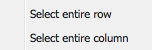
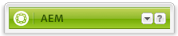
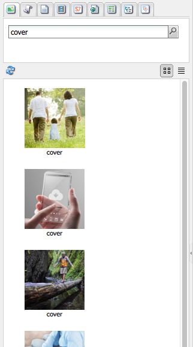
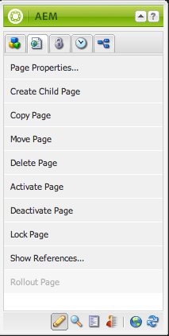

# Authoring - the Environment and Tools{#authoring-the-environment-and-tools}

The authoring environment of AEM provides various mechanisms for organizing and editing your content. The tools provided are accessed from the various consoles and page editors.

## Site Administration {#site-administration}

The **Websites** console allows you to manage and navigate your website. Using the two panes the structure of your website can be expanded and actions taken on the required element:

 

## Editing your Page Content {#editing-your-page-content}

There is a separate page editor with the classic UI, using the content finder and the sidekick:

`http://localhost:4502/cf#/content/geometrixx/en/products/triangle.html`

 

## Accessing Help {#accessing-help}

Various **Help** resources can be directly accessed from within AEM:

As well as accessing [help from the console toolbars](/sites/classic-ui-authoring/using/author-env-basic-handling.md#accessing-help), you can also access the help from the sidekick (using the ? icon) when editing a page:

Or by using the **Help** button in the edit dialog of specific components; this will show context sensitive help.

* Step text
* Step text
* Step text
* Step text
* Step text

## Sidekick {#sidekick}

The **Components** tab of the sidekick allows you to browse the components available to be added to the current page. The required group can be expanded, then a component dragged to the required location on the page.

 

## The Content Finder {#the-content-finder}

The Content Finder is a quick and easy way to find assets and/or content within the repository when editing a page.

You can use the content finder to locate a range of resources. Where appropriate you can drag an item and drop it into a paragraph on your page:

* [Images](#finding-images)
* [Documents](#finding-documents)
* [Movies](#finding-movies)
* [Scene 7 Media Browser](/sites/administering/using/scene7.md#scene7contentbrowser)
*  [Pages](../../../sites/classic-ui-authoring/using/classic-page-author-env-tools.md#finding-pages)  

* [Paragraphs](#referencing-paragraphs-from-other-pages)
* [Products](../../../sites/classic-ui-authoring/using/classic-page-author-env-tools.md#products)
* Or to [browse the website by repository structure](#the-content-finder)

With all options you can [search for specific items](#the-content-finder).

### Finding Images {#finding-images}

This tab lists any images in the repository.

After you have created an Image paragraph on your page, you can drag an item and drop it into the paragraph.

 

### Finding Documents {#finding-documents}

This tab lists any documents in the repository.

After you have created a Download paragraph on your page, you can drag an item and drop it into the paragraph.

 

### Finding Movies {#finding-movies}

This tab lists any movies (for example, Flash items) in the repository.

After you have created an appropriate paragraph (for example, Flash) on your page, you can drag an item and drop it into the paragraph.

 

### Products {#products}

This tab lists any products. After you have created an appropriate paragraph (for example, Product) on your page, you can drag an item and drop it into the paragraph.

 

### Finding Pages {#finding-pages}

This tab shows all pages. Double-click any page to open it for editing.

 

### Referencing Paragraphs from other Pages {#referencing-paragraphs-from-other-pages}

This tab allows you to search for another page. All paragraphs from that page will be listed. You can then drag a paragraph to your current page, this will create a reference to the original paragraph.

 

### Using the Full Repository View {#using-the-full-repository-view}

This tab shows all the resources in the repository.

 

### Using Search with the Content Browser {#using-search-with-the-content-browser}

On all options you can search for specific items. Any tags and any resources that match the search pattern are listed:

You can also use wildcards for search. Supported wildcards are:

* `*`  
  matches a sequence of zero or more characters.  

* `?`  
  matches a single character.

>[!NOTE]
>
>There's a pseudo property "name" which must be used to perform a wildcard search.

For example, if there is an image avaialable with the name:

`ad-nmvtis.jpg`

the following search patterns will find it (and any other images matching the pattern):

* `name:*nmv*`
* `name:AD*`  
  the character matching is *not* case sensitive.

* `name:ad?nm??is.*`  
  you can use any number of wildcards in a query.

>[!NOTE]
>
>You can also use [SQL2](/sites/developing/using/reference-materials/javadoc/org/apache/jackrabbit/commons/query/sql2/package-summary.md) search.

## Showing References {#showing-references}

AEM lets you view which pages are linked to the page you are currently working on.

To show direct page references:

1. In the sidekick, select the **Page** tab icon.

   

1. Select **Show References...** AEM opens the References window and displays which pages refer to the selected page, including their paths.

   

In certain situations further actions are available from Sidekick, including:

* [Launches](/sites/classic-ui-authoring/using/classic-launches.md)
* [Live Copies](/sites/administering/using/msm.md)  

* [Blueprint](/sites/administering/using/msm-best-practices.md)

Other [inter-page relationships can be seen in the Websites console](/sites/classic-ui-authoring/using/author-env-basic-handling.md#page-information-on-the-websites-console).

## Audit Log {#audit-log}

The **Audit Log** can be accessed from the **Information** tab of the sidekick. It lists the recent actions taken on the current page; for example:

 

## Page Information {#page-information}

The Website console also [provides information about the current status of the page](/sites/classic-ui-authoring/using/author-env-basic-handling.md#page-information-on-the-websites-console) such as publication, modification, locked, livecopy, etc.

## Page Modes {#page-modes}

When editing a page with the classic UI there are various modes that can be accessed using the icons at the bottom of the sidekick:

The row of icons at the bottom of the Sidekick are used to switch modes for working with the pages:

* [Edit](../../../sites/classic-ui-authoring/using/classic-page-author-edit-mode.md)  
  This is the default mode and allows you to edit the page, adding or deleting components and making other changes.

* [Preview](../../../sites/classic-ui-authoring/using/classic-page-author-edit-content.md#previewing-pages)  
  This mode allows you to preview the page as if it were appearing on your website in its final form.

* [Design](../../../sites/classic-ui-authoring/using/classic-page-author-design-mode.md#main-pars-procedure-0)  
  In this mode, you have the possibility to edit the design of the page by configuring the components accessible.

>[!NOTE]
>
>Other options are also available:  

>
>* [Scaffolding](../../../sites/classic-ui-authoring/using/classic-feature-scaffolding.md)
>* [Client Context](../../../sites/administering/using/client-context.md)
>* Websites - will open the Websites console.
>* Reload - will refresh the page.  
>

## Keyboard Shortcuts {#keyboard-shortcuts}

Various [keyboard shortcuts](/sites/classic-ui-authoring/using/classic-page-author-keyboard-shortcuts.md) are available.
